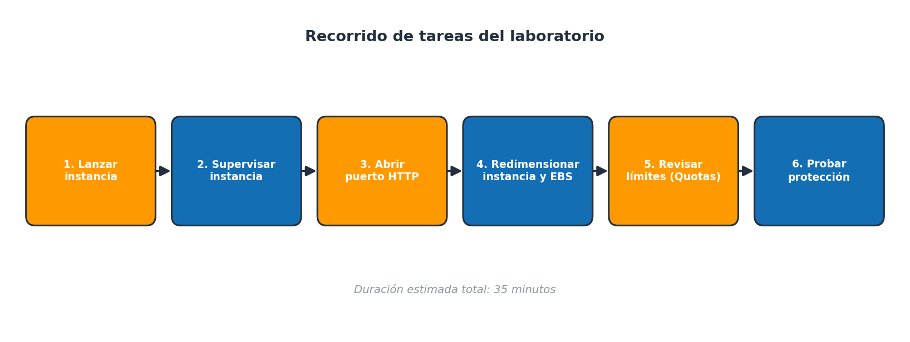
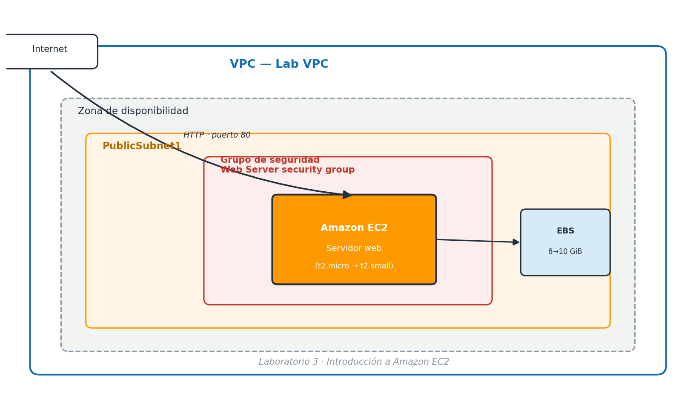
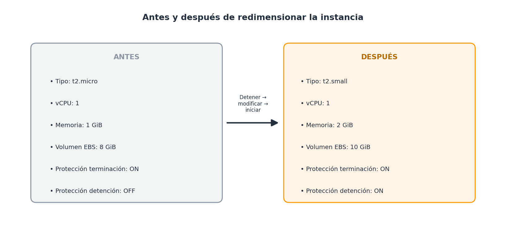

# 🖥️ Laboratorio 3: Introducción a Amazon EC2

> Laboratorio guiado en [Vocareum](https://labs.vocareum.com/main/main.php?m=clabide&mode=s&asnid=2429114&stepid=2429115), dentro del itinerario de AWS Academy. Consiste en recorrer el ciclo de vida completo de una instancia EC2: lanzarla, vigilarla, abrirle el acceso web, cambiarla de tamaño y comprobar sus mecanismos de protección.

---

## Información general

**Amazon EC2 (Elastic Compute Cloud)** es el servicio de AWS que entrega servidores virtuales de tamaño ajustable en la nube. Su objetivo es quitarle fricción al cómputo a escala: en vez de comprar, instalar y mantener hardware físico, se piden instancias por consola o API y están listas en minutos.

Tres ideas resumen por qué EC2 es el punto de partida habitual en cualquier itinerario de AWS:

- **Control total sobre el recurso.** Se elige el sistema operativo, la potencia de cómputo, el almacenamiento asociado y la red en la que vive la instancia, igual que con un servidor físico, pero sin comprarlo.
- **Elasticidad real.** Una instancia se puede apagar, encender, agrandar o achicar en cuestión de minutos, adaptando la capacidad contratada a la demanda real en lugar de sobredimensionar "por si acaso".
- **Pago por uso.** El modelo económico solo factura la capacidad que realmente se consume, lo que convierte los picos de carga en un problema de configuración y no de compra de hardware.

Este laboratorio recorre ese ciclo completo con un caso mínimo: un servidor web que sirve una página HTML sencilla, protegido por un grupo de seguridad y con las protecciones de terminación y detención activadas para evitar borrados o paradas accidentales.

Para situar el cambio de mentalidad respecto a un servidor tradicional, resulta útil comparar ambos modelos:

| | Servidor físico propio | Instancia Amazon EC2 |
|---|---|---|
| Tiempo hasta tenerlo operativo | Días o semanas (compra, envío, instalación) | Minutos |
| Coste si está infrautilizado | Se sigue pagando/amortizando igual | Se puede reducir de tamaño o detener |
| Escalar ante un pico de demanda | Comprar más hardware | Cambiar el tipo de instancia o lanzar más instancias |
| Mantenimiento físico (electricidad, refrigeración, fallos de disco) | A cargo del centro | A cargo de AWS |
| Responsabilidad de seguridad del sistema operativo y los datos | Del centro | Del centro (modelo de responsabilidad compartida) |

---

## Objetivos y duración

Al terminar el laboratorio deberías ser capaz de:

1. Lanzar un servidor web en EC2 con la protección de terminación activada.
2. Interpretar las herramientas de supervisión de una instancia (comprobaciones de estado, métricas de CloudWatch, registro del sistema y captura de pantalla).
3. Ajustar un grupo de seguridad para permitir tráfico HTTP entrante.
4. Cambiar el tipo de instancia y el tamaño del volumen EBS sin perder los datos.
5. Consultar los límites de servicio (*Service Quotas*) que AWS aplica a EC2 por región.
6. Activar la protección de detención y comprobar que impide una parada accidental.

**Duración estimada:** 35 minutos.

Antes de empezar conviene tener claro qué se va a tocar y qué no:

- Se trabaja siempre en la región **Norte de Virginia (us-east-1)**; el laboratorio no garantiza que otros servicios o regiones estén disponibles.
- La VPC, la subred pública y el par de claves `vockey` ya existen de antemano: no hay que crearlos, solo utilizarlos.
- Todo lo demás (instancia, grupo de seguridad, reglas de firewall, tamaño del volumen) se crea o modifica durante el propio laboratorio.

El siguiente mapa resume el orden en el que se encadenan las seis tareas del laboratorio:



---

## Arquitectura del laboratorio

Todo el ejercicio ocurre dentro de una única VPC de laboratorio (`Lab VPC`), ya preparada por AWS Academy mediante una plantilla de CloudFormation. Dentro de ella se despliega una subred pública (`PublicSubnet1`) con una instancia EC2 protegida por un grupo de seguridad propio, y un volumen EBS que actúa como disco raíz.



Puntos clave del diagrama:

- El tráfico de Internet solo llega a la instancia si el **grupo de seguridad** lo permite explícitamente; por defecto no hay ninguna regla de entrada.
- La instancia se lanza en la **subred pública**, por lo que recibe una IP pública automáticamente, aunque eso no basta para que sea accesible: hace falta la regla de firewall.
- El **volumen EBS** vive de forma independiente a la instancia: se puede modificar su tamaño sin perder los datos, y persiste aunque la instancia se detenga.

---

## Acceso a la consola y restricciones del entorno

El entorno del laboratorio es una cuenta de AWS real, pero acotada: solo están habilitados los servicios y acciones necesarios para completar los pasos indicados. Si se intenta usar un servicio distinto a los mencionados aquí, es normal encontrarse con errores de permisos.

Pasos para entrar en la consola:

1. Pulsa **Start Lab** en la parte superior de las instrucciones y espera a que el círculo situado junto al enlace **AWS** se ponga en verde (indica que la cuenta ya está lista).
2. Haz clic en el enlace **AWS** para abrir la Consola de administración en una pestaña nueva. Si el navegador bloquea la ventana emergente, permite los pop-ups para este sitio y vuelve a intentarlo.
3. Coloca la pestaña de la consola junto a la de las instrucciones para poder seguir los pasos sin cambiar de ventana constantemente.

> 💡 El progreso del laboratorio se puntúa automáticamente al final, comparando los nombres y configuraciones que hayas usado con los valores esperados. Los valores que aparecen entre comillas de código (por ejemplo `Web Server`) deben escribirse tal cual, respetando mayúsculas y minúsculas.

Resumen de lo que el entorno permite y lo que no:

| Permitido | Restringido |
|---|---|
| Consola de EC2 (instancias, grupos de seguridad, volúmenes) | Crear usuarios o roles nuevos de IAM |
| Consola de CloudWatch y Service Quotas para consultar métricas y límites | Servicios de AWS ajenos al laboratorio (pueden dar error de permisos) |
| Usar el par de claves `vockey` ya existente | Crear o importar pares de claves adicionales |
| Modificar el grupo de seguridad creado en la Tarea 1 | Eliminar la VPC o la subred del laboratorio |

---

## Tarea 1 — Lanzar la instancia con protección de terminación

En esta tarea se crea la instancia EC2 que actuará como servidor web, con la **protección de terminación** activada desde el primer momento para que no pueda eliminarse por error.

Desde la consola: **Servicios → Informática → EC2**, comprobando antes que la región activa (arriba a la derecha) es **Norte de Virginia (us-east-1)**. Desde ahí, **Lanzar instancia → Lanzar instancia** e ir completando el asistente:

| Paso del asistente | Configuración a aplicar | Motivo |
|---|---|---|
| Nombre y etiquetas | `Web Server` | Se guarda como etiqueta (`Name` = `Web Server`) para identificar el recurso entre muchos otros. |
| Imagen (AMI) | Amazon Linux, AMI Amazon Linux 2023 (valores por defecto) | Plantilla del sistema operativo, permisos de lanzamiento y disco raíz de la instancia. |
| Tipo de instancia | `t2.micro` (1 vCPU, 1 GiB de RAM) | Tamaño mínimo suficiente para el ejercicio; el laboratorio no permite usar otros tipos en este paso. |
| Par de claves | `vockey` | AWS instala la clave pública en la instancia; no se usará para conectarse por SSH en este laboratorio. |
| Red | VPC `Lab VPC`, subred `PublicSubnet1` | Coloca la instancia en la subred pública ya preparada, con IP pública automática. |
| Grupo de seguridad | Crear uno nuevo: `Web Server security group` / `Security group for my web server`, sin reglas de entrada | Se añadirá la regla HTTP más adelante, en la Tarea 3. |
| Almacenamiento | 8 GiB por defecto (EBS) | Volumen raíz donde vive el sistema operativo y los datos. |

Antes de lanzar, dentro de **Detalles avanzados**:

- Activa **Protección de terminación → Habilitar**, para que la instancia no pueda borrarse (`terminate`) sin desactivar antes esta opción.
- Pega el siguiente script en el campo **Datos de usuario**. Se ejecuta automáticamente, como usuario root, la primera vez que arranca la instancia:

```bash
#!/bin/bash
dnf install -y httpd
systemctl enable httpd
systemctl start httpd
echo '<html><h1>Hello From Your Web Server!</h1></html>' > /var/www/html/index.html
```

El script instala el servidor web Apache (`httpd`), lo configura para arrancar automáticamente en cada reinicio, lo pone en marcha y publica una página HTML mínima como prueba de que todo funciona.

Para terminar: **Lanzar instancia → Ver todas las instancias**, y espera a que el `Web Server` muestre **Estado de instancia: En ejecución** y **Comprobaciones de estado: 2/2 comprobaciones superadas**.

---

## Tarea 2 — Supervisar la instancia

Con la instancia ya en marcha, esta tarea recorre las herramientas que EC2 ofrece para vigilar su salud sin necesidad de conectarse a ella:

- **Comprobaciones de estado**: EC2 ejecuta automáticamente dos verificaciones —accesibilidad del sistema (el hipervisor y la red subyacente funcionan) y accesibilidad de la instancia (el sistema operativo responde)— y las muestra en la pestaña *Comprobaciones de estado*.
- **Métricas de CloudWatch**: la pestaña *Supervisión* muestra el consumo de CPU, red y disco de la instancia. Amazon EC2 envía estas métricas a CloudWatch automáticamente; la supervisión básica llega cada 5 minutos, aunque se puede activar la supervisión detallada cada minuto.
- **Registro del sistema**: desde **Acciones → Monitoreo y solución de problemas → Obtener registro del sistema** se puede leer la salida de arranque de la instancia, útil para depurar problemas de kernel o de los datos de usuario. Ahí debería verse que el paquete `httpd` se instaló correctamente.
- **Captura de pantalla de la instancia**: desde el mismo menú, **Obtener captura de pantalla de la instancia** simula cómo se vería un monitor conectado a la máquina; es la alternativa cuando no se puede acceder por SSH o RDP.

> ℹ️ Ninguna de estas herramientas requiere credenciales dentro de la instancia: todas se consultan desde la propia consola de EC2.

---

## Tarea 3 — Abrir el acceso HTTP en el grupo de seguridad

Aunque el servidor web ya está instalado y en marcha, todavía no es accesible desde fuera. Al copiar la **dirección IPv4 pública** de la instancia (pestaña *Detalles*) y pegarla en una pestaña nueva del navegador, la conexión falla.

La causa es el **grupo de seguridad**: actúa como un firewall a nivel de instancia y, por defecto, no deja entrar ningún tráfico salvo el que se autorice explícitamente. Como se creó sin reglas de entrada en la Tarea 1, todo el tráfico entrante —incluido el HTTP del puerto 80— está bloqueado.

Para solucionarlo, en el panel izquierdo de EC2: **Grupos de seguridad → `Web Server security group` → pestaña Reglas de entrada → Editar reglas de entrada → Agregar regla**, con estos valores:

| Campo | Valor |
|---|---|
| Tipo | HTTP |
| Protocolo | TCP (se rellena solo) |
| Puerto | 80 (se rellena solo) |
| Origen | Anywhere-IPv4 |

Tras **Guardar reglas**, volviendo a la pestaña del navegador y recargando la página debería aparecer el mensaje *"Hello From Your Web Server!"*, confirmando que el tráfico HTTP ya llega a la instancia.

---

## Tarea 4 — Redimensionar la instancia y el volumen EBS

Con el tiempo, una instancia puede quedarse pequeña (sobreutilizada) o grande (infrautilizada) para la carga que soporta, y lo mismo ocurre con su disco. Esta tarea cambia ambos parámetros sin perder ni un archivo.

**Antes de nada, hay que detener la instancia** (Estado de la instancia → Detener instancia → Detener, y esperar a que el estado pase a *Detenida*). Una instancia detenida deja de facturar cómputo, aunque el volumen EBS sigue generando coste de almacenamiento mientras exista.

Con la instancia detenida:

1. **Cambiar el tipo de instancia**: Acciones → Configuración de la instancia → Cambiar tipo de instancia → `t2.small` → Aplicar. El nuevo tipo duplica la memoria disponible respecto a `t2.micro` (2 GiB frente a 1 GiB).
2. **Activar la protección de detención**: Acciones → Configuración de la instancia → Cambiar la protección de detención → Habilitar → Guardar. A partir de aquí, detener la instancia por accidente ya no será posible sin desactivar antes esta opción (se comprueba en la Tarea 6).
3. **Ampliar el volumen EBS**: pestaña Almacenamiento → seleccionar el ID de volumen → Acciones → Modificar volumen → cambiar el tamaño de 8 a `10` GiB → Modificar → confirmar. El laboratorio no permite crear volúmenes de más de 10 GiB.
4. **Volver a iniciar la instancia**: Instancias → seleccionar `Web Server` → Estado de la instancia → Iniciar instancia.

El resultado de estos cuatro pasos se resume en la siguiente comparación:



> ⚠️ Cuando una instancia detenida se vuelve a iniciar, normalmente cambia de host físico y recibe una **nueva IP pública**; conviene volver a copiarla antes de probar el servidor web de nuevo. La IP privada, en cambio, se mantiene.

---

## Tarea 5 y 6 — Límites de servicio y protección de detención

**Explorar los límites de EC2 (Service Quotas).** Toda cuenta de AWS tiene topes por región para el número de instancias, volúmenes o snapshots que se pueden crear. Para consultarlos: busca `Service Quotas` en el buscador de servicios → *Servicios de AWS* → busca `ec2` → *Amazon Elastic Compute Cloud* → filtra por `running on-demand` en la barra de cuotas. Ahí se ve, por ejemplo, cuántas instancias bajo demanda de un tipo determinado se pueden ejecutar a la vez en la región; si se supera el límite, el lanzamiento de nuevas instancias falla hasta que se solicite (como propietario de la cuenta) un aumento de cuota.

**Probar la protección de detención.** Con la protección ya habilitada en la Tarea 4, al intentar detener la instancia (Estado de la instancia → Detener instancia → Detener) aparece un error del estilo:

> *"Failed to stop the instance. The instance may not be stopped. Modify its 'disableApiStop' instance attribute and try again."*

Ese mensaje confirma que la protección funciona: nadie puede detener la instancia sin desactivarla antes de forma explícita. Para completar la prueba y dejar la instancia detenida:

1. Acciones → Configuración de la instancia → Cambiar protección de detención.
2. Desmarcar la casilla **Habilitar** y pulsar **Guardar**.
3. Repetir Estado de la instancia → Detener instancia → Detener; esta vez la instancia se detiene sin errores.

Con esto quedan probadas las dos protecciones del laboratorio: la de **terminación** (activa durante todo el ejercicio, evita borrar la instancia) y la de **detención** (activada en la Tarea 4 y desactivada aquí a propósito, para comprobar su efecto).

---

## Envío, cierre y recursos adicionales

**Enviar el trabajo para su corrección:**

1. Pulsa **Submit** en la parte superior de las instrucciones y confirma con **Yes** cuando se solicite.
2. El panel de calificaciones tarda un par de minutos en aparecer; si no se actualiza solo, pulsa **Grades**.
3. El envío se puede repetir tantas veces como haga falta: cada nuevo envío sustituye al anterior. Si alguna comprobación no puntúa a la primera, suele deberse a que el proceso de verificación necesita que hayan pasado al menos 5 minutos desde que se aplicó el cambio; conviene esperar un poco y reenviar.
4. Para ver el detalle de qué comprobaciones han puntuado y cuáles no, revisa **Submission Report**.

**Cerrar el laboratorio** una vez enviado el trabajo: pulsa **End Lab** arriba de las instrucciones, confirma con **Yes**, espera al aviso de que ya se puede cerrar la ventana y ciérrala con la **X** de la esquina superior derecha.

### Solución de problemas frecuentes

| Síntoma | Causa habitual | Cómo resolverlo |
|---|---|---|
| El navegador no abre la Consola de AWS al pulsar el enlace | Bloqueo de ventanas emergentes | Permitir pop-ups para el dominio del laboratorio y volver a hacer clic |
| La página web no carga tras la Tarea 1 | Falta la regla HTTP en el grupo de seguridad | Completar la Tarea 3 antes de probar la IP pública |
| La IP pública deja de responder tras redimensionar | La instancia recibió una IP nueva al reiniciarse | Copiar de nuevo la IPv4 pública desde la pestaña *Detalles* |
| No se puede detener la instancia | Protección de detención habilitada | Desactivarla en Configuración de la instancia antes de detener |
| No se puede terminar/eliminar la instancia | Protección de terminación habilitada | Desactivarla explícitamente; solo hacerlo si ya no se necesita el recurso |
| El envío no puntúa una tarea recién completada | El verificador necesita ~5 minutos desde el cambio | Esperar unos minutos y volver a pulsar **Submit** |

### Resumen de conceptos clave

| Concepto | Para qué sirve en este laboratorio |
|---|---|
| AMI | Plantilla (SO + configuración) a partir de la cual se lanza la instancia. |
| Tipo de instancia | Define vCPU, memoria, red y almacenamiento disponibles (`t2.micro` → `t2.small`). |
| Par de claves | Mecanismo de autenticación por criptografía pública/privada para acceder al SO. |
| VPC / subred pública | Red virtual y segmento de red donde se despliega la instancia. |
| Grupo de seguridad | Firewall a nivel de instancia; sin regla HTTP, no hay acceso web. |
| Volumen EBS | Disco persistente asociado a la instancia; se puede ampliar sin perder datos. |
| Datos de usuario | Script que se ejecuta una vez, en el primer arranque, para automatizar la configuración. |
| Protección de terminación | Impide borrar (`terminate`) la instancia por accidente. |
| Protección de detención | Impide pararla (`stop`) por accidente. |
| CloudWatch | Servicio de métricas y monitorización de los recursos de AWS. |
| Service Quotas | Límites por región y por cuenta para cada tipo de recurso de AWS. |

### Recursos adicionales

- [Lanzar una instancia EC2](https://docs.aws.amazon.com/AWSEC2/latest/UserGuide/LaunchingAndUsingInstances.html)
- [Tipos de instancia de Amazon EC2](https://aws.amazon.com/ec2/instance-types)
- [Imágenes de máquina de Amazon (AMI)](https://docs.aws.amazon.com/AWSEC2/latest/UserGuide/AMIs.html)
- [Datos de usuario y scripts de shell en EC2](https://docs.aws.amazon.com/AWSEC2/latest/UserGuide/user-data.html)
- [Grupos de seguridad de Amazon EC2](https://docs.aws.amazon.com/AWSEC2/latest/UserGuide/using-network-security.html)
- [Pares de claves de Amazon EC2](https://docs.aws.amazon.com/AWSEC2/latest/UserGuide/ec2-key-pairs.html)
- [Comprobaciones de estado de las instancias](https://docs.aws.amazon.com/AWSEC2/latest/UserGuide/monitoring-system-instance-status-check.html)
- [Métricas y dimensiones de Amazon EC2 en CloudWatch](https://docs.aws.amazon.com/AmazonCloudWatch/latest/monitoring/ec2-metricscollected.html)
- [Redimensionar una instancia EC2](https://docs.aws.amazon.com/AWSEC2/latest/UserGuide/ec2-instance-resize.html)
- [Detener e iniciar instancias](https://docs.aws.amazon.com/AWSEC2/latest/UserGuide/Stop_Start.html)
- [Límites de servicio de Amazon EC2](https://docs.aws.amazon.com/AWSEC2/latest/UserGuide/ec2-resource-limits.html)
- [Protección de terminación de una instancia](https://docs.aws.amazon.com/AWSEC2/latest/UserGuide/terminating-instances.html)

---

*Contenido adaptado del enunciado oficial del laboratorio de AWS Academy (© Amazon Web Services, Inc. y sus filiales) para uso docente propio.*
