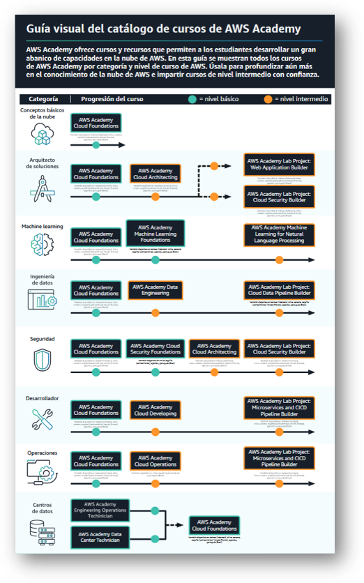
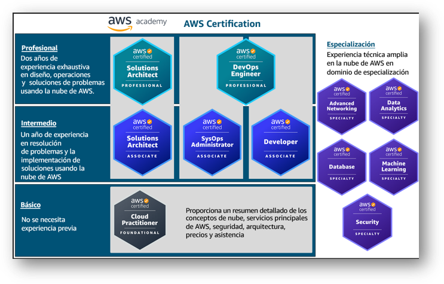
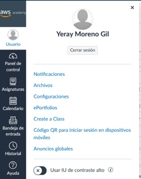
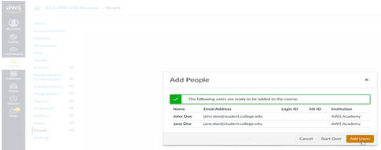
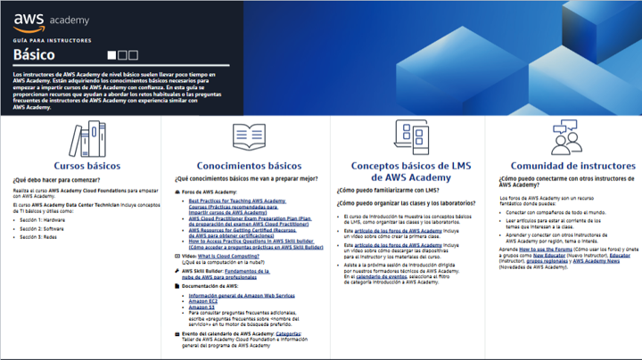
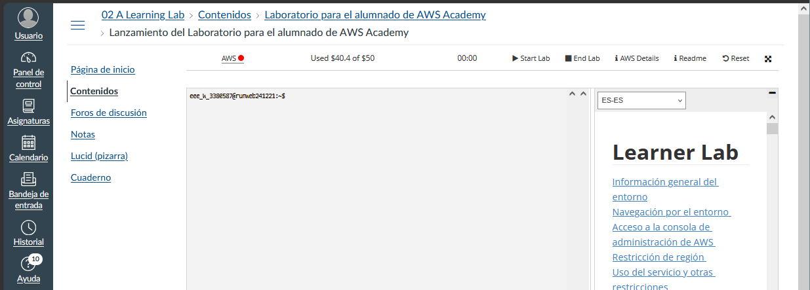

# Cursos AWS

## 01. Educator Getting Started 
**Módulo 1: Introducción**{:.awsbold}

**AWS Academy** ofrece a las instituciones de educación superior un plan de estudios de computación en la nube gratuito, a continuación, se muestra un listado de enlaces destacados:

- Guía del docente en español: AWS Academy Learner Lab - Educator Guide - Spanish (Spain)
- Forums en español para compartir recursos: Enseñando Cloud con AWS Academy (España) en este podemos encontrar una serie de documentos con videotutoriales y repositorios con ejercicios.
- [Un repositorio con los roadmap de las diferentes prácticas para los ciclos superiores y divididos por módulos](https://github.com/jose-emilio){:target="blank"}
  
AWS Academy ofrece laboratorios para el alumnado para ayudar a reforzar el aprendizaje de tus estudiantes. Estos laboratorios ofrecen un acceso práctico a más de 100 servicios de AWS para que los estudiantes trabajen en asignaciones más complejas, sin que se requiera ninguna información de tarjetas de crédito del alumnado. Para obtener acceso a los laboratorios para el alumnado, debes completar el curso de Introducción a **AWS Academy para el educador**.

**Módulo 2: Introducción al plan de estudios de AWS Academy**{:.awsbold}

Cada uno de los cursos de AWS Academy consta de una combinación de modalidades de aprendizaje. En primer lugar, los estudiantes aprenden cuestiones básicas sobre la nube, y luego pasan a un aprendizaje práctico. **Componentes** del plan de estudios de AWS:

- **Módulo de clases**: se trata de clases en directo o grabadas para presentar conceptos técnicos a los estudiantes. 
- **Laboratorios prácticos**: se trata de ejercicios guiados de la consola de administración de AWS que ofrecen la oportunidad a los estudiantes de practicar sus habilidades en un entorno de pruebas.
- **Pruebas de conocimientos**: son cuestionarios de opciones múltiples y respuestas múltiples para cada módulo con el fin de evaluar la comprensión lectora de los estudiantes. 
- **Ejercicios del proyecto**: incluyen proyectos basados en supuestos para desarrollar e implementar una solución utilizando servicios de AWS.

 
**AWS Academy Learner Lab**

AWS Academy ofrece laboratorios gratuitos para el alumnado proporciona un presupuesto de 100 USD para utilizar los servicios de AWS durante el tiempo que dure tu laboratorio. Dentro del laboratorio, los estudiantes disponen de acceso a un conjunto restringido de servicios de AWS para trabajar en sus proyectos, realizar los ejercicios de laboratorio designados por el educador o practicar.

**AWS Certification**

 
- Las AWS Certifications tienen una validez de 3 años, así que asegúrate de renovar tus certificaciones antes de que expiren.
- Los educadores y estudiantes de AWS Academy pueden acceder a conjuntos de preguntas de práctica oficiales y gratuitos para los exámenes de AWS Certification directamente en el [sitio web](https://explore.skillbuilder.aws/learn){:target="blank"}
- También puedes encontrar materiales de preparación para el examen gratuitos [aquí](https://aws.amazon.com/es/certification/certification-prep/?ch=tile&tile=prepare){:target="blank"}

**Módulo 3: Introducción a las plataformas de AWS Academy**{:.awsbold}

**Crear un entorno de clase** 

**Añadir estudiantes a una clase**

El estudiante recibe una invitación por correo desde notifications@instructure.com para que se una a la clase. Para completar la creación de la cuenta, el estudiante debe seleccionar Get Started (Comenzar) en el correo. Proporciona una lista separada por comas de las direcciones de correo de los estudiantes.

 
**Administración de una clase**

- **Cambiar la fecha** de inicio o finalización de una clase o **eliminarla** se tiene que hacer mediante solicitud al [servicio de atención al cliente](https://support.aws.amazon.com/#/contacts/aws-academy){:target="blank"}
- **Curso para el educador**: Los educadores se matriculan automáticamente como alumnos en una versión para el educador de cada uno de los cursos de AWS Academy. Puedes identificar estos cursos porque contienen la palabra **«Educator»**{:.yerbold} en el nombre del curso. Por ejemplo, AWS Academy Cloud Foundations - Educator. 
- **Guía del instructor y archivos de presentación**: El LMS de AWS Academy también es donde puedes descargar las presentaciones de PowerPoint y otros archivos asociados para el curso que estés impartiendo. Para localizar estos archivos, ve a la sección Files (Archivos) de un curso. Por motivos de propiedad intelectual, AWS Academy NO permite que se descarguen las guías para el alumno.
- **Administración de estudiantes jóvenes**: Habría que buscar y mirar términos, esto para alumnado menor de edad por tema de la protección de datos.

**Foros de AWS Academy**

Espacio para la comunidad y un centro de conocimiento para los educadores. En los foros, puedes buscar respuestas, plantear nuevas preguntas y responder a las de otros educadores. También encontrarás la programación de eventos organizada por los gerentes de programas técnicos de AWS Academy y de los eventos de incorporación organizados por los gerentes de programas de AWS Academy. 

**Credly**

Solución integral para emitir y administrar credenciales digitales. Credly colabora con organizaciones acreditadas que proporcionan credenciales digitales a personas de todo el mundo. Las insignias digitales de AWS Academy se proporcionan a través de la plataforma de Credly.

**Módulo 4: Obtención del estado Listo para enseñar**{:.awsbold}

AWS Academy ofrece dos niveles de cursos: Básico e Intermedio. Puedes comenzar a impartir en cualquiera de los niveles tras completar el curso de Introducción a AWS Academy para el educador.

Puedes encontrar un esquema del curso detallado en cada curso en la pestaña Files (Archivos) en el LMS, o en la pestaña Resources (Recursos).

Se hace un test para mostrar una guía del tipo de instructor que eres, aunque se pueden ver todas las guías. Hay una guía básica, dos avanzadas, dos expertas y otra basada en roles.
 

**Módulo 5: Siguientes pasos**{:.awsbold}

Directrices para el tema de marketing y del uso de los logos de AWS.

**SOPORTE**

- Consulta los foros. Ponte en contacto con el servicio de atención al cliente de AWS Academy directamente en la página del servicio de atención al cliente de AWS Academy. [Servicio de atención al cliente](https://support.aws.amazon.com/#/contacts/aws-academy){:target="blank"}
- El servicio de atención al cliente de AWS Academy ofrece asistencia 24/7 por correo.

!!! success "Módulo 6: Pruebas de conocimientos"

## 02. Learner Lab
**Bienvenida e información general sobre el curso**{:.awsbold}

En este apartado se encuentra un PDF no descargable con la guía para el alumnado: **Guía del alumno del Laboratorio para el alumnado de AWS Academy**

[Descargar guía](../assets/pdf/guia_aws_academy_learner_lab.pdf){ .md-button style="display:table;margin:0 auto;"}

**Conformidad y seguridad del Laboratorio para el alumnado de AWS Academy**{:.awsbold}

Un Laboratorio para el alumnado de AWS Academy proporciona un entorno de pruebas de larga duración para explorar los servicios de AWS. El entorno tiene las siguientes funciones:

- Puedes acceder a un conjunto restringido de servicios de AWS.
- Los datos y recursos que crees en la cuenta de AWS se conservarán hasta la fecha de finalización de la clase.
- Cada alumno tiene un límite presupuestario de 100 USD. Si superas el presupuesto, se desactivará tu cuenta de laboratorio y se perderán todos los progresos y recursos.
- Esta sesión tiene un temporizador predeterminado de 4 horas.
- Cerramos automáticamente las instancias EC2. Otros recursos, como las instancias RDS, siguen funcionando.

El cliente es responsable de la seguridad en la nube. Las medidas de seguridad que debes tomar dependen de los servicios que utilices y de la complejidad de tu sistema.

**Prácticas recomendadas para proteger tu red**

- Aplicar controles tanto para el tráfico entrante como para el saliente.
- Utilizar subredes en varias zonas de disponibilidad para separar las capas de tu aplicación.
- Configurar **grupos de seguridad** y **ACL** de red para permitir solo el tráfico entrante y saliente necesario.
- Inspeccionar y filtrar tu tráfico a nivel de aplicación.
- Automatizar la protección de las redes.
- Limitar la exposición permitiendo solo el acceso mínimo necesario.

**Recursos adicionales**

- [Documentación oficial](https://docs.aws.amazon.com/){:target="blank"}
- [Fundamentos de seguridad en la nube de AWS Academy](https://aws.amazon.com/training/awsacademy){:target="blank"}
- [Aspectos básicos de AWS (formato digital)](https://explore.skillbuilder.aws/learn/course/external/view/elearning/48/aws-security-fundamentals-second-edition){:target="blank"}
- [Introducción a la seguridad, identidad y conformidad de AWS (formato digital)](https://explore.skillbuilder.aws/learn/course/external/view/elearning/101/getting-started-with-aws-security-identity-and-compliance){:target="blank"}
- [Introducción a AWS Identity and Access Management (IAM) (digital)](https://explore.skillbuilder.aws/learn/course/external/view/elearning/120/introduction-to-aws-identity-and-access-management-ia){:target="blank"}
- [Introducción a Amazon Virtual Private Cloud (VPC) (formato digital)](https://explore.skillbuilder.aws/learn/course/external/view/elearning/79/introduction-to-amazon-virtual-private-cloud-vpc){:target="blank"}
- [Asegurar y proteger tus datos en Amazon Simple Storage Service (Amazon S3) (formato digital)](https://explore.skillbuilder.aws/learn/course/external/view/elearning/4892/securing-and-protecting-your-data-in-amazon-simple-storage-service-amazon-s3){:target="blank"}
- [Gobernanza a escala de la seguridad de AWS (formación presencial)](https://aws.amazon.com/training/classroom/aws-security-governance-at-scale){:target="blank"}
- [Prácticas recomendadas de seguridad de AWS: Monitorización y Alertas (formato digital)](https://explore.skillbuilder.aws/learn/course/external/view/elearning/11264/aws-security-best-practices-monitoring-and-alerting){:target="blank"}

**Laboratorio para el alumnado de AWS Academy**{:.awsbold}
 

Cuando el cronómetro alcance cero, todos los servicios que usted ha configurado serán terminados y la cuenta temporal será desactivada. Si necesita más tiempo haga clic en el botón Start Lab otra vez para resetear el cronómetro. Puede reiniciar el cronómetro tantas veces como usted quiera.

**Recursos de los Laboratorios para el alumnado de AWS Academy**{:.awsbold}

1. **Demo - Cómo acceder al Laboratorio para el alumnado**
Hay que iniciar el laboratorio y, una vez inicializado, pulsar en **AWS**, lo que nos lleva a la interfaz de la consola de AWS, donde crearemos nuestras instancias de máquinas. Hay que tener en cuenta, cuando finalicemos, parar el laboratorio, ya que tiene un tiempo límite de 4 horas, y controlar el consumo de gasto.
2. **Demo - Consejos generales para solucionar problemas**
Documentación: [https://docs.aws.amazon.com/es_es/](https://docs.aws.amazon.com/es_es/){:target="blank"}
3. **Demo - Cómo lanzar servicios a través de la consola de AWS**
AWS (Amazon Web Services) es una plataforma de servicios en la nube que se lanzan desde la consola de AWS. Algunos de los principales servicios son:
      - **Cloud computing**
        - **Elastic Compute Cloud (Amazon EC2)**: proporciona capacidades de servidor virtual escalables y personalizables.
        - **Elastic Container Service (Amazon ECS)**: permite ejecutar y administrar contenedores Docker.
      - **Almacenamiento y bases de datos**
        - **Simple Storage Service (Amazon S3)**: ofrece almacenamiento de objetos escalable y duradero.
        - **Elastic Block Store (Amazon EBS)**: proporciona almacenamiento persistente de bloques para instancias de EC2.
        - **Relational Database Service (Amazon RDS)**: permite configurar y gestionar bases de datos relacionales.
      - **Redes y entrega de contenido**
        - **Virtual Private Cloud (Amazon VPC)**: permite crear redes virtuales aisladas en la nube.
      - **Análisis y Big Data**
        - **Amazon Redshift**: almacén de datos empresariales para análisis de big data.
        - **Amazon Athena**: permite consultar datos en S3 utilizando SQL estándar.
        - **Elastic MapReduce (Amazon EMR)**: proporciona un marco para procesamiento y análisis de big data.
        - **Amazon Kinesis**: permite procesar y analizar datos de streaming en tiempo real.

4. **CodeWhisperer** - Actividad de laboratorio para estudiantes
En esta actividad, usarás CodeWhisperer en AWS Cloud9 para crear un pequeño programa en Python. Este programa pide al usuario que indique una dirección de correo electrónico y verifica que la dirección tenga un formato válido. Al crear el programa, debes usar CodeWhisperer para generar la mayor parte del código basándote en las indicaciones que proporciones.
      - **AWS Cloud9** es un entorno de desarrollo integrado (IDE).
      - **Amazon CodeWhisperer** es un generador de código de uso general basado en machine learning que ofrece recomendaciones de código en tiempo real.

## 03. Cloud Foundations
**Introducción al curso**{:.awsbold}

- Objetivos e información general sobre el curso
- Vales de examen de AWS Certification
- Documentación de AWS

**Módulo 1: Información general sobre los conceptos de la nube**{:.awsbold}

- Introducción a la computación en la nube
- Ventajas de la nube
- Introducción a AWS
- Traslado a AWS Cloud
- Actividad: Pregunta de examen de ejemplo
- Prueba de conocimientos

**Módulo 2: Economía y facturación de la nube**{:.awsbold}

- Aspectos básicos de los precios
- Costo total de propiedad
- Actividad: Calculadora de costo mensual de AWS
- Caso práctico de Delaware North
- AWS Organizations
- Administración de facturación y costos de AWS
- Paneles de facturación
- Modelos de Technical Support
- Actividad: Support Plan Scavenger Hunt
- Actividad: Pregunta de examen de ejemplo
- Prueba de conocimientos

**Módulo 3: Información general sobre la infraestructura global de AWS**{:.awsbold}

- Infraestructura global de AWS
- Demostración: Infraestructura global de AWS
- Servicios y categorías de servicios de AWS
- Actividad: Clickthrough de la consola de administración de AWS
- Actividad: Pregunta de examen de ejemplo
- Prueba de conocimientos

**Módulo 4: Seguridad de la nube**{:.awsbold}

- Modelo de responsabilidad compartida de AWS
- Actividad: Modelo de responsabilidad compartida de AWS
- AWS IAM
- Demostración: Consola AWS IAM
- Protección de una nueva cuenta AWS
- **Laboratorio 1: Introducción a AWS IAM**
- Protección de cuentas
- Protección de datos
- Trabajar para garantía de la conformidad
- Actividad: Pregunta de examen de ejemplo
- Prueba de conocimientos

**Módulo 5: Redes y entrega de contenido**{:.awsbold}

- Conceptos básicos de redes
- Amazon VPC
- VPC networking
- Actividad: Etiquetar este diagrama
- Demostración: Amazon VPC Console
- Seguridad de VPC
- Actividad: Diseñar una VPC
- **Laboratorio 2: Creación de una VPC y lanzamiento de un servidor web**
- Route 53
- CloudFront
- Actividad: Pregunta de examen de ejemplo
- Prueba de conocimientos

**Módulo 6: Cómputo**{:.awsbold}

- Información general sobre los servicios de cómputo
- Amazon EC2 parte 1
- Amazon EC2 parte 2
- Amazon EC2 parte 3
- Demostración: Amazon EC2
- **Laboratorio 3: Introducción a Amazon EC2**
- Actividad: Amazon EC2 versus servicios administrados
- Demostración: Consola de partes de Amazon EC2
- Optimización de costos de Amazon EC2
- Servicios de contenedores
- Introducción a AWS Lambda
- Actividad: AWS Lambda
- Introducción a AWS Elastic Beanstalk
- Actividad: AWS Elastic Beanstalk
- Actividad: Pregunta de examen de ejemplo
- Prueba de conocimientos

**Módulo 7: Almacenamiento**{:.awsbold}

- AWS / EBS
- Demostración: Amazon Elastic Block Store Console
- **Laboratorio 4: trabajo con EBS**
- AWS S3
- Demostración: AWS S3 Console
- AWS EFS
- Demostración: AWS EFS Console
- AWS S3 Glacier
- Demostración: AWS S3 Glacier Console
- Actividad: Estora Technology Selection
- Actividad: Pregunta de examen de ejemplo
- Prueba de conocimientos

**Módulo 8: Bases de datos**{:.awsbold}

- Amazon RDS
- Demostración: Amazon RDS Console
- **Laboratorio 5: Crear un servidor de base de datos**
- Amazon DynamoDB
- Demostración: Amazon DynamoDB
- Amazon Redshift
- Amazon Aurora
- Actividad: Caso práctico de base de datos
- Actividad: Pregunta de examen de ejemplo
- Prueba de conocimientos

**Módulo 9: Arquitectura en la nube**{:.awsbold}

- Pilares de diseño del marco de AWS Well-Architected
- Actividad: Pilares de diseño del marco de AWS Well-Architected
- Excelencia operativa
- Seguridad
- Fiabilidad
- Eficiencia del rendimiento
- Optimización de costos
- Fiabilidad y alta disponibilidad
- AWS Trusted Advisor
- Actividad: Interpretación recomendaciones de AWS Trusted Advisor
- Actividad: Pregunta de examen de ejemplo
- Prueba de conocimientos

**Módulo 10: Escalado automático y supervisión**{:.awsbold}

- Elastic Load Balancing
- Actividad: Elastic Load Balancing
- Amazon CloudWatch
- Actividad: Amazon CloudWatch
- Amazon EC2 Auto Scaling
- **Laboratorio 6: Scale and Load Balance Your Architecture**
- Actividad: Pregunta de examen de ejemplo
- Prueba de conocimientos

## 04 Data Engineering

**Module 1: Welcome to AWS Academy Data Engineering**{:.awsbold}

- Course prerequisites and objectives
- Course overview

**Module 2: Data-Driven Organizations**{:.awsbold}

- Data-driven decisions
- The data pipeline – infrastructure for data-driven decisions
- The role of the data engineer in data-driven organizations
- Modern data strategies
- **Lab: Accessing and Analyzing Data by Using Amazon S3**
- Knowledge check

**Module 3: The Elements of Data**{:.awsbold}

- The five Vs of data – volume, velocity, variety, veracity, and value
- Volume and velocity
- Variety – data types
- Variety – data sources
- Veracity and value
- Activities to improve veracity and value
- Activity: Planning Your Pipeline
- Knowledge check

**Module 4: Design Principles and Patterns for Data Pipelines**{:.awsbold}

- AWS Well-Architected Framework and Lenses
- Activity: Using the Well-Architected Framework
- The evolution of data architectures
- Modern data architecture on AWS
- Modern data architecture pipeline: Ingestion and storage
- Modern data architecture pipeline: Processing and consumption
- Streaming analytics pipeline
- **Lab: Querying Data by Using Athena**
- Knowledge check

**Module 5: Securing and Scaling the Data Pipeline**{:.awsbold}

- Cloud security review
- Security of analytics workloads
- ML security
- Scaling: An overview
- Creating a scalable infrastructure
- Creating scalable components
- Knowledge check

**Module 6: Ingesting and Preparing Data**{:.awsbold}

- ETL and ELT comparison
- Data wrangling introduction
- Data discovery
- Data structuring
- Data cleaning
- Data enriching
- Data validating
- Data publishing
- Knowledge check

**Module 7: Ingesting by Batch or by Stream**{:.awsbold}

- Comparing batch and stream ingestion
- Batch ingestion processing
- Purpose-built ingestion tools
- AWS Glue for batch ingestion processing
- Scaling considerations for batch processing
- **Lab: Performing ETL on a Dataset by Using AWS Glue**
- Services for stream processing
- Scaling considerations for stream processing
- Ingesting IoT data by stream
- Knowledge check

**Module 8: Storing and Organizing Data**{:.awsbold}

- Storage in the modern data architecture
- Data lake storage
- Data warehouse storage
- Purpose-built databases
- Storage in support of the pipeline
- Securing storage
- **Lab: Storing and Analyzing Data by Using Amazon Redshift**
- Knowledge check

**Module 9: Processing Big Data**{:.awsbold}

- Big data processing concepts
- Apache Hadoop
- Apache Spark
- Amazon EMR
- Managing your Amazon EMR clusters
- **Lab: Processing Logs by Using Amazon EMR**
- Apache Hudi
- **Lab: Updating Dynamic Data in Place**
- Knowledge check

**Module 10: Processing Data for ML**{:.awsbold}

- ML concepts
- The ML lifecycle
- Framing the ML problem to meet the business goal
- Collecting data
- Applying labels to training data with known targets
- Activity: Labeling with SageMaker Ground Truth
- Preprocessing data
- Feature engineering
- Developing a model
- Deploying a model
- ML infrastructure on AWS
- SageMaker
- Demo: Preparing Data and Training a Model with SageMaker
- Demo: Preparing Data and Training a Model with SageMaker Canvas
- Working with generative AI
- Demo: Creating a Linear Regression Model Using Amazon Q Developer
- AI/ML services on AWS
- Knowledge check

**Module 11: Analyzing and Visualizing Data**{:.awsbold}

- Considering factors that influence tool selection
- Comparing AWS tools and services
- Selecting tools for a gaming analytics use case
- **Lab: Analyzing and Visualizing Streaming Data with Amazon Data Firehose, OpenSearch Service, and OpenSearch Dashboards**
- Knowledge check

**Module 12: Automating the Pipeline**{:.awsbold}

- Automating infrastructure deployment
- CI/CD
- Automating with Step Functions
- **Lab: Building and Orchestrating ETL Pipelines by Using Athena and Step Functions**
- Knowledge check

**Module 13: Bridging to Certification**{:.awsbold}

- AWS Certification overview

!!! success "Correcto"