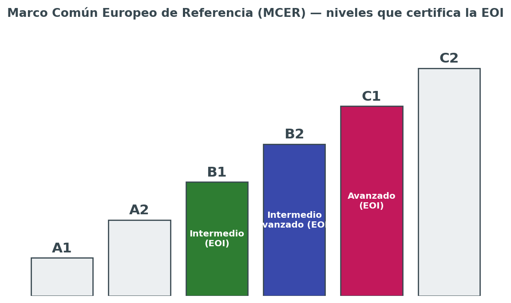
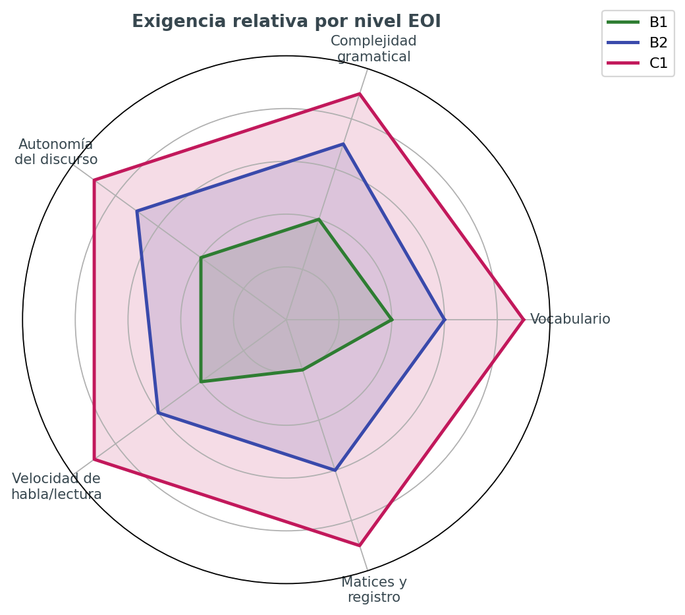
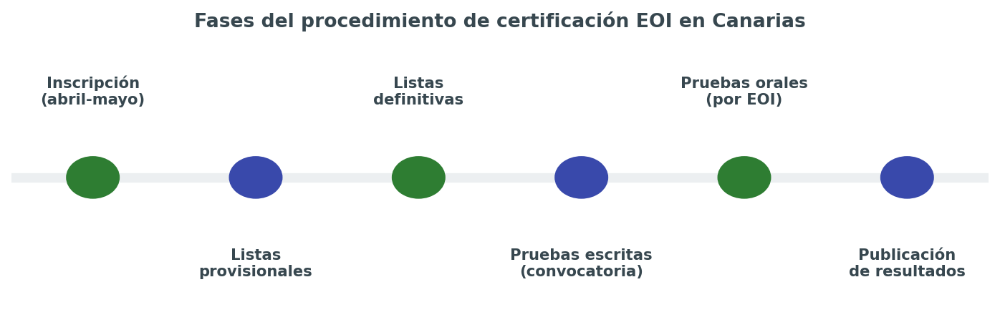

# 🎓 EOI — Guía de Certificación B1 · B2 · C1 de Inglés

> *"No estudies para el examen. Estudia el idioma y el examen se aprueba solo."*

Esta carpeta reúne **todo lo que necesito repasar para presentarme y aprobar las pruebas de certificación de inglés de la Escuela Oficial de Idiomas (EOI)** en los niveles **B1 (Intermedio)**, **B2 (Intermedio avanzado, antes "B2.2")** y **C1 (Avanzado)**, dentro de la Comunidad Autónoma de Canarias.

No es un curso de inglés general: es una **guía orientada 100% al examen**. Cada página está pensada para que, estudiándola de principio a fin, sepa exactamente qué me van a pedir, cómo se puntúa, qué estructuras gramaticales tengo que dominar en cada nivel y qué estrategias aplicar en cada parte de la prueba.

## 📂 Cómo está organizada esta guía

| Archivo | Contenido | Cuándo usarlo |
|---|---|---|
| `00-introduccion.md` | Este documento: qué es la EOI, comparativa de niveles, calendario | Antes de empezar, para tener el mapa general |
| `01-estructura-examen.md` | Las 5 partes del examen, puntuación, criterios de "Apto" | Para entender las reglas del juego |
| `02-tiempos-verbales.md` | Tiempos verbales y estructuras gramaticales por nivel | Repaso gramatical central, el más largo |
| `03-comprension.md` | Estrategias de Listening, Reading y mediación receptiva | Antes de practicar exámenes de comprensión |
| `04-expresion-escrita.md` | Cómo escribir cada tipo de texto (email, ensayo, informe...) | Antes de escribir redacciones |
| `05-expresion-oral.md` | Monólogo, interacción y mediación oral | Antes de practicar speaking |
| `06-plan-de-estudio.md` | Planificación semanal, checklist y recursos recomendados | Para organizar el tiempo hasta el examen |

Se recomienda leerlas en este orden, aunque cada una es autónoma y se puede consultar de forma independiente como chuleta rápida antes del examen.

## 🗺️ ¿Qué es la EOI y qué certifica?

Las **Escuelas Oficiales de Idiomas (EOI)** son centros públicos de enseñanza de idiomas dependientes de las Consejerías de Educación de cada comunidad autónoma. Sus certificados son **títulos oficiales con validez en toda España** y reconocimiento en el ámbito europeo, ya que se basan en el **Marco Común Europeo de Referencia para las Lenguas (MCER)**.

En Canarias, la normativa que regula las enseñanzas y las pruebas de certificación es:

- **Real Decreto 1/2019**, de 11 de enero, que establece los principios básicos comunes de evaluación de los niveles Intermedio B1, Intermedio B2, Avanzado C1 y Avanzado C2 en toda España.
- **Orden de 15 de septiembre de 2022** (BOC nº 190), por la que se regula la evaluación del alumnado y las pruebas de certificación de idiomas de régimen especial en Canarias.
- **Resolución de 5 de julio de 2023** (BOC nº 140), que dicta instrucciones sobre la estructura, características y elaboración de las pruebas de certificación.

Cada curso se publica además una **Resolución de convocatoria** (en el BOC) con fechas concretas, y una **Guía para los aspirantes** con las especificaciones exactas de ese año. Conviene descargar siempre la guía de la convocatoria vigente desde la web de la Consejería, porque los detalles de horarios y modelos pueden variar ligeramente de un curso a otro.

## 🧭 Comparativa rápida entre B1, B2 y C1

| | **B1 — Intermedio** | **B2 — Intermedio avanzado** | **C1 — Avanzado** |
|---|---|---|---|
| **Perfil del hablante** | Se desenvuelve en situaciones cotidianas y predecibles | Interactúa con fluidez razonable, incluso con hablantes nativos | Se expresa con flexibilidad y naturalidad, casi sin esfuerzo perceptible |
| **Vocabulario** | Suficiente para temas familiares: trabajo, viajes, estudios | Amplio, incluye lenguaje más idiomático y algo de registro formal | Muy amplio, incluye matices, connotaciones y coloquialismos |
| **Gramática** | Tiempos verbales básicos e intermedios, oraciones compuestas simples | Subordinadas complejas, voz pasiva, discurso indirecto | Estructuras avanzadas: inversión, condicionales mixtos, matices modales |
| **Comprensión** | Textos claros sobre temas conocidos, a velocidad normal | Textos largos y algo abstractos, la mayoría de programas de TV/radio | Textos extensos y complejos, incluso con implícitos y humor |
| **Producción** | Textos sencillos y cohesionados sobre temas conocidos | Textos claros y detallados sobre una amplia gama de temas | Textos bien estructurados, con un uso controlado de conectores y estilo |
| **Mediación** | Transmite información básica y concreta | Resume y reformula con cierta precisión | Adapta el registro y matiza con precisión ante audiencias distintas |
| **A quién suele interesar** | Requisito habitual para ciertos ciclos formativos y oposiciones | Nivel más demandado en oposiciones docentes y muchos grados | Nivel exigido en máster, oposiciones de cuerpos superiores o C2 de idiomas |

## 📅 Calendario orientativo del procedimiento en Canarias

El procedimiento de certificación en Canarias sigue, a grandes rasgos, estas fases cada curso:

1. **Inscripción** de aspirantes libres y escolarizados de B1, B2, C1 y C2: finales de abril / mediados de mayo.
2. **Publicación de listas provisionales** de admitidos, con posibilidad de subsanar errores.
3. **Publicación de listas definitivas** de admitidos, ya con el centro donde se realiza el examen.
4. **Pruebas escritas**: sesión única y común para todos los aspirantes del mismo idioma y nivel, dentro de la convocatoria ordinaria (finales de mayo / mediados de junio).
5. **Pruebas orales**: organizadas por cada EOI en fechas y turnos propios, dentro del mismo periodo de convocatoria.
6. **Publicación de resultados** y, en su caso, apertura del plazo de reclamaciones.
7. **Convocatoria extraordinaria**: para quienes no se presenten o no superen la ordinaria, normalmente a principios de septiembre.

> ⚠️ Las fechas exactas cambian cada curso. Antes de organizar el plan de estudio (ver `06-plan-de-estudio.md`), es imprescindible consultar la **Resolución de convocatoria** del año en curso publicada en el Boletín Oficial de Canarias (BOC) y la web de la Consejería de Educación.

## 🧩 Filosofía de esta guía

1. **Todo está orientado al examen.** No se explica gramática "porque sí": se explica lo que hay que saber para responder bien a cada tipo de tarea.
2. **Se diferencia por nivel.** Lo que es opcional en B1 puede ser obligatorio en B2, y lo que en B2 es aceptable puede penalizar en C1 por ser demasiado simple.
3. **Se prioriza el error típico.** Cada tema incluye, cuando aplica, los fallos más frecuentes de un hablante de español al enfrentarse a ese punto.
4. **Se enlaza con el resto del repositorio.** Para tablas de vocabulario, phrasal verbs o recursos generales de práctica, esta guía remite a `docs/ingles/` en lugar de duplicar contenido.

## 🔗 Relación con el resto de "Inglés" en este repositorio

Esta carpeta **no sustituye** al contenido general de inglés que ya existe en `docs/ingles/` (verbos, grammar, phrasal verbs, recursos, pronunciación, vocabulario). Esa sección sigue siendo la base de estudio del idioma en general.

`docs/EOI/` es un **filtro aplicado sobre ese contenido**: selecciona, prioriza y añade lo específico del examen (estructura de las pruebas, criterios de calificación, estrategias por destreza, mediación) que no tiene sentido mezclar con los apuntes generales de gramática y vocabulario.

Cuando un tema ya está bien cubierto en `docs/ingles/`, aquí se enlaza directamente en lugar de repetirlo, para mantener cada cosa en su sitio:

- Vocabulario y phrasal verbs → `../ingles/05phrasal.md`, `../ingles/21vocab.md`
- Pronunciación → `../ingles/13pronu.md`
- Recursos generales de práctica → `../ingles/10recursos.md`

## ✅ Objetivo final

Al terminar de estudiar las siete páginas de esta guía, el objetivo es llegar al examen sabiendo:

- Exactamente qué partes tiene la prueba de mi nivel y cómo se puntúa cada una.
- Qué tiempos verbales y estructuras gramaticales tengo que dominar de forma activa (no solo reconocerlos).
- Cómo abordar cada tarea de comprensión, expresión y mediación sin perder tiempo ni puntos por desconocer el formato.
- Un plan de estudio realista con las semanas que quedan hasta la convocatoria.

`[captura pendiente: portada oficial de la Guía para los aspirantes de la convocatoria vigente descargada de la web de la Consejería]`

## 🔤 Glosario de siglas del examen

Las pruebas de certificación usan siempre las mismas siglas en toda España. Conocerlas de memoria ahorra confusión al leer la guía del aspirante o las actas de resultados.

| Sigla | Nombre completo | Qué evalúa |
|---|---|---|
| **CE** | Comprensión de textos escritos | Reading — entender textos escritos de distinta tipología |
| **CO** | Comprensión de textos orales | Listening — entender audios (monólogos y diálogos) |
| **EIE** | Producción y coproducción de textos escritos | Writing — redactar textos propios |
| **EIO** | Producción y coproducción de textos orales | Speaking — monólogo e interacción oral |
| **MED** | Mediación lingüística (escrita y oral) | Actuar de "puente" entre dos textos o interlocutores |
| **MCER** | Marco Común Europeo de Referencia para las Lenguas | Escala común (A1-C2) en la que se basan todos los niveles |
| **PCEI** | Pruebas de Certificación de Enseñanzas de Idiomas | Nombre oficial del proceso completo de examen |
| **BOC** | Boletín Oficial de Canarias | Donde se publican convocatoria y normativa |

## 🎯 Para qué sirve cada certificado

| Nivel | Usos típicos |
|---|---|
| **B1** | Requisito de acceso o mérito en algunos ciclos formativos de grado superior, pruebas de acceso a la universidad para mayores de 25/45 años, currículum básico |
| **B2** | Nivel más solicitado en oposiciones docentes y de la administración, admisión en programas de movilidad (Erasmus+), muchos grados universitarios con mención bilingüe |
| **C1** | Oposiciones de cuerpos superiores, másteres oficiales, acreditación de nivel C1 en convocatorias de idiomas del profesorado, refuerzo de currículum para perfiles internacionales |

Antes de matricularme y estudiar un nivel concreto conviene comprobar en la convocatoria oficial del organismo al que voy a presentar el certificado (oposición, universidad, empresa) que **acepta específicamente el certificado EOI** y no exige otro tipo de acreditación.

## 🌍 Equivalencia aproximada con otras certificaciones

Es habitual comparar la EOI con certificaciones internacionales como Cambridge, IELTS o TOEFL. La equivalencia es **aproximada**, ya que cada examen mide competencias con enfoques distintos, pero sirve como referencia orientativa:

| Nivel MCER | EOI (España) | Cambridge English | IELTS (aprox.) | TOEFL iBT (aprox.) |
|---|---|---|---|---|
| B1 | Intermedio | PET / B1 Preliminary | 4.0 – 5.0 | 42 – 71 |
| B2 | Intermedio avanzado | FCE / B2 First | 5.5 – 6.5 | 72 – 94 |
| C1 | Avanzado | CAE / C1 Advanced | 7.0 – 8.0 | 95 – 120 |

`[captura pendiente: tabla oficial de equivalencias del Consejo de Europa, si se quiere citar la fuente exacta]`

## ❓ Preguntas frecuentes antes de empezar

**¿Puedo presentarme directamente a B2 sin haber certificado B1?**
Sí. Como aspirante libre no es obligatorio certificar los niveles anteriores; cada convocatoria se solicita de forma independiente. Lo importante es tener realmente el nivel, no el papel previo.

**¿Si suspendo una parte, tengo que repetir todo el examen?**
Depende de la normativa autonómica vigente cada curso: en algunas convocatorias se guardan las partes superadas para la convocatoria extraordinaria del mismo curso académico, pero no de un curso a otro. Hay que confirmarlo en la guía del aspirante de la convocatoria en la que me presento.

**¿La prueba oral es el mismo día que la escrita?**
No necesariamente. La prueba escrita es en sesión única para todos los aspirantes de un idioma y nivel; la prueba oral la organiza cada EOI en fechas y turnos propios dentro del periodo de convocatoria.

**¿Puedo usar diccionario en el examen?**
No. Ni diccionario ni traductor ni ningún material de consulta, salvo que la convocatoria indique expresamente lo contrario para algún colectivo específico (adaptaciones por necesidades educativas).

**¿Qué pasa si llego tarde?**
Cada convocatoria fija una hora límite de acceso al aula, pasada la cual no se permite la entrada. Conviene llegar siempre con margen (ver checklist en `06-plan-de-estudio.md`).

**¿Necesito preparar mediación aunque no la haya estudiado nunca?**
Sí, es obligatoria en B1, B2, C1 y C2. Se explica en detalle en `03-comprension.md` (mediación receptiva) y `05-expresion-oral.md` (mediación oral).

## ⚠️ Errores de planteamiento habituales antes de empezar a estudiar

- **Estudiar solo gramática y descuidar el vocabulario activo.** El examen premia la variedad léxica tanto como la corrección gramatical.
- **Practicar exámenes sin cronómetro.** La gestión del tiempo es en sí misma una competencia que se evalúa indirectamente.
- **No leer nunca los criterios de corrección oficiales (rúbricas).** Saber cómo puntúa el corrector cambia por completo la forma de redactar y de hablar.
- **Ignorar la mediación por pensar que "no es un tiempo verbal".** Es una de las cinco partes y pesa exactamente igual que las demás.
- **Memorizar redacciones enteras.** Los correctores detectan fácilmente los textos aprendidos de memoria y no encajan con el enunciado real.

## 👥 Aspirante libre vs. aspirante escolarizado

En Canarias conviven dos vías para presentarse a las pruebas de certificación, y conviene saber en cuál estoy:

| | **Aspirante libre** | **Aspirante escolarizado** |
|---|---|---|
| Requisito previo | Ninguno, solo inscripción en plazo | Estar matriculado y cursando ese nivel en una EOI |
| Coste | Tasa de examen (modelo 700) | Incluido en la matrícula del curso |
| Preparación | Autónoma (esta guía, academias, autoestudio) | Clases regulares + trabajo autónomo |
| Convocatorias por curso | Ordinaria y, si procede, extraordinaria | Ordinaria y, si procede, extraordinaria |
| Ventaja principal | Flexibilidad total de horarios y ritmo | Seguimiento docente, feedback constante, simulacros guiados |
| Riesgo principal | Falta de feedback sobre el propio nivel real | Ritmo marcado por el grupo, menos margen de personalización |

Esta guía está pensada principalmente para **aspirante libre o para reforzar la preparación de un aspirante escolarizado por su cuenta**, ya que asume que no hay un profesor corrigiendo cada tarea de forma sistemática y que hay que aprender también a autoevaluarse con las rúbricas oficiales.

## 🔖 Enlaces oficiales imprescindibles

Estos son los enlaces que hay que tener siempre a mano durante la preparación (comprobar que siguen vigentes en la convocatoria del curso actual):

| Recurso | Para qué sirve |
|---|---|
| Página de "Pruebas de certificación de las EOI" (Consejería de Educación de Canarias) | Punto de entrada a toda la información oficial: fechas, guía del aspirante, apéndices |
| Guía para los aspirantes de la convocatoria vigente | Documento de referencia con todos los detalles del procedimiento de ese curso |
| Especificaciones de la PCEI | Detalle técnico de cómo se construyen las pruebas por nivel e idioma |
| Apéndice V y VI (rúbricas de escritura y de habla) | Los criterios exactos con los que se corrige cada texto y cada intervención oral |
| Apéndice VII y VIII (rúbricas de mediación) | Los criterios exactos con los que se corrige la mediación escrita y oral |
| Modelos de pruebas de convocatorias pasadas | Exámenes reales de años anteriores para practicar en condiciones parecidas |
| Boletín Oficial de Canarias (BOC) | Publicación de la Resolución de convocatoria y de la normativa (Orden 2022, Resolución 2023) |

`[captura pendiente: capturas de pantalla de cada uno de estos apartados en la web de la Consejería, para facilitar la navegación]`

## 📝 Cómo hago seguimiento de mi propia preparación

Una plantilla simple, pero útil para no perder de vista el progreso real (se puede llevar en una hoja de cálculo aparte o directamente en un cuaderno):

| Semana | Destreza trabajada | Horas dedicadas | Autoevaluación (1-5) | Qué falla todavía |
|---|---|---|---|---|
| 1 | Gramática base | | | |
| 2 | Tiempos verbales | | | |
| 3 | Listening | | | |
| ... | ... | | | |

La columna "qué falla todavía" es la más importante: obliga a ser honesto/a sobre los puntos débiles en lugar de repetir siempre lo que ya se domina, que es la trampa más habitual al autoestudiar.

## 🧠 Mentalidad de cara a la preparación

- El examen **no premia la perfección**, premia superar un umbral concreto (cada parte ≥5/10 y media ≥6,5/10). Apuntar a la perfección en todo genera ansiedad innecesaria; apuntar al umbral con margen es más eficaz.
- **Es mejor un texto correcto y algo simple que uno ambicioso y lleno de errores.** Sobre todo en B1 y B2, la corrección pesa más que la sofisticación.
- **La constancia corta y frecuente vence al estudio intensivo y esporádico.** 30-45 minutos diarios de exposición al idioma rinden más que una sesión de tres horas el fin de semana.
- **Equivocarse practicando es gratis; equivocarse el día del examen, no.** Cuantos más simulacros en condiciones reales (tiempo cronometrado, sin diccionario), menos sorpresas el día de la prueba.

## 📌 Antes de continuar

Antes de pasar a la siguiente página conviene tener claro:

1. En qué nivel (B1, B2 o C1) me voy a examinar en la próxima convocatoria.
2. Si me presento como aspirante libre o estoy escolarizado en una EOI.
3. Dónde encontrar la Resolución de convocatoria y la Guía del aspirante del curso actual.
4. Que la mediación es obligatoria en todos los niveles desde B1.

Con esto claro, el siguiente paso es entender **exactamente cómo se estructura y se puntúa el examen**.

## 🧾 Resumen en una frase por nivel

- **B1:** con esto me defiendo en cualquier situación cotidiana y predecible, en presente, pasado y futuro, sin miedo a equivocarme en lo básico.
- **B2:** con esto puedo argumentar, matizar y seguir una conversación con fluidez razonable, incluso sobre temas algo abstractos.
- **C1:** con esto me expreso casi como en mi lengua materna, controlando el registro, los matices y las estructuras más sofisticadas del idioma.

Guardar esta frase como recordatorio del objetivo real ayuda a no perderse en el detalle técnico de la gramática y no olvidar que, al final, el examen certifica **una capacidad de comunicación**, no una colección de reglas memorizadas.

## 🗺️ Mapa visual de esta guía

| Bloque | Páginas | Pregunta que responde |
|---|---|---|
| Contexto | `00` | ¿Qué es la EOI y qué certifica exactamente? |
| Reglas del juego | `01` | ¿Cómo se estructura y se puntúa el examen? |
| Base gramatical | `02` | ¿Qué tiempos y estructuras debo dominar? |
| Comprensión | `03` | ¿Cómo leo y escucho de forma eficiente? |
| Producción | `04`, `05` | ¿Cómo escribo y hablo para conseguir la nota? |
| Organización | `06` | ¿Cuándo y cómo estudio todo esto? |

---

**Siguiente página:** [`01-estructura-examen.md`](01-estructura-examen.md) — cómo se estructura y se puntúa exactamente el examen.

*Esta guía se irá revisando cada convocatoria para mantener actualizadas fechas, enlaces y cualquier cambio normativo relevante.*

`[captura pendiente: pantallazo de mi propia inscripción confirmada en la convocatoria a la que me presento]`
