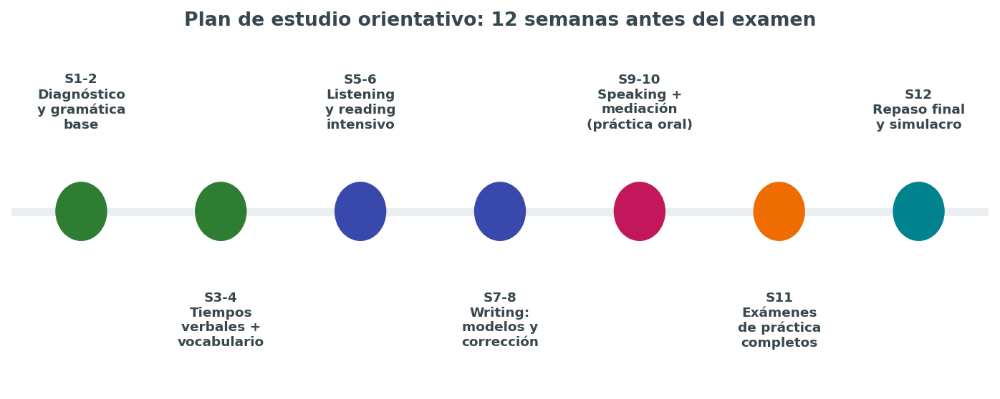
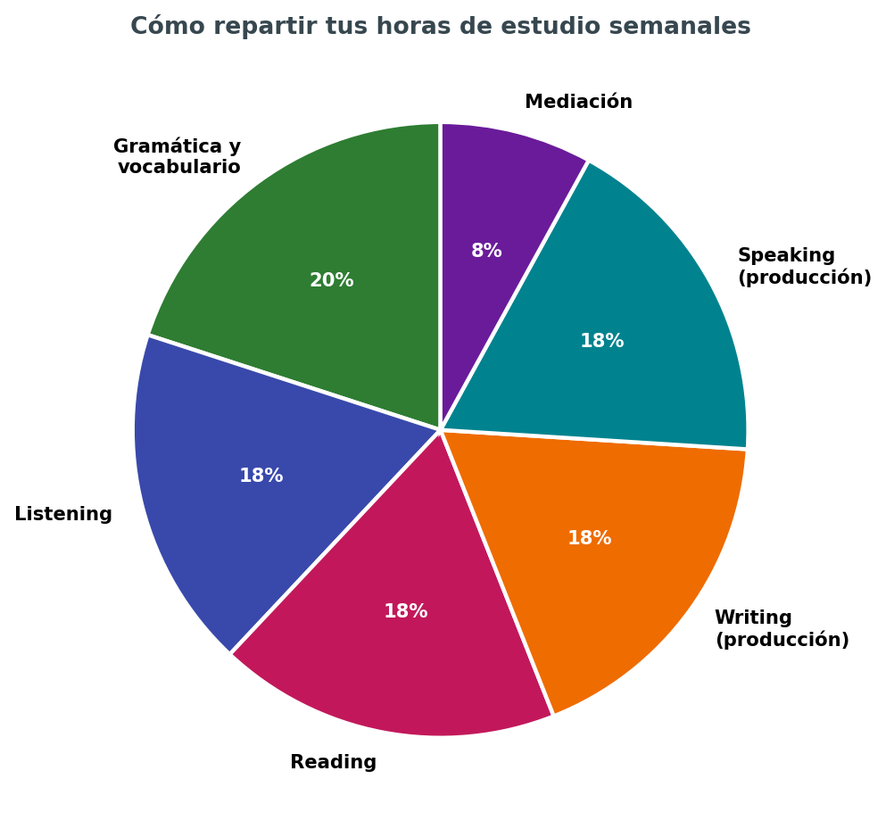
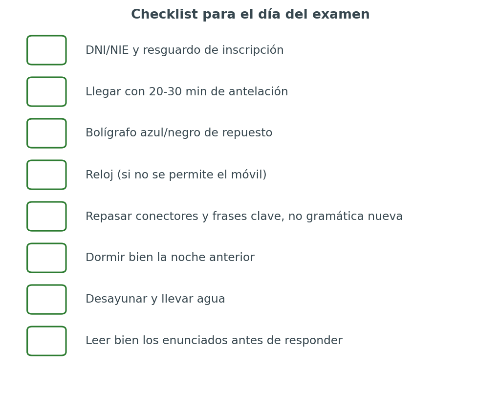

# 🗓️ Plan de estudio, recursos y checklist final

Saber qué hay que estudiar (páginas `01` a `05`) no sirve de mucho sin un plan realista de **cuándo y cómo** estudiarlo. Esta página propone una planificación orientativa de 12 semanas, una forma de repartir el tiempo semanal entre destrezas, recursos concretos de práctica y un checklist final para el día del examen.

> Esta planificación es un punto de partida, no un dogma. Hay que adaptarla al tiempo real disponible, al nivel de partida y a las semanas que queden hasta la convocatoria (ver fechas orientativas en `00-introduccion.md`).

## 📅 Roadmap orientativo de 12 semanas

| Semana | Foco principal | Objetivo concreto |
|---|---|---|
| 1-2 | Diagnóstico y gramática base | Hacer un examen de nivel completo, identificar puntos débiles, repasar tiempos verbales básicos |
| 3-4 | Tiempos verbales + vocabulario | Automatizar los tiempos de `02-tiempos-verbales.md`, ampliar vocabulario temático |
| 5-6 | Listening y reading intensivo | Practicar 3-4 modelos de CE y CO por semana, con análisis de errores |
| 7-8 | Writing: modelos y corrección | Escribir un texto de cada tipo (`04-expresion-escrita.md`), buscar corrección externa si es posible |
| 9-10 | Speaking + mediación (práctica oral) | Grabarse, practicar interacción con otra persona, mediación oral y escrita |
| 11 | Exámenes de práctica completos | Simulacro completo cronometrado, en condiciones reales |
| 12 | Repaso final y simulacro | Revisar errores frecuentes, descansar la última noche, checklist final |

**Si quedan menos de 12 semanas:** priorizar en este orden: 1) diagnóstico honesto del nivel actual, 2) la destreza más floja detectada, 3) al menos dos simulacros completos cronometrados antes del examen, aunque sea comprimiendo el resto del plan.

**Si quedan más de 12 semanas:** repetir el ciclo completo de semanas 3 a 10 una segunda vez antes de llegar a las últimas semanas de simulacro, profundizando cada vez más en los puntos débiles detectados.

## 🥧 Cómo repartir las horas semanales

Una distribución equilibrada, para alguien que dedique por ejemplo 6-8 horas semanales:

- **20% gramática y vocabulario** — base que sostiene todo lo demás.
- **18% listening** — la destreza que menos se practica por cuenta propia y más cuesta mejorar rápido.
- **18% reading** — relativamente fácil de entrenar en cualquier momento libre (transporte, pausas).
- **18% writing (producción)** — requiere tiempo de corrección, no solo de redacción.
- **18% speaking (producción)** — la más "física", se degrada rápido sin práctica regular.
- **8% mediación** — transversal a las otras cuatro, pero conviene dedicarle tiempo específico al menos una vez por semana.

**Error común:** dedicar casi todo el tiempo a gramática y vocabulario (lo más "cómodo" de estudiar en solitario) y descuidar sistemáticamente speaking y writing, que son las destrezas que exigen salir de la zona de confort.

## 📚 Recursos recomendados por destreza

### Gramática y vocabulario

- [`../ingles/01verbos.md`](../ingles/01verbos.md) y [`../ingles/02verbosi.md`](../ingles/02verbosi.md) — tablas completas de tiempos verbales.
- [`../ingles/03grammar.md`](../ingles/03grammar.md) y [`../ingles/04grammar2.md`](../ingles/04grammar2.md) — gramática de nivel B2/C1, conectores y discourse markers.
- [`../ingles/05phrasal.md`](../ingles/05phrasal.md) y [`../ingles/21vocab.md`](../ingles/21vocab.md) — phrasal verbs y vocabulario.

### Listening

- [`../ingles/20audiobooks.md`](../ingles/20audiobooks.md) — recursos de audiolibros y podcasts ya recopilados.
- BBC Learning English (niveles graduados, con transcripciones).
- News in Levels (noticias adaptadas por nivel de dificultad).
- Podcasts de noticias generalistas (NPR, BBC News) para C1, sin adaptar.

### Reading

- Artículos de prensa británica/estadounidense de dificultad media (The Guardian, BBC News) para B2/C1.
- Modelos oficiales de exámenes de convocatorias pasadas (el recurso más fiable, porque replican exactamente el formato real).

### Writing

- [`../ingles/11dudas.md`](../ingles/11dudas.md) — dudas y errores frecuentes ya recopiladas.
- Corrección por parte de un profesor, academia o intercambio de idiomas: la autocorrección tiene un límite claro, sobre todo para detectar errores que "suenan bien" al hablante de español pero no lo son.

### Speaking

- Grabadora del móvil + rúbrica de `05-expresion-oral.md` para autoevaluación.
- Intercambios de idiomas (presenciales o por videollamada) para practicar interacción real.
- [`../ingles/12duo.md`](../ingles/12duo.md) — apuntes de práctica con Duolingo como complemento, no como sustituto de la práctica oral real.

### Recursos generales

- [`../ingles/10recursos.md`](../ingles/10recursos.md) — recopilación general de recursos ya organizados en este repositorio.
- Modelos de pruebas de certificación de convocatorias pasadas de la Consejería de Educación de Canarias — el material más fiel al examen real.

## 🩺 Autodiagnóstico inicial (semana 1)

Antes de empezar el plan, hacer un examen de nivel completo (uno de los modelos oficiales de convocatorias pasadas) en condiciones reales, cronometrado, y rellenar esta tabla:

| Destreza | Nota aproximada (0-10) | ¿Por debajo de 5? | Prioridad de refuerzo |
|---|---|---|---|
| CE | | | |
| CO | | | |
| EIE | | | |
| EIO | | | |
| Mediación | | | |

La destreza con la nota más baja debe recibir proporcionalmente más tiempo en las primeras semanas del plan, sin descuidar por completo las demás.

## 🔁 Ciclo semanal recomendado (ejemplo)

| Día | Actividad |
|---|---|
| Lunes | Gramática/vocabulario (30-45 min) |
| Martes | Listening con toma de notas (30-45 min) |
| Miércoles | Reading + revisión de errores (30-45 min) |
| Jueves | Writing: redactar un texto (45-60 min) |
| Viernes | Speaking: grabarse + autoevaluar (30 min) |
| Sábado | Mediación (escrita u oral, alternando) + repaso de errores de la semana |
| Domingo | Descanso o repaso ligero (lectura/podcast por placer, sin presión de examen) |

Adaptar los días según la disponibilidad real; lo importante es la **regularidad**, no la rigidez del calendario exacto.

## 🎒 Checklist para el día del examen

### La semana antes

- [ ] Confirmar fecha, hora y lugar exactos de cada sesión (escrita y oral) en la citación oficial.
- [ ] Repasar conectores, frases de interacción y estructuras clave — **no** intentar aprender gramática nueva en la última semana.
- [ ] Hacer un último simulacro completo cronometrado, no más de uno, para no generar fatiga o ansiedad extra.
- [ ] Revisar la ubicación del centro examinador y calcular el tiempo de desplazamiento con margen.

### El día antes

- [ ] Preparar la documentación (DNI/NIE, resguardo de inscripción) y dejarla lista.
- [ ] Revisar brevemente el vocabulario y las frases clave, sin sesiones largas de estudio.
- [ ] Dormir un número de horas razonable — la falta de sueño afecta directamente a la comprensión oral y a la fluidez al hablar.

### El mismo día

- [ ] Llegar con 20-30 minutos de antelación.
- [ ] Llevar bolígrafo de repuesto, DNI/NIE, resguardo, agua.
- [ ] Desayunar/comer algo ligero antes de cada sesión, sobre todo si hay varias horas de prueba escrita.
- [ ] Leer bien cada enunciado antes de responder, sin dejarse llevar por los nervios de la primera impresión.
- [ ] En la prueba oral, recordar respirar y usar las frases de "ganar tiempo" si hace falta, en lugar de bloquearse en silencio.

## 🔄 Si el resultado es "No apto"

Un resultado de "No apto" no significa empezar de cero: significa **ajustar el plan con datos reales**.

1. **Solicitar la vista del examen** (si está disponible en la convocatoria) para ver exactamente en qué partes se ha fallado y por qué.
2. **Repetir el autodiagnóstico** con esos datos concretos, en lugar de "sensaciones" sobre lo que ha ido mal.
3. **Reforzar específicamente las actividades por debajo de 5**, sin descuidar las que sí se superaron, para mantener el nivel general.
4. **Valorar la convocatoria extraordinaria** del mismo curso si las fechas y la normativa lo permiten, en lugar de esperar automáticamente al curso siguiente.

Un intento no superado es información valiosa sobre dónde está realmente el nivel, no un fracaso definitivo: la mayoría de aspirantes que se presentan varias veces terminan certificando el nivel.

## 🔗 Modelos oficiales de examen: dónde encontrarlos

El recurso más fiable para practicar no son los libros de academia genéricos, sino los **modelos de pruebas de convocatorias pasadas** que publica la propia Consejería de Educación de Canarias, porque replican el formato, la duración y el tipo de tarea exactos del examen real.

| Recurso | Dónde está |
|---|---|
| Modelos de pruebas de certificación (aspirantes libres y escolarizados) | Web de la Consejería → Idiomas → Pruebas → Modelos de pruebas de certificación |
| Modelos de pruebas para población escolar | Misma sección, apartado específico de población escolar |
| Apéndices V-VIII (rúbricas oficiales) | Publicados junto con cada Resolución de convocatoria en el BOC |
| Guía para los aspirantes | Documento PDF descargable en la página de pruebas de certificación de cada convocatoria |

Conviene descargar y guardar en local (o enlazar aquí una vez descargados) los modelos del propio nivel e idioma antes de empezar la fase intensiva de simulacros, por si la web cambia de estructura entre convocatorias.

`[captura pendiente: enlaces directos a los PDF de los modelos de examen ya descargados, organizados por nivel]`

## 📈 Cómo medir el progreso real (no solo la sensación)

La sensación subjetiva de "voy mejorando" no siempre coincide con el progreso real. Formas más fiables de medirlo:

- **Repetir el mismo modelo de examen cada 3-4 semanas** (no el mismo texto exacto, pero sí el mismo tipo de prueba) y comparar la puntuación objetivamente.
- **Llevar el registro de práctica de comprensión** propuesto en `03-comprension.md`, buscando si los mismos tipos de error se repiten con menos frecuencia.
- **Comparar grabaciones de speaking** de distintas semanas, escuchando la más antigua después de varias semanas de práctica: suele notarse el progreso con más claridad al comparar extremos que semana a semana.
- **Pedir feedback externo periódico** (profesor, academia, intercambio de idiomas) en lugar de depender solo de la autoevaluación, que tiende a tener puntos ciegos.

## ⚠️ Errores de planificación habituales

- **Planificar de forma demasiado ambiciosa** (por ejemplo, 3 horas diarias) y abandonar el plan a la segunda semana por agotamiento. Es preferible un plan modesto pero sostenible.
- **Estudiar siempre lo mismo** (normalmente gramática, por ser lo más cómodo) y evitar sistemáticamente la destreza más débil, casi siempre speaking o writing.
- **No cronometrar nunca la práctica**, lo que genera una falsa sensación de preparación que se desmorona el día del examen real con límite de tiempo.
- **Dejar los simulacros completos para el final**, sin haber probado antes las condiciones reales (sin diccionario, con cronómetro, escribiendo a mano si aplica).
- **No descansar nunca**, asumiendo que más horas siempre es mejor: el descanso y la consolidación son parte del aprendizaje, no tiempo perdido.

## 🔥 Motivación y constancia

Preparar un examen de idiomas de este nivel es, sobre todo, una carrera de fondo. Algunas ideas para sostener la motivación durante las semanas de plan:

- **Fijar micro-objetivos semanales**, no solo el objetivo final del examen, que puede sentirse lejano y abstracto durante meses.
- **Celebrar el progreso en destrezas concretas** (por ejemplo, "esta semana he entendido un podcast completo sin subtítulos"), no solo la nota final de los simulacros.
- **Variar los materiales de práctica** para evitar el aburrimiento: series, música, podcasts de temas de interés personal, no solo material de examen.
- **Recordar el motivo real** por el que se persigue el certificado (uso profesional, académico o personal, ver `00-introduccion.md`), sobre todo en las semanas de bajón de motivación que son normales en cualquier proceso largo.

## ❓ Preguntas frecuentes sobre la planificación

**¿Cuántas horas semanales son razonables compaginando con trabajo o estudios?**
No hay un número mágico, pero por debajo de 3-4 horas semanales resulta difícil progresar de forma perceptible en pocos meses. Lo importante es que sea sostenible durante todo el plan, no solo las primeras semanas.

**¿Es mejor estudiar solo/a o apuntarse a una academia/curso de preparación?**
Depende del perfil: el autoestudio con esta guía es viable con disciplina y recursos de corrección externa puntual (para writing y speaking, donde la autocorrección tiene límites claros); una academia o curso de EOI ofrece seguimiento y feedback constante, a cambio de menos flexibilidad de horarios.

**¿Tiene sentido usar aplicaciones tipo Duolingo como base de la preparación?**
Como complemento sí, sobre todo para mantener constancia diaria y repasar vocabulario, pero no sustituyen la práctica específica de las cinco actividades del examen (especialmente mediación y producción oral extensa), que estas apps no suelen trabajar de forma realista.

**¿Cuándo dejo de aprender gramática nueva y me centro solo en practicar exámenes?**
Como referencia orientativa, a partir de un mes antes del examen conviene dejar de introducir contenido gramatical nuevo y centrarse en consolidar lo ya visto mediante simulacros y repaso activo, para evitar la sobrecarga de última hora.

**¿Merece la pena hacer un curso intensivo de última hora si he estudiado poco?**
Puede ayudar a repasar formato y estrategia de examen, pero no sustituye meses de exposición real al idioma. Es más realista, si el tiempo es muy corto, priorizar según el punto "si quedan menos de 12 semanas" de este documento y ajustar expectativas sobre el resultado.

## ⏳ Plan intensivo vs. plan pausado

| | Plan intensivo (1-2 meses) | Plan pausado (4-6 meses) |
|---|---|---|
| Horas semanales necesarias | 10-15 h | 4-6 h |
| Riesgo principal | Agotamiento, saturación de información | Pérdida de constancia, dispersión |
| Punto fuerte | Concentración e inmersión intensa | Consolidación profunda, menos estrés |
| Recomendado para | Repaso de un nivel ya bastante consolidado | Construcción de nivel desde una base más débil |
| Nº de simulacros completos recomendados | 2-3, muy espaciados los últimos días | 4-6, repartidos a lo largo del plan |

Elegir el tipo de plan según el punto de partida real (ver autodiagnóstico) y no solo según el tiempo disponible hasta la convocatoria: forzar un plan intensivo desde un nivel muy bajo suele generar frustración y resultados peores que aplazar la convocatoria a la siguiente.

## 🧩 Resumen para memorizar

- Planificar por semanas, con objetivos concretos, no solo "estudiar inglés en general".
- Repartir el tiempo entre las cinco destrezas, evitando refugiarse solo en gramática.
- Hacer al menos 2-3 simulacros completos cronometrados antes del examen real.
- Preparar la logística del día del examen con antelación, no improvisar esa parte.
- Un resultado no superado es una fuente de datos para ajustar el plan, no un punto final.

---

**Página anterior:** [`05-expresion-oral.md`](05-expresion-oral.md) · **Vuelta al índice:** [`00-introduccion.md`](00-introduccion.md)

`[captura pendiente: capturas de mi propio calendario/agenda con el plan de estudio aplicado a mis semanas reales]`

## 🏁 Cierre de la guía

Con estas siete páginas —introducción, estructura del examen, tiempos verbales, comprensión, expresión escrita, expresión oral y plan de estudio— queda cubierto todo lo necesario para preparar de forma completa y ordenada el examen de certificación EOI en B1, B2 o C1. La clave no está en releer estas páginas una vez y darlas por aprendidas, sino en volver a ellas de forma activa durante todo el proceso: como chuleta antes de cada sesión de práctica, como checklist antes de cada simulacro, y como referencia rápida en las últimas semanas antes de la convocatoria.

## 🗺️ Índice completo de la guía

| Página | Para repasar... |
|---|---|
| [`00-introduccion.md`](00-introduccion.md) | El mapa general, comparativa de niveles, calendario |
| [`01-estructura-examen.md`](01-estructura-examen.md) | Cómo se puntúa y qué se exige en cada actividad |
| [`02-tiempos-verbales.md`](02-tiempos-verbales.md) | La gramática que debe ser automática |
| [`03-comprension.md`](03-comprension.md) | Estrategia de Reading, Listening y mediación receptiva |
| [`04-expresion-escrita.md`](04-expresion-escrita.md) | Plantillas y conectores para cada tipo de texto |
| [`05-expresion-oral.md`](05-expresion-oral.md) | Monólogo, interacción y mediación oral |
| `06-plan-de-estudio.md` | Esta página: cuándo y cómo estudiar todo lo anterior |

Buena suerte con el examen.

`[captura pendiente: captura del certificado obtenido, una vez superada la prueba, como cierre simbólico de esta guía]`

## 🔁 Recuerda revisar esta página con frecuencia

A diferencia de las páginas `01` a `05`, que se estudian de forma más puntual, esta página está pensada para **volver a ella cada 2-3 semanas** durante toda la preparación: actualizar el registro de práctica, ajustar el reparto de horas según los resultados de los simulacros, y comprobar que el ritmo real coincide con el roadmap propuesto al principio.

*Fin de la guía EOI B1 · B2 · C1.*

*¡A por ello!*
