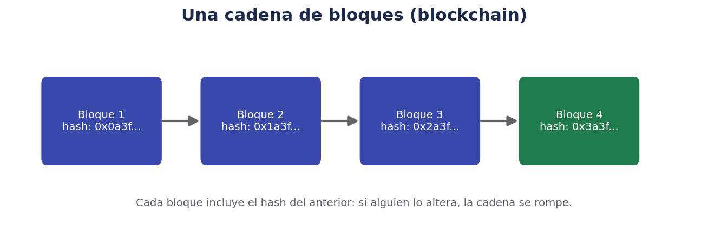
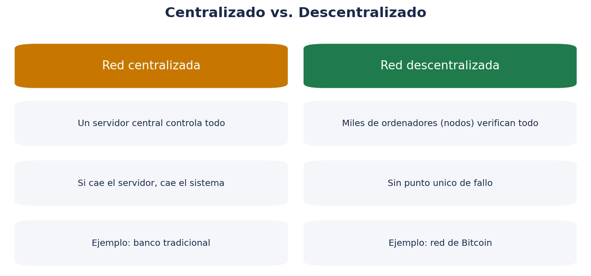
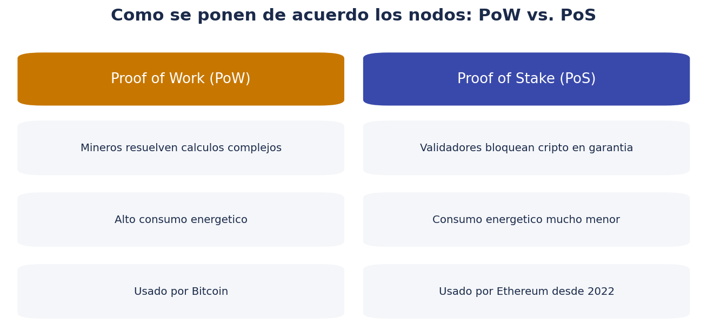

# 🔗 Criptomonedas — Introducción y blockchain desde cero

> *"No hace falta entender criptografía para usar cripto con seguridad, pero sí hace falta entender los conceptos básicos antes de mover dinero real."*

Esta carpeta parte de la base de que **no tienes ninguna experiencia previa con criptomonedas**: no sabes qué es un monedero, te has encontrado con noticias sobre exchanges que cierran o pierden la licencia, y quieres entender los conceptos antes de tomar ninguna decisión. Está pensada para leerse después (o en paralelo) de la carpeta `trade/`, ya que comparte conceptos de riesgo, diversificación y fiscalidad, pero añade particularidades técnicas y regulatorias propias del mundo cripto.

!!! warning "Esto no es asesoramiento financiero"
    Todo el contenido de esta carpeta es **educativo y divulgativo**. No es una recomendación de compra de ninguna criptomoneda, token o plataforma concreta. Los criptoactivos son, en general, productos de **riesgo muy alto y alta volatilidad**; nunca inviertas dinero que no puedas permitirte perder por completo.

## 📂 Cómo está organizada esta guía

| Archivo | Contenido | Cuándo usarlo |
|---|---|---|
| `00-introduccion-blockchain.md` | Este documento: qué es blockchain, qué es una criptomoneda | Antes de nada, para tener el mapa general |
| `01-monederos-wallets.md` | Qué es un monedero (wallet), custodial vs. no custodial, claves y seed phrase | Antes de tener cualquier cripto, propia o en un exchange |
| `02-exchanges-seguridad-regulacion.md` | Qué es un exchange, regulación MiCA, el caso Binance en España (2026) | Antes de elegir dónde comprar cripto |
| `03-tipos-de-criptoactivos.md` | Bitcoin, altcoins, stablecoins, tokens, señales de estafa | Para saber qué existe y con qué riesgo |
| `04-primeros-pasos-practicos.md` | Plan práctico paso a paso para tu primera compra segura | Cuando ya tengas los conceptos claros |

## 🧱 ¿Qué es una blockchain (cadena de bloques)?

Una **blockchain** es un tipo de base de datos distribuida que registra información (normalmente transacciones) de forma que:

- Se organiza en **bloques**, cada uno con un conjunto de transacciones.
- Cada bloque incluye una **huella digital (hash)** del bloque anterior, formando una cadena.
- Si alguien intenta modificar un bloque antiguo, su hash cambia, lo que rompe el enlace con el resto de la cadena y lo hace detectable por toda la red.

Esto hace que, en la práctica, sea extremadamente difícil alterar el historial de transacciones ya registrado, sin que la red entera lo detecte y lo rechace.

## 🌐 Centralizado vs. descentralizado

La diferencia de fondo entre un sistema financiero tradicional y una red blockchain como la de Bitcoin es la **descentralización**:

- En un sistema **centralizado** (por ejemplo, un banco), una única entidad controla el registro de las cuentas y las transacciones. Si esa entidad falla, se equivoca o es hackeada, todo el sistema se ve afectado.
- En un sistema **descentralizado** (una blockchain pública), miles de ordenadores (nodos) de todo el mundo mantienen y verifican una copia del mismo registro, siguiendo un conjunto de reglas compartidas (el protocolo). No hay un único punto de fallo.

Esto no significa que las redes descentralizadas sean invulnerables (existen ataques y riesgos propios, distintos a los de un sistema centralizado), pero cambia radicalmente el modelo de confianza: en lugar de confiar en una entidad concreta, confías en las reglas matemáticas y en el consenso de la red.

## 🪙 ¿Qué es una criptomoneda?

Una **criptomoneda** es un activo digital que existe y se transfiere a través de una blockchain, sin necesidad de un intermediario central que autorice cada transacción. Bitcoin (2009) fue la primera criptomoneda y sigue siendo la más conocida y de mayor capitalización de mercado; desde entonces han surgido miles de criptoactivos distintos, con propósitos y diseños muy diferentes entre sí (esto se desarrolla en `03-tipos-de-criptoactivos.md`).

Algunas propiedades habituales (aunque no universales: varían según el diseño de cada red):

- **Oferta limitada o predecible**: por ejemplo, Bitcoin tiene un límite máximo de 21 millones de unidades, conocido de antemano y programado en su protocolo.
- **Transferible sin intermediario bancario tradicional**, directamente entre dos monederos.
- **Transparencia**: en la mayoría de blockchains públicas, cualquiera puede consultar el historial de transacciones (aunque las direcciones no siempre están vinculadas directamente a una identidad real).
- **Volatilidad alta**: el precio de mercado de la mayoría de criptoactivos puede oscilar mucho en periodos cortos de tiempo.

## ⚙️ ¿Cómo se ponen de acuerdo los nodos? Consenso

Para que una red descentralizada funcione, todos los nodos deben ponerse de acuerdo sobre qué transacciones son válidas y en qué orden ocurrieron, sin que exista una autoridad central que lo decida. A esto se le llama **mecanismo de consenso**. Los dos más conocidos:

### Proof of Work (prueba de trabajo)

Los llamados **mineros** compiten resolviendo un problema matemático complejo (que requiere mucha potencia de cálculo) para poder añadir el siguiente bloque a la cadena, a cambio de una recompensa. Es el sistema usado por Bitcoin. Su principal crítica es el **elevado consumo energético** que implica esa competición computacional constante a escala global.

### Proof of Stake (prueba de participación)

Los **validadores** bloquean (hacen "staking" de) una cantidad de criptomoneda como garantía, y son elegidos para validar bloques de forma proporcional (entre otros factores) a esa cantidad bloqueada. Si validan de forma fraudulenta, pueden perder parte de esa garantía. Es el sistema usado por Ethereum desde su actualización de 2022 ("The Merge"), y su consumo energético es muchísimo menor que el de Proof of Work.

Ninguno de los dos sistemas es "el correcto" de forma absoluta: cada blockchain elige el que mejor encaja con sus objetivos de seguridad, descentralización y eficiencia energética.

## ⛏️ Un apunte sobre la minería

En redes basadas en Proof of Work, la **minería** no es solo "crear" criptomonedas nuevas: es el proceso por el cual se verifican y registran las transacciones de forma segura, y la recompensa en criptomoneda es el incentivo económico para que alguien aporte esa potencia de cálculo. Con el tiempo, y en el caso concreto de Bitcoin, esa recompensa se reduce periódicamente (evento conocido como "halving"), lo que forma parte del diseño original de oferta limitada y decreciente.

## 📜 Contratos inteligentes (smart contracts), brevemente

Algunas blockchains (destacando Ethereum) permiten ejecutar **contratos inteligentes**: programas informáticos que se ejecutan automáticamente en la blockchain cuando se cumplen determinadas condiciones, sin necesidad de un intermediario que los gestione manualmente. Son la base técnica de aplicaciones como los préstamos descentralizados, los intercambios automáticos de tokens o los NFT (que se mencionan brevemente en `03-tipos-de-criptoactivos.md`). Se trata de un tema avanzado que excede el alcance introductorio de este documento, pero conviene saber que existe y que añade tanto posibilidades como riesgos adicionales (errores de programación en el contrato, por ejemplo, pueden tener consecuencias económicas irreversibles).

## 🕰️ Breve cronología para situarse

- **2008**: se publica el documento técnico ("whitepaper") de Bitcoin, firmado bajo el seudónimo Satoshi Nakamoto.
- **2009**: se pone en marcha la red de Bitcoin y se mina su primer bloque.
- **2015**: se lanza Ethereum, que populariza los contratos inteligentes.
- **2017-2018**: primer gran ciclo de popularización y especulación masiva en criptomonedas, seguido de una caída fuerte de precios.
- **2020-2021**: nuevo ciclo alcista, entrada de más inversores institucionales y populares, auge de NFT y finanzas descentralizadas (DeFi).
- **2022**: Ethereum migra de Proof of Work a Proof of Stake; quiebras sonadas de algunos exchanges y proyectos cripto, que reavivan el debate regulatorio.
- **2023-2024**: la Unión Europea aprueba y pone en marcha el **Reglamento MiCA**, primer marco regulatorio integral para criptoactivos a nivel de la UE.
- **2026**: finaliza el periodo transitorio de MiCA en España (1 de julio de 2026): a partir de esa fecha, solo pueden operar con normalidad los exchanges con licencia MiCA. Este punto se desarrolla en detalle en `02-exchanges-seguridad-regulacion.md`, incluyendo el caso concreto de Binance.

## 🎯 Casos de uso más allá de la especulación

Aunque gran parte del interés mediático se centra en el precio y la especulación, las blockchains y criptomonedas tienen (o se plantean) otros usos:

- **Transferencias internacionales** potencialmente más rápidas y baratas que los circuitos bancarios tradicionales, aunque con matices según el activo y la red concretos.
- **Reserva de valor** (el argumento más asociado a Bitcoin, comparándolo con el oro digital, aunque su volatilidad histórica ha sido muy superior a la del oro).
- **Programabilidad financiera** (contratos inteligentes, préstamos automatizados, finanzas descentralizadas o DeFi).
- **Trazabilidad de activos digitales** (tokens que representan propiedad, coleccionables digitales, certificados).

Cada uno de estos casos de uso tiene también sus propios riesgos y limitaciones, que se explorarán en los siguientes documentos de la carpeta.

## ❓ Preguntas frecuentes de quien empieza

**¿Necesito entender de programación o criptografía para usar cripto?**
No, para usarla como usuario final no. Sí conviene entender los conceptos básicos de este documento y, sobre todo, los de `01-monederos-wallets.md`, porque afectan directamente a la seguridad de tu dinero.

**¿Es lo mismo "blockchain" que "Bitcoin"?**
No. Bitcoin es una criptomoneda concreta que utiliza una blockchain concreta. "Blockchain" es la tecnología subyacente, que puede usarse (con diseños distintos) para Bitcoin, Ethereum, y miles de otras redes y aplicaciones.

**¿Por qué ha habido tantas noticias sobre exchanges que cierran o tienen problemas?**
Por varias razones: quiebras por mala gestión o fraude interno, y más recientemente, cambios regulatorios como el Reglamento MiCA en la Unión Europea, que exige a los exchanges obtener una licencia específica para poder seguir operando con normalidad. Este segundo punto se explica con detalle, incluyendo el caso de Binance en España, en `02-exchanges-seguridad-regulacion.md`.

**¿Es demasiado tarde para "entrar" en cripto?**
Esta pregunta no tiene una respuesta objetiva ni se puede responder desde un enfoque educativo: nadie puede predecir con certeza la evolución futura de precios. Lo que sí se puede afirmar es que se trata de un activo de riesgo muy alto, y que cualquier decisión debería tomarse con información suficiente, nunca por presión externa o miedo a "quedarse fuera".

## 🔍 Cómo verificar una transacción tú mismo (exploradores de bloques)

Una de las propiedades más útiles de las blockchains públicas es que **cualquiera puede consultar el historial de transacciones** sin depender de la palabra de un intermediario. Esto se hace a través de los llamados **exploradores de bloques (block explorers)**, páginas web que muestran en tiempo real:

- El listado de bloques minados/validados y su contenido.
- El detalle de una transacción concreta: origen, destino, cantidad, comisión pagada, número de confirmaciones.
- El saldo asociado a una dirección pública (sin revelar quién es su propietario real).

Por ejemplo, tras enviar una criptomoneda desde tu monedero, puedes copiar el identificador de la transacción (**TXID** o hash de transacción) y buscarlo en el explorador correspondiente a esa red, para comprobar de forma independiente que se ha registrado correctamente y cuántas confirmaciones lleva acumuladas. Cuantas más confirmaciones (más bloques añadidos después del que contiene tu transacción), más difícil es, en la práctica, que esa transacción se revierta.

## 🧮 Comparativa rápida: sistema bancario tradicional vs. blockchain pública

| Aspecto | Sistema bancario tradicional | Blockchain pública (ej. Bitcoin) |
|---|---|---|
| Quién controla el registro | El banco o entidad central | Red distribuida de nodos |
| Horario de operación | Habitualmente en horario laboral/bancario | 24 horas, 365 días al año |
| Reversibilidad de una transacción | Posible en ciertos casos (fraude, error) | Prácticamente irreversible una vez confirmada |
| Necesidad de identificarte para transferir | Sí, cuenta bancaria vinculada a tu identidad | No directamente; la dirección no revela identidad por sí sola |
| Supervisión regulatoria directa | Alta, bancos centrales y reguladores nacionales | Variable; en la UE se está regulando a través de MiCA, sobre todo a los intermediarios (exchanges), no a los protocolos en sí |
| Recuperación si pierdes el acceso | El banco puede ayudarte a recuperar el acceso | Si pierdes tus claves/seed phrase, en la mayoría de los casos nadie puede recuperar el acceso por ti |

Esta última fila es clave y se desarrolla en detalle en el siguiente documento (`01-monederos-wallets.md`): la responsabilidad sobre la custodia de las claves recae, en gran medida, en el propio usuario cuando no se opera a través de un intermediario custodio.

## 🏫 Por qué merece la pena entender esto, aunque no vayas a invertir

Independientemente de si decides invertir en criptoactivos o no, entender los conceptos de blockchain y descentralización tiene valor por sí mismo, especialmente desde una perspectiva técnica y docente:

- Es una tecnología que se aplica también fuera de las finanzas: trazabilidad de cadenas de suministro, certificación de documentos, identidad digital, votaciones, etc.
- Introduce conceptos de criptografía aplicada (funciones hash, firma digital, claves pública/privada) que son transferibles a otras áreas de la seguridad informática.
- Ayuda a entender de forma crítica las noticias y el debate público sobre criptomonedas, regulación financiera y economía digital, en lugar de depender de titulares simplificados.

## 🧾 Glosario básico de esta introducción

| Término | Definición |
|---|---|
| **Bloque** | Conjunto de transacciones agrupadas y añadidas a la cadena |
| **Hash** | Huella digital única generada a partir de unos datos; cualquier cambio en los datos altera el hash |
| **Nodo** | Ordenador que participa en la red, manteniendo una copia del registro y validando reglas |
| **Minero / validador** | Participante que propone y valida nuevos bloques, según el mecanismo de consenso |
| **Consenso** | Conjunto de reglas por las que la red se pone de acuerdo sobre qué transacciones son válidas |
| **Halving** | Reducción periódica y programada de la recompensa por minar un bloque (Bitcoin) |
| **Contrato inteligente** | Programa que se ejecuta automáticamente en la blockchain al cumplirse ciertas condiciones |
| **TXID** | Identificador único de una transacción, usado para buscarla en un explorador de bloques |
| **Confirmación** | Cada bloque añadido después del que contiene una transacción, que refuerza su carácter definitivo |
| **DeFi (finanzas descentralizadas)** | Aplicaciones financieras (préstamos, intercambios...) construidas sobre contratos inteligentes |
| **Whitepaper** | Documento técnico que describe el funcionamiento y propósito de un proyecto cripto |

## ❓ Más preguntas frecuentes

**¿Todas las criptomonedas usan blockchain?**
La inmensa mayoría sí, aunque existen variantes técnicas (como los llamados DAG, "grafos acíclicos dirigidos") que resuelven el mismo problema de registro distribuido de forma distinta. Para un nivel introductorio, es razonable asumir que "blockchain" es el estándar de referencia.

**¿Puedo "perder" mi criptomoneda si la red deja de existir?**
Si una red pierde por completo el interés de mineros/validadores y usuarios, en la práctica puede dejar de ser operativa o de tener valor de mercado, igual que cualquier proyecto o empresa puede desaparecer. Esto es distinto de perder el acceso por un problema de claves (que se trata en el siguiente documento).

**¿Es verdad que las transacciones en blockchain son anónimas?**
No exactamente: la mayoría de blockchains públicas son **pseudónimas**, no anónimas. Las direcciones no llevan asociado un nombre directamente, pero todo el historial de movimientos de esa dirección es público y, con técnicas de análisis (o al vincular una dirección a una identidad real, por ejemplo al retirar fondos a una cuenta bancaria a través de un exchange regulado), sí se puede llegar a rastrear.

**¿Qué relación tiene todo esto con el "Binance va a cerrar" que he oído?**
Ese tipo de noticias no tienen que ver con que la blockchain de Bitcoin o Ethereum "deje de funcionar", sino con la regulación de los **intermediarios** (exchanges) que permiten comprar/vender cripto con euros. Es un tema regulatorio, no técnico de la blockchain en sí, y se explica en profundidad en `02-exchanges-seguridad-regulacion.md`.

## ✅ Resumen de este documento

- Una blockchain es una base de datos distribuida y encadenada mediante hashes, difícil de alterar retroactivamente.
- La descentralización cambia el modelo de confianza: de una entidad central a las reglas de la red y el consenso entre nodos.
- Una criptomoneda es un activo digital nativo de una blockchain, con oferta y reglas definidas por su protocolo.
- Proof of Work y Proof of Stake son los dos mecanismos de consenso más habituales, con distinto consumo energético.
- El Reglamento MiCA (Unión Europea) marca un antes y un después regulatorio, con su periodo transitorio finalizando el 1 de julio de 2026 en España.

## 🍴 Un concepto adicional: los "forks" (bifurcaciones)

Como el protocolo de una blockchain es, en el fondo, software compartido por toda la comunidad de nodos, a veces surgen propuestas de cambio en sus reglas. Cuando esto ocurre, puede producirse una **bifurcación (fork)**:

- **Soft fork**: un cambio de reglas compatible con versiones anteriores del protocolo; los nodos que no actualizan pueden seguir participando sin romper la red.
- **Hard fork**: un cambio de reglas incompatible con versiones anteriores, que puede dividir la red en dos cadenas distintas si una parte de la comunidad no acepta el cambio (cada una con su propia criptomoneda resultante). Un ejemplo histórico conocido es la separación entre Bitcoin y Bitcoin Cash en 2017, tras un desacuerdo sobre el tamaño de los bloques.

Esto ilustra que, aunque no exista una autoridad central formal, las decisiones sobre el futuro de una blockchain siguen dependiendo del consenso social y técnico de su comunidad (desarrolladores, mineros/validadores, usuarios), no de un algoritmo completamente autónomo y ajeno a intervención humana.

## 🧩 Cómo conecta esta introducción con el resto de la carpeta

Entender qué es una blockchain y qué es una criptomoneda es el punto de partida, pero la parte más importante para tu seguridad práctica viene después: **quién controla las claves de acceso a tu cripto** (documento 01), **a través de qué plataforma la compras y qué regulación la ampara** (documento 02), **qué tipo de criptoactivo concreto estás considerando** (documento 03) y, finalmente, **cómo dar los primeros pasos de forma ordenada** (documento 04). Ninguno de estos documentos tiene sentido completo sin los demás: la tecnología (blockchain) es solo una parte de la ecuación; la custodia, la regulación y la prudencia práctica son igual de importantes.

## 🌱 El debate sobre el consumo energético

El consumo energético de las redes Proof of Work (como Bitcoin) es objeto de debate público recurrente. Algunos puntos que suelen aparecer en esa discusión, presentados de forma equilibrada:

- Quienes critican el modelo señalan el elevado consumo eléctrico agregado de la red de minería a nivel mundial, comparándolo con el consumo de países enteros en algunas estimaciones.
- Quienes lo defienden argumentan que buena parte de esa minería se realiza cada vez más con fuentes de energía renovable o excedentaria (energía que de otro modo se desperdiciaría), y que el consumo debe compararse con el de otros sistemas financieros o industriales a nivel global, no evaluarse de forma aislada.
- El propio ecosistema cripto ha evolucionado: Ethereum, la segunda red por capitalización, migró de Proof of Work a Proof of Stake en 2022 precisamente para reducir drásticamente su consumo energético (una reducción estimada de más del 99 % según distintas fuentes técnicas).

Se trata de un debate técnico y político-económico real y activo, sin un consenso único, y conviene contrastarlo con fuentes actualizadas si te interesa profundizar en el tema.

## 📋 Tabla resumen final de este documento

| Concepto | Punto clave a recordar |
|---|---|
| Blockchain | Base de datos distribuida, encadenada mediante hashes |
| Nodo | Ordenador que mantiene y valida una copia del registro |
| Proof of Work | Consenso por cálculo computacional, usado por Bitcoin |
| Proof of Stake | Consenso por garantía bloqueada, usado por Ethereum |
| Contrato inteligente | Programa que se ejecuta automáticamente en la blockchain |
| Fork | Bifurcación del protocolo, puede dividir una red en dos |
| Explorador de bloques | Herramienta pública para verificar cualquier transacción |
| Pseudónimo, no anónimo | Las direcciones son públicas, no llevan nombre asociado directamente |

## 📌 Ideas clave para retener antes de continuar

- Blockchain es la tecnología; Bitcoin, Ethereum y demás son redes concretas que la utilizan.
- La descentralización cambia el modelo de confianza, pero no elimina todos los riesgos: solo cambia su naturaleza.
- El consenso (Proof of Work, Proof of Stake) es el mecanismo que permite que la red se ponga de acuerdo sin autoridad central.
- Las transacciones son públicas y verificables por cualquiera a través de exploradores de bloques, aunque pseudónimas, no anónimas.
- La regulación (como MiCA en la Unión Europea) afecta principalmente a los intermediarios, no a la tecnología subyacente en sí misma.

## 🧵 Hilo conductor de toda la carpeta, en una frase por documento

Para tener una visión de conjunto antes de continuar: este documento (00) explica qué es blockchain y qué es una criptomoneda; el 01 explica qué es un monedero y por qué la custodia de las claves es la decisión de seguridad más importante; el 02 explica qué es un exchange y cómo la regulación MiCA ha cambiado el panorama en España en 2026; el 03 clasifica los tipos de criptoactivos existentes y sus riesgos; y el 04 traduce todo lo anterior en un plan práctico y ordenado para tu primera compra.

## 🎯 Qué deberías poder responder antes de seguir

Antes de pasar al siguiente documento, comprueba si podrías explicar con tus propias palabras: qué es una blockchain, en qué se diferencia de una base de datos tradicional, qué hace un nodo, qué diferencia hay entre Proof of Work y Proof of Stake, y por qué las noticias sobre exchanges regulados no significan que "la cripto en sí" vaya a desaparecer. Si todas estas ideas te resultan claras, estás listo para avanzar a la parte más práctica: cómo se guarda y protege tu criptomoneda.

---

Siguiente: [01 · Monederos y wallets](01-monederos-wallets.md)
