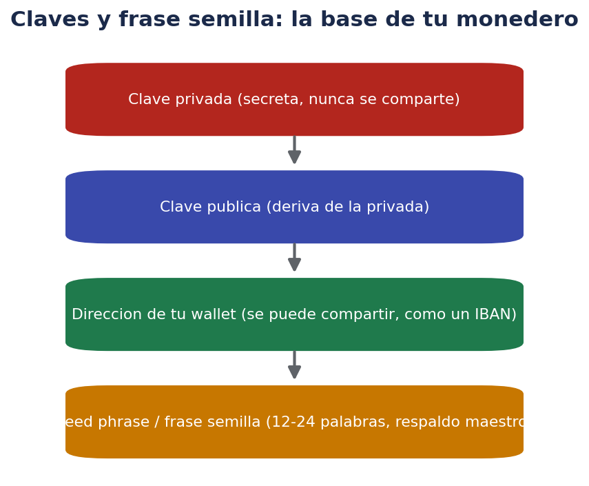
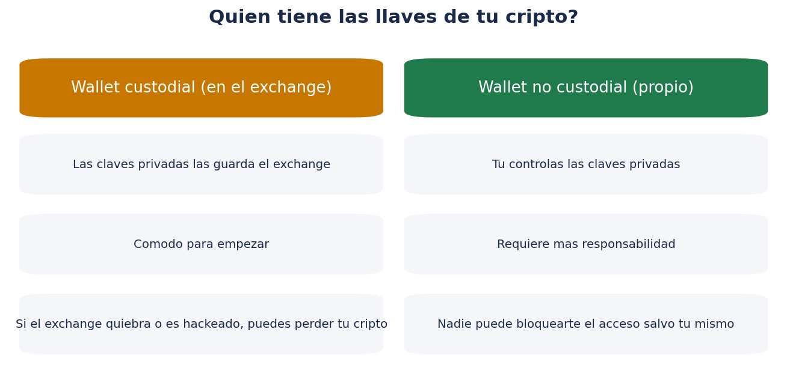
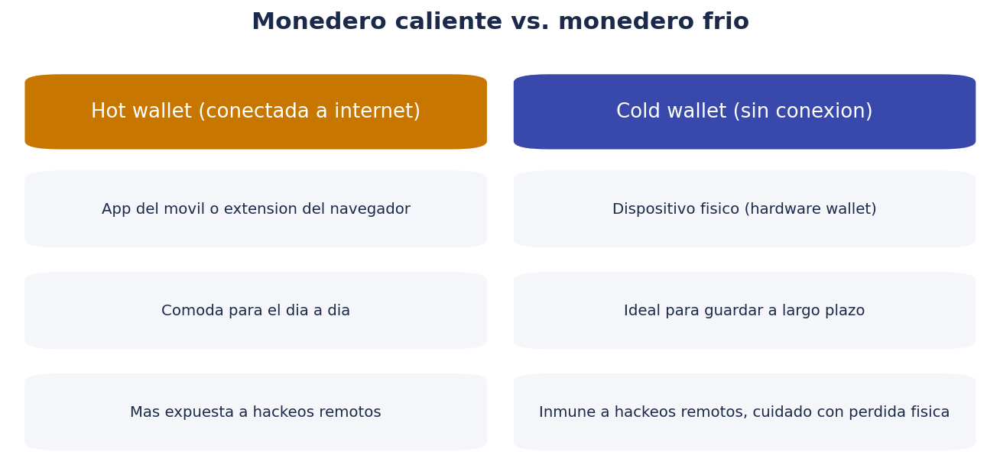

# 👛 Monederos (wallets): la base de la seguridad en cripto

> Si solo te llevas una idea de toda esta carpeta, que sea esta: **quien controla las claves privadas, controla la criptomoneda**. Este documento explica qué significa exactamente eso.

!!! warning "Recordatorio"
    Este documento tiene fines educativos. No sustituye la lectura de la documentación oficial de tu monedero o exchange concreto, ni el asesoramiento profesional en materia de seguridad informática o financiera.

## 🤔 ¿Qué es un monedero (wallet) exactamente?

Un **monedero de criptomonedas** no "contiene" las monedas de la forma en que una cartera física contiene billetes. En realidad, las criptomonedas siempre existen registradas en la blockchain; un monedero es el software (o dispositivo) que **guarda las claves criptográficas** que te permiten demostrar que eres el propietario de esas monedas y autorizar su movimiento.

Dicho de otro modo: un monedero es más parecido a un **llavero** que a una hucha. Las monedas "viven" en la blockchain; las claves de tu monedero son las llaves que demuestran que puedes moverlas.

## 🔑 Clave privada, clave pública y dirección

- **Clave privada**: un número secreto que demuestra la propiedad y permite autorizar transacciones. **Nunca debe compartirse con nadie**, bajo ninguna circunstancia. Quien tenga tu clave privada tiene control total sobre esos fondos, igual (o peor) que si tuviera el PIN y la tarjeta física de tu cuenta bancaria.
- **Clave pública**: se deriva matemáticamente de la clave privada (en un sentido, no al revés: no se puede deducir la privada a partir de la pública). Sirve para verificar firmas y generar direcciones.
- **Dirección**: una versión de la clave pública, más corta y manejable, que puedes compartir libremente para que alguien te envíe fondos, de forma parecida a un IBAN o un número de cuenta.
- **Seed phrase (frase semilla)**: un conjunto de 12 o 24 palabras (según el estándar) que permite regenerar todas las claves de tu monedero si pierdes el acceso al dispositivo o la aplicación. Es, en la práctica, **el respaldo maestro de todo tu monedero**: quien la tenga, tiene acceso completo a todos los fondos asociados, presentes y futuros.

!!! danger "La seed phrase es lo más importante que vas a leer en esta carpeta"
    Nunca la escribas en un documento digital conectado a internet (ni en el móvil, ni en la nube, ni en un correo, ni en una nota de texto), nunca la fotografíes, y nunca se la compartas a nadie que te la pida (ni "soporte técnico", ni nadie que se haga pasar por tal: ningún servicio legítimo te la pedirá jamás). Se guarda anotada a mano, en papel, en un lugar físico seguro.

## 🏦 Custodial vs. no custodial: ¿quién tiene las llaves?

Esta es, probablemente, la distinción más importante de todo el documento:

### Wallet custodial

Cuando compras cripto en un exchange (una plataforma de intercambio) y la dejas ahí, **el exchange guarda las claves privadas por ti**, no tú directamente. Es cómodo (no tienes que gestionar tú mismo la seguridad de las claves), pero implica confiar en que esa entidad:

- Gestione la seguridad de sus sistemas correctamente.
- No sufra un hackeo que comprometa los fondos de sus usuarios.
- No tenga problemas de solvencia o de cumplimiento regulatorio que le impidan devolver los fondos (como se explica con detalle en `02-exchanges-seguridad-regulacion.md`, con el caso concreto de la situación de Binance en España en 2026).

### Wallet no custodial (propia)

Tú mismo generas y guardas las claves privadas (a través de una app, una extensión de navegador o un dispositivo físico), sin depender de un tercero para poder mover tus fondos. La contrapartida es que **la responsabilidad de la seguridad recae completamente en ti**: si pierdes la seed phrase y el acceso al dispositivo, en la inmensa mayoría de los casos nadie (ni el fabricante del monedero, ni nadie más) puede recuperar el acceso por ti.

La frase que resume esta idea, muy repetida en la comunidad cripto, es: ***"Not your keys, not your coins"*** ("si no tienes las claves, no tienes las monedas" — en el sentido de que dependes completamente de un tercero).

## 🔥🧊 Monedero caliente (hot) vs. monedero frío (cold)

Otra clasificación, independiente (aunque relacionada) de la custodial/no custodial:

### Hot wallet (monedero caliente)

Cualquier monedero **conectado a internet**: una app del móvil, una extensión de navegador, o incluso el propio monedero del exchange mientras usas la web/app. Es cómodo para el uso diario (comprar, vender, transferir con frecuencia), pero está más expuesto a ataques remotos (malware, phishing, vulnerabilidades del software).

### Cold wallet (monedero frío)

Un dispositivo físico (**hardware wallet**, como Ledger o Trezor, por citar dos fabricantes conocidos del sector) que genera y guarda las claves privadas **sin conexión a internet**, firmando las transacciones de forma aislada. Es mucho más resistente a hackeos remotos, aunque introduce otros riesgos: pérdida física del dispositivo, daño físico, o pérdida de la seed phrase de respaldo (que sigue siendo imprescindible incluso con un hardware wallet).

Una práctica habitual entre usuarios con cantidades relevantes es combinar ambos enfoques: mantener una pequeña cantidad en un hot wallet para operativa diaria, y el grueso de los fondos en un cold wallet para almacenamiento a largo plazo.

## 🧩 Tipos concretos de monederos

| Tipo | Ejemplos genéricos de categoría | Conexión a internet | Quién guarda las claves |
|---|---|---|---|
| Monedero de exchange | El propio saldo dentro de la plataforma de compraventa | Sí | El exchange (custodial) |
| App móvil / de escritorio | Aplicaciones de monedero instalables | Sí | Tú (no custodial) |
| Extensión de navegador | Monederos integrados en el navegador web | Sí | Tú (no custodial) |
| Hardware wallet | Dispositivo físico dedicado | No (firma offline) | Tú (no custodial) |
| Monedero de papel | Claves impresas o escritas físicamente | No | Tú (no custodial), método menos habitual hoy en día |

## 🚨 Errores de seguridad más comunes

1. **Guardar la seed phrase en una foto del móvil o en la nube.** Cualquier acceso no autorizado a esos servicios comprometería directamente tus fondos.
2. **Compartir la seed phrase con "soporte técnico"**: ningún exchange o fabricante de monedero legítimo la pedirá jamás, ni por chat, ni por teléfono, ni por email.
3. **Usar el mismo dispositivo o navegador sin ninguna medida de seguridad adicional** (contraseña, verificación en dos pasos) para acceder a monederos con fondos relevantes.
4. **Comprar hardware wallets de segunda mano o de vendedores no oficiales**, con riesgo de que vengan manipulados.
5. **No hacer ninguna copia de seguridad de la seed phrase**, arriesgándose a perder el acceso por un fallo del dispositivo, sin ninguna forma de recuperación.
6. **Confiar en apps de monedero descargadas fuera de las tiendas oficiales**, con riesgo de instalar software malicioso diseñado para robar claves.

## 🧠 ¿Cuándo tiene sentido mover cripto del exchange a tu propio monedero?

No existe una regla universal, pero algunas pautas orientativas habituales en la comunidad:

- Si vas a mantener una cantidad durante mucho tiempo sin operar activamente, muchos usuarios prefieren moverla a un monedero propio (reduciendo el riesgo de contraparte del exchange).
- Si vas a operar con frecuencia (comprar/vender a corto plazo), puede ser más práctico mantenerla en el exchange durante ese periodo, asumiendo el riesgo de contraparte asociado.
- Cuantas más noticias de inestabilidad o problemas regulatorios tenga un exchange concreto (como se explica en el siguiente documento), más razonable resulta plantearse retirar fondos a un monedero propio como medida de precaución.

## ✅ Checklist de seguridad de monedero

- [ ] Sé la diferencia entre wallet custodial y no custodial.
- [ ] Sé la diferencia entre hot wallet y cold wallet.
- [ ] Nunca he compartido ni voy a compartir mi seed phrase con nadie.
- [ ] Si tengo seed phrase, está anotada en papel, offline, en un lugar físico seguro (y quizá con una copia en otro lugar seguro, ante robo o incendio).
- [ ] He activado la verificación en dos pasos (2FA) en cualquier app o exchange que use.
- [ ] Descargo apps de monedero solo desde tiendas oficiales y fuentes verificadas.
- [ ] Compro hardware wallets solo directamente del fabricante o distribuidores oficiales.

## ❓ Preguntas frecuentes

**¿Necesito un hardware wallet desde el principio, con poca cantidad?**
No es imprescindible para cantidades pequeñas o mientras estás aprendiendo, pero es una buena práctica a considerar en cuanto la cantidad que gestionas empiece a ser relevante para ti.

**Si pierdo mi móvil, ¿pierdo mi cripto?**
Si tienes tu seed phrase guardada de forma segura (en papel, offline), no: puedes restaurar el mismo monedero en otro dispositivo usando esa frase. Si no tienes la seed phrase guardada y solo confiabas en el dispositivo, sí podrías perder el acceso de forma irreversible.

**¿Qué pasa si alguien consigue mi dirección pública (no la clave privada)?**
No pasa nada grave: la dirección pública solo sirve para recibir fondos y consultar el historial de esa dirección en un explorador de bloques. El riesgo real está en la clave privada y la seed phrase, no en la dirección pública.

**¿Es lo mismo un monedero que un exchange?**
No. Un exchange es una plataforma para comprar/vender cripto con euros u otras monedas; internamente, el exchange usa sus propios monederos (custodiales) para gestionar los fondos de sus usuarios. Un monedero propio (no custodial) es independiente de cualquier exchange concreto.

## 🔐 Multi-firma (multisig): un nivel adicional de seguridad

Algunos monederos permiten configurar un esquema de **multi-firma (multisig)**, donde se requieren varias claves privadas distintas (por ejemplo, 2 de 3) para autorizar una transacción, en lugar de una sola. Esto tiene ventajas de seguridad relevantes:

- Si una de las claves se ve comprometida (robada o perdida), los fondos no se pierden automáticamente, porque hace falta también otra clave para moverlos.
- Es habitual en entornos de empresas, asociaciones o fondos compartidos, donde no conviene que una única persona tenga control unilateral.
- Aumenta la complejidad de configuración y recuperación, por lo que suele reservarse para usuarios con cierta experiencia o para gestionar cantidades más significativas.

Para un usuario particular que empieza, no es imprescindible, pero conviene saber que existe como opción de seguridad avanzada.

## 🎣 Cómo suelen actuar las estafas de phishing en cripto

El **phishing** (suplantación de identidad para robar credenciales o claves) es una de las causas más habituales de pérdida de fondos, y suele seguir patrones reconocibles:

- **Webs falsas casi idénticas a un exchange o monedero real**, con una URL ligeramente distinta (una letra cambiada, un dominio distinto al oficial).
- **Correos o mensajes urgentes** ("tu cuenta ha sido bloqueada", "verifica tu wallet ahora") que llevan a hacer clic en un enlace fraudulento.
- **Soporte técnico falso** en redes sociales o chats, que contacta de forma proactiva ofreciendo "ayuda" y termina pidiendo la seed phrase o acceso remoto al dispositivo.
- **Aplicaciones de monedero falsas** subidas a tiendas de aplicaciones, imitando el diseño de apps legítimas.
- **Extensiones de navegador maliciosas** que interceptan las direcciones de destino al copiar y pegar, sustituyéndolas por una dirección del atacante sin que el usuario lo note a simple vista.

Medidas de defensa básicas: verificar siempre la URL oficial escribiéndola directamente o desde favoritos guardados (no desde enlaces de correos o mensajes), activar 2FA, y **nunca** proporcionar la seed phrase a nadie, bajo ningún concepto, ni siquiera si el mensaje parece oficial o urgente.

## 🛒 Cómo elegir un hardware wallet, si decides usar uno

Si decides dar el paso a un monedero físico, algunas pautas generales:

- **Comprarlo siempre directamente del fabricante o de un distribuidor oficial reconocido**, nunca de segunda mano ni de vendedores no verificados.
- **Comprobar el precinto de seguridad** del paquete al recibirlo, según las indicaciones del propio fabricante.
- **Configurar tú mismo el dispositivo desde cero**, generando tu propia seed phrase en el momento de la configuración inicial (desconfía de cualquier dispositivo que llegue con una seed phrase ya escrita o "preconfigurada").
- **Familiarizarte con el proceso de recuperación** (restaurar el monedero a partir de la seed phrase) en un entorno controlado, para no tener que aprenderlo por primera vez en una situación de emergencia.

## 👨‍👩‍👧 Herencia digital y plan de continuidad

Un aspecto que se suele olvidar al empezar: ¿qué pasaría con tu cripto si te ocurriera algo a ti? A diferencia de una cuenta bancaria tradicional, donde existen procedimientos legales establecidos de sucesión, el acceso a un monedero no custodial depende exclusivamente de quién conozca la seed phrase. Algunas ideas generales (sin ser esto asesoramiento legal):

- Dejar instrucciones claras, en un lugar seguro y conocido por una persona de confianza, sobre dónde está guardada la seed phrase (sin necesidad de revelarla mientras no sea necesario).
- Consultar con un profesional (notario, asesor legal) sobre cómo reflejar activos digitales en un testamento o planificación patrimonial, ya que la legislación y las mejores prácticas en esta materia siguen evolucionando.
- Tener en cuenta que, sin ninguna previsión, el fallecimiento del titular sin que nadie conozca la seed phrase puede suponer la **pérdida permanente e irrecuperable** de esos fondos.

## 🧮 Comparativa final: ¿qué combinación elegir según tu situación?

| Situación | Combinación razonable |
|---|---|
| Estoy empezando, cantidades pequeñas | Exchange regulado (custodial) mientras aprendes |
| Cantidad moderada, uso ocasional | Hot wallet propio (no custodial) para el día a día |
| Cantidad relevante, horizonte largo | Cold wallet (hardware wallet) para el grueso de los fondos |
| Gestión compartida (familia, asociación, empresa) | Multisig, con varias personas custodiando claves distintas |

## ✅ Resumen de este documento

- Un monedero guarda claves criptográficas, no "monedas" en sentido físico; las monedas siempre están registradas en la blockchain.
- La clave privada y la seed phrase son lo más crítico: nunca se comparten y se guardan offline, en papel.
- Custodial (exchange guarda las claves) vs. no custodial (tú las guardas) es la distinción más importante para tu seguridad.
- Hot wallet (conectado, cómodo, más expuesto) vs. cold wallet (offline, más seguro, requiere cuidado físico) es otra distinción clave.
- La mayoría de pérdidas de fondos en cripto se deben a errores de gestión de claves o a estafas de phishing, no a fallos de la blockchain en sí.

## 🏛️ Monedero cripto vs. cuenta bancaria: diferencias que conviene interiorizar

| Aspecto | Cuenta bancaria tradicional | Monedero cripto no custodial |
|---|---|---|
| Recuperación de contraseña | El banco puede ayudarte a restablecerla | Nadie puede "restablecer" tu seed phrase si la pierdes |
| Protección ante fraude | Existen mecanismos de reclamación y, en algunos casos, devolución | Las transacciones confirmadas son, en la práctica, irreversibles |
| Supervisión regulatoria directa | Alta (banco central, fondo de garantía de depósitos) | Indirecta, principalmente sobre los exchanges/intermediarios, no sobre el monedero en sí |
| Custodia de las claves de acceso | El banco gestiona la seguridad de fondo | Tú eres el único responsable de proteger tus claves |
| Reversión de errores propios (enviar a la cuenta equivocada) | A veces posible con gestiones | Prácticamente nunca posible una vez confirmada la transacción |

Esta tabla resume por qué la gestión de un monedero cripto exige un nivel de responsabilidad personal mayor que el de una cuenta bancaria convencional: no hay una "llamada al banco" que solucione un error de clave o una transacción mal dirigida.

## ❓ Preguntas adicionales

**¿Puedo tener varios monederos a la vez?**
Sí, y de hecho es habitual: por ejemplo, un monedero de exchange para operar, un hot wallet para uso frecuente, y un cold wallet para ahorro a largo plazo, cada uno con su propósito y nivel de riesgo distinto.

**¿Qué pasa si escribo mal una dirección al enviar cripto?**
Si la dirección no es válida (no cumple el formato esperado), la mayoría de monederos y exchanges no dejan enviar la transacción. Pero si la dirección es válida aunque no sea la que querías (por ejemplo, un error de un solo carácter que coincide con otra dirección real), la transacción se puede completar igualmente y, en la mayoría de los casos, no hay forma de revertirla. Por eso es buena práctica verificar cuidadosamente la dirección de destino, especialmente en el primer y último carácter, antes de confirmar cualquier envío.

**¿Los monederos cuestan dinero?**
Las apps de monedero software son, en general, gratuitas de descargar y usar (aunque las transacciones en la blockchain sí conllevan una comisión de red, distinta del monedero en sí). Los hardware wallets sí tienen un coste de compra, al ser un dispositivo físico.

**¿Puedo recuperar mi monedero si cambio de móvil?**
Sí, siempre que conserves tu seed phrase: puedes instalar la misma app (o una compatible con el mismo estándar) en el nuevo dispositivo e introducir la seed phrase para restaurar el acceso a tus fondos.

## 🗒️ Nota final sobre el hábito de verificar

Más allá de cualquier lista concreta, el hábito más valioso que puedes desarrollar tras leer este documento es el de **verificar dos veces antes de actuar una sola vez**: verificar la dirección antes de enviar, verificar la fuente antes de introducir una seed phrase, verificar la app antes de instalarla. En un entorno donde la mayoría de las operaciones son irreversibles, esa pausa de verificación es la medida de seguridad más barata y más eficaz que existe.

## ✅ Checklist antes de enviar cualquier transacción

- [ ] He verificado carácter por carácter (al menos el principio y el final) la dirección de destino.
- [ ] He comprobado que la red seleccionada es la correcta (algunas criptomonedas pueden enviarse por varias redes distintas, y elegir la equivocada puede provocar la pérdida de los fondos).
- [ ] Voy a enviar primero una cantidad pequeña de prueba si es una dirección nueva y el importe total es relevante.
- [ ] He revisado la comisión de red estimada antes de confirmar.
- [ ] No he copiado la dirección desde una fuente no verificada (mensaje, comentario, anuncio).

## 🧭 Última reflexión antes de seguir

La gran mayoría de las historias de "he perdido mi cripto" que circulan no se deben a fallos de la tecnología blockchain en sí, sino a errores humanos de gestión de claves: pérdida de la seed phrase, entrega voluntaria (por engaño) de las claves a un estafador, o confianza ciega en una plataforma sin verificar su solidez. Entender bien este documento es, probablemente, la lectura con mayor retorno práctico de toda la carpeta antes de mover dinero real. El siguiente documento aborda la otra gran fuente de riesgo: la elección de la plataforma (exchange) a través de la cual compras y vendes.

## 📋 Tabla resumen final de este documento

| Concepto | Punto clave a recordar |
|---|---|
| Clave privada | Nunca se comparte, bajo ninguna circunstancia |
| Seed phrase | Se guarda en papel, offline, nunca en digital |
| Custodial | El exchange guarda tus claves por ti |
| No custodial | Tú guardas tus propias claves |
| Hot wallet | Cómodo, conectado, más expuesto |
| Cold wallet | Más seguro, offline, requiere cuidado físico |
| Multisig | Varias claves necesarias para autorizar, mayor seguridad |
| Phishing | La causa más común de robo de fondos, no un fallo técnico |

---

Anterior: [00 · Introducción y blockchain](00-introduccion-blockchain.md) · Siguiente: [02 · Exchanges, seguridad y regulación](02-exchanges-seguridad-regulacion.md)
