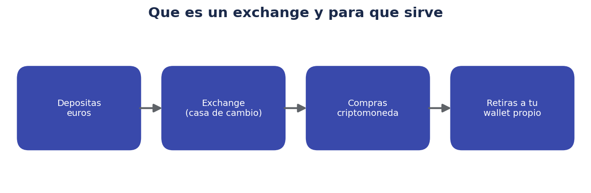
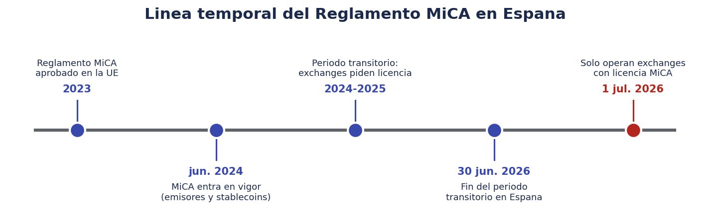
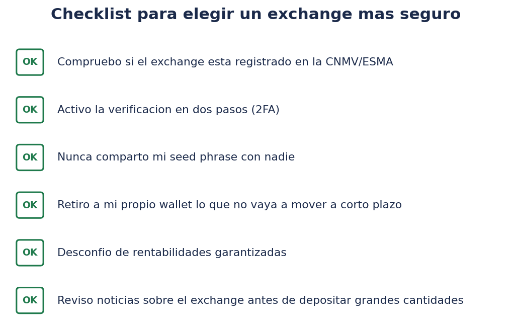

# 🏦 Exchanges, seguridad y regulación (MiCA)

> Este documento responde directamente a una duda muy concreta y muy actual: *"me hablan de que Binance va a cerrar y no sé qué significa eso"*. Aquí se explica qué es un exchange, qué es la regulación MiCA y qué ha pasado exactamente en España en 2026.

!!! warning "Recordatorio"
    Este documento describe hechos regulatorios generales y públicos, con fuentes de julio de 2026. La situación regulatoria evoluciona: antes de tomar decisiones, comprueba siempre el estado actualizado en la CNMV y en fuentes oficiales.

## 🔄 ¿Qué es un exchange?

Un **exchange** (casa de cambio de criptoactivos) es una plataforma que permite:

1. Depositar dinero "normal" (euros, dólares...).
2. Comprar criptomonedas con ese dinero (o vender cripto y recibir dinero "normal" a cambio).
3. En muchos casos, mantener esa cripto guardada en un monedero **custodial** gestionado por el propio exchange (ver `01-monederos-wallets.md`).
4. Retirar la cripto a un monedero propio, si el usuario lo decide.

Ejemplos de este tipo de plataformas (mencionados aquí solo con fines descriptivos, no como recomendación): Binance, Coinbase, Kraken, Bit2Me, entre muchos otros, cada uno con distinto alcance geográfico, regulación y nivel de licencias obtenidas según el país.

## 📜 ¿Qué es el Reglamento MiCA?

**MiCA** (Markets in Crypto-Assets, "Mercados de Criptoactivos") es el **reglamento de la Unión Europea** que establece, por primera vez, un marco regulatorio integral y armonizado para los criptoactivos y para las plataformas que operan con ellos (exchanges, custodios, emisores de determinados tokens) en todos los países miembros.

Cronología relevante:

- **2023**: se aprueba formalmente el Reglamento (UE) 2023/1114 (MiCA).
- **30 de junio de 2024**: entra en vigor la parte del reglamento relativa a emisores de stablecoins y determinados tokens.
- **2024-2026**: periodo transitorio, durante el cual los exchanges que ya operaban pueden seguir haciéndolo mientras tramitan su licencia MiCA ante el regulador correspondiente (en España, la CNMV).
- **30 de junio de 2026**: fin del periodo transitorio en España (inicialmente se había fijado el 30 de diciembre de 2025, pero se amplió ante el bajo número de entidades que habían completado su registro a tiempo).
- **1 de julio de 2026**: a partir de esta fecha, **solo pueden operar con normalidad en España los proveedores de servicios de criptoactivos que cuenten con autorización MiCA** (de la CNMV o de otro regulador de la UE, con pasaporte comunitario).

Según datos de la CNMV citados en prensa especializada, a mediados de 2026 más de 185 proveedores habían obtenido licencia MiCA en el conjunto de la Unión Europea, de los cuales varias decenas ya estaban registrados u operando en España.

## 🎯 ¿Qué exige MiCA a un exchange?

De forma simplificada, un exchange con licencia MiCA debe cumplir, entre otras, obligaciones de:

- **Autorización y gobierno corporativo**: requisitos de solvencia, honorabilidad de administradores, y procedimientos internos de control.
- **Protección al cliente**: segregación de los fondos de los clientes respecto al patrimonio propio de la empresa, y normas claras sobre custodia de activos.
- **Transparencia**: información clara sobre riesgos, comisiones y características de los servicios ofrecidos.
- **Prevención del abuso de mercado**: reglas contra la manipulación de precios y el uso de información privilegiada, similares en espíritu a las que existen en los mercados financieros tradicionales.
- **Supervisión continuada** por parte de la autoridad competente (la CNMV, en el caso de España).

## 📰 El caso concreto: Binance y España en 2026

Este es probablemente el motivo por el que has oído hablar de "Binance cerrando", y merece una explicación clara y sin alarmismo:

- Binance intentó tramitar su licencia MiCA a través de Grecia, pero **retiró esa solicitud** y comunicó que buscaría la autorización en otro Estado miembro de la Unión Europea.
- A fecha de finalización del periodo transitorio (30 de junio de 2026), **Binance no figuraba en el registro de entidades autorizadas de ESMA** (la autoridad europea de valores y mercados) ni contaba, por tanto, con licencia MiCA.
- Como consecuencia, **desde el 1 de julio de 2026, los usuarios españoles de Binance no pueden abrir nuevas operaciones de trading spot** en la plataforma; las órdenes que ya estuvieran abiertas antes de esa fecha se ejecutaron o se cancelaron automáticamente en un plazo breve (48 horas, según la información publicada).
- Para los usuarios ya existentes, el servicio queda limitado, en la práctica, a **operaciones de venta, retirada o transferencia de los criptoactivos y cierre de posiciones existentes**, no a nuevas compras ni nuevo trading.
- Esto **no significa que Binance como empresa "desaparezca" globalmente**, ni que las criptomonedas en sí dejen de existir o de funcionar: es una restricción regulatoria específica sobre esa plataforma concreta en el mercado español (y, en la práctica, en el conjunto de la Unión Europea), mientras no obtenga la licencia correspondiente en algún Estado miembro.

!!! info "Por qué esto es, en realidad, una buena noticia para el usuario final"
    Aunque genere incertidumbre a corto plazo, el objetivo de MiCA es precisamente que los exchanges que operan en la UE cumplan unos estándares mínimos de solvencia, transparencia y protección al usuario. Antes de esta regulación, un usuario no tenía forma sencilla de saber si una plataforma cumplía unos requisitos mínimos de seguridad; ahora existe un registro público (a través de la CNMV o de ESMA) que permite comprobarlo.

## ✅ Cómo comprobar si un exchange tiene licencia MiCA

Antes de depositar dinero en cualquier plataforma, se recomienda:

1. Consultar el **registro de entidades autorizadas de la CNMV** (para España) o el registro público de ESMA a nivel de la Unión Europea.
2. Comprobar que el nombre legal de la entidad que aparece en los términos y condiciones de la plataforma coincide con el registrado, no solo la marca comercial.
3. Desconfiar de cualquier plataforma que no aparezca en ningún registro oficial y que, aun así, insista en operar con normalidad con clientes españoles pasado el periodo transitorio.

## 🛡️ Riesgo de contraparte: qué pasa si un exchange tiene problemas

El **riesgo de contraparte** es el riesgo de que la entidad con la que operas no pueda cumplir sus obligaciones (por insolvencia, hackeo, fraude interno o, como en el caso descrito, pérdida de la autorización para operar). En criptoactivos, a diferencia de la banca tradicional, **no existe (todavía, de forma armonizada y generalizada) un fondo de garantía equivalente al de los depósitos bancarios** que cubra la insolvencia de un exchange de criptoactivos frente a sus clientes, aunque MiCA introduce exigencias de segregación de fondos que buscan mitigar precisamente este riesgo.

Esto refuerza la idea ya explicada en `01-monederos-wallets.md`: **cuanta más cripto mantengas en un exchange (en lugar de en un monedero propio), mayor es tu exposición al riesgo de contraparte de ese exchange concreto.**

## 🌍 Otros episodios regulatorios recientes, para contexto

El caso de Binance en España no es un hecho aislado dentro del proceso de adaptación a MiCA:

- Binance también había anunciado la retirada de otros mercados europeos (como Grecia) mientras buscaba una licencia en otro Estado miembro.
- Otros exchanges de menor tamaño han optado por cesar su actividad en la Unión Europea directamente, en lugar de afrontar el coste regulatorio de obtener la licencia MiCA.
- Al mismo tiempo, decenas de exchanges (algunos históricamente conocidos, otros más locales) sí han completado su registro y continúan operando con normalidad bajo licencia MiCA.

Esto ilustra un patrón habitual tras la entrada en vigor de una nueva regulación: una fase de reordenación del sector, en la que algunas plataformas se adaptan y otras salen (temporal o permanentemente) del mercado regulado.

## ⚖️ ¿Qué deberías hacer si usas (o usabas) un exchange sin licencia MiCA?

Como pauta general educativa (no como instrucción personalizada):

1. **Revisa el estado de tu plataforma** en el registro oficial de la CNMV o ESMA.
2. Si no tiene licencia y ya no permite operar con normalidad, **sigue las instrucciones oficiales de la propia plataforma** para retirar tus fondos dentro de los plazos habilitados.
3. Si vas a seguir invirtiendo en cripto, considera migrar a una plataforma con licencia MiCA verificable.
4. Si mantienes cripto que no vas a mover a corto plazo, valora transferirla a un monedero propio (no custodial), reduciendo tu exposición al riesgo de contraparte de cualquier exchange concreto.

## ❓ Preguntas frecuentes

**¿He perdido mi dinero si mi exchange se queda sin licencia MiCA?**
No necesariamente: en los casos conocidos hasta ahora, las plataformas afectadas han seguido permitiendo la retirada, venta o transferencia de los activos ya depositados, aunque con restricciones sobre nuevas operaciones. La situación puede variar según el caso, por lo que conviene seguir siempre la información oficial de la propia plataforma y de la CNMV.

**¿Puedo seguir usando una app o web de un exchange sin licencia desde España?**
Las restricciones regulatorias afectan a la prestación del servicio a clientes en la Unión Europea; usar una plataforma no autorizada al margen de esas restricciones puede implicar quedarte sin las protecciones que ofrece la regulación, entre otras consideraciones legales.

**¿Todas las criptomonedas necesitan licencia MiCA para existir?**
No: MiCA regula principalmente a los **proveedores de servicios** (exchanges, custodios) y a los **emisores** de determinados tokens (como las stablecoins), no a la tecnología blockchain en sí ni a redes descentralizadas como Bitcoin o Ethereum, que no tienen un emisor central al que exigir licencia.

**¿Esto significa que invertir en cripto ahora es más seguro?**
La regulación reduce (no elimina) ciertos riesgos, principalmente los relacionados con la solvencia y transparencia del intermediario. No elimina el riesgo de mercado (la volatilidad del precio de los criptoactivos), que sigue siendo muy alto independientemente de la plataforma utilizada.

## 🏗️ ¿Por qué se creó MiCA? El contexto previo

Antes de MiCA, cada país de la Unión Europea regulaba (o no regulaba) los criptoactivos de forma distinta e inconexa, lo que generaba varios problemas:

- Un exchange podía estar autorizado (o simplemente tolerado) en un país y operar de facto en otros sin ningún control equivalente.
- Los usuarios no tenían una forma sencilla y homogénea de comprobar la fiabilidad regulatoria de una plataforma.
- Episodios como quiebras sonadas de exchanges internacionales (fuera de la UE) en 2022, con pérdidas cuantiosas para usuarios particulares, pusieron de manifiesto la falta de un marco de protección claro para este tipo de activos.

MiCA busca precisamente cerrar ese vacío, estableciendo un conjunto de reglas comunes para los 27 países de la Unión Europea, con un régimen de "pasaporte comunitario": un exchange autorizado en un Estado miembro puede operar en el resto de la UE sin necesidad de una licencia distinta en cada país.

## 🗂️ Categorías de proveedores que regula MiCA

MiCA no regula únicamente a los exchanges de compraventa; el reglamento distingue varios tipos de proveedores de servicios de criptoactivos (CASP, por sus siglas en inglés), entre ellos:

| Tipo de servicio | Qué hace |
|---|---|
| Custodia y administración de criptoactivos | Guardar claves privadas por cuenta de clientes |
| Operación de una plataforma de negociación | Permitir comprar/vender criptoactivos entre usuarios |
| Cambio de criptoactivos por fondos (o por otros criptoactivos) | Servicios de intercambio directo |
| Ejecución de órdenes por cuenta de clientes | Similar al bróker tradicional, pero para criptoactivos |
| Colocación de criptoactivos | Ayudar a un emisor a distribuir un nuevo criptoactivo |
| Asesoramiento sobre criptoactivos | Recomendaciones personalizadas de inversión en cripto |
| Gestión de carteras de criptoactivos | Gestión discrecional de una cartera de criptoactivos por cuenta de un cliente |

Cada tipo de servicio tiene requisitos específicos, aunque todos comparten principios comunes de transparencia, protección al cliente y solvencia.

## 🔎 Guía paso a paso para verificar un exchange antes de usarlo

1. Busca el **nombre legal completo** de la entidad (no solo la marca comercial) en la web de la plataforma, normalmente en el aviso legal o los términos de uso.
2. Accede al **registro público de la CNMV** (o de ESMA para el conjunto de la UE) y busca ese nombre legal exacto.
3. Comprueba que el **país de autorización** coincide con lo que indica la propia plataforma.
4. Revisa si existen **alertas públicas** de la CNMV sobre esa entidad o sobre entidades que suplantan su identidad (una práctica de fraude conocida: clones de exchanges legítimos).
5. Si tienes dudas, contrasta la información con más de una fuente oficial antes de depositar fondos.

## 📊 Comparativa simplificada: exchange regulado vs. no regulado

| Aspecto | Exchange con licencia MiCA | Exchange sin licencia MiCA operando fuera de la UE |
|---|---|---|
| Supervisión | Autoridad competente de un Estado miembro de la UE | Normalmente ninguna supervisión equivalente aplicable en la UE |
| Segregación de fondos de clientes | Exigida por normativa | No garantizada ni verificable de forma homogénea |
| Vía de reclamación en caso de problema | Canales previstos por la regulación europea | Mucho más limitada o inexistente para un usuario en la UE |
| Continuidad legal para operar con clientes españoles | Garantizada mientras mantenga la licencia | En riesgo de restricciones, como el caso descrito de Binance en 2026 |

## 🧾 Glosario de este documento

| Término | Definición |
|---|---|
| **MiCA** | Reglamento (UE) 2023/1114, marco regulatorio europeo para criptoactivos |
| **CASP** | Crypto-Asset Service Provider, proveedor de servicios de criptoactivos regulado por MiCA |
| **CNMV** | Comisión Nacional del Mercado de Valores, autoridad competente en España |
| **ESMA** | Autoridad Europea de Valores y Mercados, supervisor a nivel de la Unión Europea |
| **Pasaporte comunitario** | Régimen que permite operar en toda la UE con una única autorización nacional |
| **Periodo transitorio** | Fase durante la cual plataformas ya existentes podían seguir operando mientras tramitaban su licencia |
| **Riesgo de contraparte** | Riesgo de que la entidad con la que operas no cumpla sus obligaciones |
| **Trading spot** | Compraventa directa de un criptoactivo al precio actual de mercado, sin derivados ni apalancamiento |
| **Segregación de fondos** | Obligación de mantener los activos de los clientes separados del patrimonio propio de la empresa |

## 🧭 Qué aprender de este episodio para el futuro

Independientemente de cómo evolucione la situación concreta de cualquier exchange, el episodio descrito en este documento deja algunas lecciones generales aplicables a cualquier futura decisión sobre dónde operar con criptoactivos:

- La regulación cambia, y puede afectar de un día para otro a la operativa de una plataforma concreta, incluso si es muy conocida o de gran tamaño.
- Diversificar también aplica a los intermediarios: no depender de un único exchange para todos tus fondos reduce el impacto de un episodio como este.
- Mantener el hábito de revisar periódicamente el estado regulatorio de las plataformas que usas es una práctica de seguridad razonable, no una precaución excesiva.
- La existencia de un marco como MiCA no elimina el riesgo de mercado de los criptoactivos, solo mitiga (parcialmente) el riesgo asociado al intermediario.

## ✅ Resumen de este documento

- Un exchange es el intermediario que permite comprar/vender cripto con dinero tradicional.
- MiCA es el reglamento de la UE que regula a estos intermediarios, en vigor de forma completa en España desde el 1 de julio de 2026.
- Binance no había obtenido licencia MiCA a esa fecha y ha visto restringidos sus servicios de trading para clientes españoles, sin que esto afecte a la existencia de las criptomonedas en sí.
- Antes de usar cualquier exchange, se recomienda comprobar su registro oficial en la CNMV o ESMA.
- Cuanta más cripto mantengas en un exchange, mayor es tu exposición al riesgo de contraparte de esa plataforma concreta.

## 🗒️ Nota sobre cómo seguir esta información actualizada

La regulación cripto es, por naturaleza, un terreno en movimiento constante: nuevas licencias, nuevas restricciones, nuevos ajustes normativos. Además de la propia web de la CNMV, conviene seguir fuentes de prensa especializada en regulación financiera y cripto, contrastando siempre más de una fuente antes de dar por buena cualquier noticia concreta sobre una plataforma determinada, especialmente si esa noticia genera alarma o urgencia para actuar.

## 🔁 Relación entre este documento y la fiscalidad (recordatorio breve)

Aunque la fiscalidad de las criptomonedas se trata con más detenimiento en la carpeta `trade/` en lo relativo a conceptos generales de ganancias patrimoniales, conviene recordar aquí que **retirar o transferir cripto entre tu propio exchange y tu propio monedero no suele considerarse una venta a efectos fiscales** (al no cambiar la titularidad), mientras que **vender cripto por euros, o intercambiar una criptomoneda por otra, sí genera normalmente una ganancia o pérdida patrimonial que debe declararse**. Ante cualquier operación relevante derivada de un cambio de plataforma como el descrito en este documento, conviene llevar un registro claro de fechas, cantidades y contravalor en euros, para facilitar la futura declaración fiscal.

## 🧯 Qué hacer si te encuentras en una situación similar (guía de reacción)

Si te avisan de que tu exchange pierde su autorización o restringe servicios, una reacción ordenada (en lugar de una decisión impulsiva) suele incluir estos pasos:

1. **No entres en pánico ni tomes decisiones apresuradas** basadas en rumores; busca la comunicación oficial de la propia plataforma y de la CNMV.
2. **Lee con calma qué operaciones siguen permitidas** (habitualmente venta, retirada y transferencia) y cuáles no (habitualmente nuevas compras o nuevo trading).
3. **Verifica el plazo** que te dan para actuar, si lo hay, y anótalo.
4. **Decide con tiempo** si vas a transferir tus fondos a otra plataforma regulada o a un monedero propio, en lugar de improvisar en el último momento.
5. **Guarda capturas o registros** de las comunicaciones oficiales recibidas, por si los necesitas más adelante (por ejemplo, a efectos fiscales o de reclamación).
6. **Evita canales no oficiales** (foros, redes sociales, mensajes de desconocidos) como única fuente de información sobre qué hacer.

## 🔮 ¿Qué podría pasar a partir de ahora?

Es razonable esperar que la situación siga moviéndose en los próximos meses: plataformas que hoy no tienen licencia pueden obtenerla más adelante en algún Estado miembro (recuperando así la posibilidad de operar con normalidad en toda la UE gracias al pasaporte comunitario), y es probable que sigan apareciendo ajustes normativos y aclaraciones por parte de ESMA y de los reguladores nacionales a medida que el reglamento MiCA termina de aplicarse en la práctica. Por este motivo, cualquier información concreta sobre una plataforma determinada debería verificarse en el momento de tomar una decisión, en lugar de asumir que la situación descrita en este documento se mantendrá invariable indefinidamente.

## 📌 Idea final para llevarte de este documento

Si te quedas con una sola idea de este documento, que sea esta: **la pregunta relevante no es "¿es buena o mala una plataforma?", sino "¿está autorizada para operar donde yo resido, y qué nivel de protección regulatoria tengo si algo sale mal?"**. Esa pregunta, a diferencia de una opinión sobre el mercado, sí se puede responder de forma objetiva consultando los registros oficiales antes de depositar ni un solo euro.

---

Anterior: [01 · Monederos y wallets](01-monederos-wallets.md) · Siguiente: [03 · Tipos de criptoactivos](03-tipos-de-criptoactivos.md)

Fuentes consultadas para la información regulatoria de este documento (julio de 2026): CNMV, ESMA, y cobertura periodística especializada en regulación cripto (DiarioBitcoin, Cripto247, Merca2, Observatorio Blockchain, El Confidencial Digital, Finantres).

## 📋 Tabla resumen final de este documento

| Concepto | Punto clave a recordar |
|---|---|
| Exchange | Intermediario para comprar/vender cripto con dinero tradicional |
| MiCA | Reglamento europeo que regula a estos intermediarios desde 2024-2026 |
| Periodo transitorio | Terminó el 30 de junio de 2026 en España |
| Binance en España | Sin licencia MiCA a esa fecha, servicios de trading restringidos |
| Cómo verificar | Registro público de la CNMV o de ESMA |
| Riesgo de contraparte | Aumenta cuanta más cripto dejes en un único exchange |
| Reacción ante restricciones | Calma, información oficial, ningún canal no verificado |
