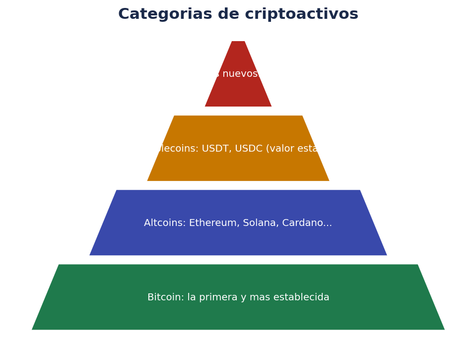
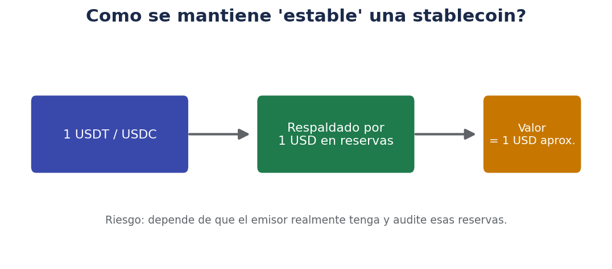
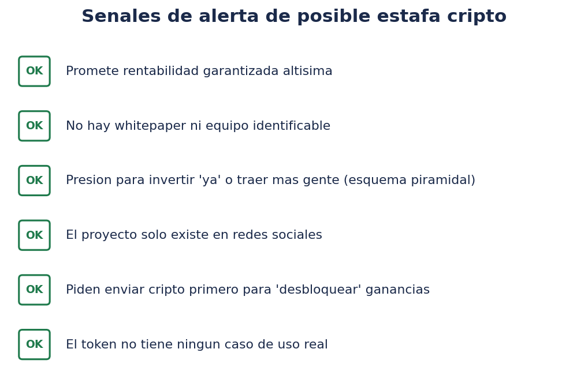

# 🪙 Tipos de criptoactivos: Bitcoin, altcoins, stablecoins y tokens

> No todos los criptoactivos son iguales, ni tienen el mismo propósito ni el mismo nivel de riesgo. Este documento pone orden en la terminología antes de que consideres comprar nada.

!!! warning "Recordatorio"
    Este documento describe categorías generales con fines educativos. No es una recomendación de compra de ninguna criptomoneda o token concreto. La inmensa mayoría de los criptoactivos son productos de riesgo muy alto.

## 🗺️ Panorama general

## ₿ Bitcoin

Bitcoin fue el primer criptoactivo y sigue siendo, con diferencia, el de mayor capitalización de mercado. Características que lo distinguen:

- **Oferta máxima fija**: 21 millones de unidades, un límite conocido de antemano y programado en su protocolo, que no puede modificarse sin un consenso extraordinario de toda la red.
- **Propósito principal**: se plantea sobre todo como reserva de valor y medio de intercambio descentralizado, sin depender de ningún banco central ni gobierno.
- **Red más antigua y probada**: lleva operando de forma ininterrumpida desde 2009, lo que le da un historial de resistencia mayor que a la mayoría de proyectos posteriores.
- **Consenso**: utiliza Proof of Work (ver `00-introduccion-blockchain.md`), con el consumo energético y el debate asociado que ya se explicó en ese documento.

## 🌐 Altcoins

Se denomina **altcoin** (moneda alternativa) a cualquier criptomoneda distinta de Bitcoin. Es un término muy amplio que incluye proyectos con propósitos muy diferentes entre sí:

- **Ethereum**: la altcoin de mayor capitalización, popularizó los contratos inteligentes y sirve de base a miles de aplicaciones descentralizadas (finanzas, coleccionables digitales, videojuegos, etc.).
- **Otras blockchains de "capa 1"** (Solana, Cardano, Avalanche y muchas otras): redes independientes que compiten en velocidad, coste de transacción o enfoque tecnológico, cada una con su propia criptomoneda nativa.
- **Tokens de "capa 2"**: soluciones construidas sobre otra blockchain (normalmente Ethereum) para mejorar velocidad o reducir comisiones, sin crear una red completamente independiente.

El riesgo de las altcoins, en general, tiende a ser mayor que el de Bitcoin: menor historial, mayor dependencia de un equipo de desarrollo concreto, y mayor concentración de la propiedad en pocas manos en muchos casos, lo que puede facilitar movimientos de precio más bruscos.

## 💵 Stablecoins: el intento de "criptomoneda estable"

Las **stablecoins** son criptoactivos diseñados para mantener un valor estable, normalmente vinculado a una moneda fiduciaria como el dólar o el euro (por ejemplo, 1 USDT o 1 USDC intentando valer siempre aproximadamente 1 dólar). Existen distintos mecanismos para lograrlo:

- **Respaldadas por reservas (colateralizadas con activos)**: el emisor mantiene reservas (efectivo, deuda pública a corto plazo...) equivalentes al valor de las stablecoins emitidas, y en teoría permite canjearlas por esa cantidad de moneda tradicional. Ejemplos conocidos: USDT (Tether) y USDC.
- **Colateralizadas con otros criptoactivos**: respaldadas por otras criptomonedas depositadas como garantía, con mecanismos de sobrecolateralización para absorber la volatilidad del colateral.
- **Algorítmicas**: intentan mantener la paridad mediante mecanismos automáticos de oferta y demanda, sin reservas físicas equivalentes; este tipo ha demostrado ser el más frágil, con varios casos históricos de pérdida completa de la paridad y del valor.

**Riesgos específicos de las stablecoins**: dependen de que el emisor realmente tenga y audite adecuadamente sus reservas declaradas, y de la solidez del propio emisor como empresa. El Reglamento MiCA presta especial atención a la regulación de este tipo de activos precisamente por su papel como "puente" entre el mundo cripto y el dinero tradicional, exigiendo a los emisores autorizados de stablecoins significativas requisitos de reservas y transparencia.

## 🪪 Tokens: más allá de "monedas"

No todo criptoactivo es una "moneda" en el sentido de medio de pago. El término **token** se usa para una variedad mucho más amplia de activos digitales construidos sobre una blockchain existente (a menudo Ethereum u otras con soporte de contratos inteligentes):

- **Tokens de utilidad (utility tokens)**: dan acceso a una función o servicio dentro de una plataforma concreta (por ejemplo, pagar comisiones dentro de una aplicación descentralizada).
- **Tokens de gobernanza**: otorgan derecho de voto sobre decisiones de un proyecto u organización descentralizada (por ejemplo, cambios en sus parámetros o uso de fondos comunitarios).
- **Tokens de seguridad (security tokens)**: representan un activo financiero tradicional (una participación, un derecho sobre un flujo de ingresos) tokenizado en blockchain; suelen estar sujetos a una regulación financiera más estricta y específica, más allá de MiCA.
- **NFT (Non-Fungible Token, token no fungible)**: representan la propiedad única de un activo digital concreto (una imagen, un coleccionable, un certificado), a diferencia de las criptomonedas "normales", donde una unidad es intercambiable por otra igual (fungible). Su valor depende enormemente de factores especulativos, de escasez percibida y de la comunidad asociada al proyecto, y ha mostrado una volatilidad y unos riesgos de liquidez muy altos en la práctica.

## 📊 Comparativa de riesgo por categoría

| Categoría | Historial / madurez | Riesgo típico | Ejemplo de propósito |
|---|---|---|---|
| Bitcoin | Muy alto (desde 2009) | Alto (pero el más bajo dentro de cripto) | Reserva de valor descentralizada |
| Altcoins establecidas (ej. Ethereum) | Alto | Alto | Infraestructura de aplicaciones descentralizadas |
| Altcoins de menor capitalización | Bajo-medio | Muy alto | Muy variable, a menudo especulativo |
| Stablecoins respaldadas por reservas | Medio-alto | Medio (riesgo del emisor) | Puente entre cripto y moneda tradicional |
| Stablecoins algorítmicas | Bajo | Muy alto | Intento de estabilidad sin reservas físicas |
| Tokens de proyectos nuevos | Muy bajo | Extremo | Muy variable, alto riesgo de proyecto fallido o estafa |
| NFT | Bajo-variable | Muy alto, baja liquidez | Coleccionismo digital, certificados de propiedad |

## 🚩 Cómo evaluar un proyecto antes de considerar invertir en él

Antes de plantearte cualquier criptoactivo más allá de los más establecidos, conviene revisar (sin que esto garantice nada, solo reduce el riesgo de errores evidentes):

- **Whitepaper**: ¿existe un documento técnico serio que explique el propósito, el diseño y la utilidad real del proyecto?
- **Equipo**: ¿hay personas identificables y con trayectoria verificable detrás del proyecto, o es completamente anónimo sin ninguna razón clara para serlo?
- **Código y actividad de desarrollo**: ¿existe un repositorio público de código con actividad real y sostenida?
- **Comunidad y adopción real**: ¿tiene uso real más allá de la especulación sobre su precio?
- **Distribución de tokens**: ¿está muy concentrada en pocas direcciones (riesgo de que unos pocos "grandes tenedores" muevan el precio a su antojo)?
- **Promesas de rentabilidad**: ¿promete rendimientos "garantizados" o extraordinariamente altos? Esto es una señal de alerta prácticamente universal.

## 🚨 Señales de alerta de posible estafa

Algunas de las estafas más habituales en el espacio cripto siguen patrones reconocibles:

- **Esquemas piramidales o Ponzi disfrazados de proyecto cripto**: prometen rentabilidad garantizada a cambio de traer más inversores, con la rentabilidad de los primeros pagada con el dinero de los últimos.
- **"Rug pull"**: los creadores de un token lanzan el proyecto, generan interés y liquidez, y después retiran todos los fondos desapareciendo, dejando el token sin ningún valor.
- **Estafas de "soporte técnico"**: contacto no solicitado ofreciendo ayuda para "recuperar" fondos o "desbloquear" una cuenta, que termina pidiendo la seed phrase o acceso remoto.
- **Perfiles falsos en redes sociales** suplantando a personas conocidas o a plataformas legítimas, anunciando regalos o duplicación de criptomonedas a cambio de un envío previo.
- **Presión de urgencia**: mensajes que insisten en actuar "ya" o perder una oportunidad única, diseñados para evitar que pares a pensar o verifiques la información.

## ❓ Preguntas frecuentes

**¿Es Bitcoin "más seguro" que otras criptomonedas?**
En términos de historial, madurez de la red y descentralización, sí suele considerarse el criptoactivo con el perfil de riesgo relativamente más bajo dentro del propio sector cripto, aunque sigue siendo un activo de riesgo muy alto y alta volatilidad en comparación con activos financieros tradicionales.

**¿Las stablecoins no tienen riesgo, al estar "ancladas" a una moneda tradicional?**
No están libres de riesgo: dependen de la solidez del emisor, de la calidad y auditoría real de sus reservas, y de la confianza del mercado en esa paridad. Han existido episodios históricos de pérdida (parcial o total) de la paridad, especialmente en modelos algorítmicos.

**¿Qué es "capitalización de mercado" en cripto?**
Es el resultado de multiplicar el precio de una unidad por el número total de unidades en circulación; es un indicador del tamaño relativo de un proyecto, pero no garantiza ni su solidez ni su liquidez real en el mercado.

**¿Los NFT son lo mismo que las criptomonedas?**
No exactamente: los NFT son un tipo de token no fungible (cada uno es único), mientras que la mayoría de criptomonedas son fungibles (una unidad es igual e intercambiable por otra). Comparten la tecnología blockchain subyacente, pero su naturaleza económica es distinta.

## 📖 Casos históricos conocidos (para aprender de ellos)

Sin ánimo de generar alarma, conocer algunos episodios ya documentados públicamente ayuda a entender por qué se insiste tanto en la prudencia:

- **Colapso de una stablecoin algorítmica (2022)**: un proyecto de stablecoin sin respaldo de reservas físicas perdió por completo su paridad con el dólar en cuestión de días, arrastrando también a la baja a su criptomoneda asociada, con pérdidas muy elevadas para los inversores que confiaban en su estabilidad.
- **Quiebra de un gran exchange internacional (2022)**: una plataforma de gran tamaño y reputación colapsó por una gestión interna fraudulenta de los fondos de sus clientes, evidenciando que el tamaño o la popularidad de una plataforma no garantiza por sí sola su solidez ni la seguridad de los fondos depositados.
- **Numerosos "rug pulls" de proyectos menores**: cientos de tokens de pequeña capitalización han desaparecido con los fondos de sus inversores tras generar expectación en redes sociales, sin que existiera nunca un producto o utilidad real detrás.

Estos casos no significan que "toda la cripto sea una estafa": Bitcoin y Ethereum, por ejemplo, han seguido operando con normalidad durante todos estos episodios. Lo que sí ilustran es que el riesgo de proyecto, de emisor y de intermediario son reales y han tenido consecuencias económicas graves para quienes no los tuvieron en cuenta.

## 🧾 Glosario de este documento

| Término | Definición |
|---|---|
| **Altcoin** | Cualquier criptomoneda distinta de Bitcoin |
| **Capitalización de mercado** | Precio unitario × unidades en circulación de un criptoactivo |
| **Capa 1 (Layer 1)** | Blockchain independiente con su propia red de validación (ej. Ethereum, Solana) |
| **Capa 2 (Layer 2)** | Solución construida sobre otra blockchain para mejorar velocidad/coste |
| **Colateralización** | Respaldo de un activo mediante otros activos depositados como garantía |
| **Fungible / no fungible** | Intercambiable por una unidad idéntica (fungible) o único e irrepetible (no fungible, NFT) |
| **Paridad (peg)** | Relación de valor fija que una stablecoin intenta mantener frente a otra moneda |
| **Rug pull** | Estafa en la que los creadores de un proyecto retiran los fondos y desaparecen |
| **Token de gobernanza** | Token que otorga derecho de voto sobre decisiones de un proyecto |
| **Token de utilidad** | Token que da acceso a una función dentro de una plataforma concreta |
| **Whitepaper** | Documento técnico que describe el propósito y funcionamiento de un proyecto |

## 🔍 Preguntas adicionales para tu propio criterio

- ¿Podría explicar qué problema real resuelve este criptoactivo, más allá de "puede subir de precio"?
- ¿Existe información verificable e independiente sobre el equipo y el desarrollo del proyecto?
- ¿Qué pasaría con mi inversión si este proyecto concreto perdiera todo su valor? ¿Podría asumirlo sin que afecte a mi situación financiera?
- ¿Estoy considerando esto por convicción informada, o por presión de un grupo, red social o anuncio?

## ✅ Resumen de este documento

- Bitcoin es el criptoactivo más establecido, con oferta limitada y consenso Proof of Work.
- Las altcoins son cualquier criptomoneda distinta de Bitcoin, con propósitos y niveles de riesgo muy variados.
- Las stablecoins buscan estabilidad de precio, pero dependen de la solidez del emisor y de sus reservas.
- Los tokens abarcan una categoría mucho más amplia que las "monedas": utilidad, gobernanza, seguridad, NFT.
- Cuanto más nuevo, anónimo o con promesas de rentabilidad garantizada sea un proyecto, mayor es el riesgo de estafa.

## 🧮 Volatilidad: una comparación con activos tradicionales

Para dimensionar el riesgo real, ayuda comparar (de forma orientativa e ilustrativa, sin cifras exactas de ningún periodo concreto) la volatilidad típica de distintos tipos de activos:

| Activo | Oscilaciones diarias típicas | Oscilaciones en episodios de estrés de mercado |
|---|---|---|
| Deuda pública a corto plazo | Mínimas | Bajas |
| Índice bursátil diversificado (ej. renta variable global) | Moderadas | Notables, pero limitadas por la diversificación |
| Acción individual | Moderadas-altas | Pueden ser muy altas en casos concretos |
| Bitcoin | Altas | Muy altas, con caídas históricas superiores al 50 % en varios episodios |
| Altcoins de menor capitalización | Muy altas | Extremas, incluyendo pérdida total del valor en muchos casos |

Esta comparación no pretende disuadir de invertir en cripto, sino situar correctamente las expectativas: la volatilidad de los criptoactivos, incluso los más establecidos, supera con claridad a la de la mayoría de activos financieros tradicionales.

## 🧠 Diversificación dentro del propio universo cripto

Si, tras toda esta información, decides invertir en criptoactivos, la misma lógica de diversificación explicada en la carpeta `trade/` aplica aquí, con matices propios:

- Concentrar todo en un único altcoin de baja capitalización es mucho más arriesgado que repartir entre los activos más establecidos (Bitcoin, Ethereum) si el objetivo es reducir el riesgo específico de proyecto.
- El peso que dediques al conjunto de criptoactivos dentro de tu patrimonio total debería ser coherente con tu tolerancia al riesgo global, no solo con el riesgo relativo dentro del propio universo cripto.
- Diversificar entre exchanges y monederos (como se explicó en los documentos anteriores) es tan importante como diversificar entre activos, dado el riesgo de contraparte específico de este sector.

## 📚 Dónde informarte de forma más técnica si quieres profundizar

- El **whitepaper original de Bitcoin** (disponible públicamente y traducido a múltiples idiomas) sigue siendo una lectura de referencia para entender los fundamentos técnicos.
- La documentación oficial de **Ethereum.org** ofrece explicaciones actualizadas sobre contratos inteligentes, Proof of Stake y el ecosistema de aplicaciones descentralizadas.
- Los informes y guías de la **CNMV** sobre criptoactivos ofrecen una perspectiva regulatoria y de protección al inversor, complementaria a la puramente técnica.
- Los **exploradores de bloques** (mencionados en `00-introduccion-blockchain.md`) permiten verificar de primera mano datos objetivos sobre cualquier red pública, sin depender de intermediarios.

## ❓ Última tanda de preguntas frecuentes

**¿Tiene sentido comprar "un poco de todo" para diversificar dentro de cripto?**
No necesariamente: comprar decenas de tokens poco conocidos "para diversificar" puede en realidad aumentar el riesgo total, si la mayoría de esos proyectos tienen alta probabilidad de fracasar. Una diversificación razonable dentro de cripto suele apoyarse más en los activos de mayor capitalización y trayectoria, si el objetivo es reducir el riesgo específico.

**¿Por qué se habla tanto del "ciclo" del mercado cripto?**
Históricamente, el mercado cripto ha mostrado fases de fuerte subida seguidas de caídas prolongadas, en ciclos que muchos analistas asocian a factores como los halvings de Bitcoin, la liquidez macroeconómica global y la entrada/salida de inversores minoristas e institucionales. Esto no es una ley física ni garantiza que el patrón se repita en el futuro, pero explica por qué la volatilidad de este mercado ha sido, históricamente, tan pronunciada.

**¿Debo esperar a "que baje" o a "que suba" para comprar?**
Intentar acertar el momento perfecto de entrada es extremadamente difícil incluso para profesionales, y en un activo tan volátil como el cripto, ese riesgo se amplifica. Estrategias como las aportaciones periódicas (DCA, ya explicadas en la carpeta `trade/`) son una forma de reducir el impacto de este dilema, aunque no eliminan el riesgo de mercado subyacente.

## 🏛️ DAO: organizaciones autónomas descentralizadas, brevemente

Un concepto relacionado con los tokens de gobernanza es el de **DAO (Decentralized Autonomous Organization)**: una organización cuyas reglas de funcionamiento y toma de decisiones están, al menos en parte, codificadas en contratos inteligentes, y donde los poseedores de un token de gobernanza pueden votar propuestas (por ejemplo, cómo gastar un fondo comunitario, o qué cambios técnicos aplicar). Es un modelo experimental de gobernanza colectiva que plantea preguntas interesantes desde el punto de vista de la ciencia de la computación y la teoría de organizaciones, aunque también ha mostrado limitaciones prácticas: baja participación real en las votaciones, concentración de tokens de gobernanza en pocas manos, y vulnerabilidades cuando el código del contrato inteligente tiene errores de diseño.

Para quien tiene un perfil docente en informática, las DAO son un ejemplo interesante de aplicación práctica (con luces y sombras) de conceptos como sistemas distribuidos, criptografía aplicada y automatización de procesos de decisión, más allá del componente puramente especulativo asociado a sus tokens.

## 🧩 Tabla resumen final: pregunta clave por categoría

| Categoría | Pregunta clave antes de considerarla |
|---|---|
| Bitcoin | ¿Encaja como reserva de valor a muy largo plazo dentro de mi tolerancia al riesgo? |
| Altcoin establecida | ¿Qué utilidad real tiene su red y qué adopción demuestra? |
| Altcoin especulativa | ¿Puedo permitirme perder el 100 % de lo invertido en ella? |
| Stablecoin | ¿Confío en la transparencia y auditoría de las reservas de su emisor? |
| Token nuevo | ¿Existe whitepaper, equipo identificable y actividad de desarrollo real? |
| NFT | ¿Entiendo que su liquidez y valor futuro son altamente inciertos? |

## ✅ Cierre de este documento

Este documento no pretende ser una lista exhaustiva de criptoactivos (una tarea imposible, dado que se crean miles de proyectos nuevos constantemente), sino un marco conceptual para clasificar cualquier criptoactivo que te encuentres en el futuro: ¿es Bitcoin, una altcoin establecida, una altcoin especulativa, una stablecoin, o un token de un tipo concreto? Y, sobre esa base, ¿qué nivel de riesgo implica y qué preguntas deberías hacerte antes de considerar invertir en él?

## 🗒️ Nota final sobre la terminología

El ecosistema cripto genera terminología nueva constantemente, y es habitual sentirse desbordado por siglas y anglicismos. La buena noticia es que casi cualquier término nuevo que te encuentres encajará, con algo de análisis, en alguna de las categorías vistas en este documento: ¿es una red con su propia blockchain, o un token construido sobre otra? ¿busca ser un medio de pago, una reserva de valor, dar acceso a un servicio, o representar un activo único? Responder a esas preguntas suele ser más útil que memorizar cada nuevo nombre que aparece en redes sociales.

## 🔗 Puente hacia la práctica

Con esta clasificación clara, el siguiente y último documento de la carpeta se centra en la parte más concreta: cómo dar tus primeros pasos reales, eligiendo una plataforma regulada, comprando tu primera criptomoneda de forma prudente y protegiendo esa compra desde el primer minuto.

## 📋 Tabla resumen final de este documento

| Concepto | Punto clave a recordar |
|---|---|
| Bitcoin | El más establecido, oferta limitada a 21 millones |
| Altcoin | Cualquier cripto distinta de Bitcoin, riesgo variable |
| Stablecoin | Busca estabilidad, pero depende del emisor y sus reservas |
| Token de utilidad | Da acceso a una función dentro de una plataforma |
| Token de gobernanza | Da derecho de voto sobre decisiones de un proyecto |
| NFT | Token único, no fungible, alta volatilidad y baja liquidez |
| Rug pull | Estafa donde los creadores desaparecen con los fondos |
| Whitepaper | Documento técnico a revisar antes de considerar cualquier proyecto |

---

Anterior: [02 · Exchanges, seguridad y regulación](02-exchanges-seguridad-regulacion.md) · Siguiente: [04 · Primeros pasos prácticos](04-primeros-pasos-practicos.md)
