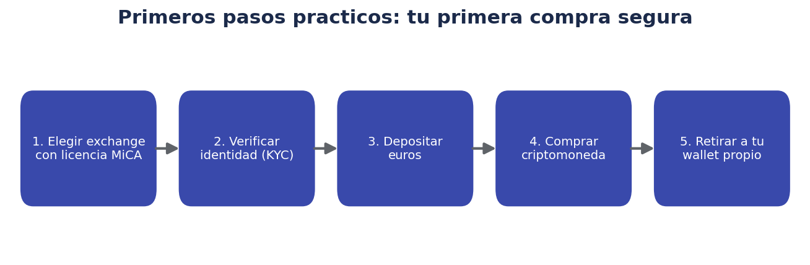
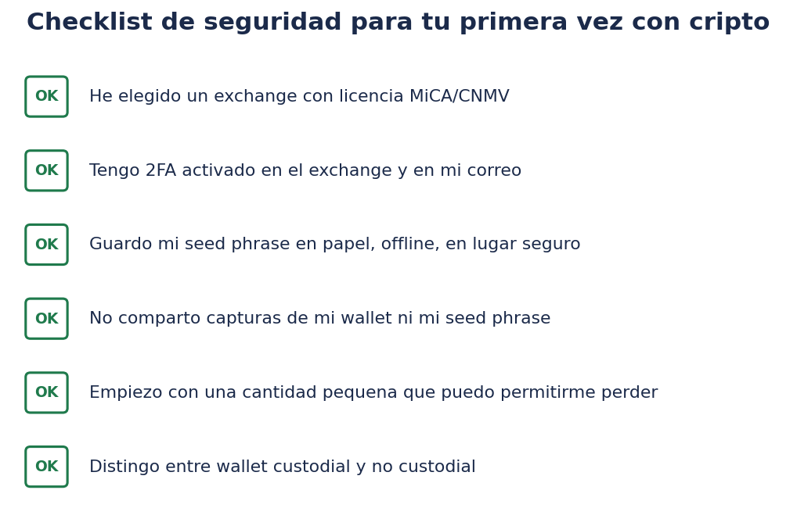
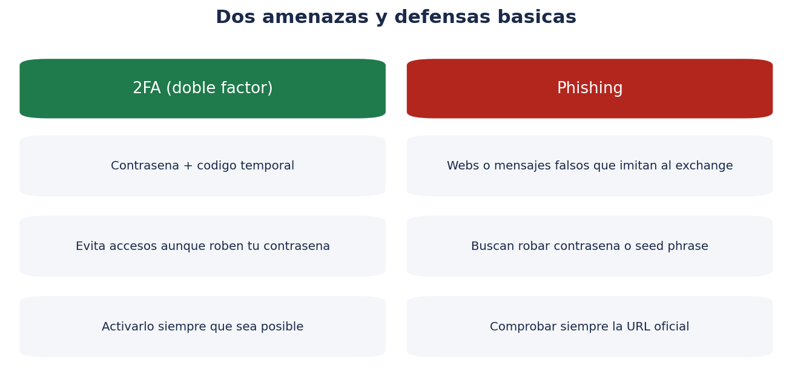

# 🚀 Primeros pasos prácticos: tu primera compra segura

> Con los conceptos de los cuatro documentos anteriores ya interiorizados, este documento propone un plan concreto, ordenado y prudente para dar tus primeros pasos reales en criptomonedas.

!!! warning "Recordatorio"
    Este documento es una guía general de buenas prácticas, no una recomendación de compra de ninguna criptomoneda ni de ninguna plataforma concreta. Aplica siempre tu propio criterio y verifica la información en fuentes oficiales actualizadas.

## 🗺️ El plan paso a paso

### Paso 1: Elige un exchange con licencia MiCA verificable

Como se explicó en `02-exchanges-seguridad-regulacion.md`, el primer filtro de seguridad no es "qué tan conocida es la plataforma", sino **si está autorizada para operar donde resides**. Antes de registrarte:

- Consulta el registro de la CNMV (o de ESMA para el conjunto de la UE).
- Verifica que el nombre legal de la entidad coincide con el que aparece en los términos y condiciones de la plataforma.
- Descarta cualquier plataforma que no puedas verificar en un registro oficial.

### Paso 2: Verificación de identidad (KYC)

Los exchanges regulados están obligados a aplicar procedimientos de **KYC (Know Your Customer, "conoce a tu cliente")**, que normalmente implican:

- Aportar un documento de identidad oficial (DNI, pasaporte).
- Realizar una verificación biométrica (una foto o vídeo corto para comparar con el documento).
- En algunos casos, justificar el origen de los fondos para importes elevados.

Esto no es un obstáculo arbitrario: es una exigencia regulatoria (relacionada con la prevención del blanqueo de capitales) que, de hecho, es una señal de que la plataforma cumple con sus obligaciones legales.

### Paso 3: Depositar euros

Los métodos de depósito habituales incluyen transferencia bancaria SEPA o tarjeta de débito/crédito, cada uno con distintas comisiones y tiempos de procesamiento. Conviene revisar la comisión aplicada por cada método antes de elegir uno.

### Paso 4: Tu primera compra

Antes de comprar:

- Empieza con una **cantidad pequeña**, asumible por completo como "coste de aprendizaje" si algo sale mal.
- Prioriza los criptoactivos más establecidos (Bitcoin, Ethereum) frente a proyectos nuevos o poco conocidos, al menos en esta primera fase.
- Revisa la comisión de compra/venta antes de confirmar la operación.

### Paso 5: Retirar a tu propio monedero (si procede)

Como se explicó en `01-monederos-wallets.md`, si vas a mantener la cripto durante un tiempo sin operar activamente, considera retirarla a un monedero propio (no custodial), reduciendo tu exposición al riesgo de contraparte del exchange.

## ✅ Checklist completa antes de tu primera compra

- [ ] He verificado que el exchange elegido tiene licencia MiCA/CNMV.
- [ ] He completado la verificación de identidad (KYC) siguiendo el proceso oficial de la plataforma.
- [ ] He activado la verificación en dos pasos (2FA) en el exchange y en mi correo electrónico asociado.
- [ ] He entendido la diferencia entre wallet custodial y no custodial, y he decidido cuál usar en cada fase.
- [ ] Empiezo con una cantidad pequeña que puedo permitirme perder por completo.
- [ ] Sé qué tipo de criptoactivo estoy comprando y por qué (no compro solo porque "está de moda").
- [ ] Tengo mi seed phrase (si uso monedero propio) anotada en papel, offline, en un lugar seguro.
- [ ] No he compartido ni voy a compartir mi seed phrase, contraseñas o códigos de verificación con nadie.

## 🔐 Seguridad básica: 2FA y phishing

Dos medidas de seguridad imprescindibles desde el primer día:

- **2FA (verificación en dos pasos)**: añade una segunda capa de seguridad más allá de la contraseña (un código temporal generado por una app de autenticación, preferible a los códigos por SMS, que son más vulnerables a ciertos ataques). Actívalo en el exchange, en tu correo electrónico asociado y en cualquier monedero que lo permita.
- **Prevención de phishing**: accede siempre a las plataformas escribiendo la URL directamente o desde tus propios favoritos guardados, nunca desde enlaces de correos, mensajes o anuncios. Verifica siempre la URL exacta antes de introducir tus credenciales.

## 💸 Errores comunes de quien empieza en cripto

1. **Invertir más de lo que se puede permitir perder**, presionado por el miedo a "quedarse fuera" (FOMO).
2. **Comprar sin haber entendido antes qué tipo de criptoactivo es** (Bitcoin, altcoin establecida, token especulativo...).
3. **Dejar grandes cantidades en un único exchange** durante mucho tiempo, sin valorar mover parte a un monedero propio.
4. **No activar 2FA**, dejando la cuenta protegida solo por una contraseña.
5. **Compartir capturas de pantalla del monedero o de la seed phrase**, aunque sea sin querer, en redes sociales o chats.
6. **Confiar en "señales" o promesas de rentabilidad garantizada** recibidas por redes sociales o mensajes privados.
7. **No informarse sobre la fiscalidad** de las operaciones con criptoactivos antes de empezar a operar con cierta frecuencia.

## 🧾 Un apunte fiscal práctico

Como se ha mencionado en documentos anteriores, en España, con carácter general: vender cripto por euros, o intercambiar una criptomoneda por otra, genera normalmente una ganancia o pérdida patrimonial que debe declararse en el IRPF, integrada en la base imponible del ahorro. Es recomendable llevar, desde el primer día, un **registro propio de operaciones** (fecha, cantidad, contravalor en euros de cada compra y venta), ya que no todos los exchanges (especialmente los que no operan bajo normativa española) facilitan automáticamente un resumen fiscal completo y adaptado a la declaración española.

## 🎓 Cómo seguir formándote después de tu primera compra

1. Revisa periódicamente el estado regulatorio de la plataforma que uses (los cambios, como se ha visto con el caso de Binance en 2026, pueden ser repentinos).
2. Vuelve a leer `01-monederos-wallets.md` antes de mover cantidades relevantes a un monedero propio por primera vez, para no improvisar con la seed phrase.
3. Si te interesa profundizar más allá de comprar y mantener, investiga con calma (y mucha cautela) conceptos más avanzados como el staking, las finanzas descentralizadas (DeFi) o los contratos inteligentes, idealmente con importes simbólicos mientras aprendes.
4. Contrasta siempre cualquier "novedad" o "tendencia" viral con fuentes técnicas y regulatorias serias antes de actuar.

## ❓ Preguntas frecuentes de cierre

**¿Cuánto dinero es razonable destinar a criptomonedas al empezar?**
No existe una cifra universal, pero una pauta habitual entre asesores financieros es que los activos de muy alto riesgo (incluidos los criptoactivos) representen solo una parte reducida del patrimonio total invertido, ajustada a tu capacidad real de asumir pérdidas totales sobre esa parte.

**¿Debo comprar todo de golpe o poco a poco?**
Muchos inversores prefieren aportaciones periódicas pequeñas (la misma lógica de DCA explicada en la carpeta `trade/`) para reducir el impacto de comprar todo justo antes de una caída puntual, aunque esto no elimina el riesgo de mercado a largo plazo.

**¿Qué hago si tengo dudas sobre si una plataforma es de fiar?**
Verifica su registro oficial (CNMV/ESMA), busca noticias recientes sobre esa plataforma en fuentes serias, y ante la duda, prioriza siempre la prudencia: no depositar fondos hasta tener una respuesta clara y verificable.

**¿Es buena idea contarle a otras personas cuánto tengo invertido en cripto?**
Por seguridad personal, se recomienda discreción sobre las cantidades concretas que gestionas, tanto en redes sociales como en conversaciones informales, para reducir el riesgo de ser objetivo de estafas dirigidas o de ingeniería social.

## 📋 Plantilla de registro de operaciones (para tu propio control)

Llevar un registro sencillo desde la primera operación facilita tanto el seguimiento personal como la futura declaración fiscal. Una estructura básica podría ser:

| Fecha | Operación | Criptoactivo | Cantidad | Contravalor en euros | Comisión | Plataforma |
|---|---|---|---|---|---|---|
| dd/mm/aaaa | Compra | BTC | 0,01 | 550 € | 2,50 € | (nombre del exchange) |
| dd/mm/aaaa | Retirada a wallet propio | BTC | 0,01 | — | 0,80 € (comisión de red) | (nombre del exchange) |
| dd/mm/aaaa | Venta | BTC | 0,005 | 310 € | 1,20 € | (nombre del exchange) |

Puedes llevar esta tabla en una hoja de cálculo propia, actualizándola en cada operación, independientemente de si tu exchange ofrece o no un resumen fiscal automático.

## 💳 Comparativa de métodos de depósito habituales

| Método | Velocidad habitual | Comisión típica | Consideración |
|---|---|---|---|
| Transferencia bancaria SEPA | 1-2 días hábiles | Baja o nula | Método recomendable para importes mayores |
| Tarjeta de débito/crédito | Inmediata | Más alta que la transferencia | Cómoda para importes pequeños o primeras pruebas |
| Transferencia instantánea | Minutos | Variable según plataforma y banco | Depende de si ambas entidades la soportan |

Antes de depositar, revisa siempre la comisión concreta que aplica tu exchange para cada método, ya que puede variar significativamente entre plataformas.

## 📖 Glosario final combinado de toda la carpeta criptomonedas/

A modo de cierre, un repaso rápido de los términos más importantes vistos a lo largo de los cinco documentos:

| Término | Definición resumida |
|---|---|
| Blockchain | Base de datos distribuida y encadenada mediante hashes |
| Nodo | Ordenador que participa en la red validando el protocolo |
| Consenso (PoW/PoS) | Mecanismo por el que la red se pone de acuerdo sobre transacciones válidas |
| Monedero (wallet) | Software/dispositivo que guarda las claves de acceso a tus criptoactivos |
| Clave privada / seed phrase | Elementos secretos que dan control total sobre los fondos; nunca se comparten |
| Custodial / no custodial | Quién guarda las claves: el exchange o tú mismo |
| Hot / cold wallet | Monedero conectado a internet o aislado (dispositivo físico) |
| Exchange | Plataforma para comprar/vender cripto con moneda tradicional |
| MiCA | Reglamento de la UE que regula a los proveedores de servicios de criptoactivos |
| KYC | Proceso de verificación de identidad exigido a los exchanges regulados |
| Altcoin | Cualquier criptomoneda distinta de Bitcoin |
| Stablecoin | Criptoactivo diseñado para mantener un valor estable frente a otra moneda |
| Token | Activo digital construido sobre una blockchain existente, con múltiples propósitos |
| Rug pull | Estafa en la que los creadores de un proyecto desaparecen con los fondos |

## ✅ Resumen de este documento

- El proceso seguro de entrada en cripto pasa por: elegir exchange regulado, verificar identidad, depositar, comprar con prudencia y, si procede, retirar a monedero propio.
- La seguridad básica (2FA, prevención de phishing, protección de la seed phrase) es tan importante como la elección del activo.
- Los errores más habituales de quien empieza son emocionales (FOMO, presión social) más que técnicos.
- Llevar un registro propio de operaciones facilita la declaración fiscal, especialmente si se opera con plataformas no domiciliadas en España.
- La formación continua y la verificación periódica del estado regulatorio de las plataformas usadas son hábitos que reducen (sin eliminar) el riesgo de sorpresas desagradables.

## 🧭 Mapa de decisión rápido para tu primera semana

Un esquema orientativo de qué hacer, día a día, en tu primera semana con criptomonedas:

- **Día 1-2**: elige y verifica un exchange con licencia MiCA; completa el registro y la verificación de identidad (KYC).
- **Día 2-3**: activa 2FA en el exchange y en el correo asociado; familiarízate con la interfaz sin depositar aún dinero real.
- **Día 3-4**: realiza un primer depósito pequeño; revisa las comisiones aplicadas.
- **Día 4-5**: realiza tu primera compra, priorizando un criptoactivo establecido y una cantidad simbólica.
- **Día 5-7**: decide si vas a mantener la cripto en el exchange o retirarla a un monedero propio; si eliges monedero propio, practica primero el proceso de configuración y respaldo de la seed phrase con calma, sin prisas.

Este calendario es solo orientativo: lo importante no es la velocidad, sino no saltarte ningún paso de verificación y seguridad por las prisas.

## 🔁 Repaso de las cinco preguntas que deberías poder responder ya

Al llegar a este punto de la carpeta, deberías poder responder con seguridad a estas cinco preguntas, que resumen lo esencial de los cinco documentos:

1. ¿Qué es una blockchain y por qué es difícil de alterar retroactivamente?
2. ¿Qué diferencia hay entre un monedero custodial y uno no custodial, y por qué importa tanto?
3. ¿Qué es el Reglamento MiCA y por qué ha afectado a plataformas como Binance en España en 2026?
4. ¿Qué diferencia hay entre Bitcoin, una altcoin, una stablecoin y un token?
5. ¿Qué pasos concretos seguirías para hacer tu primera compra de forma prudente y seguirla registrando correctamente?

Si alguna de estas preguntas te genera dudas, no hay ningún problema en releer el documento correspondiente antes de operar con dinero real: la prisa es, precisamente, uno de los principales enemigos de la seguridad en este ámbito.

## 🏁 Cierre de la carpeta criptomonedas/

Con estos cinco documentos deberías tener una base sólida y realista sobre qué es blockchain, qué es un monedero, cómo funcionan los exchanges y la regulación MiCA, qué tipos de criptoactivos existen y cómo dar tus primeros pasos con prudencia. El mensaje de fondo, que se repite de forma deliberada a lo largo de toda la carpeta, es sencillo: **entiende antes de actuar, protege tus claves, verifica la regulación de cualquier plataforma, y nunca inviertas más de lo que puedas permitirte perder por completo.**

## 🗒️ Último recordatorio práctico

Si después de leer toda la carpeta decides no invertir en criptomonedas, esta lectura sigue teniendo valor: te permite entender con criterio propio las noticias sobre regulación, exchanges y volatilidad que seguirán apareciendo, en lugar de depender de titulares simplificados o de lo que te cuente un tercero sin verificar. Y si decides sí invertir, lo harás con una base mucho más sólida que la de la mayoría de personas que se lanzan a comprar cripto motivadas únicamente por el ruido mediático del momento.

## 🧠 Reflexión final: prudencia sin parálisis

El objetivo de toda esta carpeta no es generar miedo hacia las criptomonedas, sino sustituir el desconocimiento (que es lo que realmente genera vulnerabilidad ante estafas y errores costosos) por una base de conceptos sólida. Con esa base, la decisión de invertir o no, cuánto y en qué, pasa a ser una elección informada y personal, coherente con tu situación financiera y tu tolerancia al riesgo, en lugar de una reacción a titulares, publicidad o presión social.

## 🔗 Enlaces internos de esta carpeta

- [00 · Introducción y blockchain](00-introduccion-blockchain.md)
- [01 · Monederos y wallets](01-monederos-wallets.md)
- [02 · Exchanges, seguridad y regulación](02-exchanges-seguridad-regulacion.md)
- [03 · Tipos de criptoactivos](03-tipos-de-criptoactivos.md)

## 📝 Plantilla de notas personales (para rellenar)

- **Exchange elegido y por qué**: ___________________________
- **Fecha de mi primera compra**: ___________________________
- **Criptoactivo(s) elegido(s) inicialmente**: ___________________________
- **¿Uso monedero propio? ¿Cuál?**: ___________________________
- **Dónde guardo mi seed phrase (recordatorio, no la frase en sí)**: ___________________________
- **Próxima revisión programada del estado regulatorio de mi exchange**: ___________________________

---

## 📋 Tabla resumen final de este documento

| Paso | Punto clave a recordar |
|---|---|
| 1. Elegir exchange | Verificar licencia MiCA en el registro de la CNMV/ESMA |
| 2. Verificación KYC | Exigencia legal, señal de cumplimiento normativo |
| 3. Depositar | Comparar comisiones según el método elegido |
| 4. Primera compra | Cantidad pequeña, activo establecido |
| 5. Custodia | Decidir entre exchange o monedero propio según el caso |
| Seguridad | 2FA activado, prevención de phishing, seed phrase protegida |
| Fiscalidad | Registro propio de operaciones desde el primer día |

Anterior: [03 · Tipos de criptoactivos](03-tipos-de-criptoactivos.md) · Volver al [índice de la carpeta](00-introduccion-blockchain.md)

*Última actualización de contenido: julio de 2026. La regulación y el mercado de criptoactivos cambian con rapidez: verifica siempre la información vigente en fuentes oficiales (CNMV, ESMA) antes de tomar decisiones.*
