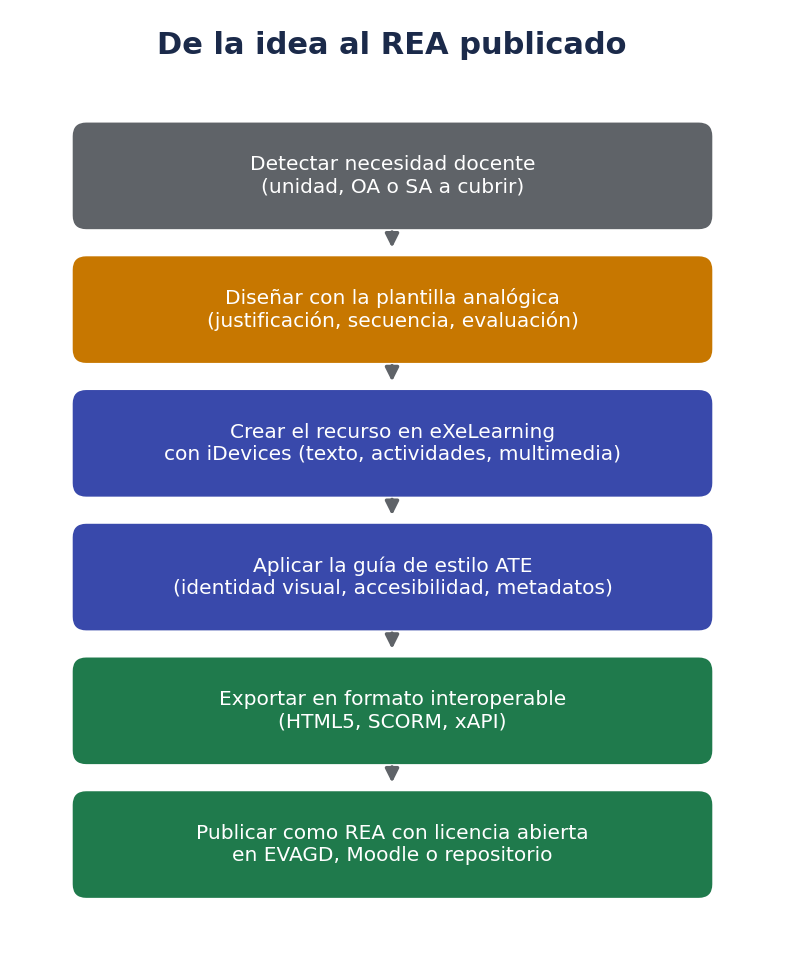
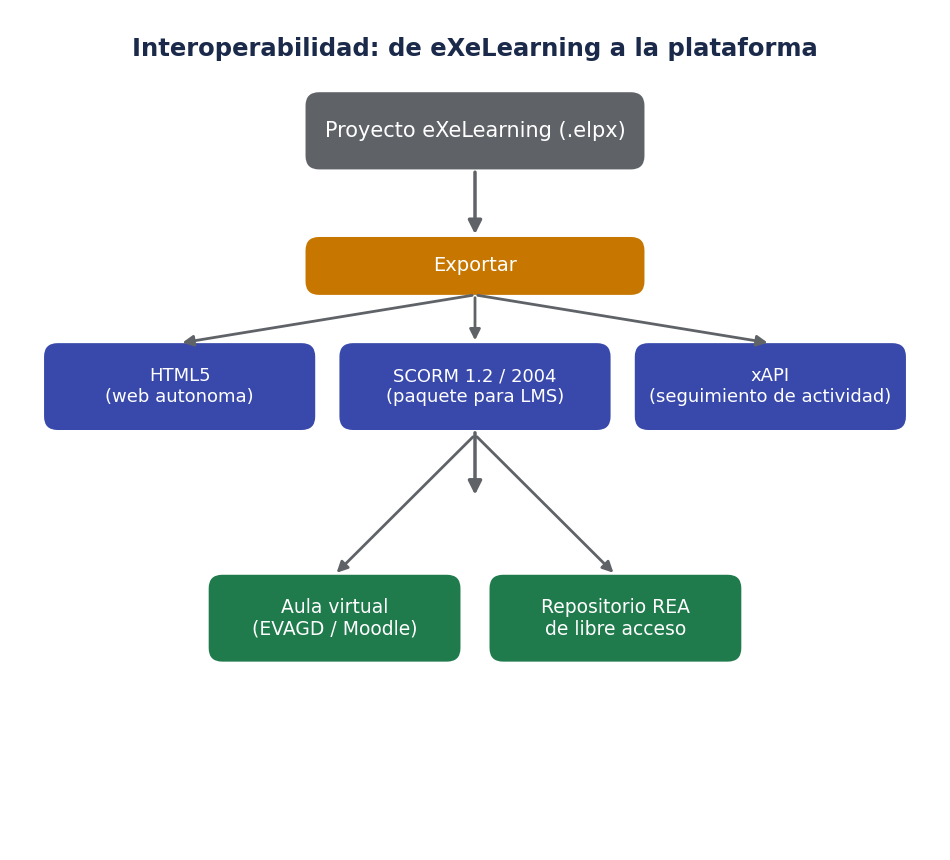
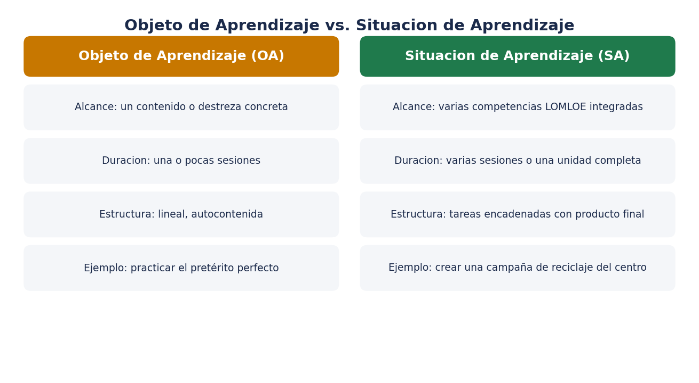

# 📘 eXeLearning — Crear Recursos Educativos Abiertos (REA)

> *"Cada vez que se crea un recurso, se está contribuyendo a construir soberanía digital bajo un protocolo de excelencia."* — Área de Tecnología Educativa, Gobierno de Canarias

Esta carpeta reúne **lo que necesito saber sobre eXeLearning** para crear Recursos Educativos Abiertos (REA) de calidad: qué es la herramienta, quién la mantiene, cómo se organiza un proyecto por dentro, en qué formatos se exporta y cómo aprovechar las plantillas y la guía de estilo que el Área de Tecnología Educativa (ATE) del Gobierno de Canarias ha publicado en 2026.

No es un manual exhaustivo de todos los iDevices, sino una guía de **arranque rápido y con criterio**, pensada para llevar directamente a la práctica en el aula y, en mi caso, también a la documentación técnica que publico en Markdown/MkDocs.

!!! info "Por qué me interesa esta herramienta"
    Como coordinador de innovación y responsable de la web del centro, eXeLearning encaja con dos objetivos a la vez: producir materiales didácticos reutilizables y accesibles, y hacerlo con software libre e interoperable, sin depender de una plataforma cerrada de un proveedor externo.

## 🧭 ¿Qué es eXeLearning?

**eXeLearning** es una herramienta de autoría de código abierto (licencia AGPL) para crear contenidos educativos digitales sin necesidad de saber programar. Permite construir árboles de contenido con elementos multimedia y actividades interactivas de autoevaluación, y exportar el resultado a múltiples formatos estándar.

Nació como *eXe* (proyecto neozelandés, University of Auckland) y hoy se desarrolla en España a través de **CEDEC-INTEF** (Centro Nacional de Desarrollo Curricular en Sistemas no Propietarios), dependiente del Ministerio de Educación, en colaboración con varias comunidades autónomas —entre ellas Canarias, Extremadura, Galicia, la Comunidad Valenciana y Madrid— que firman el llamado *protocolo eXe* para financiar de forma conjunta su desarrollo evolutivo.

Los proyectos oficiales de referencia son [exelearning.net](https://exelearning.net) (portal, comunidad, documentación y descargas) y [exelearning.dev](https://exelearning.dev) (aplicación web activa, instalable en servidor propio). Desde la versión 3.0, eXeLearning funciona como **aplicación web** —con edición colaborativa multiusuario en tiempo real— además de mantener versión de escritorio para Windows, macOS y Linux, y despliegue mediante Docker para centros o administraciones que quieran alojarla en su propia infraestructura, sin depender de un servicio en la nube de terceros.

## 🕰️ De eXe a eXeLearning 3.0: evolución rápida

| Etapa | Qué cambió |
|---|---|
| **eXe (proyecto original, Nueva Zelanda)** | Primera herramienta de autoría de REA, código abierto, origen del formato `.elp` |
| **eXeLearning.net (impulso español, CEDEC-INTEF)** | Continuidad del proyecto, traducción, comunidad hispanohablante, integración con normativa educativa española |
| **eXeLearning 2.x** | Versión de escritorio estable durante años, base de la mayoría de manuales todavía en circulación |
| **eXeLearning 3.0 (beta a estable)** | Reimplementación moderna: app web colaborativa, nuevo formato `.elpx`, interfaz renovada, nuevos estilos visuales |
| **eXeLearning 3.0.1 y sucesivas** | Ajustes de estabilidad, mejoras en exportación SCORM y en el manejo de `suspend_data` |

## 🧱 Cómo se organiza un proyecto (.elpx)

Un proyecto de eXeLearning se guarda con extensión **`.elpx`** (desde la versión 3, sustituye al antiguo `.elp`, aunque los proyectos antiguos se pueden migrar). Dentro de ese archivo hay una estructura de **páginas**, y cada página se construye combinando **iDevices**: los bloques de contenido y actividad con los que se monta el recurso.

| Categoría de iDevice | Para qué sirve | Ejemplos |
|---|---|---|
| **Contenido** | Aportar información al alumnado | Texto, imagen, galería, vídeo/audio incrustado |
| **Interactivos** | Que el alumnado manipule o practique | Rellenar huecos, relacionar conceptos, ordenar elementos, juegos |
| **Evaluación** | Comprobar el aprendizaje | Test de opción múltiple, verdadero/falso, pregunta abierta |
| **Organización** | Agrupar y estructurar | Cajas (*boxes*) con título e icono propio, pestañas, acordeón |

Desde la versión 3.0, los iDevices se pueden **agrupar en cajas** con arrastrar y soltar (*drag & drop*), lo que facilita organizar contenido en bloques temáticos dentro de una misma página, y se han incorporado nuevos estilos visuales predefinidos (*Flux*, *Neo*, *Nova*, *Zen*) para no tener que maquetar el recurso desde cero. También se ha añadido una pestaña de generación de respuestas asistida por IA para algunos tipos de actividad, aunque conviene revisar siempre el resultado antes de publicarlo.

!!! tip "Exportar a Word y viceversa"
    Un proyecto `.elpx` se puede exportar a `.docx` para revisarlo o compartirlo con compañeros que no usan eXeLearning, y también importar un `.docx` ya redactado para convertirlo en punto de partida de un nuevo proyecto. Es útil cuando el borrador inicial de un recurso nace como documento de texto convencional.

## 🔄 Exportación e interoperabilidad

La ventaja de eXeLearning frente a crear una presentación o un documento suelto es que el mismo proyecto se puede **exportar a varios formatos estándar**, pensados para integrarse en distintas plataformas sin perder la interactividad ni el seguimiento del progreso del alumnado.

| Formato de exportación | Uso principal |
|---|---|
| **HTML5** | Página web autónoma, se puede alojar en cualquier servidor o abrir en local sin conexión |
| **SCORM 1.2 / SCORM 2004** | Paquete que un LMS (Moodle, EVAGD, Aula Virtual) puede rastrear: progreso, intentos, calificación |
| **xAPI (Tin Can)** | Seguimiento más granular de la actividad del alumnado, útil para analítica de aprendizaje |
| **IMS Content Package** | Estándar de empaquetado de contenido, compatible con múltiples plataformas educativas |

En la versión 3.x se ha mejorado especialmente la fiabilidad del `suspend_data` y la recuperación de puntuaciones al exportar a SCORM, algo que antes daba problemas al reanudar una actividad ya empezada dentro del LMS. Antes de dar por bueno un paquete, conviene subirlo a un curso de pruebas y comprobar que la calificación se registra correctamente, no solo que el contenido se ve bien.

## 🎯 Objeto de Aprendizaje vs. Situación de Aprendizaje

La plantilla analógica del ATE distingue dos tipos de recurso que se pueden construir con eXeLearning, y conviene tenerlos claros antes de empezar a diseñar:

- **Objeto de Aprendizaje (OA)**: recurso acotado a un contenido o destreza muy concreta, pensado para una o pocas sesiones, con estructura lineal y autocontenida.
- **Situación de Aprendizaje (SA)**: propuesta más amplia, alineada con la LOMLOE, que integra varias competencias, se despliega en varias sesiones y encadena tareas hasta llegar a un producto final competencial.

Elegir uno u otro formato **condiciona el diseño**: un OA se puede montar casi directamente en eXeLearning, mientras que una SA conviene planificarla antes en la plantilla analógica (justificación pedagógica, secuencia de tareas, criterios de evaluación) para no perderse a mitad de la maquetación digital. Empezar a maquetar sin ese guion previo suele acabar en un recurso desordenado, aunque el contenido en sí sea correcto.

## 🎨 Plantillas y guía de estilo del ATE (Canarias, 2026)

En marzo de 2026 el Área de Tecnología Educativa del Gobierno de Canarias publicó un paquete de recursos de apoyo, dentro de la estrategia nacional impulsada por CEDEC-INTEF, para homogeneizar la calidad de los REA que se producen en los centros:

| Recurso | Qué aporta |
|---|---|
| **Plantilla analógica** | Guion paso a paso (en papel/documento) para diseñar el OA o la SA antes de tocar eXeLearning: justificación, secuencia competencial, metodología, evaluación |
| **Guía de estilo** | Criterios pedagógicos, técnicos y visuales para que el recurso final sea coherente, accesible y reutilizable |
| **Plantilla digital (.elpx)** | Proyecto de eXeLearning ya maquetado con la identidad visual corporativa y los metadatos mínimos, listo para rellenar con el contenido propio |

!!! note "Dónde encontrarlas"
    Las plantillas y la guía se publicaron en el blog del [Área de Tecnología Educativa](https://www3.gobiernodecanarias.org/medusa/ecoescuela/ate/2026/03/24/plantillas-y-guias-exelearning/) y se distribuyen también desde el repositorio de [Recursos Educativos Digitales](https://www3.gobiernodecanarias.org/medusa/ecoescuela/recursosdigitales/2026/03/25/plantilla-digital-y-guias-de-estilo-para-exelearning/) de la Consejería.

Usar la plantilla digital como punto de partida evita dos problemas típicos: recursos con aspecto muy distinto entre docentes de un mismo centro, y recursos a los que les falta algún metadato (autoría, licencia, nivel educativo) necesario para publicarlos correctamente como REA. La iniciativa forma parte de un plan de comunicación y difusión continua: los recursos validados se van poniendo a disposición del profesorado a través de espacios web institucionales, acciones formativas y el asesoramiento de los equipos de los centros del profesorado del archipiélago.

## 🔐 Accesibilidad y sostenibilidad, dos criterios no negociables

La guía de estilo del ATE insiste en cuatro principios que conviene interiorizar antes de maquetar cualquier REA:

- **Competencia digital docente**: usar la herramienta con criterio pedagógico, no solo técnico.
- **Respeto a la propiedad intelectual**: solo incluir materiales propios o con licencia compatible.
- **Accesibilidad universal**: textos alternativos, contraste, estructura de encabezados coherente, navegación por teclado.
- **Interoperabilidad y sostenibilidad digital**: formatos abiertos que sigan siendo legibles y editables dentro de varios años, sin depender de un servicio que pueda desaparecer.

## ✅ Checklist antes de publicar un REA

Antes de dar por terminado un recurso y subirlo a EVAGD, Moodle o un repositorio abierto, conviene repasar:

1. **Licencia**: ¿lleva una licencia abierta (por ejemplo, Creative Commons) indicada de forma visible en la portada o en los metadatos?
2. **Metadatos**: título, autoría, nivel educativo, área o materia y palabras clave completos y correctos.
3. **Accesibilidad**: textos alternativos en imágenes, contraste suficiente, navegación por teclado comprobada.
4. **Guía de estilo**: identidad visual, tipografías y colores coherentes con lo establecido por el centro o la administración.
5. **Exportación probada**: el paquete SCORM/HTML5 se ha probado en el LMS de destino, no solo visualizado en el editor.
6. **Propiedad intelectual**: las imágenes, vídeos o textos de terceros usados tienen licencia compatible o son de elaboración propia.

## 🏫 Integración con Moodle y EVAGD

Al exportar un proyecto como **paquete SCORM**, se puede subir directamente como actividad en Moodle (y por tanto en EVAGD, que usa Moodle como base) igual que se subiría cualquier otro paquete SCORM: el sistema crea automáticamente la actividad, registra intentos y permite configurar una calificación asociada a la puntuación del recurso.

Si el objetivo es solo **mostrar contenido sin necesidad de seguimiento** (por ejemplo, un recurso de consulta libre o una chuleta), exportar a **HTML5** y subir la carpeta resultante como recurso tipo "Archivo" o "Página" suele ser más ligero que empaquetar en SCORM, y evita generar registros de intento innecesarios en el libro de calificaciones.

## 🧑‍🏫 eXeLearning en Formación Profesional

En un ciclo de FP, eXeLearning encaja especialmente bien en tres escenarios:

- **Guías de práctica paso a paso**, con capturas de pantalla numeradas e iDevices de autoevaluación al final de cada bloque, exportadas como recurso HTML5 de consulta libre.
- **Cuestionarios previos o de repaso** empaquetados en SCORM, con calificación automática integrada en el libro de calificaciones de la plataforma virtual del ciclo.
- **Materiales reutilizables entre cursos**, ya que al ser software libre y formatos abiertos, el recurso no queda ligado a la versión de una suite ofimática concreta ni caduca con una licencia.

## ⚖️ eXeLearning frente a otras herramientas de autor

| Herramienta | Código abierto | Exporta SCORM | Requiere cuenta/servicio externo | Punto fuerte |
|---|---|---|---|---|
| **eXeLearning** | ✅ Sí (AGPL) | ✅ Sí | ❌ No (autoalojable) | Soberanía digital, sin dependencia de terceros |
| **H5P** | ✅ Sí | ✅ Sí (vía plugin) | Depende del alojamiento (Moodle, Lumi, WordPress) | Actividades interactivas muy vistosas |
| **Genially** | ❌ No | ⚠️ Limitado | ✅ Sí (cuenta en la nube) | Diseño visual muy atractivo, curva de entrada baja |
| **PowerPoint / Impress** | Según suite | ❌ No | Depende | Rapidez para algo puntual, sin interactividad real |

Ninguna herramienta sustituye a las demás: para una infografía rápida puede bastar Genially, pero cuando el objetivo es producir un **recurso reutilizable, evaluable en un LMS y sin depender de un servicio externo**, eXeLearning sigue siendo la opción más sólida dentro del ecosistema educativo público español.

## 🚀 Primeros pasos prácticos

1. Accede a la versión web en [exelearning.dev](https://exelearning.dev) o instala la versión de escritorio desde [exelearning.net](https://exelearning.net) si prefieres trabajar sin conexión.
2. Descarga la **plantilla digital .elpx** del ATE y ábrela como punto de partida en lugar de un proyecto en blanco.
3. Decide si el recurso es un **OA o una SA** y, si es una SA, rellena antes la plantilla analógica en papel o documento.
4. Monta el contenido con iDevices, agrupando los relacionados en **cajas** con título propio.
5. Aplica los criterios de la **guía de estilo** (tipografía, colores, accesibilidad) antes de dar por cerrado el diseño.
6. Exporta en el formato que corresponda (HTML5 para consulta libre, SCORM para actividad evaluable en el LMS).
7. Pasa el **checklist de publicación** y sube el recurso a EVAGD, Moodle o el repositorio de REA que corresponda.

## ❓ Preguntas frecuentes

**¿eXeLearning necesita instalación o puedo usarlo directamente desde el navegador?**
Ambas cosas son posibles: la versión web en exelearning.dev funciona sin instalar nada, y también existe versión de escritorio para trabajar sin conexión o instalar en un servidor propio del centro.

**¿Qué pasa con los proyectos antiguos en formato `.elp`?**
Se pueden abrir y migrar a `.elpx` desde las versiones 3.x, aunque conviene revisar que los iDevices más antiguos se muestren correctamente tras la migración.

**¿Puedo trabajar en el mismo proyecto con otro compañero a la vez?**
En la versión web (3.0 en adelante) sí, mediante edición colaborativa multiusuario; en la versión de escritorio no, cada persona trabaja sobre su propia copia del archivo.

**¿Es obligatorio usar la plantilla digital del ATE?**
No es obligatorio, pero facilita mucho cumplir de entrada con la guía de estilo y evita tener que añadir a mano los metadatos mínimos de un REA.

**¿eXeLearning sirve para algo más que "unidades didácticas" clásicas?**
Sí. También se usa para chuletas de repaso, guías de práctica de laboratorio, cuestionarios de autoevaluación previos a un examen o incluso para portafolios de evidencias del alumnado, siempre que interese el seguimiento del progreso o la interactividad.

## 🧩 Utilidades complementarias de la comunidad

Alrededor de eXeLearning ha crecido un pequeño ecosistema de utilidades, mantenidas por la comunidad docente, que resuelven necesidades muy concretas al trabajar con los paquetes exportados:

| Utilidad | Para qué sirve |
|---|---|
| **EdEX** | Editor ligero para revisar y corregir metadatos o pequeños detalles de un paquete SCORM/HTML5 ya exportado, sin tener que reabrir el proyecto original |
| **eXeConvert** | Conversión por lotes entre formatos de exportación cuando hay que adaptar muchos recursos a la vez |
| **Visor Web-ZIP** | Permite visualizar un paquete exportado en formato ZIP directamente en el navegador, sin necesidad de descomprimirlo antes en el LMS |

No son imprescindibles para empezar, pero conviene conocer que existen antes de intentar resolver "a mano" un problema que estas utilidades ya cubren.

## 📄 Licencias Creative Commons más habituales en un REA

La licencia es el metadato que más se olvida y el que determina si el recurso realmente se puede considerar "abierto". Las combinaciones más frecuentes en REA educativos son:

| Licencia | Permite | Restricción principal |
|---|---|---|
| **CC BY** | Uso, adaptación y redistribución, incluso comercial | Solo exige citar la autoría original |
| **CC BY-SA** | Igual que la anterior | Las adaptaciones deben compartirse con la misma licencia |
| **CC BY-NC** | Uso y adaptación no comercial | No se permite uso comercial del recurso ni de sus adaptaciones |
| **CC BY-NC-SA** | Uso y adaptación no comercial | No comercial y las adaptaciones deben mantener la misma licencia |

Para material producido en un centro público, **CC BY-SA** suele ser una opción equilibrada: garantiza que el recurso y sus adaptaciones sigan siendo abiertos para toda la comunidad educativa, exigiendo únicamente reconocer la autoría.

## 🚫 Errores comunes al empezar con eXeLearning

1. **Maquetar antes de planificar.** Abrir eXeLearning y empezar a añadir iDevices sin haber pasado por la plantilla analógica suele acabar en un recurso desordenado y difícil de reestructurar después.
2. **Mezclar demasiados iDevices distintos en una sola página.** Sobrecarga visualmente el recurso y dificulta la navegación del alumnado; suele ser mejor repartir el contenido en varias páginas o cajas.
3. **Olvidar los metadatos.** Un recurso sin autoría, licencia o nivel educativo indicado deja de ser un REA completo, aunque el contenido esté bien hecho.
4. **No probar la exportación en el LMS real.** Un paquete que se ve perfecto en el editor puede fallar al registrar la calificación si no se prueba antes en Moodle o EVAGD.
5. **Usar imágenes o vídeos sin comprobar la licencia.** Es el error de propiedad intelectual más habitual al construir recursos rápido con material encontrado en internet.
6. **No revisar la accesibilidad hasta el final.** Añadir textos alternativos y comprobar el contraste al terminar, en vez de sobre la marcha, es mucho más costoso que hacerlo desde el principio.

## 📚 Recursos oficiales para ampliar

- **[CEDEC-INTEF](https://cedec.intef.es)**: noticias de desarrollo de eXeLearning, manuales y guías oficiales.
- **[exelearning.net](https://exelearning.net)**: portal del proyecto, descargas, ayuda y comunidad.
- **[Área de Tecnología Educativa (ATE) de Canarias](https://www3.gobiernodecanarias.org/medusa/ecoescuela/ate/)**: noticias, plantillas y recursos digitales para el profesorado canario.
- **[Recursos EDIA de CEDEC](https://cedec.intef.es/recursos-edia-y-situaciones-de-aprendizaje-relacion-entre-las-propuestas-edia-y-la-lomloe/)**: ejemplos de situaciones de aprendizaje alineadas con la LOMLOE.

## 🧗 Autoevaluación

Antes de ponerte a montar tu primer REA, intenta responder mentalmente a estas preguntas. Si alguna te cuesta, vuelve al apartado correspondiente de este documento:

1. ¿Sabrías explicar la diferencia entre un Objeto de Aprendizaje y una Situación de Aprendizaje?
2. ¿Qué formato exportarías si el recurso necesita registrar la calificación del alumnado en el LMS?
3. ¿Qué tres cosas revisarías del checklist antes de publicar cualquier REA?
4. ¿Sabrías dónde encontrar la plantilla digital y la guía de estilo del ATE de Canarias?
5. ¿Podrías justificar por qué eXeLearning aporta "soberanía digital" frente a una herramienta cerrada en la nube?

## ✅ Resumen de este documento

- eXeLearning es una herramienta de autoría libre (AGPL), desarrollada por CEDEC-INTEF y varias comunidades autónomas, disponible como app web, escritorio y despliegue propio (Docker).
- Un proyecto `.elpx` se construye combinando iDevices de contenido, interactivos, evaluación y organización, agrupables en cajas desde la versión 3.0.
- Se exporta a HTML5, SCORM 1.2/2004, xAPI e IMS CP, lo que permite integrarlo en Moodle, EVAGD o cualquier repositorio abierto.
- El ATE de Canarias ha publicado en 2026 una plantilla analógica, una guía de estilo y una plantilla digital para homogeneizar la creación de REA alineados con la LOMLOE.
- Antes de publicar un REA conviene revisar licencia, metadatos, accesibilidad, estilo, exportación probada y propiedad intelectual.
- En FP funciona especialmente bien para guías de práctica, cuestionarios con calificación automática y material reutilizable entre cursos.
- **CC BY-SA** suele ser la licencia más adecuada para material producido en un centro público: mantiene el recurso y sus adaptaciones abiertos para toda la comunidad educativa.

---

Sources:
- [Creación de Recursos Educativos Abiertos en eXeLearning: nuevas plantillas y una guía de estilo — ATE Canarias](https://www3.gobiernodecanarias.org/medusa/ecoescuela/ate/2026/03/24/plantillas-y-guias-exelearning/)
- [Plantilla digital y Guía de Estilo para eXeLearning — Recursos Educativos Digitales, Gobierno de Canarias](https://www3.gobiernodecanarias.org/medusa/ecoescuela/recursosdigitales/2026/03/25/plantilla-digital-y-guias-de-estilo-para-exelearning/)
- [Guía de creación de REA con eXeLearning (2026) — CEDEC-INTEF](https://cedec.intef.es/guia-de-creacion-de-rea-con-exelearning-2026-un-recorrido-paso-a-paso/)
- [eXeLearning 3.0: una nueva era para crear, compartir y aprender — CEDEC-INTEF](https://cedec.intef.es/exelearning-3-0-una-nueva-era-para-crear-compartir-y-aprender/)
- [eXeLearning 3.0.1: Seguimos avanzando — CEDEC-INTEF](https://cedec.intef.es/exelearning-3-0-1-seguimos-avanzando/)
- [eXeLearning project — exelearning.net](https://exelearning.net/en/exelearning-project/)
- [Recursos EDIA y Situaciones de Aprendizaje. Relación entre las propuestas EDIA y la LOMLOE — CEDEC-INTEF](https://cedec.intef.es/recursos-edia-y-situaciones-de-aprendizaje-relacion-entre-las-propuestas-edia-y-la-lomloe/)
