# 🎓 EOI — Guía de Certificación B1 · B2 · C1 de Inglés

Esta página reúne **todo lo que necesito repasar para presentarme a las pruebas de certificación de inglés de la Escuela Oficial de Idiomas (EOI)** en los niveles **B2 (Intermedio avanzado, antes "B2.2")** y **C1 (Avanzado)**, dentro de la Comunidad Autónoma de Canarias. Es una **guía orientada 100% al examen**. 
> *"No estudies para el examen. Estudia el idioma y el examen se aprueba solo."*

## 🗺️ EOI
Las **Escuelas Oficiales de Idiomas (EOI)** son centros públicos de enseñanza de idiomas dependientes de las Consejerías de Educación de cada comunidad autónoma. Sus certificados son **títulos oficiales con validez en toda España** y reconocimiento en el ámbito europeo, ya que se basan en el **Marco Común Europeo de Referencia para las Lenguas (MCER)**. 

| | **B1 — Intermedio** | **B2 — Intermedio avanzado** | **C1 — Avanzado** |
|---|---|---|---|
| **Perfil del hablante** | Se desenvuelve en situaciones cotidianas y predecibles | Interactúa con fluidez razonable, incluso con hablantes nativos | Se expresa con flexibilidad y naturalidad, casi sin esfuerzo perceptible |
| **Vocabulario** | Suficiente para temas familiares: trabajo, viajes, estudios | Amplio, incluye lenguaje más idiomático y algo de registro formal | Muy amplio, incluye matices, connotaciones y coloquialismos |
| **Gramática** | Tiempos verbales básicos e intermedios, oraciones compuestas simples | Subordinadas complejas, voz pasiva, discurso indirecto | Estructuras avanzadas: inversión, condicionales mixtos, matices modales |
| **Comprensión** | Textos claros sobre temas conocidos, a velocidad normal | Textos largos y algo abstractos, la mayoría de programas de TV/radio | Textos extensos y complejos, incluso con implícitos y humor |
| **Producción** | Textos sencillos y cohesionados sobre temas conocidos | Textos claros y detallados sobre una amplia gama de temas | Textos bien estructurados, con un uso controlado de conectores y estilo |
| **Mediación** | Transmite información básica y concreta | Resume y reformula con cierta precisión | Adapta el registro y matiza con precisión ante audiencias distintas |

**Para qué sirve cada certificado**

| Nivel | Usos típicos | Frase por nivel|
|---|---| |
| **B1** | Requisito de acceso o mérito en algunos ciclos formativos de grado superior, pruebas de acceso a la universidad para mayores de 25/45 años, currículum básico |Con esto me defiendo en cualquier situación cotidiana y predecible, en presente, pasado y futuro, sin miedo a equivocarme en lo básico.|
| **B2** | Nivel más solicitado en oposiciones docentes y de la administración, admisión en programas de movilidad (Erasmus+), muchos grados universitarios con mención bilingüe |Con esto puedo argumentar, matizar y seguir una conversación con fluidez razonable, incluso sobre temas algo abstractos.|
| **C1** | Oposiciones de cuerpos superiores, másteres oficiales, acreditación de nivel C1 en convocatorias de idiomas del profesorado, refuerzo de currículum para perfiles internacionales |Con esto me expreso casi como en mi lengua materna, controlando el registro, los matices y las estructuras más sofisticadas del idioma.|

**Equivalencia con otras certificaciones**

| Nivel MCER | EOI (España) | Cambridge English | IELTS (aprox.) | TOEFL iBT (aprox.) |
|---|---|---|---|---|
| B1 | Intermedio | PET / B1 Preliminary | 4.0 – 5.0 | 42 – 71 |
| B2 | Intermedio avanzado | FCE / B2 First | 5.5 – 6.5 | 72 – 94 |
| C1 | Avanzado | CAE / C1 Advanced | 7.0 – 8.0 | 95 – 120 |

### Enlaces oficiales
Estos son los enlaces que hay que tener siempre a mano durante la preparación (comprobar que siguen vigentes en la convocatoria del curso actual):

| Recurso | Para qué sirve |
|---|---|
| [Pruebas de certificación de las EOI](https://www.gobiernodecanarias.org/educacion/web/idiomas/pruebas/pruebas_certificacion/){target="_blank"} (Consejería) | Punto de entrada a toda la información oficial: fechas, guía del aspirante, apéndices y criterios exactos con los que se corrige cada prueba. |
| [Guía para los aspirantes](https://www.gobiernodecanarias.org/cmsgob1/export/sites/educacion/web/idiomas/_galerias/descargas/pruebas_certificacion_eoi_25_26/20261004_guia_aspirantes_pcei_libes_escolarizados_2025-2026.pdf)  | Documento de referencia con todos los detalles del procedimiento de ese curso |
| [Especificaciones de la PCEI](https://www.gobiernodecanarias.org/cmsgob1/export/sites/educacion/web/idiomas/_galerias/descargas/pruebas_certificacion_eoi_25_26/20261004_especificaciones_pcei_libes_escolarizados_2025-2026.pdf) | Detalle técnico de cómo se construyen las pruebas por nivel e idioma |
| [Modelos de pruebas de convocatorias pasadas](https://www.gobiernodecanarias.org/educacion/web/idiomas/pruebas/pruebas_certificacion/documentos_interes/){target="_blank} | Exámenes reales de años anteriores para practicar en condiciones parecidas |

!!! info "Normativa Canaria que regula las enseñanzas y las pruebas de certificación"
    - **Real Decreto 1/2019**, de 11 de enero, que establece los principios básicos comunes de evaluación de los niveles Intermedio B1, Intermedio B2, Avanzado C1 y Avanzado C2 en toda España.
    - **Orden de 15 de septiembre de 2022** (BOC nº 190), por la que se regula la evaluación del alumnado y las pruebas de certificación de idiomas de régimen especial en Canarias.
    - **Resolución de 5 de julio de 2023** (BOC nº 140), que dicta instrucciones sobre la estructura, características y elaboración de las pruebas de certificación.

    Cada curso se publica además:

      - Una **Resolución de convocatoria** (en el BOC) con fechas concretas
      - Una **Guía para los aspirantes** con las especificaciones exactas de ese año. Conviene descargar siempre porque los detalles de horarios y modelos pueden variar ligeramente de un curso a otro

**CALENDARIO**

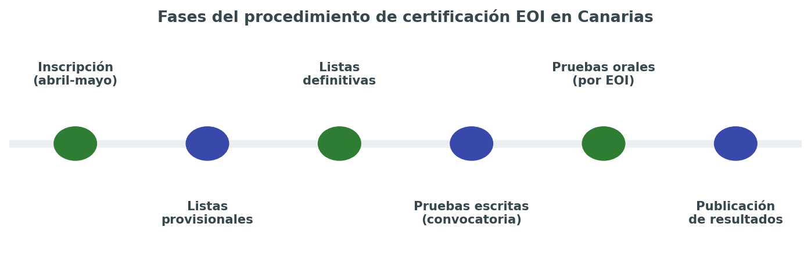

El procedimiento de certificación en Canarias sigue estas **fases** cada curso:

1. **Inscripción** de aspirantes libres y escolarizados de B1, B2, C1 y C2: finales de abril / mediados de mayo.
2. **Publicación de listas provisionales** de admitidos, con posibilidad de subsanar errores.
3. **Publicación de listas definitivas** de admitidos, ya con el centro donde se realiza el examen.
4. **Pruebas escritas**: sesión única y común para todos los aspirantes del mismo idioma y nivel, dentro de la convocatoria ordinaria (finales de mayo / mediados de junio).
5. **Pruebas orales**: organizadas por cada EOI en fechas y turnos propios, dentro del mismo periodo de convocatoria.
6. **Publicación de resultados** y, en su caso, apertura del plazo de reclamaciones, , en la web de la Consejería y/o del centro examinador.
7. **Plazo de vista de exámenes y reclamaciones**: quienes no superan la prueba, o quieren revisar su calificación, pueden solicitar ver su examen corregido dentro de un plazo determinado por la convocatoria.
8. **Reclamación formal**: si tras la revisión se considera que la corrección no se ajusta a los criterios, existe un procedimiento de reclamación ante la propia EOI o la Consejería, con plazos y forma establecidos en cada convocatoria.
9. **Expedición del certificado**: para quienes obtienen "Apto", el certificado se tramita después según los plazos administrativos habituales, que pueden tardar varios meses.
10. **Convocatoria extraordinaria**: para quienes no se presenten o no superen la ordinaria, normalmente a principios de septiembre.

**ASPIRANTES**

| | **Aspirante libre** | **Aspirante escolarizado** |
|---|---|---|
| Requisito previo | Ninguno, solo inscripción en plazo | Estar matriculado y cursando ese nivel en una EOI |
| Coste | Tasa de examen (modelo 700) | Incluido en la matrícula del curso |
| Preparación | Autónoma (esta guía, academias, autoestudio) | Clases regulares + trabajo autónomo |
| Convocatorias por curso | Ordinaria y, si procede, extraordinaria | Ordinaria y, si procede, extraordinaria |
| Ventaja principal | Flexibilidad total de horarios y ritmo | Seguimiento docente, feedback constante, simulacros guiados |
| Riesgo principal | Falta de feedback sobre el propio nivel real | Ritmo marcado por el grupo, menos margen de personalización |

### Consejos

!!! note "Consejos"
      1. **Una plantilla de seguimiento**, pero útil para no perder de vista el progreso real (se puede llevar en una hoja de cálculo aparte o directamente en un cuaderno):
      2. **Estudiar solo gramática y descuidar el vocabulario activo.** El examen premia la variedad léxica tanto como la corrección gramatical.
      3. **Practicar exámenes sin cronómetro.** La gestión del tiempo es en sí misma una competencia que se evalúa indirectamente.
      4. **No leer nunca los criterios de corrección oficiales (rúbricas).** Saber cómo puntúa el corrector cambia por completo la forma de redactar y de hablar.
      5. **Ignorar la mediación por pensar que "no es un tiempo verbal".** Es una de las cinco partes y pesa exactamente igual que las demás.
      6. **Memorizar redacciones enteras.** Los correctores detectan fácilmente los textos aprendidos de memoria y no encajan con el enunciado real.
      7. **El examen no premia la perfección**, premia superar un umbral concreto (cada parte ≥5/10 y media ≥6,5/10). Apuntar a la perfección en todo genera ansiedad innecesaria; apuntar al umbral con margen es más eficaz.
      8. **Es mejor un texto correcto y algo simple que uno ambicioso y lleno de errores.** Sobre todo en B1 y B2, la corrección pesa más que la sofisticación.
      9. **La constancia corta y frecuente vence al estudio intensivo y esporádico.** 30-45 minutos diarios de exposición al idioma rinden más que una sesión de tres horas el fin de semana.
      10. **Equivocarse practicando es gratis; equivocarse el día del examen, no.** Cuantos más simulacros en condiciones reales (tiempo cronometrado, sin diccionario), menos sorpresas el día de la prueba.

!!! question "Preguntas frecuentes"
    1. **¿Puedo presentarme directamente a B2 sin haber certificado B1?**
    Sí. Como aspirante libre no es obligatorio certificar los niveles anteriores; cada convocatoria se solicita de forma independiente. Lo importante es tener realmente el nivel, no el papel previo.
    2. **¿Si suspendo una parte, tengo que repetir todo el examen?**
    Depende de la normativa autonómica vigente cada curso: en algunas convocatorias se guardan las partes superadas para la convocatoria extraordinaria del mismo curso académico, pero no de un curso a otro. Hay que confirmarlo en la guía del aspirante de la convocatoria en la que me presento.
    3. **¿La prueba oral es el mismo día que la escrita?**
    No necesariamente. La prueba escrita es en sesión única para todos los aspirantes de un idioma y nivel; la prueba oral la organiza cada EOI en fechas y turnos propios dentro del periodo de convocatoria.
    4. **¿Qué pasa si llego tarde?**
    Cada convocatoria fija una hora límite de acceso al aula, pasada la cual no se permite la entrada. Conviene llegar siempre con margen (ver checklist en `06-plan-de-estudio.md`).
    5. **¿Necesito preparar mediación aunque no la haya estudiado nunca?**
    Sí, es obligatoria en B1, B2, C1 y C2. Se explica en detalle en `03-comprension.md` (mediación receptiva) y `05-expresion-oral.md` (mediación oral).

## 📑 Examen
El examen de certificación se organiza siempre en torno a **cinco actividades**, un error muy común es **practicar sin cronómetro**: hacerlo así da una falsa sensación de control, porque en casa siempre hay más margen mental que en el aula de examen. Desde la segunda semana de preparación conviene cronometrar todas las tareas de comprensión y producción.

> Los detalles exactos de cada convocatoria (duración en minutos, número de tareas) se confirman siempre en la **Guía para los aspirantes** del curso vigente, ya que pueden variar ligeramente de una convocatoria a otra.

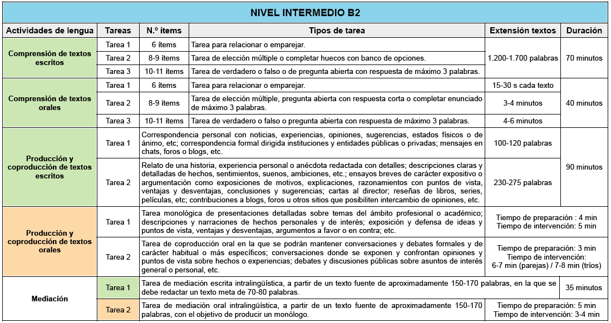

El examen se administra en **dos sesiones distintas**, pero cuenta como una sola prueba a efectos de calificación:

1. **Sesión escrita (única y común)** Se realiza el mismo día para todos los aspirantes del mismo idioma y nivel, normalmente en un centro examinador designado. En esta sesión se evalúan de forma conjunta:
      - Comprensión de textos escritos (CTE)
      - Comprensión de textos orales (CTO) — el audio se reproduce en el aula para todos a la vez
      - Producción y coproducción de textos escritos (PCTE)
      - Mediación escrita (MED)
      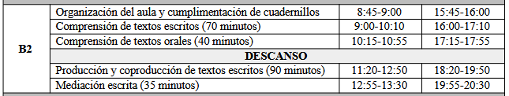

2. **Sesión oral (por EOI y turno)** Cada Escuela Oficial de Idiomas organiza sus propios turnos y horarios dentro del periodo fijado por la convocatoria (finales de mayo y mediados de junio). Suele constar de un tiempo de **preparación previa** (lectura de las tarjetas/enunciados de la tarea) antes de entrar al aula, seguido de la intervención ante el tribunal. En esta sesión se evalúan:
      - Producción y coproducción de textos orales (EIO): monólogo + interacción
      - Mediación oral (parte de MED)

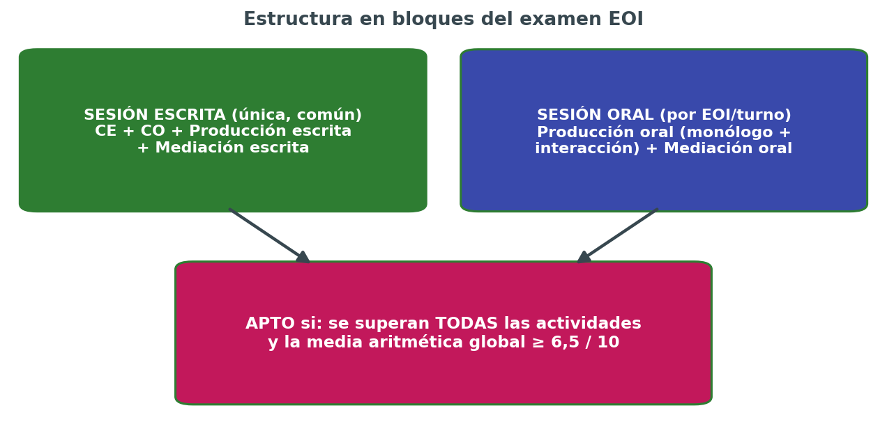

### Certificación
La producción escrita y la producción oral se usan **rúbricas oficiales** publicadas como apéndices de cada convocatoria (**apéndices V-VIII**). Practicar con estas rúbricas delante, en lugar de solo "escribir y ya está", es una de las formas más eficaces de mejorar la nota rápidamente, porque permite auto-corregirse con los mismos criterios que usará el tribunal. Criterios:

- **Adecuación a la tarea**: ¿responde a lo que se pedía, con la extensión y el formato correctos?
- **Coherencia y cohesión**: ¿las ideas están bien organizadas y conectadas?
- **Corrección gramatical**: ¿los errores son puntuales o sistemáticos, y afectan a la comprensión?
- **Riqueza léxica**: ¿el vocabulario es variado y apropiado para el nivel, o repetitivo y básico?
- **Registro**: ¿el tono (formal/informal) encaja con la tarea y el destinatario?

Para obtener el certificado, la normativa exige **dos condiciones simultáneas**:

1. **Superar cada una de las cinco actividades de lengua por separado**, con una puntuación mínima de **5 sobre 10** en cada una.
2. **Obtener una media aritmética global de, al menos, 6,5 sobre 10** entre las cinco actividades.

Si **cualquiera** de las dos condiciones falla —aunque sea una sola actividad por debajo de 5, o una media global de 6,4— el resultado es **"No apto"**, con independencia de lo bien que hayan ido el resto de partes. Esto tiene una implicación práctica muy importante: **no se puede "compensar" una actividad floja apoyándose solo en las demás**; hay que llegar mínimamente preparado/a a las cinco.

### Consejos

!!! note "Consejos"
      1. **5 actividades**: Sesión escrita única (CTE + CTO + PCTE + mediación escrita) y sesión oral por EOI (PCTO + mediación oral).
      2. Hay que superar **cada actividad con ≥5/10** y obtener una **media global ≥6,5/10**.
      3. Las **rúbricas oficiales son públicas**: usarlas para autoevaluarse durante la preparación, no solo el día del examen.
      4. Dentro de cada actividad hay varias tareas: no hay que bloquearse en una sola pregunta difícil.
      5. Siempre conviene confirmar duraciones y nº de tareas exactas en la Guía del aspirante de la convocatoria vigente.
      6. El examen se corrige con rúbricas públicas: descargarlas y estudiarlas es tan rentable como estudiar gramática
      7. **No leer las instrucciones de cada tarea antes de empezar a responder.** El formato de respuesta (número de palabras, formato de carta/email, uso de mayúsculas en el título) forma parte de la nota de "adecuación a la tarea".
      8. **Dedicar demasiado tiempo a una sola parte de la comprensión escrita** y quedarse sin tiempo para las últimas tareas, normalmente las de mayor dificultad.
      9. **Olvidar la mediación por practicar solo comprensión y producción "puras".** Una mediación floja puede arrastrar la media por debajo de 6,5 aunque el resto vaya bien.
      10. **No practicar en las condiciones reales del examen** ( con cronómetro, escribiendo a mano si el examen es en papel).

!!! example "Ejemplos de tareas reales por actividad"
      **CTE — B2:** leer un artículo de opinión sobre teletrabajo y responder preguntas de opción múltiple sobre la postura del autor.

      **CTE — C1:** leer un fragmento literario o un ensayo y responder preguntas sobre matices, ironía o intención del autor que no están dichos de forma explícita.

      **CTO — B2:** escuchar una entrevista de radio y decidir si varias afirmaciones son verdaderas, falsas o no se mencionan.

      **CTO — C1:** escuchar un fragmento de un debate con varios interlocutores y determinar de qué postura es partidario cada uno, incluyendo matices e ironías.

      **PCTE — B2:** escribir un artículo de opinión para el blog del centro sobre las ventajas y desventajas de las redes sociales (150-200 palabras).

      **PCTE — C1:** escribir un informe formal dirigido a un ayuntamiento proponiendo mejoras para el transporte público, con datos y argumentos (200-250 palabras).

      **PCTO — B2:** defender una opinión sobre un tema de actualidad y responder a las objeciones del examinador.

      **PCTO — C1:** debatir sobre un dilema ético o social con matices, cediendo y rebatiendo argumentos con fluidez.

      **Mediación — B2:** resumir por escrito, para un lector que no tiene tiempo de leer el original, las ideas principales de un artículo de dos páginas.

      **Mediación — C1:** explicar a alguien con una postura contraria los puntos clave de un texto polémico, manteniendo un tono neutral y matizado.

!!! failure "Errores puede penalizar de forma muy distinta según el nivel del examen"
      | Tipo de "fallo" | En B2 | En C1 |
      |---|---|---|
      | Frases cortas y simples  | Empieza a penalizar por falta de variedad | Penaliza claramente: se espera subordinación y matices |
      | Vocabulario básico repetido  | Penaliza moderadamente | Penaliza con fuerza: se espera precisión léxica |
      | Error puntual de tiempo verbal  | Penaliza more, se espera dominio | Penaliza mucho: se presupone automatismo total |
      | Registro inadecuado (informal en tarea formal)  | Penaliza de forma notable | Penaliza fuerte: el control del registro es central en C1 |
      | Uso de conectores simples (and, but, so)  | Insuficiente si es lo único que se usa | Insuficiente: se esperan conectores variados y precisos |

## 💠 SESIÓN ESCRITA

### 01 📑 CTE (Reading) T3

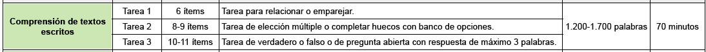

!!! abstract "ESTRATEGIA"
      1. **Lectura rápida global** leer el texto completo en 1-2 minutos sin detenerse en palabras desconocidas, solo para entender de qué trata y cuál es su estructura (introducción, argumentos, conclusión).
      2. **Leer las preguntas antes de buscar respuestas** esto permite saber exactamente qué información hay que localizar, en lugar de releer el texto entero para cada pregunta.
      3. **Scan (búsqueda de información concreta)** una vez sabidas las preguntas, volver al texto buscando palabras clave, sinónimos o cifras relacionadas con cada pregunta, sin leer todo de nuevo. Buscar sinónimos, si la pregunta dice "disadvantage" y el texto dice "one of the main drawbacks", hay que reconocer que son sinónimos —los exámenes rara vez repiten la palabra exacta de la pregunta en el texto.
      4. **Comparar las opciones con la frase exacta del texto**, descartando las que añaden matices que el texto no dice (por ejemplo, si el texto habla de "reduced social contact" y una opción dice "makes people depressed", es una generalización no respaldada por el texto).
      5. **Check (verificación final):** releer solo la frase o el párrafo exacto donde está la respuesta para confirmar que encaja con lo que pide la pregunta, no solo con una palabra suelta que coincide por casualidad. Revisar las repuestas que no repitas palabras en las opciones de las tareas.

!!! note "Consejos: Trampas típicas de las preguntas de opción múltiple"
    1. **Distractor por palabra literal:** una opción repite una palabra del texto pero cambia el sentido de la frase. Leer siempre la frase completa, no solo buscar la palabra.
    2. **Distractor por negación:** el texto dice "not always" y la opción incorrecta dice "always" (o al revés). Prestar atención especial a negaciones, adverbios de frecuencia y matizadores (*mainly, partly, rarely*).
    3. **Distractor por generalización excesiva:** el texto menciona un caso concreto y la opción lo presenta como una regla general (o al revés).
    4. **Opción "casi correcta pero incompleta":** cubre parte de la idea del texto pero no toda, mientras que otra opción sí es completa.

### 02 📑 CTO (Listening) T2
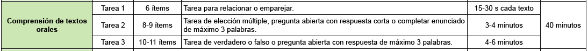

| Tipo de tarea | En qué consiste | Consejo específico |
|---|---|---|
| Task 1| **1. Multiple matching** Relacionar varios hablantes con varias afirmaciones | Escuchar hasta el final antes de decidir: la respuesta correcta a veces se confirma solo al final del turno de cada hablante |
| Task 2 | **2. Note/sentence completion** Completar huecos con la palabra exacta que se oye <br>**2. Multiple choice**Elegir la opción correcta entre 3-4| - Prestar atención a la gramática del hueco (singular/plural, tiempo verbal) para no escribir una palabra que no encaja <br> - Las opciones incorrectas suelen mencionarse en el audio pero con una palabra que cambia el sentido (no, actually, but)|
| Task 3 | **3. True/False/Not mentioned** Decidir si una afirmación es verdadera, falsa o no aparece | No dar por falso algo que simplemente no se menciona: son categorías distintas |

!!! abstract "ESTRATEGIA"
      - **ANTES** de escuchar
          1. **Leer las preguntas con antelación**, durante el tiempo que se da antes de cada audio. Esto permite anticipar qué tipo de información hay que captar (un nombre, una cifra, una opinión) y "escuchar con un propósito" en lugar de escuchar pasivamente.
          2. **Subrayar palabras clave de las preguntas** (nombres, fechas, lugares) para reconocerlas rápidamente cuando aparezcan en el audio.
          3. **Predecir el contexto** a partir del título o la introducción de la tarea: ¿es una conversación informal, una entrevista, una noticia?
      - **DURANTE** la escucha
          1. **No bloquearse en una palabra que no se entiende.** Es preferible seguir escuchando y perder esa palabra que quedarse pensando en ella y perderse las tres frases siguientes.
          2. **Aprovechar la segunda escucha** (cuando la haya) para confirmar respuestas dudosas, no para escuchar todo desde cero sin criterio.
          3. **Tomar notas breves** (palabras sueltas, no frases completas) según se escucha, para no depender solo de la memoria.
              - Usar flechas para relaciones causa-efecto: **rain → traffic jam**
              - Abreviar palabras largas: **govt** (government), **info** (information), **approx** (approximately)
              - Anotar solo números, nombres propios y palabras clave, nunca frases completas.
              - Marcar con un signo de interrogación (**?**) las respuestas dudosas, para revisarlas en la segunda escucha en vez de perder tiempo decidiendo en el momento.

!!! note "CONSEJOS"
    1. **Practicar con material auténtico, no solo con exámenes de academia.** Noticias, podcasts, series con subtítulos en inglés, artículos de prensa británica o estadounidense.
    2. **No traducir mentalmente palabra por palabra.** Cuanto más se traduce internamente, más lento es el procesamiento y más se pierde por el camino. El objetivo es entender directamente en inglés.
    3. **Aceptar la ambigüedad tolerable.** No hace falta entender el 100% de las palabras para responder bien: el objetivo es entender lo suficiente para la tarea concreta.
    4. **Cronometrar siempre la práctica.** La gestión del tiempo en comprensión es tan entrenable como el propio idioma.
    5.  **Identificar los tipos de distractor** más habituales en preguntas de opción múltiple. (negaciones, generalizaciones y sinónimos parciales)
    6.  Leer preguntas antes de escuchar, tomar notas breves, aprovechar bien la segunda escucha.

!!! failure "ERRORES"
    1. **Dejar preguntas en blanco por quedarse "atascado" en una sola tarea difícil**, en lugar de seguir avanzando y volver después si queda tiempo.
    2. **Fiarse de la memoria en el listening sin tomar ninguna nota**, sobre todo en tareas con varios datos concretos (fechas, cifras, nombres).
    3. **Responder según conocimiento previo del tema en vez de según el texto/audio**, especialmente en preguntas tipo "According to the speaker...".
    4. **Ignorar la instrucción sobre el límite de palabras** en tareas de completar huecos, lo que puede anular una respuesta correcta por motivos de formato.

**ACENTOS**

Los audios pueden incluir **acentos no estándar**. Conviene practicar con fuentes variadas para no llevarse una sorpresa el día del examen.

| Acento/variedad | Dónde practicarlo |
|---|---|
| Británico estándar (RP) | BBC News, BBC Learning English |
| Británico regional (escocés, del norte de Inglaterra) | Series de la BBC ambientadas fuera de Londres |
| Americano general | NPR, podcasts de noticias de EE. UU. |
| Australiano/neozelandés | Podcasts de ABC Australia |
| Hablantes no nativos con acento marcado | TED Talks de ponentes de distintos países |

### 03 📑 PCTE (Writing) T2
Escribir bien en el examen no es solo "no cometer errores": es **responder exactamente a lo que pide la tarea**, con la estructura, el registro y la extensión adecuados, usando un lenguaje variado y bien conectado. 

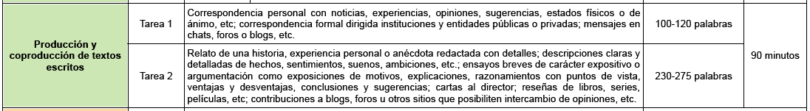

**ESTARTEGIA**

1. **Leer el enunciado dos veces** y subrayar: tipo de texto, destinatario, propósito, puntos que hay que incluir obligatoriamente, número de palabras.
2. **Planificar 3-5 minutos** antes de escribir: esquema con las ideas principales de cada párrafo, en un margen o borrador. Escribir sin plan es la causa número uno de textos desordenados. Saltarse la fase de planificación para "ganar tiempo" casi siempre sale caro: los textos improvisados tienden a repetir ideas, a desviarse del tema o a quedarse cortos de conclusión.
3. **Redactar** siguiendo el esquema, controlando el tiempo restante para no quedarse sin terminar la conclusión.
4. **Revisar 3-5 minutos al final**: concordancia verbal, ortografía, conectores, y que se cumple el número de palabras pedido (ni muy por debajo ni muy por encima, un ±10% suele ser el margen razonable).

!!! info "Actualmente quiero mirar numero de frases que más o menos cubren las palabras que hay que escribir para cuando este organizando la idea mirar que estructura grámatical meter tambien en las frases."


**CONECTORES**

| Función | Conectores | Ejemplo |
|---|---|---|
| Añadir | **moreover, furthermore, in addition, besides** | The hotel was expensive. Moreover, the service was poor. |
| Contrastar | **however, although, whereas, despite, nevertheless** | Although it was raining, we went out. |
| Causa | **since, as, due to, owing to** | The flight was delayed due to bad weather. |
| Consecuencia | **therefore, as a result, consequently** | She missed the train. As a result, she was late. |
| Ejemplificar | **for instance, such as, namely** | Some sports, such as football, are very popular. |
| Secuenciar | **firstly, subsequently, eventually, finally** | Firstly, we need to assess the situation. |
| Concluir | **in conclusion, to sum up, overall, all in all** | To sum up, the benefits outweigh the drawbacks. |

### Email / carta

| Parte | Informal (a un amigo o familiar)| Formal (a una empresa, institución o desconocido)|
|---|---||
| Saludo | Hi Anna, / Dear John, | Dear Sir/Madam, / Dear Mr Smith,|
| Apertura | How are you? / Thanks for your last email. <br> I hope you're doing well. | I am writing to enquire about... <br> I am writing with regard to...|
| Cuerpo<br> (1-2 parr) | Lenguaje coloquial, contracciones (I'm, don't, can't), frases cortas | Sin contracciones, vocabulario preciso, tono neutro y respetuoso|
| Cierre | Write back soon! <br> Can't wait to hear from you. |  I look forward to hearing from you. <br> Please do not hesitate to contact me. |
| Despedida | Best, / Take care, / Love, | Yours faithfully, (si no se sabe el nombre) <br> Yours sincerely, (si se sabe el nombre)|

> **Error típico:** mezclar registro formal e informal en el mismo texto (empezar con "Dear Sir/Madam" y despedirse con "Bye!"). El registro debe ser coherente de principio a fin.

**Por nivel:** en B2 se espera cierta elaboración argumentativa (quejas, sugerencias); en C1 se valora la precisión del registro y el uso de fórmulas menos comunes (**I would be most grateful if**..., **Should you require further information**...).

### Composition (opinión)
La estructura clásica de cuatro bloques es la más segura para el examen:

1. **Introduction:** presentar el tema de forma general (parafraseando el título, no copiándolo literalmente) y anunciar la postura o los puntos que se van a tratar.
2. **Body paragraph 1:** una idea principal, desarrollada con un argumento y un ejemplo concreto.
3. **Body paragraph 2:** una segunda idea (a favor, en contra, o un matiz distinto), con su propio argumento y ejemplo.
4. **Conclusion:** resumir brevemente sin repetir literalmente lo ya dicho, y cerrar con una opinión personal clara o una recomendación.

!!! success "FRASES ÚTILES para cada bloque"
      1. **Introducir el tema:** *Nowadays, it is often said that... / One of the most debated issues today is...*
      2. **Dar la propia opinión:** *In my view, / As far as I am concerned, / I would argue that...*
      3. **Introducir un argumento a favor:** *One of the main advantages is that... / A strong argument in favour of this is...*
      4. **Introducir un argumento en contra:** *On the other hand, some people believe that... / However, it could be argued that...*
      5. **Concluir:** *All things considered, / To sum up, / Taking everything into account,...*

**Por nivel:** en B2 se espera contraargumentación explícita (reconocer el punto de vista contrario antes de rebatirlo); en C1 se valora una postura matizada, no binaria, con concesiones parciales ("While it is true that..., it is also important to consider...").

### Informe (report)
Un informe se diferencia claramente de un ensayo en el formato: usa **títulos y subtítulos**, no un texto corrido, y un tono objetivo, casi siempre en tercera persona o en voz pasiva.

**Estructura habitual:**

- **Introduction:** propósito del informe y a quién va dirigido.
- **Findings / Current situation:** datos y observaciones, organizados por subtítulos temáticos.
- **Recommendations:** sugerencias concretas y accionables, normalmente en forma de lista.
- **Conclusion:** resumen breve de la recomendación principal.

!!! success "FRASES ÚTILES para cada bloque"
      - **The aim of this report is to...**
      - **Findings show that...**
      - **It is recommended that...**
      - **Overall, it would be advisable to...**

**Error típico:** escribir un informe como si fuera un ensayo, sin subtítulos ni estructura visual, lo que penaliza directamente en el criterio de "adecuación a la tarea".

### Reseña (review)
Combina descripción objetiva y opinión personal sobre un libro, película, restaurante, producto o evento.

**Estructura habitual:**

1. Breve introducción de qué se reseña (título, tipo, contexto).
2. Descripción de los aspectos principales (trama, ambiente, calidad).
3. Valoración personal, con argumentos concretos, no solo "I liked it".
4. Recomendación final: ¿a quién le gustaría y por qué?

!!! success "FRASES ÚTILES para cada bloque"
      - **What struck me most was...**
      - **I would highly recommend...** 
      - **Overall, it falls short of expectations because..**

### Complaint letter
**Carta de reclamación**, muy habitual en B2 y C1. Combina el formato de carta formal con un tono firme pero educado, nunca agresivo.

**Estructura:**

1. Explicar el motivo de la reclamación con hechos concretos (fechas, productos, servicios).
2. Detallar el problema con precisión, sin exagerar ni victimizarse en exceso.
3. Indicar claramente qué solución se espera (reembolso, sustitución, disculpa).
4. Cerrar con una fórmula que deje constancia de que se espera respuesta en un plazo razonable.

!!! success "FRASES ÚTILES para cada bloque"
      - **I am writing to express my dissatisfaction with...**
      - **To make matters worse,...**
      - **I trust you will resolve this matter promptly.**

**Error típico:** escribir con un tono demasiado agresivo o coloquial ("This is ridiculous!!!"), lo que penaliza en el criterio de registro incluso si el contenido es correcto.

### Consejos

!!! abstract "Rubricas B2"
      1. **COMPETENCIA LÉXICA**
         1. Utiliza un vocabulario amplio y evita la repetición mediante reformulaciones.
         2. Su precisión léxica es generalmente alta, aunque tenga alguna confusión o cometa alguna incorrección al seleccionar las palabras, sin que afecte a la comunicación.
      2. **COMPETENCIA GRAMATICAL**
         1. Utiliza diversas estructuras simples, con un alto grado de control, y algunas estructuras más complejas.
         2. Comete errores solo al utilizar estructuras más complejas, pero sin que afecte a la comunicación.
      3. **COMPETENCIA DISCURSIVA Y ORGANIZATA**
         1. Produce un texto organizado y coherente usando diversos mecanismos de cohesión.
         2. Puntúa y usa la ortografía de manera correcta, aunque puede evidenciarse cierta influencia de otra lenguas. En textos largos, distribuye las ideas en párrafos lógicos y claros.
      4. **ADECUACIÓN DE LA TAREA**
         1. Se expresa con educación y elige el registro adecuado. Para ello utiliza expresiones lingüísticas apropiadas para el contexto. Se ajusta a la tipología textual propuesta.
         2. Desarrolla las ideas principales con detalle y de manera inteligible, aportando contenido relevante y ejemplificando, si es necesario, para la tarea propuesta.

!!! note "CONSEJOS"
      1. En la fase de planificación, **elegir de antemano** 4-5 conectores distintos que se van a usar en el texto, para forzarse a variar en lugar de caer siempre en los mismos por defecto bajo presión de tiempo.
      2. Escribir muy por debajo del mínimo penaliza por "desarrollo insuficiente del contenido"; escribir muy por encima del máximo penaliza por "falta de concisión" y, en exámenes con tiempo limitado, resta minutos a la revisión final. **Practicar el cálculo** aproximado de palabras a ojo (contando líneas y palabras medias por línea) ayuda a no tener que contar palabra por palabra en el examen.

!!! question "PREGUNTAS"
      1. **¿Puedo usar contracciones (I'm, don't) en un texto formal?**
      No. En textos formales se evitan las contracciones; en informales son recomendables porque dan naturalidad.
      2. **¿Cuenta el título como parte de las palabras del texto?**
      Depende de la convocatoria, pero por precaución conviene no incluir un título largo y centrar el recuento en el cuerpo del texto, siguiendo el formato exacto que pida el enunciado.
      3. **¿Está permitido tachar y corregir a mano si el examen es en papel?**
      Sí, tachar de forma clara y ordenada es preferible a dejar un error sin corregir; los correctores valoran la legibilidad, no la ausencia total de tachones.
      4. **¿Qué hago si me quedo sin tiempo para terminar la conclusión?**
      Siempre es mejor una conclusión de una frase, aunque breve, que dejar el texto sin cerrar: un texto sin conclusión se penaliza claramente en el criterio de adecuación a la tarea.

!!! failure "ERRORES"
      1. **No responder a todos los puntos del enunciado.** Si la tarea pide tratar tres aspectos y solo se desarrollan dos, se penaliza en "adecuación a la tarea" aunque el inglés sea impecable.
      2. **Registro inconsistente** dentro del mismo texto (mezclar formal e informal).
      3. **Repetir las mismas palabras y conectores** una y otra vez en lugar de variar el vocabulario.
      4. **Errores sistemáticos de concordancia** (sujeto-verbo, singular-plural) que se repiten varias veces en el texto.
      5. **No dejar tiempo para revisar.** Muchos errores tontos (falta de -s, mayúsculas olvidadas, errores de ortografía básicos) se detectan solo con una relectura atenta.

###  04 📑 ME (Mediación escrita)
La mediación evalúa la capacidad de **actuar como puente entre un texto (o una persona) y otra persona que no tiene acceso directo a ese texto o a ese idioma**. No es traducción literal palabra por palabra: es selección, síntesis y adaptación de la información relevante.

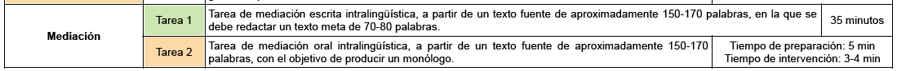

!!! success "Sinónimos para "subir de nivel" un texto"
      * good → **beneficial, advantageous, valuable, effective**
      * bad → **detrimental, harmful, problematic, counterproductive**
      * big → **significant, substantial, considerable**
      * important → **crucial, essential, fundamental, paramount**
      * a lot of → **numerous, a considerable number of, a wide range of**
      * think → **believe, argue, maintain, contend**
      * show → **demonstrate, reveal, indicate, highlight**
      * get → **obtain, acquire, achieve**

!!! success "Plantilla de planificación rápida (para usar en el examen)"
      ```
      Tipo de texto: ___________
      Destinatario/registro: ___________
      Puntos obligatorios a incluir: 1) ___ 2) ___ 3) ___
      Conectores que voy a usar: ___________
      Palabras objetivo: ___________
      ```

**EJEMPLOS**

!!! example "*"Some people think social media has more disadvantages than advantages. Discuss both views and give your opinion." (150-200 words)*"
      Nowadays, social media platforms are part of almost everyone's daily routine. **(introducción parafraseando el tema, sin copiar el título literalmente)** While some people argue that they cause more harm than good, others believe their benefits outweigh the risks. In this essay, I will discuss both perspectives before giving my own opinion.
      
      On the one hand, social media can have a negative impact on mental health. **(conector de contraste + idea 1)** Constant exposure to curated images of other people's lives, for instance, often leads to feelings of inadequacy and anxiety. **(ejemplificación con "for instance")** Furthermore, the amount of time spent online can reduce face-to-face interaction with family and friends. **(conector de adición)**
      
      On the other hand, social media also offers clear advantages. **(conector de contraste + idea 2)** It allows people to stay connected with relatives who live far away, and it has become an essential tool for small businesses to reach new customers. **(dos argumentos concretos, no vagos)**
      
      In my view, the key issue is not social media itself, but how it is used. **(matiz, no postura binaria — típico de B2 alto)** Used in moderation, it can be a valuable tool rather than a source of harm.

**Por qué funciona:** responde exactamente a lo pedido (discutir ambas posturas + opinión propia), usa conectores variados, incluye ejemplos concretos en lugar de generalidades, y cierra con un matiz personal en vez de una conclusión genérica repetida.

!!! example "Mediación receptiva resuelta"
      **Tarea:** un compañero de trabajo, que no ha tenido tiempo de leer el correo, pregunta de qué trata un email largo sobre un cambio de horario de reuniones. Hay que explicárselo oralmente en inglés en 30 segundos.

      **Mal enfoque (traducción literal de todo):** repetir frase por frase todo el contenido del email, incluidas fórmulas de cortesía y detalles irrelevantes, sin priorizar.

      **Buen enfoque (mediación real):** *"Basically, the Monday meeting has been moved to 10am instead of 9am, starting next week. Everything else stays the same."* — se selecciona solo la información accionable, se ignoran los saludos y las fórmulas de cortesía del email original, y se adapta a un registro oral breve y directo.

### Consejos
!!! note "CONSEJOS"
    1. **Planificar** 3-5 minutos antes de escribir, siempre.
    2. **Adecuación:** Responder a todos los puntos del enunciado, con el formato y el registro correctos 
    3. **Identificar qué información es relevante** para la persona destinataria del mensaje
    4. **Adaptación de registro:** si el destinatario es un amigo, tono cercano; si es un informe para un superior, tono formal.
    5. **Coherencia y cohesión:** ¿las ideas están bien organizadas en párrafos, con conectores variados?
    6. **Corrección gramatical:** ¿hay errores sistemáticos (no puntuales) que afecten a la comprensión?
    7. **Riqueza léxica y registro:** ¿el vocabulario es variado y el tono es coherente con la tarea?
    8. **Selección:** incluir solo la información relevante para la tarea, no todo el texto original.
    9. **Reformulación:** usar palabras propias, no copiar frases enteras del texto origen y controlar la extensión (±10% del rango pedido) y dejar tiempo para revisar.
   
!!! failure "ERRORES"
      1. **Traducir literalmente en vez de reformular.** La mediación no pide una traducción palabra por palabra, sino transmitir el sentido con las propias palabras.
      2. **Incluir toda la información del texto original**, incluso lo irrelevante para la tarea concreta, en lugar de seleccionar lo importante.
      3. **Olvidar el destinatario.** El registro y el nivel de detalle deben adaptarse a quién va a recibir la información (un amigo, un cliente, un compañero de trabajo).
      4. **No adaptar el formato pedido** (si se pide una nota breve y se entrega un párrafo largo, o al revés).

## 💠 SESIÓN ORAL
La prueba oral suele ser la que más nervios genera, precisamente porque no hay tiempo para "borrar y volver a empezar" como en Writing. Esta página se centra en cómo estructurar el monólogo, gestionar la interacción, resolver la mediación oral y controlar los nervios el día del examen.

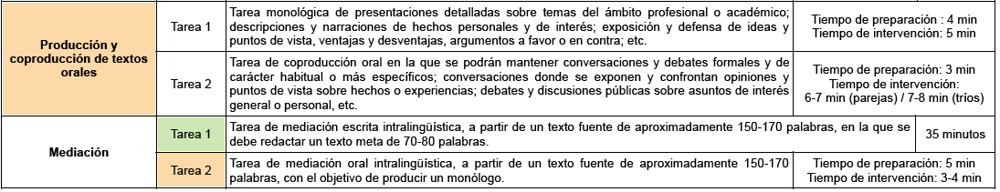

1. **Tiempo de preparación:** antes de entrar al aula se entregan las tarjetas con las tareas (monólogo e interacción); hay unos minutos para leerlas y tomar notas breves (nunca frases completas, solo palabras clave).
2. **Monólogo:** exposición individual sobre el tema asignado, con apoyo de una imagen, un gráfico o un guion de puntos, según el nivel.
3. **Interacción:** conversación con el examinador o con otro candidato sobre el mismo tema u otro relacionado, en forma de diálogo, debate o negociación simulada.
4. **Mediación oral:** transmitir información de un texto breve a un interlocutor que no tiene acceso a él, adaptando el registro y seleccionando lo relevante.

Durante el tiempo de **preparación** antes de entrar al aula (normalmente unos minutos, variable según la convocatoria y el nivel), es más eficaz anotar **palabras clave y conectores**, no frases completas. Escribir frases completas para leerlas después suena forzado y poco natural ante el tribunal; las palabras clave sirven de "andamiaje" mental sin caer en la lectura literal: 

!!! success "Plantilla de planificación rápida"
            Tema: ___________
            Idea 1: ___________ (ejemplo: ___________)
            Idea 2: ___________ (ejemplo: ___________)
            Vocabulario específico que quiero usar: ___________
            Conector de cierre: ___________
            
###  05 📑 PCTO (Speaking)

### Task 1 Monólogo
!!! tip "Preparar de memoria una **estructura fija reutilizable** para cualquier tema (no un contenido memorizado, sino un esqueleto)"

**ESTRUCTURA RECOMENDADA**

1. **Introducción breve:** presentar el tema con una frase general, sin lanzarse directamente al detalle.
2. **Desarrollo en 2-3 puntos:** cada uno con una idea clara y un ejemplo o justificación personal.
3. **Cierre:** una frase de conclusión o de opinión personal que dé sensación de cierre, no dejar la intervención "colgada".

Muchas tareas de monólogo parten de una fotografía o un gráfico. Un esqueleto útil y reutilizable:

1. **Describir lo que se ve, en general:** *The picture shows/depicts a group of people... In the foreground/background, there is/are...*
2. **Dar detalles concretos:** *On the left/right, I can see... What stands out to me is...*
3. **Especular sobre lo que no se ve directamente:** *It looks like they might be... / I imagine that...*
4. **Relacionarlo con la propia experiencia u opinión:** *This reminds me of... / Personally, I think this shows...*

> **Error típico:** limitarse a listar objetos ("There is a table. There is a chair. There is a window.") sin conectar las ideas ni aportar interpretación, lo que da una impresión de nivel más bajo del real.

!!! success "FRASES ÚTILES"
    * **To begin with, I'd like to talk about...** 
    * **One thing I find interesting/challenging about this is...** 
    * **Another point worth mentioning is...** 
    * **To sum up, I would say that..."**

### Task 2 Interacción
!!! tip "Practicar este formato con un compañero de estudio, y no solo en solitario, es la única forma real de entrenar esta dinámica antes del examen."

La interacción evalúa la capacidad de **mantener una conversación real con otro candidato**, no solo de responder preguntas aisladas: escuchar al interlocutor, reaccionar a lo que dice, y no limitarse a "monólogos alternos". En ese caso conviene tener presente:

- **Ceder turno de palabra de forma natural**, sin monopolizar toda la conversación ni quedarse en un rol pasivo.
- **Construir sobre lo que dice el otro candidato**, en lugar de ignorar su intervención y continuar con lo que se tenía preparado.
- **Llegar a algún tipo de conclusión o acuerdo conjunto**, si la tarea lo pide (por ejemplo, decidir juntos una opción entre varias).
- **Mantener un tono colaborativo**, incluso al mostrar desacuerdo, ya que también se evalúa la capacidad de interactuar de forma cortés y constructiva.

!!! success "FRASES ÚTILES"
    * Dar tu opinión → **I'd say that... / In my view... / From my point of view...**
    * Pedir la opinión de otro → **What do you think about...? / How do you see it?**
    * Estar de acuerdo → **That's a fair point. / I couldn't agree more. / Exactly.**
    * Estar en desacuerdo (con tacto) → **I see your point, but... / I'm not sure I fully agree, because...**
    * Ganar tiempo para pensar → **Well, let me think... / That's an interesting question... / It depends, actually...**
    * Pedir aclaración → **Sorry, could you repeat that? / What exactly do you mean by...?**
    * Cerrar el tema → **So, to sum up... / Overall, I think...**

###  06 📑MO (Mediación oral)
La mediación oral pide **transmitir información de un texto (leído previamente o escuchado) a un interlocutor que no tiene acceso a ese texto**, adaptando el registro y seleccionando lo relevante para la situación.

**ESTRUCTURA RECOMENDADA**

1. **Leer/escuchar el texto origen** con atención a los datos clave (quién, qué, cuándo, por qué).
2. **Decidir qué información es relevante** para la persona a la que se le va a explicar (no toda la información del texto es necesaria).
3. **Explicarlo oralmente con las propias palabras**, en un registro adaptado (más informal si es un amigo, más formal si es un contexto profesional).

!!! success "FRASES ÚTILES"
      - **Basically, what this is about is... / The main point is that...**
      - **According to the text, ... / It says here that...**
      - **To put it simply, ... / In other words, ...**
      - **The key thing you need to know is...**

!!! example "Some people say working from home is better than working in an office. What's your opinion?"
      **Candidato:** Well, that's an interesting question. **(fórmula para ganar tiempo)** In my view, it really depends on the type of job. **(matiz inicial, evita respuesta binaria)** On the one hand, working from home gives you more flexibility and saves commuting time. **(argumento 1 con conector de contraste)** On the other hand, I think face-to-face contact with colleagues is important for collaboration and creativity. **(argumento 2, contraargumento)**
      
      **Examinador:** Do you think this could change in the future?
      
      **Candidato:** That's a fair point. **(reacciona a la pregunta antes de responder)** I'd say hybrid models are probably the way forward, combining the best of both. **(responde de forma directa y personal, sin monosílabos)**

**Por qué funciona:** el candidato reacciona a cada intervención del examinador (no responde con frases preparadas de antemano desconectadas), usa fórmulas de transición naturales, y mantiene una postura matizada en lugar de una opinión extrema y cerrada.

## Rúbricas PCTO
- **En B2:** buscar un equilibrio: mostrar variedad de estructuras, pero sin sacrificar tanto la fluidez que la intervención se vuelva entrecortada.
- **En C1:** se espera fluidez y naturalidad simultáneamente con la complejidad; los silencios largos para "construir" una frase compleja penalizan más que en niveles inferiores.

| Criterio | Qué se evalúa |
|---|---|
| Fluidez | Ritmo natural, sin bloqueos largos ni excesivas muletillas |
| Interacción | Capacidad de reaccionar y construir la conversación con el interlocutor, no solo responder |
| Corrección gramatical | Precisión en tiempos verbales y estructuras, proporcional al nivel |
| Vocabulario | Variedad y precisión léxica, uso de expresiones idiomáticas cuando aplica (sobre todo en B2/C1) |
| Pronunciación | Claridad e inteligibilidad, aunque haya acento |
| Adecuación a la tarea | Responder realmente a lo que pedía la tarjeta/tarea, no desviarse del tema |

**PRONUNCIACIÓN** 

No tiene que ser "perfecta" ni imitar un acento nativo concreto, pero sí ser **clara e inteligible**. Los puntos que más suelen penalizar por interferencia del español:

- Confundir los sonidos /iː/ y /ɪ/ (*sheep* vs *ship*), que pueden cambiar el significado.
- Pronunciar la "h" muda en palabras como *hour* o *honest*, o al revés, no aspirar la "h" en palabras que sí la llevan (*house, happy*).
- Acentuar mal palabras largas, cambiando la sílaba tónica (*comfortable, photography*).
- Pronunciar la "-ed" del pasado siempre igual, cuando en realidad varía entre /t/, /d/ e /ɪd/ según el sonido anterior.

## Consejos speaking

!!! note "CONSEJOS"
    1. **Grabarse respondiendo a preguntas de modelos de examen**, cronometrado, y volver a escuchar la grabación con la rúbrica delante.
    2. **Hablar en voz alta describiendo el entorno** (una foto, una habitación, una noticia leída) durante 2-3 minutos, como entrenamiento de fluidez.
    3. **Practicar "shadowing"**: repetir en voz alta, casi en simultáneo, lo que dice un locutor de un podcast o vídeo, para mejorar ritmo y entonación.
    4. **Buscar un compañero de intercambio de idiomas** (presencial o por videollamada) para practicar la interacción real, que es más difícil de simular en solitario.
    5. **Practicar** 10-15 minutos de speaking varias veces por semana, aunque sea en solitario, es más rentable que una sesión larga y aislada una vez cada dos semanas.
    6. **Estructura fija reutilizable** para el monólogo: introducción, 2-3 puntos con ejemplos, cierre. Conocer de memoria al menos 5-6 frases de interacción (opinar, **ganar tiempo**, mostrar desacuerdo).
    7. **En la interacción, reaccionar de verdad** al interlocutor, no soltar un discurso preparado.
    8. **En la mediación oral, reformular con palabras propias**, nunca repetir de memoria el texto original.
    9. **Practicar en voz alta y grabarse** es más efectivo que solo "pensar" en inglés.
    10. **No traducir mentalmente del español.** Pensar directamente en estructuras en inglés, aunque sean simples, es más rápido y más natural que construir la frase en español y traducirla sobre la marcha.

!!! failure "ERRORES"
    1. **Error típico:** intentar recordar y repetir el texto original palabra por palabra, en lugar de reformular con naturalidad. La mediación premia la claridad de la comunicación, no la memoria literal.
    2. **Responder con monosílabos** ("Yes" / "No" / "I don't know") sin desarrollar, lo que corta la conversación y limita la evaluación.
    3. **No reaccionar a lo que dice el interlocutor**, limitándose a decir lo que se había preparado de antemano sin escuchar de verdad.
    4. **Interrumpir de forma brusca** en lugar de usar fórmulas de transición ("Sorry to interrupt, but...").
    5. **Evitar el desacuerdo por completo** por miedo, cuando mostrar una opinión propia matizada, incluso en desacuerdo, suele valorarse más que la sumisión constante.
    6. **Memorizar respuestas enteras** en lugar de estructuras reutilizables: los examinadores detectan fácilmente un discurso aprendido de memoria que no encaja con la pregunta real.
    7. **Hablar solo cuando se pregunta directamente**, sin aportar nada extra en la interacción, lo que da una impresión de pasividad.
    8. **No mirar al examinador** y hablar mirando las notas todo el tiempo, lo que también afecta a la naturalidad percibida.
    9. **Corregirse a uno mismo de forma excesiva**, deteniéndose constantemente a reformular cada frase, lo que rompe la fluidez más que un error puntual sin corregir.

!!! question "PREGUNTAS"
      1. **¿Me penaliza tener acento español al hablar inglés?**
      No. El acento en sí no se penaliza; lo que se evalúa es la inteligibilidad. Un acento marcado pero perfectamente comprensible no resta puntos por sí mismo.
      2. **¿Qué pasa si no entiendo una pregunta del examinador?**
      Es perfectamente aceptable, y recomendable, pedir que la repita o la reformule (*Sorry, could you say that again?* / *Do you mean...?*), en lugar de responder algo que no tiene relación con la pregunta.
      3. **¿Puedo llevar notas escritas a la parte de interacción?**
      Generalmente solo se permite usar las notas tomadas durante el tiempo de preparación para el monólogo, no durante la interacción en sí, que debe ser espontánea. Conviene confirmarlo en la guía del aspirante de la convocatoria.
      4. **¿Es mejor hablar rápido para parecer más fluido?**
      No necesariamente. Un ritmo natural con pausas breves bien gestionadas transmite más control del idioma que hablar muy rápido cometiendo errores por las prisas.
      5. **¿Puedo pedir repetir la pregunta más de una vez?**
      Sí, aunque hacerlo de forma excesiva puede transmitir inseguridad. Si ocurre varias veces, puede ser señal de que conviene reforzar la comprensión oral antes del examen.

## 🗓️ Recursos

**Error común:** dedicar casi todo el tiempo a gramática y vocabulario (lo más "cómodo" de estudiar en solitario) y descuidar sistemáticamente speaking y writing, que son las destrezas que exigen salir de la zona de confort.

### Checklist para el examen

**La semana antes**

- [ ] Confirmar fecha, hora y lugar exactos de cada sesión (escrita y oral) en la citación oficial.
- [ ] Repasar conectores, frases de interacción y estructuras clave — **no** intentar aprender gramática nueva en la última semana.
- [ ] Hacer un último simulacro completo cronometrado, no más de uno, para no generar fatiga o ansiedad extra.
- [ ] Revisar la ubicación del centro examinador y calcular el tiempo de desplazamiento con margen.

**El día antes**

- [ ] Preparar la documentación (DNI/NIE, resguardo de inscripción) y dejarla lista.
- [ ] Revisar brevemente el vocabulario y las frases clave, sin sesiones largas de estudio.
- [ ] Dormir un número de horas razonable — la falta de sueño afecta directamente a la comprensión oral y a la fluidez al hablar.

**El mismo día**

- [ ] Llegar con 20-30 minutos de antelación.
- [ ] Llevar bolígrafo de repuesto, DNI/NIE, resguardo, agua.
- [ ] Desayunar/comer algo ligero antes de cada sesión, sobre todo si hay varias horas de prueba escrita.
- [ ] Leer bien cada enunciado antes de responder, sin dejarse llevar por los nervios de la primera impresión.
- [ ] En la prueba oral, recordar respirar y usar las frases de "ganar tiempo" si hace falta, en lugar de bloquearse en silencio.

**"No apto"**

No significa empezar de cero: significa **ajustar el plan con datos reales**.

1. **Solicitar la vista del examen** (si está disponible en la convocatoria) para ver exactamente en qué partes se ha fallado y por qué.
2. **Repetir el autodiagnóstico** con esos datos concretos, en lugar de "sensaciones" sobre lo que ha ido mal.
3. **Reforzar específicamente las actividades por debajo de 5**, sin descuidar las que sí se superaron, para mantener el nivel general.
4. **Valorar la convocatoria extraordinaria** del mismo curso si las fechas y la normativa lo permiten, en lugar de esperar automáticamente al curso siguiente.

**MEDIR EL PROGRESO**

La sensación subjetiva de "voy mejorando" no siempre coincide con el progreso real. Formas más fiables de medirlo:

- **Repetir el mismo modelo de examen cada 3-4 semanas** (no el mismo texto exacto, pero sí el mismo tipo de prueba) y comparar la puntuación objetivamente.
- **Llevar el registro de práctica de comprensión** p buscando si los mismos tipos de error se repiten con menos frecuencia.
- **Comparar grabaciones de speaking** de distintas semanas, escuchando la más antigua después de varias semanas de práctica: suele notarse el progreso con más claridad al comparar extremos que semana a semana.
- **Pedir feedback externo periódico** (profesor, academia, intercambio de idiomas) en lugar de depender solo de la autoevaluación, que tiende a tener puntos ciegos.

### Consejos
!!! note  "Consejos para sostener motivación"
    1. **Fijar micro-objetivos semanales**, no solo el objetivo final del examen, que puede sentirse lejano y abstracto durante meses.
    2. **Celebrar el progreso en destrezas concretas** (por ejemplo, "esta semana he entendido un podcast completo sin subtítulos"), no solo la nota final de los simulacros.
    3. **Variar los materiales de práctica** para evitar el aburrimiento: series, música, podcasts de temas de interés personal, no solo material de examen.
    4. **Recordar el motivo real** por el que se persigue el certificado (uso profesional, académico o personal), sobre todo en las semanas de bajón de motivación que son normales en cualquier proceso largo.
    5. Planificar por semanas, con **objetivos concretos**, no solo "estudiar inglés en general".
    6. Hacer al menos 2-3 simulacros completos cronometrados antes del examen real.
    7. Preparar la logística del día del examen con antelación, no improvisar esa parte.
    8. Un resultado no superado es una fuente de datos para ajustar el plan, no un punto final.

!!! failure "ERRORES"
    1. **Planificar de forma demasiado ambiciosa** (por ejemplo, 3 horas diarias) y abandonar el plan a la segunda semana por agotamiento. Es preferible un plan modesto pero sostenible.
    2. **Estudiar siempre lo mismo** (normalmente gramática, por ser lo más cómodo) y evitar sistemáticamente la destreza más débil, casi siempre speaking o writing.
    3. **No cronometrar nunca la práctica**, lo que genera una falsa sensación de preparación que se desmorona el día del examen real con límite de tiempo.
    4. **Dejar los simulacros completos para el final**, sin haber probado antes las condiciones reales (sin diccionario, con cronómetro, escribiendo a mano si aplica).
    5. **No descansar nunca**, asumiendo que más horas siempre es mejor: el descanso y la consolidación son parte del aprendizaje, no tiempo perdido

!!! question "PREGUNTAS"
      1. **¿Cuántas horas semanales son razonables compaginando con trabajo o estudios?**
      No hay un número mágico, pero por debajo de 3-4 horas semanales resulta difícil progresar de forma perceptible en pocos meses. Lo importante es que sea sostenible durante todo el plan, no solo las primeras semanas.
      2. **¿Es mejor estudiar solo/a o apuntarse a una academia/curso de preparación?**
      Depende del perfil: el autoestudio con esta guía es viable con disciplina y recursos de corrección externa puntual (para writing y speaking, donde la autocorrección tiene límites claros); una academia o curso de EOI ofrece seguimiento y feedback constante, a cambio de menos flexibilidad de horarios.
      3. **¿Tiene sentido usar aplicaciones tipo Duolingo como base de la preparación?**
      Como complemento sí, sobre todo para mantener constancia diaria y repasar vocabulario, pero no sustituyen la práctica específica de las cinco actividades del examen (especialmente mediación y producción oral extensa), que estas apps no suelen trabajar de forma realista.
      4. **¿Cuándo dejo de aprender gramática nueva y me centro solo en practicar exámenes?**
      Como referencia orientativa, a partir de un mes antes del examen conviene dejar de introducir contenido gramatical nuevo y centrarse en consolidar lo ya visto mediante simulacros y repaso activo, para evitar la sobrecarga de última hora.
      5. **¿Merece la pena hacer un curso intensivo de última hora si he estudiado poco?**
      Puede ayudar a repasar formato y estrategia de examen, pero no sustituye meses de exposición real al idioma. Es más realista, si el tiempo es muy corto, priorizar según el punto "si quedan menos de 12 semanas" de este documento y ajustar expectativas sobre el resultado.

## 🇬🇧 Resumen Gramatical
El examen EOI pone el foco sobre todo en la **producción activa**, así que esta página prioriza ese enfoque.

!!! failure "Los cinco errores más penalizados, resumidos"
    1. **Present Perfect con marcador de tiempo cerrado** (*I have been there last year* ❌).
    2. **"Would" dentro de la cláusula "if"** (*If I would have known* ❌).
    3. **Inversión mantenida en preguntas indirectas y reported speech** (*She asked what did I want* ❌).
    4. **Verbos de estado en forma continua** (*I am loving this song* ❌ en registro neutro/formal, aunque en publicidad e inglés muy coloquial se vea).
    5. **Concordancia de tercera persona en Present Simple olvidada** (*He go to work by bus* ❌).

    Revisar mentalmente esta lista antes de entregar cualquier tarea escrita, y antes de hablar en la prueba oral, reduce de forma directa e inmediata el número de errores sistemáticos.

### Tiempos verbales
**PRESENTE**

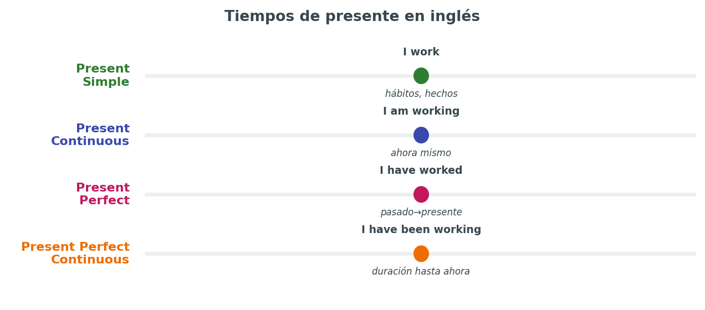

!!! info "PRESENT SIMPLE"
      - **Forma:** *I work / She works / I don't work / Does she work?*
      - **Uso:** rutinas, hechos permanentes, verdades generales, horarios fijos.
      - **Marcadores:** always, usually, often, every day, on Mondays.
      - **Error típico:** olvidar la -s en tercera persona (*she work* ❌ → *she works* ✅), muy frecuente al hablar improvisando.
      - **Consejo EOI:** en la interacción oral, usarlo mal en la primera frase da mala impresión inicial al examinador; conviene practicarlo hasta que sea reflejo.
!!! info "PRESENT CONTINUOUS"
      - **Forma:** *I am working / I am not working / Am I working?*
      - **Uso:** acción en curso ahora mismo, o plan futuro ya confirmado con fecha.
      - **Marcadores:** now, right now, at the moment, this week, tomorrow (si hay plan concreto).
      - **Error típico:** usarlo con verbos de estado que normalmente no llevan -ing (*I am knowing* ❌ → *I know* ✅): like, want, know, believe, understand, need.
      - **Consejo EOI:** para hablar de planes de futuro cercanos y confirmados es más natural que "will" (*I am meeting her tomorrow* frente a *I will meet her tomorrow*).
!!! info "PRESENT PERFECT"
      - **Forma:** *I have worked / I haven't worked / Have I worked?*
      - **Uso:** experiencias de vida sin momento concreto, acciones recién terminadas, situaciones que empezaron en el pasado y continúan.
      - **Marcadores:** already, yet, just, ever, never, since, for, recently.
      - **Error típico:** confundirlo con el Past Simple cuando hay un momento concreto mencionado (*I have seen him yesterday* ❌ → *I saw him yesterday* ✅). Es el error número uno de los hablantes de español en todos los niveles.
      - **Consejo EOI:** la regla práctica es: si hay una fecha, hora o momento concreto y cerrado → Past Simple. Si no hay momento concreto, o la acción conecta con el presente → Present Perfect.
!!! info "PRESENT PERFECT CONTINUOUS"
      - **Forma:** *I have been working / I haven't been working / Have I been working?*
      - **Uso:** acción que empezó en el pasado y continúa ahora, con énfasis en la duración o el proceso.
      - **Marcadores:** for, since, all day, lately, recently.
      - **Error típico:** usarlo con verbos de estado (*I have been knowing him for years* ❌ → *I have known him for years* ✅).
      - **Consejo EOI:** compararlo con Present Perfect simple: *I have painted the wall* (acabado, resultado visible) frente a *I have been painting the wall* (proceso, puede no estar acabado, hay pintura por el suelo).

**PASADO** 

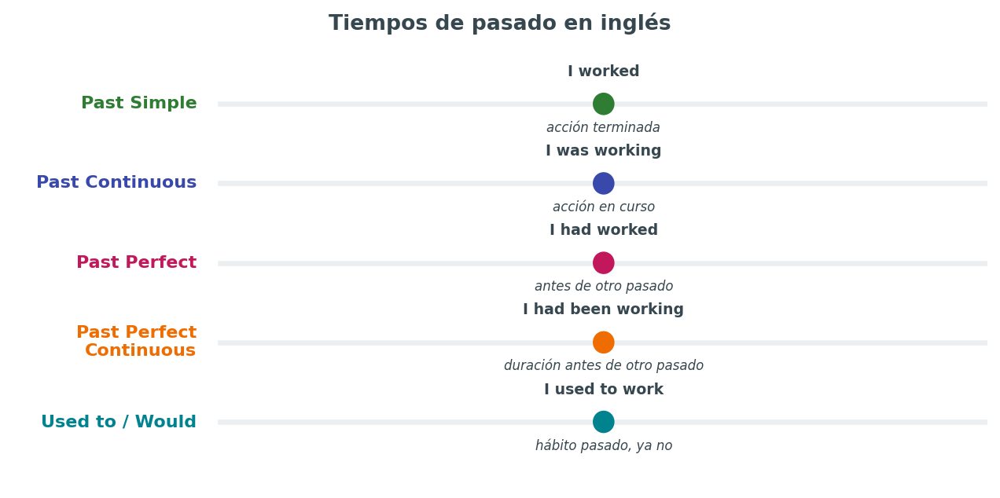

!!! warning "PAST SIMPLE"
      - **Forma:** *I worked / I didn't work / Did I work?* (verbos irregulares: went, saw, had...)
      - **Uso:** acción terminada en un momento concreto del pasado. El tiempo narrativo por excelencia.
      - **Marcadores:** yesterday, last week, ago, in 2010, when.
      - **Error típico:** aplicar la regla de -ed a verbos irregulares (*goed* ❌ → *went* ✅). Los verbos irregulares hay que memorizarlos de forma activa, no solo reconocerlos.
!!! warning "PAST CONTINUOUS"
      - **Forma:** *I was working / I wasn't working / Was I working?*
      - **Uso:** acción en progreso en un momento del pasado, contexto de una historia, acción interrumpida por otra.
      - **Marcadores:** while, when, at that moment.
      - **Consejo EOI:** muy útil en el monólogo narrativo del examen oral para dar contexto: *I was walking home when it started raining* — combina de forma natural con Past Simple.
!!! warning "PAST PERFECT"
      - **Forma:** *I had worked / I hadn't worked / Had I worked?*
      - **Uso:** acción anterior a otro momento del pasado — el "pasado del pasado".
      - **Marcadores:** already, just, before, after, by the time, when.
      - **Error típico:** usar Past Simple para las dos acciones cuando el orden importa (*When I arrived, the film started* es ambiguo; *When I arrived, the film had already started* deja claro que empezó antes).
      - **Consejo EOI:** en B2 y C1 es casi obligatorio para dar credibilidad a una narración compleja o para explicar causas ("no fui a la fiesta porque había perdido la invitación").
!!! warning "PAST PERFECT CONTINUOUS"
      - **Forma:** *I had been working / I hadn't been working / Had I been working?*
      - **Uso:** acción en progreso antes de otro momento del pasado, con énfasis en duración.
      - **Marcadores:** for, since, before, when.
      - **Ejemplo:** *She was tired because she had been studying all night.*
!!! warning "Used to / Would para hábitos pasados"
      - **Forma:** *I used to play football / I didn't use to play football.* *Would* solo para acciones repetidas, no para estados (*I would live in Madrid* ❌ → *I used to live in Madrid* ✅).
      - **Uso:** hábitos o estados en el pasado que ya no son ciertos.
      - **Consejo EOI:** en la mediación y en el monólogo, "used to" da naturalidad al hablar de la infancia o de cambios personales, y es un recurso muy valorado frente al simple Past Simple repetido.

**FUTURO**

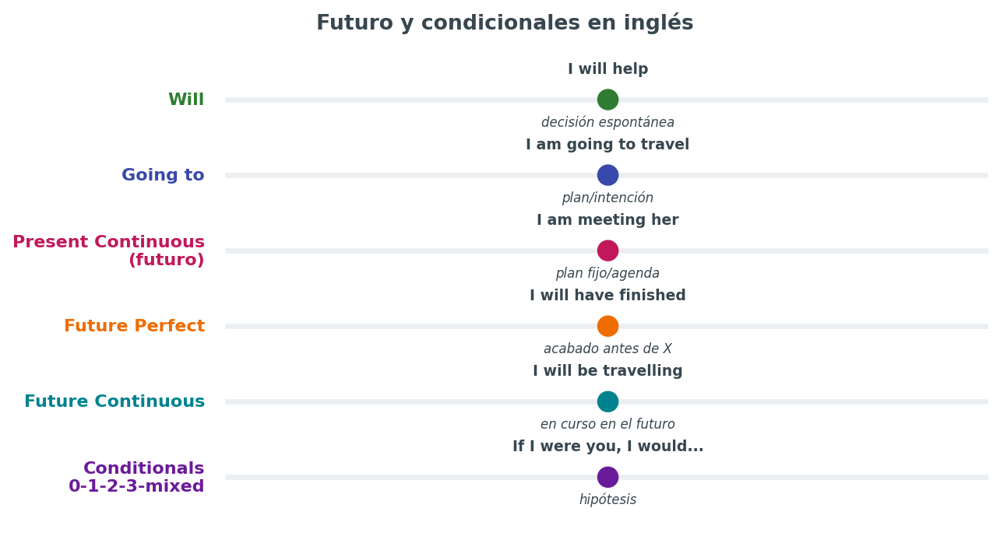

| Forma | Cuándo usarla | Ejemplo |
|---|---|---|
| **Will** | Decisión espontánea, predicción sin evidencia clara, promesa, ofrecimiento | *I'll help you with that.* |
| **Going to** | Intención ya decidida, predicción con evidencia visible | *Look at those clouds, it's going to rain.* |
| **Present Continuous** | Plan futuro ya confirmado, con fecha o cita concreta | *I'm meeting the dentist on Friday.* |
| **Future Continuous** | Acción en progreso en un momento futuro concreto|*I will be flying to London this time tomorrow*|
| **Future Perfect** | Acción completada antes de un momento futuro. Muy útil en C1 para hablar de objetivos y proyecciones|*By next June, I will have finished my degree*|

**VERBOS IRREGULARES**

No hace falta memorizar los 200 verbos irregulares,estos son los que, por frecuencia de uso en textos y audios de nivel B1-C1, conviene tener totalmente automatizados:

| Base | Past Simple | Past Participle | Traducción |
|---|---|---|---|
| be | was/were | been | ser/estar |
| go | went | gone | ir |
| do | did | done | hacer |
| have | had | had | tener/haber |
| say | said | said | decir |
| get | got | got/gotten | conseguir/llegar a estar |
| make | made | made | hacer/fabricar |
| take | took | taken | coger/tomar |
| see | saw | seen | ver |
| know | knew | known | saber/conocer |
| think | thought | thought | pensar |
| come | came | come | venir |
| give | gave | given | dar |
| find | found | found | encontrar |
| tell | told | told | contar/decir |
| become | became | become | convertirse en |
| leave | left | left | dejar/marcharse |
| feel | felt | felt | sentir |
| bring | brought | brought | traer |
| begin | began | begun | empezar |
| write | wrote | written | escribir |
| understand | understood | understood | entender |
| break | broke | broken | romper |
| choose | chose | chosen | elegir |
| lose | lost | lost | perder |

### Estructuras avanzadas

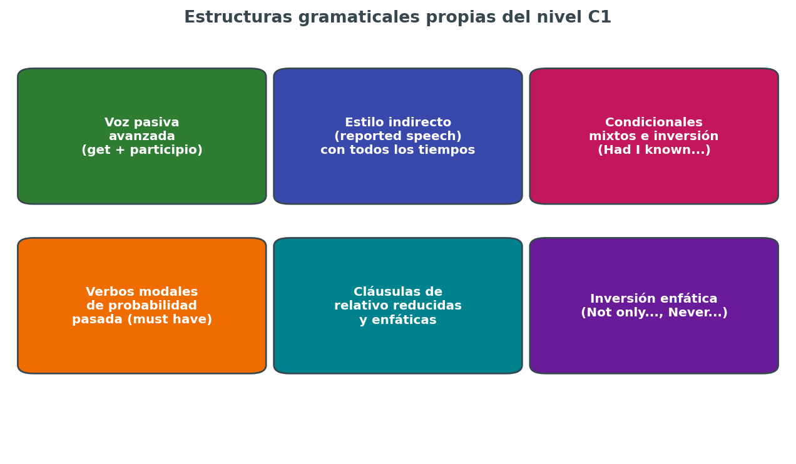

!!! tip "Voz pasiva"
    - **Forma:** *object + be + past participle (+ by + agent)*: *The report was written by the committee.*
    - **Uso en B1/B2:** cuando el agente no importa o no se conoce: *My car was stolen last night.*
    - **Uso avanzado en C1:** con verbos como *believe, say, think, report* para dar objetividad y registro formal: *It is believed that the economy will improve* / *The economy is believed to improve.*
    - **Error típico:** usar la pasiva de forma innecesaria y forzada cuando la activa es más natural; en C1 se penaliza tanto el defecto como el exceso.

!!! tip "Reported speech (estilo indirecto)"
    - **Regla general:** los tiempos "retroceden" un paso (present → past, past → past perfect, will → would), y cambian pronombres y marcadores temporales (today → that day, tomorrow → the next day).
    - **Ejemplo:** *"I am tired," she said* → *She said she was tired.*
    - **Con preguntas:** se pierde la inversión y el signo de interrogación: *"Where do you live?"* → *He asked where I lived.*
    - **Error típico:** mantener la inversión en preguntas indirectas (*He asked where did I live* ❌ → *He asked where I lived* ✅).
    - **Consejo EOI:** imprescindible en la mediación, donde constantemente hay que transmitir lo que "alguien dijo" o "el texto explica".

!!! tip "Condicionales"
      | Tipo | Estructura | Uso | Ejemplo |
      |---|---|---|---|
      | **Zero** | If + present, present | Verdades generales, ciencia | If you heat water to 100°C, it boils. |
      | **First** | If + present, will + infinitivo | Situación futura real y posible | If it rains, I'll stay home. |
      | **Second** | If + past simple, would + infinitivo | Situación hipotética, poco probable o imaginaria en presente/futuro | If I won the lottery, I would travel the world. |
      | **Third** | If + past perfect, would have + participio | Situación hipotética en el pasado, ya no se puede cambiar | If I had studied more, I would have passed. |
      | **Mixed** | If + past perfect, would + infinitivo (o viceversa) | Consecuencia presente de una condición pasada | If I had taken that job, I would be rich now. |

      **Error típico y muy frecuente:** poner "would" dentro de la cláusula con "if" (*If I would have more time* ❌ → *If I had more time* ✅). Es uno de los errores que más penaliza en B2 y C1 por lo sistemático que suele ser.

      **Consejo EOI:** el condicional mixto es un recurso que distingue claramente a un C1 de un B2; conviene incluir al menos un ejemplo bien construido en el ensayo o en el monólogo cuando el tema lo permita (arrepentimientos, decisiones pasadas con consecuencias actuales).

!!! tip "Verbos modales de probabilidad y deducción"
      | Modal + have + participio | Grado de certeza | Ejemplo |
      |---|---|---|
      | **must have** | Casi seguro (deducción lógica positiva) | She must have left already, her coat isn't here. |
      | **can't have** | Casi seguro que no | He can't have finished, it's only been five minutes. |
      | **might/could have** | Posible, no seguro | They might have missed the train. |
      | **should have** | No ocurrió, pero se esperaba/recomendaba | You should have called me earlier. |

      **Consejo EOI:** este bloque es un clásico en las tareas de mediación e interacción de C1, donde hay que especular sobre información incompleta.

!!! tip "Cláusulas de relativo reducidas"
    - *The man who is standing by the door* → *The man standing by the door.*
    - *The book which was written in 1990* → *The book written in 1990.*
    - **Uso:** dar fluidez y evitar la repetición constante de pronombres relativos en textos más largos.

!!! tip "Inversión enfática y estructuras de registro formal"
    - *Not only did she finish the project, but she also presented it early.*
    - *Never have I seen such a beautiful sunset.*
    - *Rarely do we get the chance to travel like this.*
    - *Had I known, I would have called you.* (inversión en el tercer condicional, alternativa a "If I had known...")

    **Consejo EOI:** usar una sola de estas estructuras, bien construida, en un ensayo o en el monólogo de C1 suma más que varias frases simples correctas, porque demuestra un control del idioma que va más allá de lo funcional.

!!! tip "Qué tiempo dominar de forma activa, por nivel"
      | Bloque | B1 (activo) | B2 (activo) | C1 (activo) |
      |---|---|---|---|
      | Presente | Simple, Continuous, Perfect | + Perfect Continuous con matices | Dominio total, incluyendo matices de registro |
      | Pasado | Simple, Continuous | + Perfect, Perfect Continuous, used to | Dominio total + narrativa compleja |
      | Futuro | Will, Going to | + Present Continuous, Future Continuous | + Future Perfect con matices de proyección |
      | Condicionales | 0 y 1 | + 2 y 3 | + Mixed, inversión como alternativa |
      | Pasiva | Reconocimiento | Producción básica | Producción con verbos de opinión (is believed to...) |
      | Reported speech | Reconocimiento | Producción de afirmaciones y preguntas | Producción fluida, incluso con verbos introductorios variados (claim, admit, deny) |
      | Modales de deducción | No exigido | Básico (must/might) | Dominio completo, incluidas formas con "have" |

## Estrategia día de examen — Writing (Task 1 y Task 2)

## Reparto de tiempo orientativo

| Fase | Task 1 (100-120 palabras) | Task 2 (230-275 palabras) |
|---|---|---|
| Leer + subrayar | 2 min | 3 min |
| Planificar | 3 min | 5 min |
| Redactar | 10-12 min | 25-28 min |
| Revisar | 3 min | 5 min |
| **Total aprox.** | **~18-20 min** | **~38-40 min** |

---

## FASE 1 — Leer el enunciado (igual en las dos tareas)

Subraya siempre estas 4 cosas antes de escribir una sola palabra:
- **Tipo de texto** (email, blog, essay, report...)
- **Destinatario** (amigo, empresa, revista del centro...) → esto define el registro
- **Puntos obligatorios** que hay que incluir (normalmente 2, en negrita o con viñetas en el enunciado)
- **Número de palabras**

---

## FASE 2 — Planificar

### Task 1 (esquema rápido, 3 min)
1. Escribe los 2 puntos obligatorios como 2 mini-bloques
2. Para cada bloque, anota 1-2 frases clave que quieres decir
3. Asigna a cada frase una estructura gramatical objetivo — ej: "frase 1 → present perfect", "frase 2 → relative clause"
4. Elige 2-3 conectores que vas a usar, para no repetir

### Task 2 (esquema más completo, 5 min)
1. Divide en los 4 bloques fijos: introducción / párrafo cuerpo 1 / párrafo cuerpo 2 / conclusión
2. En cada bloque cuerpo, anota: idea principal + 1 ejemplo concreto
3. Asigna 1 estructura gramatical objetivo por párrafo — ej: "párrafo 1 → conditional", "párrafo 2 → passive voice", "conclusión → cleft sentence"
4. Elige 4-5 conectores distintos (uno por bloque más o menos)

### Lista de estructuras candidatas (elige 3-5 según la tarea)
present perfect · past perfect · conditionals · passive voice · relative clauses · reported speech · comparativos dobles · cleft sentences · inversión · causativa · wish

---

## FASE 3 — Redactar

- Sigue el esquema, no improvises sobre la marcha
- Si te atascas en una palabra, no pares a buscar la perfecta — sigue escribiendo y revisa el vocabulario en la Fase 4
- Vigila el tiempo: si vas muy retrasado en Task 2, prioriza terminar la conclusión antes que perfeccionar el cuerpo (un texto sin cierre penaliza más que uno con el cuerpo algo corto)

---

## FASE 4 — Revisar (checklist, igual en las dos tareas)

1. ¿Está el registro consistente de principio a fin? (nada de mezclar formal/informal)
2. ¿Concordancia sujeto-verbo?
3. ¿Usaste las estructuras gramaticales que planeaste, o se quedaron fuera?
4. ¿Número de palabras dentro del margen (±10%)?
5. Ortografía y mayúsculas sueltas

---

## Diferencia clave entre las dos tareas

- **Task 1:** prioriza precisión y que no falte ningún punto obligatorio — es corta, cada frase pesa mucho
- **Task 2:** prioriza estructura clara en párrafos y variedad de conectores/gramática — aquí sí hay espacio para desarrollar argumentos