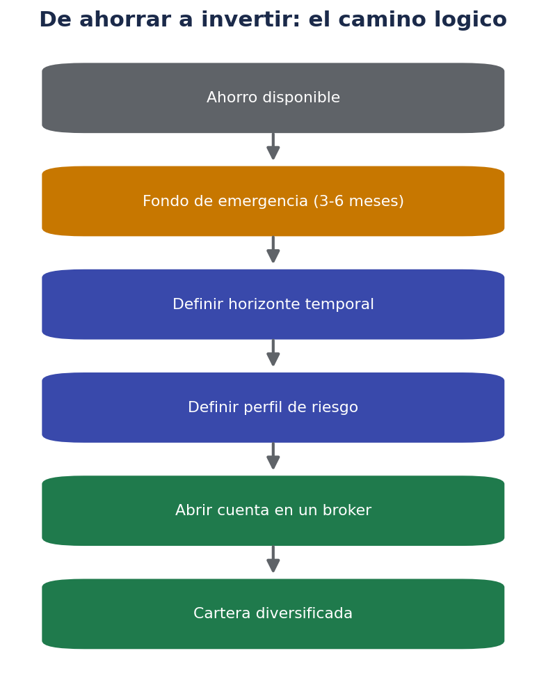
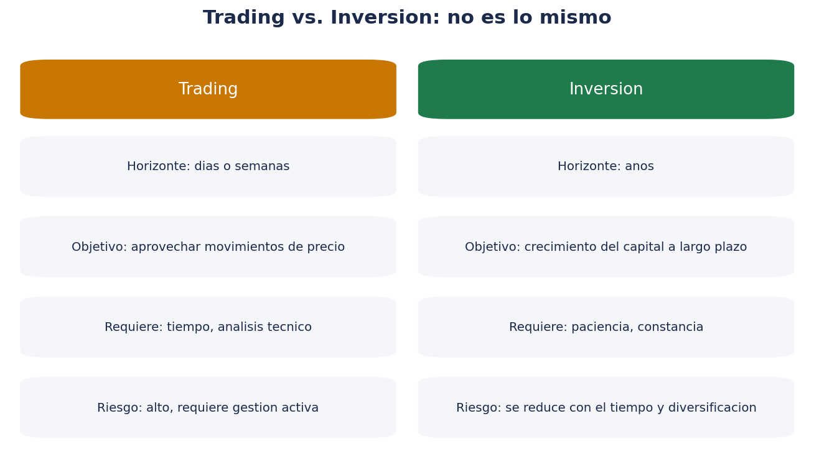
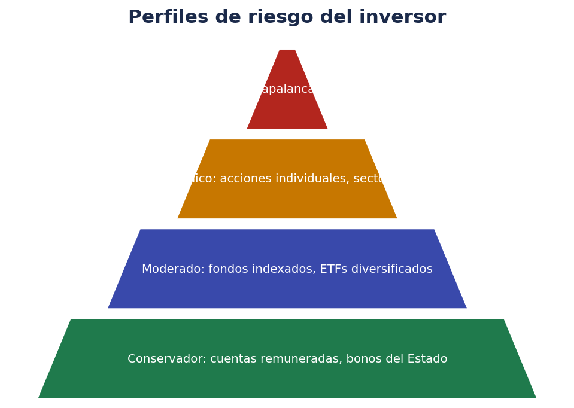

# 💹 Trade — Introducción a invertir desde cero

> *"No hace falta ser rico para empezar a invertir, pero sí hace falta entender qué se está haciendo antes de hacerlo."*

Esta carpeta reúne **todo lo que necesito saber para empezar a invertir con cabeza**, partiendo de cero: qué es invertir, qué diferencia hay con el trading, qué es una cuenta de bróker (como la cuenta de trading que ya tengo abierta), qué tipos de activos existen y cómo dar los primeros pasos sin cometer errores típicos de principiante.

No es un curso de análisis técnico ni una promesa de "hazte rico rápido". Es una guía de **conceptos básicos, ordenados y explicados en cristiano**, pensada para alguien que solo tiene una cuenta abierta y ninguna otra experiencia previa.

!!! warning "Esto no es asesoramiento financiero"
    Todo el contenido de esta carpeta tiene fines **educativos y divulgativos**. No es una recomendación de compra o venta de ningún activo concreto, ni sustituye el asesoramiento de un profesional financiero colegiado. Antes de invertir dinero real, contrasta la información con fuentes oficiales (CNMV, Banco de España) y valora tu situación personal.

## 📂 Cómo está organizada esta guía

| Archivo | Contenido | Cuándo usarlo |
|---|---|---|
| `00-introduccion.md` | Este documento: qué es invertir, trading vs. inversión, primeros conceptos | Antes de nada, para tener el mapa general |
| `01-tipos-de-activos.md` | Acciones, bonos, fondos, ETF, materias primas, derivados | Para saber en qué se puede invertir y con qué riesgo |
| `02-ordenes-y-mercados.md` | Cómo funciona una orden de compra/venta, tipos de órdenes, spread | Antes de tocar el botón de "comprar" por primera vez |
| `03-riesgo-diversificacion-fiscalidad.md` | Riesgo, diversificación, errores comunes, fiscalidad básica en España | Para entender qué puede salir mal y qué hay que declarar |
| `04-glosario-primeros-pasos.md` | Glosario extenso + checklist práctico para arrancar | Como chuleta de consulta rápida |

Se recomienda leerlos en orden la primera vez, aunque cada uno funciona también como consulta independiente.

## 🧭 ¿Qué significa "invertir"?

Invertir es **destinar dinero hoy con la expectativa de obtener más dinero en el futuro**, asumiendo un riesgo a cambio. Se diferencia de:

- **Ahorrar**: guardar dinero sin buscar que genere rentabilidad relevante (por ejemplo, en una cuenta corriente). Es el paso previo a invertir, no un sustituto.
- **Especular / hacer trading**: buscar beneficio en movimientos de precio a corto plazo, con una actitud mucho más activa y un riesgo mayor.
- **Apostar o jugar**: en el juego, la expectativa matemática suele ser negativa para el jugador. En la inversión en activos productivos (empresas, deuda pública, etc.), a largo plazo la expectativa histórica ha sido positiva, aunque no está garantizada.

Como se ve en el esquema, invertir no es el primer paso. Antes conviene tener:

1. **Ingresos estables** (o al menos previsibles).
2. **Un fondo de emergencia** de 3 a 6 meses de gastos, en algo líquido y seguro (cuenta corriente o remunerada), para no tener que vender inversiones en el peor momento si surge un imprevisto.
3. **Ausencia de deudas caras** (tarjetas de crédito, préstamos al consumo con intereses altos): casi ninguna inversión "normal" bate esos intereses de forma fiable.
4. **Un objetivo y un horizonte temporal**: ¿para qué inviertes? ¿Para la jubilación dentro de 30 años, para una entrada de vivienda en 5 años, para complementar ingresos?

Si no se cumplen los tres primeros puntos, tiene más sentido resolverlos antes de destinar dinero a invertir.

## ⚖️ Trading vs. Inversión

Es habitual mezclar ambos conceptos, pero tienen lógicas distintas.

| | Trading | Inversión |
|---|---|---|
| Horizonte temporal | Minutos, horas, días, semanas | Años, décadas |
| Qué se busca | Aprovechar movimientos de precio (subidas y bajadas) | Crecimiento del capital y/o generación de rentas a largo plazo |
| Dedicación | Alta: seguimiento constante, análisis técnico | Baja-media: revisiones periódicas |
| Herramientas típicas | Gráficos, indicadores técnicos, órdenes rápidas | Análisis fundamental, fondos indexados, planes periódicos |
| Riesgo | Alto, se puede perder todo el capital operado en poco tiempo | Existe, pero se puede gestionar mejor con tiempo y diversificación |
| Perfil recomendado | Personas con formación específica, tiempo y capital que pueden permitirse perder | Casi cualquier perfil, adaptando el tipo de activo al horizonte y tolerancia al riesgo |

Para alguien que empieza de cero, **lo razonable suele ser empezar por la inversión a largo plazo** (por ejemplo, en fondos indexados o ETF diversificados) antes de plantearse el trading activo, que exige mucha más formación y gestión del riesgo.

## 🏦 ¿Qué es una cuenta de trading / bróker?

Cuando abres una cuenta en una plataforma de inversión (a veces llamada "cuenta trade", "cuenta de inversión" o "cuenta de bróker"), en realidad estás contratando los servicios de un **intermediario financiero** que te permite:

- Enviar órdenes de compra y venta a los mercados (bolsas, mercados de bonos, etc.).
- Mantener en depósito o custodia los activos que compras (aunque legalmente suelen seguir siendo tuyos, no del bróker).
- Consultar cotizaciones, informes y, en algunos casos, herramientas de análisis.

Existen distintos tipos de intermediarios:

- **Bancos tradicionales**: suelen tener comisiones más altas, pero ofrecen acompañamiento y a veces asesoramiento personal.
- **Neobrókers / brókers digitales** (por ejemplo, plataformas tipo Trade Republic, eToro, DEGIRO, MyInvestor, etc.): comisiones más bajas, todo gestionado desde el móvil, pero normalmente sin asesoramiento personalizado.
- **Gestoras de fondos**: si inviertes directamente en fondos de una gestora, sin pasar por un bróker de bolsa.

Da igual el nombre concreto de la plataforma que uses: **el concepto de fondo es el mismo** y lo importante es entender qué estás comprando, qué comisiones pagas y qué protección tiene tu dinero (por ejemplo, si la entidad está supervisada por la CNMV o el Banco de España, y si existe algún fondo de garantía de inversiones).

## 🌍 ¿Qué es un mercado / una bolsa?

Una **bolsa de valores** es un mercado organizado donde se compran y venden activos financieros (principalmente acciones, aunque también bonos, ETF, derivados, etc.). Algunas bolsas conocidas:

- **Bolsa de Madrid** (parte del mercado español, índice de referencia: IBEX 35).
- **NYSE** y **Nasdaq** (Estados Unidos).
- **Euronext** (varias plazas europeas: París, Ámsterdam, Bruselas, Lisboa...).

Cuando compras una acción a través de tu bróker, en realidad tu orden viaja hasta el mercado donde cotiza esa empresa, se cruza con la orden de otra persona que quiere vender (o comprar) y ahí se ejecuta la operación. Esto se explica con más detalle en `02-ordenes-y-mercados.md`.

## 🎯 Perfil de riesgo: ¿qué tipo de inversor eres?

Antes de elegir en qué invertir, conviene tener una idea aproximada de tu **perfil de riesgo**, que depende de:

- **Tu horizonte temporal**: cuanto más lejano es el objetivo, más riesgo (volatilidad) puedes asumir, porque tienes tiempo para recuperarte de caídas.
- **Tu capacidad financiera**: cuánta pérdida temporal podrías asumir sin que afecte a tu vida diaria.
- **Tu tolerancia emocional**: cuánta volatilidad puedes soportar sin tomar decisiones impulsivas (vender en pánico, por ejemplo).

Una forma simplificada de clasificar los perfiles:

- **Conservador**: prioriza no perder capital. Activos como cuentas remuneradas, depósitos, bonos del Estado a corto plazo.
- **Moderado**: acepta oscilaciones moderadas a cambio de más rentabilidad esperada. Fondos indexados diversificados, mezcla de renta fija y variable.
- **Dinámico**: acepta más volatilidad buscando más rentabilidad a largo plazo. Más peso en acciones y ETF de renta variable.
- **Agresivo**: busca máxima rentabilidad asumiendo riesgo elevado. Derivados, apalancamiento, activos muy volátiles.

No existe un perfil "mejor" en abstracto: lo importante es que el riesgo asumido sea coherente con tu situación real y tu horizonte, no con lo que prometa una publicidad o un vídeo viral.

## 🚫 Errores típicos al empezar (para evitarlos desde ya)

1. **Invertir dinero que se puede necesitar a corto plazo.** Si hay una caída puntual del mercado justo cuando necesitas ese dinero, puedes verte obligado a vender con pérdidas.
2. **Invertir sin entender el producto.** Si no puedes explicar con tus palabras qué has comprado y qué riesgo tiene, mejor no comprarlo todavía.
3. **Perseguir rentabilidades pasadas o virales.** Que algo haya subido mucho no garantiza que vaya a seguir subiendo; al revés, a veces es señal de sobrevaloración.
4. **Concentrar todo en un único activo.** Se explica en detalle en `03-riesgo-diversificacion-fiscalidad.md`.
5. **Usar apalancamiento sin entenderlo.** Multiplica tanto las ganancias como las pérdidas, y puede hacer que pierdas más dinero del que depositaste.
6. **Tomar decisiones por miedo o euforia.** Vender en pánico durante una caída o comprar por FOMO (miedo a quedarse fuera) en un pico suelen ser las peores decisiones.

## 🧩 Primeros conceptos que conviene tener claros

| Concepto | Explicación breve |
|---|---|
| **Activo** | Cualquier bien o instrumento financiero que se puede comprar/vender y que tiene valor (acción, bono, fondo, cripto, inmueble...) |
| **Cartera / portfolio** | El conjunto de activos que posees |
| **Rentabilidad** | La ganancia (o pérdida) que genera una inversión, normalmente expresada en % |
| **Riesgo** | La posibilidad de que el resultado real sea distinto (peor) del esperado |
| **Liquidez** | La facilidad para convertir un activo en dinero disponible sin perder valor por ello |
| **Comisión** | El coste que cobra el intermediario por sus servicios (compra/venta, custodia, cambio de divisa...) |
| **Dividendo** | Parte del beneficio de una empresa que reparte entre sus accionistas |
| **Cotización** | El precio al que se está negociando un activo en un momento dado |

Este glosario se amplía mucho más en `04-glosario-primeros-pasos.md`.

## 🗺️ Cómo seguir a partir de aquí

1. Lee `01-tipos-de-activos.md` para saber qué se puede comprar realmente y con qué nivel de riesgo.
2. Lee `02-ordenes-y-mercados.md` antes de enviar tu primera orden real, aunque sea pequeña.
3. Lee `03-riesgo-diversificacion-fiscalidad.md` para entender qué puede salir mal y qué obligaciones fiscales tienes en España.
4. Usa `04-glosario-primeros-pasos.md` como chuleta y checklist antes de operar.

## ❓ Preguntas frecuentes de quien empieza

**¿Necesito mucho dinero para empezar a invertir?**
No necesariamente. Muchos brókers permiten comprar fracciones de acciones o participaciones de fondos/ETF desde importes pequeños. Lo importante es empezar con una cantidad con la que te sientas cómodo, no con la que "deberías" según nadie.

**¿Es lo mismo mi cuenta de trading que una cuenta bancaria normal?**
No. Una cuenta de trading está pensada para mantener e invertir en activos financieros, no para el día a día (nóminas, recibos, etc.). El efectivo que tengas ahí normalmente no genera intereses relevantes salvo que el bróker ofrezca explícitamente una remuneración por el efectivo no invertido.

**¿Puedo perder todo mi dinero?**
Depende del activo y de cómo lo uses. En productos con apalancamiento (derivados, CFD) sí es posible perder más de lo depositado. En una cartera diversificada de acciones/fondos a largo plazo, el riesgo de perderlo todo es mucho menor, aunque sí puedes sufrir pérdidas temporales importantes.

**¿Cuándo sabré que estoy "listo" para invertir?**
Cuando puedas responder con seguridad: qué activo compras, por qué, qué riesgo tiene, qué comisiones pagas y qué harías si baja un 20% mañana. Si alguna de esas respuestas es "no lo sé", toca seguir formándose un poco más antes de invertir cantidades relevantes.

## 📱 Qué significa cada dato que ves en la app de tu bróker

Cuando abres tu cuenta de trading y miras una posición (un activo que ya tienes comprado), es normal ver una pantalla llena de números que al principio no dicen nada. Estos son los más habituales:

| Dato en pantalla | Qué significa |
|---|---|
| **Precio actual / cotización** | El precio al que se está negociando ahora mismo ese activo |
| **Coste medio de compra** | El precio medio al que compraste tus participaciones (si compraste varias veces a precios distintos) |
| **Valor de mercado** | Cuánto valen hoy tus participaciones al precio actual (cantidad × precio actual) |
| **Rentabilidad no realizada (o "en papel")** | La ganancia o pérdida que tendrías si vendieras ahora mismo; no es dinero real hasta que vendes |
| **Rentabilidad realizada** | La ganancia o pérdida ya materializada, de operaciones que ya cerraste (vendiste) |
| **Efectivo disponible** | El dinero que tienes en la cuenta sin invertir, listo para nuevas compras o para retirar |
| **Comisiones acumuladas** | El total pagado en comisiones desde que operas |

Un matiz importante para quien empieza: **una pérdida en pantalla no es una pérdida real hasta que vendes**. Si el precio baja y no vendes, sigues teniendo el mismo número de participaciones; si el precio se recupera, la "pérdida en papel" desaparece. Esto no significa que toda caída se vaya a recuperar siempre, pero ayuda a entender por qué no conviene tomar decisiones solo mirando la pantalla en rojo un día concreto.

## 🏛️ ¿Quién protege mi dinero si el bróker quiebra?

Es una duda muy razonable al empezar. En la Unión Europea (y por tanto en España), existen dos mecanismos de protección distintos, y conviene no confundirlos:

- **Fondo de Garantía de Inversiones (FOGAIN en España, o equivalentes en otros países de la UE)**: cubre, hasta un límite (actualmente 100.000 € por cliente y entidad, sujeto a la normativa vigente), los valores e instrumentos financieros depositados en caso de que la entidad no pueda devolverlos por insolvencia o problemas operativos, no por pérdidas de mercado.
- **Fondo de Garantía de Depósitos**: protege el efectivo depositado en entidades bancarias (no es lo mismo que las inversiones), también hasta un límite legal.

Es importante entender que **estos fondos no cubren las pérdidas de valor de tus inversiones** (si una acción baja porque a la empresa le va mal, eso no lo cubre ningún fondo de garantía). Solo protegen frente a la insolvencia o mala praxis del propio intermediario.

Antes de operar con una plataforma, conviene comprobar:

- Si está **autorizada y supervisada** por la CNMV (España) o por el regulador equivalente de otro país de la UE (y si opera en España en libre prestación de servicios, que esté registrada ante la CNMV).
- Si pertenece a algún fondo de garantía de inversiones reconocido.
- Qué política tiene sobre custodia de activos (si los mantiene segregados de su propio patrimonio, que es la práctica exigida por normativa).

## 💶 Efectivo, cuentas remuneradas y liquidez dentro del bróker

Muchos brókers actuales, además de permitir comprar acciones, fondos o ETF, ofrecen la posibilidad de mantener el efectivo no invertido en algún tipo de **cuenta remunerada** o en fondos monetarios (fondos que invierten en deuda pública a muy corto plazo, considerados de bajo riesgo). Esto no es lo mismo que "no hacer nada" con el dinero: conviene revisar si tu plataforma ofrece algo así y en qué condiciones, porque puede marcar la diferencia frente a dejar el efectivo sin ninguna remuneración.

Algunos puntos a comprobar sobre el efectivo en tu cuenta:

- ¿El efectivo no invertido genera algún interés? ¿En qué condiciones (importe mínimo, plazo, etc.)?
- ¿Ese rendimiento proviene de un depósito bancario garantizado o de un fondo monetario (que, aunque de bajo riesgo, no es lo mismo que un depósito garantizado)?
- ¿Hay comisión por mantener saldo en efectivo sin operar?

## 📚 Recursos oficiales para contrastar información

Antes de tomar decisiones de inversión, es buena práctica consultar fuentes oficiales y neutrales, no solo contenido divulgativo (incluido este documento):

- **CNMV** (Comisión Nacional del Mercado de Valores): guías para el inversor, alertas sobre entidades no autorizadas, información sobre productos.
- **Banco de España**: información sobre educación financiera y productos bancarios.
- **Finanzas para Todos**: portal conjunto de CNMV y Banco de España con contenido divulgativo gratuito.
- **Documentos de Datos Fundamentales (KID/DFI)**: documento resumen que cualquier fondo, ETF o producto de inversión empaquetado debe ofrecer, con riesgo, costes y escenarios de rentabilidad. Merece la pena leerlo antes de comprar un producto nuevo.

## 🧠 Mentalidad antes que técnica

Antes de aprender a leer un gráfico o a configurar una orden stop, es más importante interiorizar algunas ideas de fondo:

- **El tiempo en el mercado suele importar más que intentar acertar el momento perfecto.** Intentar comprar siempre en el mínimo y vender siempre en el máximo es prácticamente imposible de hacer de forma consistente.
- **La rentabilidad pasada no garantiza la rentabilidad futura.** Es una frase que aparece en toda la documentación regulada por un motivo: es verdad.
- **A mayor rentabilidad esperada, mayor riesgo asumido.** Si algo promete mucha rentabilidad "sin riesgo", sospecha.
- **Los costes (comisiones) se comen la rentabilidad a largo plazo**, aunque parezcan pequeños en cada operación individual.
- **Formarse es gratis; los errores por no formarse, no.**

## 📈 El interés compuesto, explicado sin fórmulas complicadas

Uno de los conceptos que más conviene entender antes de empezar es el del **interés compuesto**: la idea de que las ganancias generadas por una inversión, si se reinvierten, empiezan a generar a su vez nuevas ganancias.

Un ejemplo simplificado (sin comisiones ni impuestos, solo para ilustrar el efecto):

| Año | Aportación acumulada | Con rentabilidad simple (solo sobre lo aportado) | Con interés compuesto (reinvirtiendo) |
|---|---|---|---|
| 1 | 1.000 € | 1.070 € | 1.070 € |
| 5 | 1.000 € | 1.350 € | 1.403 € |
| 15 | 1.000 € | 2.050 € | 2.759 € |
| 30 | 1.000 € | 3.100 € | 7.612 € |

*(Ejemplo ilustrativo con una rentabilidad anual constante del 7 %, solo con fines didácticos: en la práctica la rentabilidad real varía cada año y puede ser negativa en algunos periodos.)*

La diferencia entre ambas columnas crece con el tiempo, no al principio. Por eso se suele decir que **el tiempo es uno de los factores más importantes en la inversión a largo plazo**: cuanto antes se empieza (aunque sea con poco), más tiempo tiene el interés compuesto para actuar.

Esto no es una promesa de rentabilidad futura (los mercados no garantizan un 7 % anual ni ninguna otra cifra), sino una explicación de **cómo funciona matemáticamente la reinversión de beneficios**, independientemente del activo concreto.

## 🧗 Autoevaluación antes de seguir a la carpeta 01

Antes de pasar al documento sobre tipos de activos, intenta responder mentalmente a estas preguntas. Si alguna te cuesta, no pasa nada: es justo lo que se va a desarrollar en los siguientes documentos.

1. ¿Sabrías explicar con tus palabras la diferencia entre ahorrar, invertir y hacer trading?
2. ¿Sabes qué protege (y qué no protege) un fondo de garantía de inversiones?
3. ¿Tienes claro cuál sería tu horizonte temporal para el dinero que planeas invertir?
4. ¿Sabrías decir si tu perfil es más bien conservador, moderado o dinámico, y por qué?
5. ¿Entiendes por qué el tiempo (y no solo la cantidad invertida) es una variable clave en el interés compuesto?

Si has respondido "sí" a la mayoría, estás en buena posición para avanzar. Si no, no hay prisa: se puede releer esta introducción cuantas veces haga falta antes de invertir dinero real.

## ✅ Resumen de este documento

- Invertir no es lo mismo que ahorrar, especular o apostar.
- Antes de invertir conviene tener fondo de emergencia, ingresos estables y ausencia de deudas caras.
- Trading e inversión son enfoques distintos, con distinto horizonte, dedicación y riesgo.
- Una cuenta de trading es un acceso a un intermediario financiero regulado; conviene saber quién te protege y cómo.
- El perfil de riesgo debe basarse en tu horizonte temporal, capacidad financiera y tolerancia emocional, no en modas.
- Existen fuentes oficiales gratuitas (CNMV, Banco de España, Finanzas para Todos) para contrastar cualquier información.

---

Continúa con [01 · Tipos de activos](01-tipos-de-activos.md).
