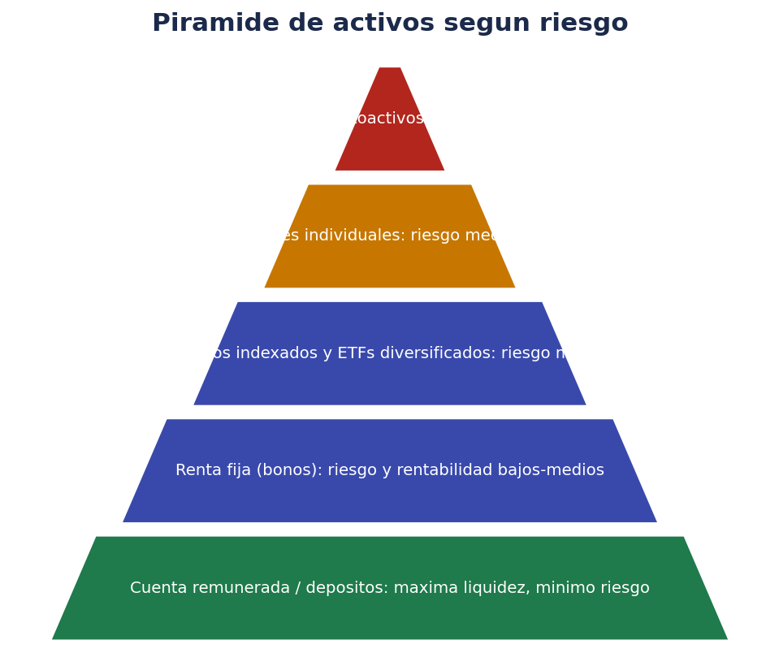
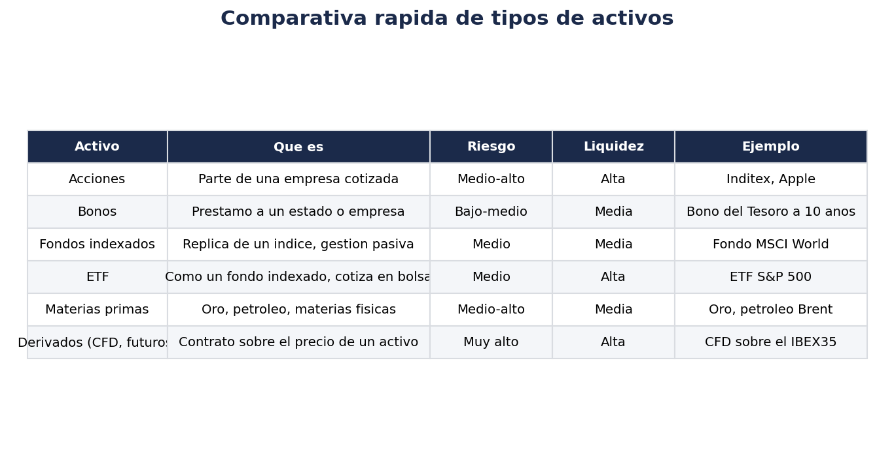
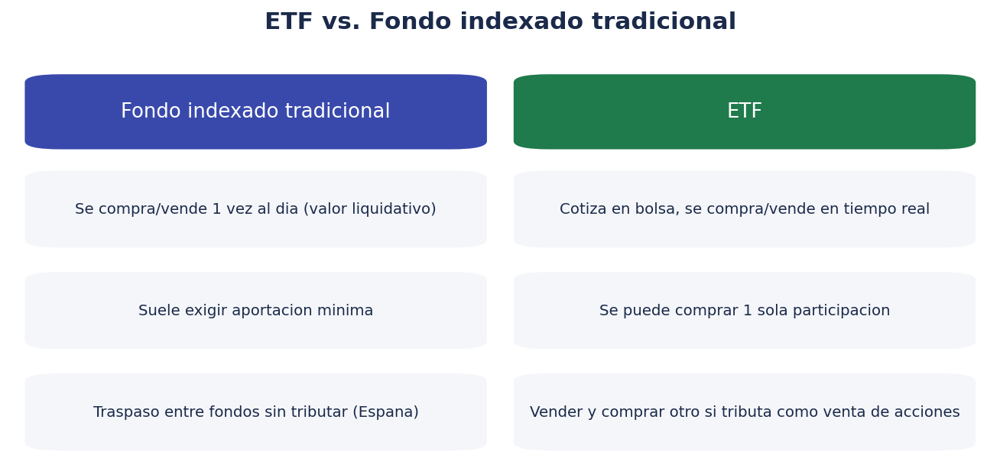

# 📊 Tipos de activos: en qué se puede invertir

> Antes de invertir en algo, deberías poder explicar con tus palabras qué es y qué riesgo tiene. Esta página es el mapa de los tipos de activos más habituales.

!!! warning "Recordatorio"
    Este documento describe categorías generales de activos con fines educativos. No es una recomendación de compra de ningún activo, empresa o fondo concreto.

## 🗺️ Panorama general

De forma simplificada, cuanto más arriba en la pirámide, mayor suele ser el riesgo (y la rentabilidad potencial), y menor la liquidez o la previsibilidad. No es una regla matemática exacta, pero ayuda a situarse.

## 📋 Comparativa rápida

| Activo | Qué es | Riesgo típico | Liquidez | Genera ingresos periódicos |
|---|---|---|---|---|
| Cuenta remunerada / depósito | Dinero prestado a un banco a cambio de interés | Muy bajo | Alta | Sí (interés) |
| Bonos / renta fija | Préstamo a un Estado o empresa | Bajo-medio | Media-alta | Sí (cupón) |
| Fondos de inversión | Cesta de activos gestionada por una gestora | Variable según el fondo | Media | Depende del fondo |
| ETF | Como un fondo, pero cotiza en bolsa como una acción | Variable según el ETF | Alta | Depende del ETF |
| Acciones | Parte de la propiedad de una empresa cotizada | Medio-alto | Alta (empresas grandes) | A veces (dividendos) |
| Materias primas | Oro, plata, petróleo, materias físicas o sus derivados | Medio-alto | Media | No |
| Divisas (forex) | Compra/venta de una moneda contra otra | Alto (muy volátil a corto plazo) | Muy alta | No |
| Derivados (CFD, futuros, opciones) | Contratos sobre el precio futuro de otro activo | Muy alto | Alta | No |
| Criptoactivos | Activos digitales basados en blockchain | Muy alto | Alta (pero variable) | Depende (staking, etc.) |

## 🏦 Renta fija: bonos y deuda

Cuando compras un **bono**, en la práctica le prestas dinero a quien lo emite (un Estado, una comunidad autónoma, una empresa) a cambio de:

- **Cupones**: pagos periódicos de intereses (no todos los bonos los tienen; algunos, como las Letras del Tesoro, se compran con descuento y se cobra la diferencia al vencimiento).
- **Devolución del nominal** al vencimiento, si el emisor no incumple (riesgo de impago o "riesgo de crédito").

Puntos clave:

- A mayor plazo del bono, normalmente mayor sensibilidad a cambios en los tipos de interés (si suben los tipos, el precio de mercado de un bono ya emitido con tipo fijo tiende a bajar, y viceversa).
- La deuda pública de países con alta solvencia (por ejemplo, la deuda del Estado español, alemán, etc.) suele considerarse de bajo riesgo de impago, aunque no es "sin riesgo" en términos absolutos.
- Existen también bonos corporativos (de empresas), con más riesgo de impago cuanto peor sea la calificación crediticia de la empresa.

## 📈 Renta variable: acciones

Una **acción** representa una parte proporcional de la propiedad de una empresa. Como accionista:

- Tienes derecho a una parte proporcional de los beneficios, si la empresa reparte dividendos.
- Tienes derecho de voto en la junta de accionistas (proporcional a tu participación, normalmente irrelevante si tienes pocas acciones de una empresa grande).
- Asumes el riesgo de que el valor de la acción baje si el negocio va mal, o incluso de perder toda la inversión si la empresa quiebra.

La rentabilidad de una acción viene de dos vías: la **revalorización** (que suba el precio) y los **dividendos** (reparto de beneficios). No todas las empresas reparten dividendos; algunas reinvierten todo el beneficio en crecer.

## 🧺 Fondos de inversión y ETF

Tanto los **fondos de inversión** como los **ETF (Exchange Traded Funds)** son vehículos que agrupan el dinero de muchos inversores para comprar una cesta diversificada de activos (acciones, bonos, o una mezcla), gestionada según una estrategia definida.

Diferencias prácticas más relevantes:

- **Cómo se compran/venden**: un fondo tradicional se suscribe/reembolsa a un único precio diario (el "valor liquidativo"); un ETF cotiza en bolsa y se compra/vende en tiempo real como una acción.
- **Importe mínimo**: los fondos tradicionales a veces exigen una aportación mínima; muchos ETF se pueden comprar por el precio de una sola participación (o fracciones, según el bróker).
- **Fiscalidad en España**: los fondos de inversión (no los ETF) permiten el **traspaso** entre fondos sin tributar en el momento del cambio, difiriendo la fiscalidad hasta el reembolso final. Los ETF, en cambio, tributan como las acciones en cada venta. Esta diferencia es relevante y conviene tenerla en cuenta al planificar.
- **Gestión activa vs. pasiva**: tanto los fondos como los ETF pueden ser de gestión activa (un gestor decide qué comprar/vender intentando batir al mercado) o de gestión pasiva/indexada (replican un índice, como el S&P 500 o el MSCI World, con comisiones normalmente más bajas).

### ¿Qué es un fondo indexado?

Un **fondo indexado** (o ETF indexado) replica la composición de un índice bursátil (por ejemplo, el S&P 500, que agrupa las 500 mayores empresas cotizadas de EE. UU.), en lugar de intentar seleccionar manualmente las mejores empresas. Ventajas típicas:

- Comisiones de gestión mucho más bajas que los fondos de gestión activa.
- Diversificación automática (al comprar una sola participación, inviertes en cientos de empresas a la vez).
- Rendimiento históricamente competitivo frente a la mayoría de fondos de gestión activa a largo plazo (aunque esto no es garantía de resultados futuros).

## 🥇 Materias primas

Las **materias primas** (oro, plata, petróleo, gas, productos agrícolas...) se pueden invertir de varias formas:

- Físicamente (por ejemplo, comprando oro físico), lo que implica custodia y seguros.
- A través de ETF/ETC (Exchange Traded Commodities) que replican el precio de la materia prima sin necesidad de poseerla físicamente.
- A través de derivados (futuros sobre materias primas), con mayor complejidad y riesgo.

El oro, en particular, se suele mencionar como activo "refugio" en momentos de incertidumbre, aunque esto no significa que no tenga volatilidad ni que sea inmune a caídas de precio.

## 💱 Divisas (forex)

El mercado de **divisas** consiste en comprar una moneda vendiendo otra (por ejemplo, comprar dólares vendiendo euros), especulando con el tipo de cambio. Es uno de los mercados más líquidos y con más volumen del mundo, pero también uno de los más volátiles a corto plazo y donde más se suele operar con apalancamiento, lo que incrementa mucho el riesgo para quien no tiene experiencia.

## 🎲 Derivados: CFD, futuros y opciones

Los **derivados** son instrumentos cuyo valor "deriva" del precio de otro activo (una acción, un índice, una materia prima, una divisa). Los más habituales para el inversor particular:

- **CFD (Contract for Difference)**: contrato que replica la diferencia de precio de un activo entre la apertura y el cierre de la posición, habitualmente con apalancamiento. Es uno de los productos de mayor riesgo para el inversor minorista; de hecho, los reguladores europeos exigen advertencias específicas sobre el porcentaje de inversores particulares que pierden dinero operando con CFD.
- **Futuros**: contrato para comprar/vender un activo a un precio fijado en una fecha futura.
- **Opciones**: dan el derecho (no la obligación) de comprar o vender un activo a un precio determinado antes de una fecha concreta.

!!! danger "Apalancamiento: la palabra clave del riesgo en derivados"
    El **apalancamiento** permite operar con una posición mayor de la que realmente depositas (por ejemplo, con 1.000 € controlar una posición de 10.000 €). Esto multiplica tanto las ganancias como las pérdidas potenciales, y en muchos productos puedes llegar a perder más dinero del que depositaste inicialmente. No es un producto recomendable para quien empieza sin formación específica.

## 🪙 Criptoactivos: mención rápida

Los **criptoactivos** (Bitcoin, Ethereum y similares) son también un tipo de activo en el que se puede invertir, pero tienen particularidades suficientes (custodia, monederos, regulación específica, volatilidad extrema) como para merecer su propia carpeta de documentación completa: consulta la carpeta `criptomonedas/` de este mismo repositorio para profundizar en ello.

## 🧮 ¿Cómo elegir según tu perfil?

No existe una combinación "correcta" universal, pero como orientación general y simplificada:

- **Perfil conservador / horizonte corto**: peso alto en cuentas remuneradas, fondos monetarios y renta fija a corto plazo.
- **Perfil moderado / horizonte medio-largo**: combinación de renta fija y renta variable diversificada (por ejemplo, a través de fondos indexados o ETF globales).
- **Perfil dinámico / horizonte largo**: mayor peso en renta variable diversificada, aceptando más volatilidad a cambio de mayor rentabilidad esperada a largo plazo.
- **Derivados, apalancamiento, cripto muy volátil**: solo con formación específica y capital que puedas permitirte perder por completo, nunca como base de un patrimonio.

Esto se amplía en `03-riesgo-diversificacion-fiscalidad.md`, donde se habla de diversificación y gestión del riesgo con más detalle.

## 📑 Cómo leer la ficha de un producto antes de comprarlo

Antes de invertir en cualquier fondo, ETF o producto empaquetado, revisa al menos:

1. **Objetivo y política de inversión**: en qué invierte realmente el producto.
2. **Comisiones**: comisión de gestión, de depósito, de éxito si la hay, y cómo afectan a la rentabilidad neta.
3. **Riesgo**: normalmente expresado en una escala (por ejemplo, del 1 al 7 en el Documento de Datos Fundamentales/KID).
4. **Divisa**: si el producto está denominado en una moneda distinta al euro, existe además riesgo de tipo de cambio.
5. **Liquidez**: con qué frecuencia se puede comprar/vender y si hay penalizaciones por salida anticipada.
6. **Histórico de rentabilidad** (con la advertencia legal de que rentabilidades pasadas no garantizan rentabilidades futuras).

## 🏢 Inversión inmobiliaria cotizada: REIT y SOCIMI

Si te interesa el sector inmobiliario pero no quieres (o no puedes) comprar un inmueble físico, existen vehículos que permiten invertir en inmuebles a través de la bolsa:

- **SOCIMI** (Sociedad Cotizada de Inversión en el Mercado Inmobiliario): empresas españolas que invierten en inmuebles para alquiler y cotizan en bolsa, con un régimen fiscal especial que las obliga a repartir buena parte de sus beneficios como dividendos.
- **REIT** (Real Estate Investment Trust): el equivalente internacional a las SOCIMI, muy habitual en mercados como el estadounidense.

Ventajas frente a comprar un inmueble directamente: mayor liquidez (se compran/venden como acciones), no requiere gestión directa del inmueble (mantenimiento, inquilinos...) y permite diversificar con importes mucho menores. Como contrapartida, el precio en bolsa puede ser más volátil a corto plazo que el precio de tasación de un inmueble físico, precisamente por cotizar en un mercado líquido.

## 📉 Bonos ligados a la inflación

Existen bonos cuyo valor nominal o cupón se ajusta según la evolución de un índice de precios (como el IPC), diseñados para proteger el poder adquisitivo frente a la inflación. Son más habituales en carteras conservadoras que buscan preservar capital en términos reales, aunque su comportamiento y disponibilidad varían según el emisor y el país.

## 🧮 Gestión activa vs. gestión pasiva, con más detalle

Ya se ha mencionado la diferencia entre fondos/ETF de gestión activa y pasiva. Merece la pena profundizar un poco más, porque es una de las decisiones más relevantes al elegir dónde invertir:

**Gestión activa**

- Un gestor (o equipo) decide qué comprar y vender, intentando batir a un índice de referencia.
- Comisiones de gestión más altas (para pagar el equipo de análisis y gestión).
- Resultado muy dependiente de la habilidad (y suerte) del gestor concreto.
- Estudios históricos a largo plazo muestran que una mayoría de fondos de gestión activa no logra batir de forma consistente a su índice de referencia una vez descontadas las comisiones, aunque siempre existen excepciones.

**Gestión pasiva (indexada)**

- El fondo o ETF replica mecánicamente la composición de un índice, sin intentar "adivinar" qué activos irán mejor.
- Comisiones de gestión mucho más bajas.
- Resultado prácticamente idéntico al del índice replicado (menos las comisiones y el llamado "tracking error", la pequeña desviación entre el fondo y el índice).
- Es la opción que suele recomendarse como punto de partida razonable para quien empieza, por su sencillez, diversificación automática y coste reducido.

Ninguna de las dos opciones es intrínsecamente "mejor" en términos absolutos: dependen de tus preferencias, del tiempo que quieras dedicar a informarte y de tu tolerancia a pagar más comisión por la posibilidad (no garantía) de un resultado superior.

## 📊 Riesgo y rentabilidad histórica: una perspectiva de largo plazo

A modo puramente ilustrativo (no predictivo), así se suelen ordenar los distintos tipos de activos según su comportamiento histórico agregado en periodos largos, en mercados desarrollados:

| Tipo de activo | Rentabilidad histórica esperada (orden relativo) | Volatilidad histórica (orden relativo) |
|---|---|---|
| Efectivo / cuentas remuneradas | Muy baja | Muy baja |
| Renta fija a corto plazo | Baja | Baja |
| Renta fija a largo plazo | Baja-media | Media |
| Renta variable diversificada (fondos/ETF globales) | Media-alta | Media-alta |
| Renta variable sectorial concentrada | Alta (pero muy variable) | Alta |
| Materias primas | Variable | Alta |
| Derivados apalancados | Muy variable | Muy alta |
| Criptoactivos | Muy variable | Muy alta |

Esta tabla es una simplificación con fines didácticos: la rentabilidad real de cualquier periodo concreto puede alejarse mucho de estos patrones históricos generales, y "rentabilidad esperada" no es una garantía ni una promesa.

## 💶 TER y tracking error: los costes que no siempre se ven a simple vista

Al comparar fondos o ETF indexados que replican el mismo índice, dos datos son especialmente relevantes:

- **TER (Total Expense Ratio)**: el porcentaje anual que se descuenta automáticamente del valor del fondo/ETF para cubrir los costes de gestión, administración y otros gastos. No se paga aparte: ya está reflejado en la rentabilidad que ves.
- **Tracking error**: la diferencia entre la rentabilidad del fondo/ETF y la del índice que dice replicar. Un tracking error bajo indica que el producto replica fielmente su índice de referencia.

Dos ETF que replican el mismo índice (por ejemplo, el mismo índice global de renta variable) pueden tener TER distintos según la gestora, lo que a largo plazo puede suponer una diferencia relevante en la rentabilidad neta acumulada, aunque la diferencia anual parezca pequeña.

## 🌍 Ejemplos de categorías habituales de ETF por ámbito

Solo a modo orientativo, sin recomendar ningún producto concreto, así se suelen clasificar los ETF según su ámbito de inversión:

| Categoría | Qué suele incluir | Nivel de diversificación |
|---|---|---|
| Global / mundial | Miles de empresas de mercados desarrollados y, en algunos casos, emergentes | Muy alta |
| Por región (Europa, EE. UU., Asia...) | Empresas de una zona geográfica concreta | Alta, pero menos que el global |
| Por país | Empresas de un único país | Media, con más riesgo específico de ese país |
| Por sector (tecnología, salud, energía...) | Empresas de un mismo sector económico | Baja-media, más riesgo específico del sector |
| Renta fija por plazo/emisor | Bonos de gobiernos o empresas, agrupados por duración o calidad crediticia | Variable según la composición |
| Temáticos (energías renovables, inteligencia artificial...) | Empresas relacionadas con una tendencia concreta | Baja, alta concentración temática |

Cuanto más concentrado (por país, sector o temática), mayor es el riesgo específico asumido, aunque también puede ser mayor el potencial de revalorización si esa apuesta concreta acierta.

## 🔍 Preguntas para hacerte antes de comprar cualquier activo

- ¿Sé explicar, en una frase sencilla, en qué consiste este activo?
- ¿Conozco su nivel de riesgo aproximado y su liquidez?
- ¿Encaja con mi horizonte temporal y mi perfil de riesgo?
- ¿He comparado sus comisiones con alternativas similares?
- ¿Sé cómo tributa en España (o en mi país de residencia fiscal)?
- ¿Estoy comprando por convicción propia o por presión externa (moda, redes sociales, urgencia)?

## ❓ FAQ de esta carpeta

**¿Es mejor invertir en acciones sueltas o en un fondo/ETF?**
Depende del tiempo, conocimiento y tolerancia al riesgo específico que tengas. Un ETF diversificado reduce el riesgo de que la caída de una sola empresa arruine tu inversión; elegir acciones sueltas exige más análisis y seguimiento, con más riesgo (y más potencial de acierto o error).

**¿Los ETF son más arriesgados que los fondos tradicionales?**
No por el hecho de ser ETF: el riesgo depende de en qué invierta el ETF (si replica un índice diversificado de renta variable global, o un sector muy concreto y volátil). La diferencia principal entre ETF y fondo tradicional es de estructura y fiscalidad, no de riesgo intrínseco.

**¿Tiene sentido combinar varios tipos de activos a la vez?**
En general sí: combinar renta fija y variable, por ejemplo, suele reducir la volatilidad total de la cartera frente a tener solo renta variable, aunque también puede reducir la rentabilidad esperada a largo plazo. El equilibrio depende del perfil de cada inversor.

## ✅ Resumen de este documento

- Existen múltiples tipos de activos, con distinto riesgo, liquidez y complejidad: desde cuentas remuneradas hasta derivados apalancados.
- Los fondos indexados y ETF son opciones habituales para empezar a invertir de forma diversificada y con comisiones bajas.
- Los ETF y los fondos tradicionales tienen un tratamiento fiscal distinto en España (traspasos sin tributar solo en fondos, no en ETF).
- Los derivados y el apalancamiento son productos de riesgo muy alto, no recomendables sin formación específica.
- Antes de comprar cualquier producto, conviene leer su ficha de datos fundamentales (KID/DFI).

## 🎛️ Ejemplo de carteras tipo (solo ilustrativo)

Para terminar de fijar ideas, así podrían verse tres combinaciones tipo según perfil (de nuevo, ejemplo puramente ilustrativo, no una recomendación personalizada):

| Perfil | Renta fija / efectivo | Renta variable diversificada | Otros (materias primas, inmobiliario cotizado...) |
|---|---|---|---|
| Conservador | 70-80 % | 15-25 % | 0-5 % |
| Moderado | 40-50 % | 45-55 % | 0-10 % |
| Dinámico | 15-25 % | 70-80 % | 0-10 % |

Estos porcentajes son solo un punto de partida conceptual para entender cómo varía la composición según el perfil, no una fórmula matemática a aplicar literalmente. La combinación final depende de cada situación personal, y conviene revisarla periódicamente a medida que cambian el horizonte temporal o las circunstancias de cada persona.

## 🧾 Nota final sobre la elección de activos

No existe una "cartera perfecta" universal: la combinación adecuada depende de tu horizonte, tu perfil de riesgo, tus conocimientos y tu situación personal. Lo que sí es constante en casi cualquier estrategia razonable es: entender lo que se compra, vigilar las comisiones, diversificar y ajustar el riesgo al horizonte temporal real de cada objetivo. El siguiente documento explica cómo se traduce todo esto en la práctica, al enviar una orden concreta a un mercado concreto.

---

Anterior: [00 · Introducción](00-introduccion.md) · Siguiente: [02 · Órdenes y mercados](02-ordenes-y-mercados.md)
