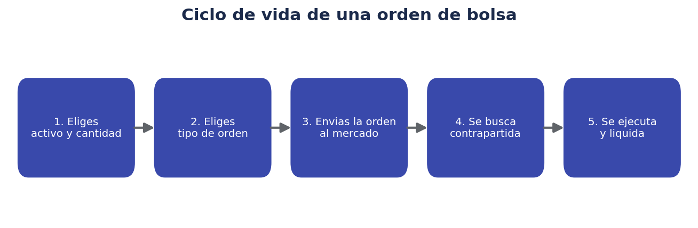
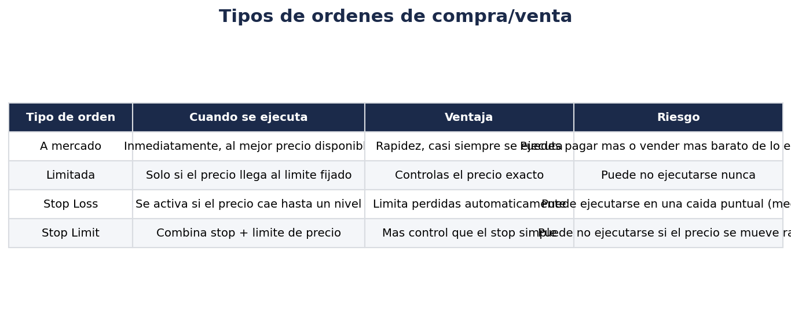
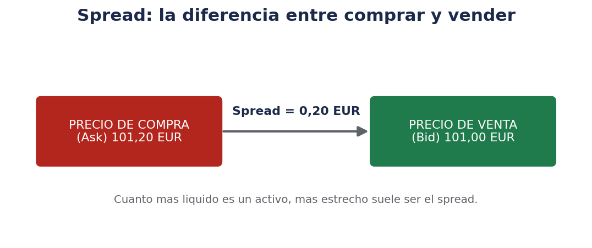

# 🖱️ Cómo funciona una orden de compra/venta

> El momento en el que realmente "haces algo" con tu cuenta de trading es cuando envías una orden. Entender qué tipos existen evita sorpresas.

!!! warning "Recordatorio"
    Este documento explica el funcionamiento técnico de los mercados y de las órdenes. No es una recomendación sobre qué comprar, vender ni cuándo hacerlo.

## 🔄 El ciclo de vida de una orden

Cuando pulsas "comprar" o "vender" en tu app de bróker, ocurre lo siguiente, simplificado:

1. **Eliges el activo y la cantidad** (por ejemplo, 3 participaciones de un ETF).
2. **Eliges el tipo de orden** (a mercado, limitada, stop...), que determina a qué precio y en qué condiciones se ejecutará.
3. **Tu bróker envía la orden al mercado** correspondiente (la bolsa donde cotiza ese activo, o un sistema interno de casamiento de órdenes).
4. **El mercado busca una contrapartida**: alguien que quiera vender (si tú compras) o comprar (si tú vendes) en condiciones compatibles con tu orden.
5. **La orden se ejecuta** (total o parcialmente) **y se liquida**: los títulos pasan a tu cuenta y el efectivo sale de ella (o al revés, si vendes). La liquidación efectiva de los títulos puede tardar uno o varios días hábiles según el mercado (lo habitual en muchos mercados es "T+2", es decir, dos días hábiles tras la operación).

## 🎯 Tipos de órdenes

### Orden a mercado

Se ejecuta **inmediatamente**, al mejor precio disponible en ese momento.

- **Ventaja**: rapidez, prácticamente garantizada su ejecución si hay suficiente liquidez.
- **Riesgo**: en activos poco líquidos o con mucha volatilidad puntual, el precio final de ejecución puede ser distinto (peor) del que veías justo antes de enviar la orden. Esto se conoce como **slippage** (deslizamiento).

### Orden limitada

Se ejecuta **solo si el precio de mercado llega al límite que fijas** (o mejora).

- Si compras con orden limitada a 50 €, solo se ejecutará a 50 € o menos.
- Si vendes con orden limitada a 50 €, solo se ejecutará a 50 € o más.
- **Ventaja**: control total sobre el precio.
- **Riesgo**: puede no llegar a ejecutarse nunca si el mercado no alcanza ese precio.

### Orden stop / stop loss

Se activa (se convierte en una orden a mercado, normalmente) **cuando el precio cae hasta un nivel determinado**, con el objetivo de limitar pérdidas en una posición ya abierta.

- **Ventaja**: automatiza la gestión del riesgo, sin necesidad de estar pendiente todo el día.
- **Riesgo**: en caídas muy rápidas y puntuales ("mechas"), se puede ejecutar a un precio peor del esperado, o activarse por una caída momentánea que luego se recupera.

### Orden stop limit

Combina las dos anteriores: cuando el precio llega al nivel de activación (stop), se genera una orden limitada (no a mercado) con el precio límite que hayas fijado.

- **Ventaja**: más control sobre el precio de ejecución que un stop simple.
- **Riesgo**: si el precio se mueve muy rápido, puede no llegar a ejecutarse porque salte por encima/por debajo del límite fijado sin llegar a cruzarse.

## 💰 Bid, Ask y el spread

En cualquier mercado existen, en todo momento, dos precios:

- **Bid (precio de venta / demanda)**: el precio máximo que alguien está dispuesto a pagar ahora mismo por ese activo.
- **Ask (precio de compra / oferta)**: el precio mínimo al que alguien está dispuesto a vender ahora mismo.

La diferencia entre ambos se llama **spread**. Cuanto más líquido es un activo (más volumen de compraventa), más estrecho suele ser el spread; cuanto menos líquido, más ancho, lo que en la práctica es un coste implícito para quien opera (compras un poco más caro y vendes un poco más barato de lo que parece "el precio" a simple vista).

## 💧 Liquidez y horarios de mercado

La **liquidez** de un mercado o activo se refiere a la facilidad para comprar/vender sin que ello mueva mucho el precio. Factores que afectan a la liquidez:

- **Volumen de negociación**: cuántas operaciones se hacen habitualmente sobre ese activo.
- **Horario de mercado**: cada bolsa tiene un horario de apertura y cierre (por ejemplo, la Bolsa de Madrid opera aproximadamente de 9:00 a 17:30, hora peninsular española, en el mercado continuo; los horarios exactos y las subastas de apertura/cierre conviene consultarlos en la fuente oficial del mercado). Fuera de ese horario, las órdenes pueden quedar pendientes hasta la siguiente sesión, o ejecutarse en mercados fuera de horario con condiciones distintas si el bróker lo ofrece.
- **Festivos y sesiones especiales**: los mercados suelen cerrar en festivos nacionales o locales del país donde radica la bolsa.

Algunos brókers ofrecen también acceso a mercados internacionales (Estados Unidos, otros países europeos), cada uno con su propio horario y calendario de festivos, lo que conviene tener en cuenta al planificar cuándo enviar una orden.

## 📉 ¿Qué es un índice bursátil?

Un **índice bursátil** es un indicador que resume la evolución conjunta de un grupo representativo de activos (normalmente acciones), ponderadas según algún criterio (capitalización bursátil, precio, etc.). Ejemplos habituales:

- **IBEX 35**: las 35 empresas de mayor liquidez cotizadas en la bolsa española.
- **S&P 500**: 500 grandes empresas cotizadas en Estados Unidos.
- **Euro Stoxx 50**: 50 grandes empresas de la zona euro.
- **MSCI World**: miles de empresas de mercados desarrollados de todo el mundo.

Los índices sirven tanto como termómetro del mercado (para saber "cómo va la bolsa" en general) como de referencia para fondos y ETF indexados, que replican su composición.

## 💸 Comisiones habituales de un bróker

Antes de operar, conviene entender qué comisiones puede aplicar tu plataforma, porque afectan directamente a la rentabilidad neta:

| Tipo de comisión | Cuándo se aplica |
|---|---|
| Comisión de compra/venta | Al ejecutar una orden (a veces un importe fijo, a veces un porcentaje) |
| Comisión de custodia | Por mantener activos depositados (algunos brókers no la cobran) |
| Comisión de cambio de divisa | Al comprar activos denominados en una moneda distinta a la de tu cuenta |
| Comisión de gestión (en fondos/ETF) | Cobrada por la gestora del fondo, no por el bróker directamente, y ya está descontada del valor liquidativo |
| Comisión por inactividad | Algunos brókers la cobran si la cuenta no registra actividad durante un periodo prolongado |
| Comisión por retirada de efectivo | Al transferir dinero desde la cuenta a tu banco, en algunos brókers |

Un pequeño porcentaje de comisión puede parecer insignificante en una operación puntual, pero **se acumula a lo largo de los años** y afecta de forma relevante a la rentabilidad final, especialmente si se opera con frecuencia.

## 🧪 Ejemplo práctico simulado paso a paso

Supongamos (ejemplo puramente ilustrativo, sin relación con ningún activo real) que quieres comprar participaciones de un ETF que cotiza a 100 €:

1. Compruebas el **bid/ask**: bid 99,95 €, ask 100,05 € → spread de 0,10 €.
2. Decides una **orden limitada de compra a 100,00 €** (en vez de una orden a mercado) para no pagar el ask completo.
3. Envías la orden. Si alguien está dispuesto a vender a 100,00 € o menos, se ejecuta; si no, queda pendiente.
4. La orden se ejecuta parcialmente: consigues 2 de las 3 participaciones que querías, porque solo había venta disponible para 2 a ese precio.
5. Las 2 participaciones aparecen en tu cartera, normalmente con la liquidación efectiva completándose en los días hábiles siguientes según el mercado.
6. La participación restante puede quedar como orden pendiente (si no la cancelas) hasta que se cumpla el precio o hasta la fecha de caducidad de la orden que hayas configurado (día, semana, "hasta cancelación"...).

## ⏳ Validez de las órdenes

Al enviar una orden, normalmente puedes elegir cuánto tiempo permanece activa si no se ejecuta de inmediato:

- **Día (Day)**: válida solo durante la sesión de ese día; si no se ejecuta, se cancela automáticamente al cierre.
- **Hasta cancelación (GTC – Good Till Cancelled)**: permanece activa varios días hasta que se ejecute o la canceles tú mismo (algunos brókers limitan el máximo de días).
- **Todo o nada / ejecución parcial**: según configuración, una orden se puede ejecutar completa de una vez, o en varias ejecuciones parciales a medida que aparece contrapartida.

## 🏗️ Mercado primario vs. mercado secundario

Es útil distinguir entre dos momentos distintos en la vida de un activo cotizado:

- **Mercado primario**: cuando una empresa (o un Estado) emite por primera vez acciones o bonos para captar capital directamente (por ejemplo, una salida a bolsa u "OPV/IPO", o una subasta de deuda pública). El dinero va directamente al emisor.
- **Mercado secundario**: donde se negocian esos mismos activos entre inversores, una vez ya emitidos (comprar/vender acciones en la bolsa, por ejemplo). El dinero no va a la empresa, sino que cambia de manos entre compradores y vendedores.

Cuando un particular compra acciones de una empresa que ya cotiza desde hace años, casi siempre está operando en el **mercado secundario**: le compra las acciones a otro inversor, no a la empresa directamente.

## 📖 El libro de órdenes (order book) y la profundidad de mercado

Cada mercado mantiene, en todo momento, un **libro de órdenes**: la lista de órdenes de compra y venta pendientes, a distintos precios. Un ejemplo simplificado:

| Compras (Bid) | Precio | Ventas (Ask) |
|---|---|---|
| 150 títulos | 99,90 € | |
| 80 títulos | 99,95 € | |
| | 100,05 € | 120 títulos |
| | 100,10 € | 200 títulos |

En este ejemplo, si envías una orden de compra a mercado, se ejecutaría contra la mejor oferta de venta disponible (100,05 €, por 120 títulos); si tu orden fuera mayor a 120 títulos, el resto se ejecutaría al siguiente nivel de precio disponible (100,10 €), lo que puede hacer que el precio medio de tu compra sea algo superior al precio que veías inicialmente en pantalla. Esto es especialmente relevante en activos poco líquidos o en órdenes de gran tamaño.

La **profundidad de mercado** (cuántas órdenes hay acumuladas a cada nivel de precio) es un indicador de liquidez: cuanta más profundidad, más fácil es ejecutar órdenes grandes sin mover mucho el precio.

## 🤝 Creadores de mercado (market makers)

En muchos mercados existen participantes llamados **creadores de mercado (market makers)**, cuya función es ofrecer continuamente precios de compra y venta para un activo, aportando liquidez incluso cuando no hay coincidencia directa entre compradores y vendedores particulares en ese instante. Su beneficio suele provenir precisamente del spread (compran al bid y venden al ask). Su presencia ayuda a que los mercados, especialmente los menos líquidos, tengan precios disponibles de forma más continua.

## ✂️ Fraccionamiento de acciones (fractional shares)

Tradicionalmente, las acciones se compraban en unidades enteras. Sin embargo, muchos brókers actuales permiten comprar **participaciones fraccionadas** (por ejemplo, 0,1 acciones de una empresa cuyo precio unitario es elevado), lo que facilita diversificar con importes pequeños sin necesidad de reunir el precio completo de una acción cara. Conviene comprobar si tu bróker ofrece esta posibilidad y si tiene alguna particularidad (por ejemplo, restricciones para vender fracciones, o si las fracciones no incluyen derecho de voto).

## 📅 Dividendos: fecha ex-dividendo y pago

Cuando una empresa reparte un dividendo, existen varias fechas relevantes a entender:

- **Fecha de declaración**: cuando la empresa anuncia el dividendo.
- **Fecha ex-dividendo**: a partir de este día, quien compre la acción ya no tiene derecho a cobrar ese dividendo concreto (el derecho se queda con quien la poseía el día anterior). El precio de la acción suele ajustarse a la baja aproximadamente en el importe del dividendo ese mismo día, como reflejo contable de la salida de caja de la empresa.
- **Fecha de registro**: fecha en la que se determina qué accionistas constan como beneficiarios.
- **Fecha de pago**: cuando el dividendo se abona efectivamente en la cuenta.

Es un error común pensar que comprar justo antes de la fecha ex-dividendo es una forma de "ganar dinero fácil": el precio de la acción suele ajustarse a la baja en un importe similar al dividendo, por lo que el efecto neto para quien compra en ese momento concreto no es tan ventajoso como parece a simple vista, y además el dividendo tributa.

## 🌐 Operar en mercados internacionales

Si tu bróker permite comprar activos que cotizan en otros países, ten en cuenta:

- **Horario distinto**: por ejemplo, el mercado estadounidense abre por la tarde en horario peninsular español.
- **Divisa distinta**: si compras en dólares u otra moneda, existe conversión de divisa (con su comisión asociada) y riesgo de tipo de cambio sobre el resultado final en euros.
- **Festivos distintos**: cada mercado tiene su propio calendario de días no operativos.
- **Retenciones fiscales internacionales**: los dividendos de empresas extranjeras pueden sufrir una retención en origen (por ejemplo, en Estados Unidos), que en muchos casos se puede recuperar parcialmente gracias a los convenios de doble imposición entre países, aunque el trámite y el porcentaje recuperable dependen de cada caso.

## ❓ FAQ de esta carpeta

**¿Por qué el precio que veo en la app no es exactamente al que se ejecuta mi orden?**
Porque entre que ves el precio y envías la orden, el mercado puede haberse movido, y porque una orden a mercado se ejecuta contra el libro de órdenes disponible en ese instante (ver la sección de profundidad de mercado), no contra un precio fijo.

**¿Qué pasa si envío una orden y luego me arrepiento?**
Si aún no se ha ejecutado (por ejemplo, una orden limitada que no ha llegado a su precio), normalmente puedes cancelarla desde la app antes de que se ejecute. Si ya se ha ejecutado, tendrías que enviar una orden en sentido contrario para deshacer la posición, asumiendo el precio de mercado del momento.

**¿Es mejor operar siempre con órdenes limitadas?**
No necesariamente: en activos muy líquidos (grandes índices, grandes empresas) una orden a mercado suele ejecutarse a un precio muy similar al que ves en pantalla. En activos poco líquidos, una orden limitada da más control, a cambio de no garantizar la ejecución.

**¿Puedo perder dinero solo por el spread, sin que el precio "real" cambie?**
Sí: si compras al ask y vendes inmediatamente al bid, sin que el precio subyacente se mueva, pagarías el spread completo como coste, sin haber ganado ni perdido por movimiento de mercado.

## 🕹️ Simuladores y cuentas demo antes de operar con dinero real

Antes de enviar tu primera orden real, muchos brókers ofrecen una **cuenta demo o simulador**, que permite practicar el envío de distintos tipos de órdenes con dinero ficticio y condiciones de mercado reales (o casi reales). Aunque el comportamiento psicológico ante una pérdida "de mentira" nunca es idéntico al de una pérdida real, sí es una forma útil de:

- Familiarizarte con la interfaz de tu bróker sin riesgo.
- Comprobar cómo se comportan las órdenes limitadas y stop en la práctica.
- Detectar errores de manejo (por ejemplo, confundir cantidad con importe, o el tipo de orden) antes de que cuesten dinero real.

Si tu plataforma no ofrece cuenta demo, una alternativa razonable es empezar directamente con importes muy pequeños en la cuenta real, asumiendo que ese dinero forma parte del "coste de aprendizaje".

## 🧭 Resumen visual del proceso completo

Uniendo todo lo visto en este documento, el proceso completo de una operación sería:

1. Analizas el activo y decides cantidad y tipo de orden (mercado, limitada, stop...).
2. Compruebas el bid/ask y la profundidad de mercado disponible.
3. Envías la orden dentro del horario de negociación del mercado correspondiente.
4. La orden se casa contra el libro de órdenes (total o parcialmente).
5. Se liquida la operación (normalmente T+2 en muchos mercados de acciones).
6. La posición aparece en tu cartera, con su coste medio, valor de mercado y rentabilidad no realizada actualizándose en tiempo real.
7. Si el activo reparte dividendos, se aplican las fechas ex-dividendo, registro y pago correspondientes.

## ⚠️ Errores frecuentes al enviar órdenes

- **Confundir "cantidad" con "importe"**: algunos brókers permiten indicar cuánto dinero quieres invertir (y calculan cuántos títulos o fracciones te corresponden), y otros piden directamente el número de títulos. Revisar bien qué está pidiendo la app antes de confirmar.
- **No fijar un precio límite en activos poco líquidos**: enviar una orden a mercado en un activo con poco volumen puede ejecutarse a un precio bastante distinto del esperado.
- **Olvidar cancelar órdenes pendientes** que ya no tienen sentido, y que se ejecutan más adelante en un contexto de mercado distinto al que las motivó.
- **No revisar el horario del mercado de destino**, sobre todo al operar en mercados internacionales con husos horarios distintos.
- **Enviar una orden de venta sin comprobar antes si el activo tiene alguna restricción temporal** (por ejemplo, periodos de bloqueo en ciertos productos o promociones de bienvenida de algunos brókers).

## ✅ Resumen de este documento

- Una orden pasa por varias fases: creación, envío al mercado, búsqueda de contrapartida, ejecución y liquidación.
- Existen varios tipos de órdenes (mercado, limitada, stop loss, stop limit), cada una con ventajas y riesgos distintos.
- El spread (diferencia entre bid y ask) es un coste implícito que depende de la liquidez del activo.
- Los horarios de mercado y la liquidez afectan a cuándo y a qué precio se ejecuta una orden.
- Las comisiones (compra/venta, custodia, cambio de divisa...) impactan la rentabilidad neta a largo plazo.

## 🗣️ Términos en inglés que verás en casi cualquier app de bróker

Muchas plataformas, aunque estén traducidas al español, mantienen términos en inglés en pantallas concretas o en informes. Una pequeña chuleta:

| Inglés | Español |
|---|---|
| Market order | Orden a mercado |
| Limit order | Orden limitada |
| Stop loss | Orden de stop / limitación de pérdidas |
| Bid / Ask | Precio de compra / Precio de venta |
| Spread | Diferencial entre bid y ask |
| Order book | Libro de órdenes |
| Fill / Filled | Ejecución / Ejecutada |
| Pending order | Orden pendiente |
| Settlement | Liquidación |
| Ex-dividend date | Fecha ex-dividendo |

## 🔗 Para seguir profundizando

Entender el mecanismo de las órdenes es solo la mitad del trabajo: la otra mitad es decidir con criterio cuándo y cuánto comprar o vender, algo que depende directamente de tu perfil de riesgo y de tu estrategia de diversificación. Ese es precisamente el tema del siguiente documento de esta carpeta.

---

Anterior: [01 · Tipos de activos](01-tipos-de-activos.md) · Siguiente: [03 · Riesgo, diversificación y fiscalidad](03-riesgo-diversificacion-fiscalidad.md)
