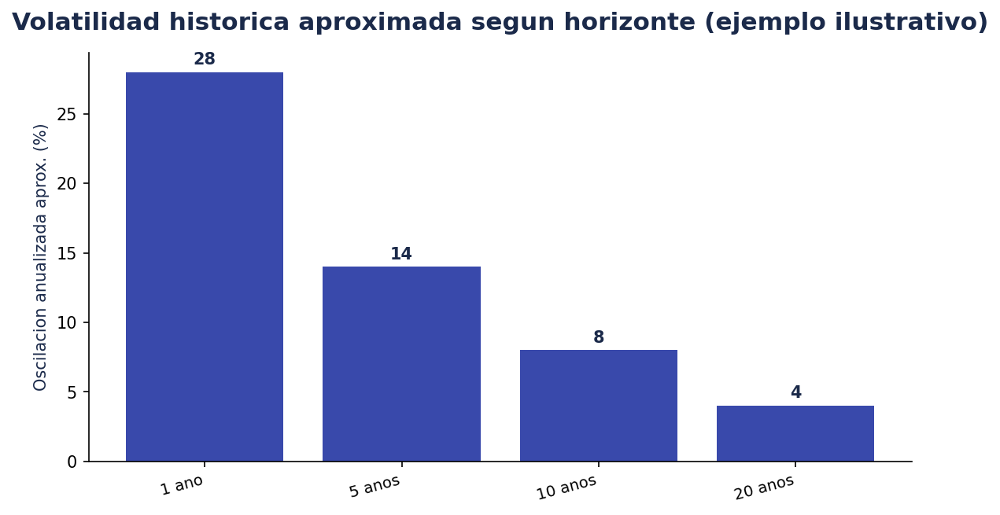
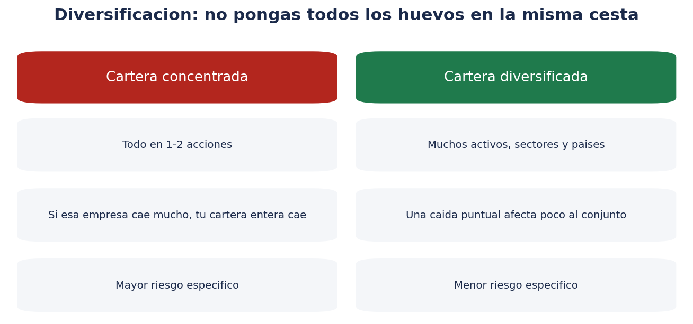
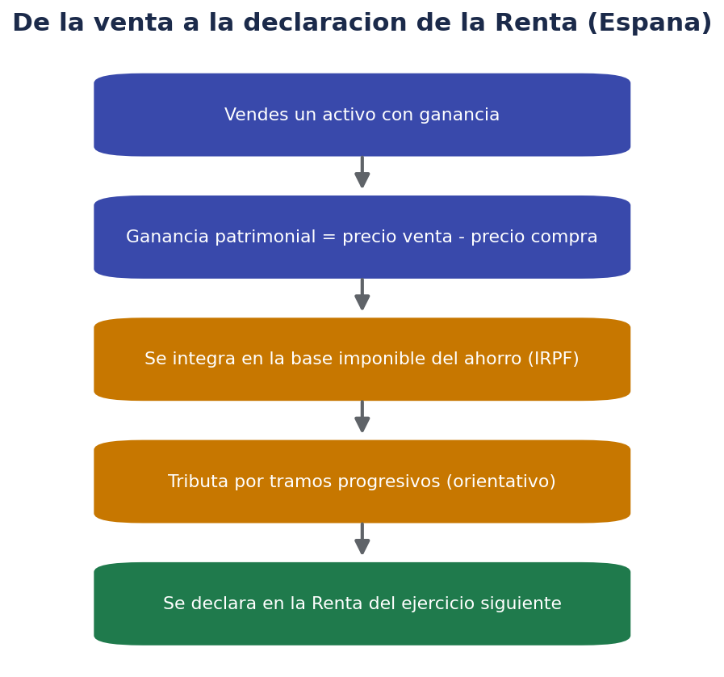

# ⚖️ Riesgo, diversificación y fiscalidad básica

> Saber qué puede salir mal (y cómo repartir el riesgo) es tan importante como saber qué comprar.

!!! warning "Recordatorio"
    La información fiscal de este documento es orientativa y de carácter general para España, con datos de referencia de 2026. La normativa fiscal cambia y tiene matices personales (comunidad autónoma, otras rentas, etc.). Antes de declarar impuestos, consulta a un asesor fiscal o la Agencia Tributaria.

## 🌪️ ¿Qué es el riesgo, en la práctica?

El **riesgo** de una inversión es la posibilidad de que el resultado real sea distinto (y peor) del esperado. No es un concepto abstracto: se puede observar en la **volatilidad**, es decir, cuánto oscila el precio de un activo en el tiempo.

Una idea importante (ilustrada de forma simplificada en el gráfico anterior): **cuanto mayor es el horizonte temporal, menor suele ser la oscilación anualizada media de una cartera diversificada de renta variable**, porque los periodos malos tienden a compensarse con los buenos a largo plazo. Esto no elimina el riesgo (pueden existir periodos largos de rentabilidad baja o negativa), pero ayuda a entender por qué el horizonte temporal es una variable clave a la hora de asumir más o menos riesgo.

Tipos de riesgo que conviene conocer:

- **Riesgo de mercado**: el precio de un activo baja por factores generales del mercado (crisis económica, subida de tipos de interés, etc.), no por algo específico de ese activo.
- **Riesgo específico (o idiosincrático)**: algo va mal en una empresa o emisor concreto (mala gestión, escándalo, quiebra).
- **Riesgo de liquidez**: dificultad para vender un activo rápidamente sin asumir una pérdida de valor relevante.
- **Riesgo de tipo de cambio**: si inviertes en activos denominados en otra divisa, el resultado final en euros depende también de cómo evolucione el tipo de cambio.
- **Riesgo de crédito / contraparte**: el emisor de un bono, o la entidad con la que operas, no cumple sus obligaciones (impago, quiebra).
- **Riesgo regulatorio**: cambios normativos que afectan al valor o a la operativa de un activo (más relevante todavía en criptoactivos, como se explica en la carpeta `criptomonedas/`).

## 🧺 Diversificación: no pongas todos los huevos en la misma cesta

La **diversificación** consiste en repartir la inversión entre distintos activos, sectores, países y, en algunos casos, divisas, de forma que **el riesgo específico de un solo activo no determine el resultado de toda la cartera**.

Formas habituales de diversificar:

- **Por tipo de activo**: combinar renta fija y renta variable, por ejemplo.
- **Por sector**: no concentrar todo en un único sector económico (tecnología, energía, banca...).
- **Por geografía**: no invertir solo en empresas de un único país.
- **Por número de emisores**: en renta fija, no concentrar todo en un único emisor.
- **Por tiempo (DCA – Dollar Cost Averaging / aportaciones periódicas)**: invertir una cantidad fija de forma periódica (por ejemplo, mensual) en lugar de todo de golpe, para repartir también el "riesgo del momento de entrada".

Una forma sencilla y muy utilizada de diversificar de golpe es invertir en **fondos indexados o ETF globales**, que ya reparten automáticamente la inversión entre cientos o miles de empresas de distintos países y sectores.

## 🧠 Perfil de riesgo, revisado

Como se explicó en `00-introduccion.md`, el perfil de riesgo depende del horizonte temporal, la capacidad financiera y la tolerancia emocional. Una pregunta útil para calibrarlo: *"si mi inversión bajara un 20-30% el mes que viene, ¿qué haría? ¿Vendería por pánico, o entendería que es una fluctuación dentro de lo esperado para ese tipo de activo?"*. Si la respuesta es "vendería por pánico", puede que el nivel de riesgo asumido sea mayor del que realmente toleras, independientemente de lo que "en teoría" deberías aguantar según tu edad u horizonte.

## 🚫 Errores comunes de principiante (ampliado)

1. **No diversificar**: concentrar todo en una empresa, sector o activo de moda.
2. **Invertir por FOMO** (Fear Of Missing Out): comprar solo porque algo ha subido mucho y "todo el mundo habla de ello".
3. **Vender en pánico**: liquidar posiciones en el peor momento de una caída, convirtiendo una pérdida "en papel" en una pérdida real.
4. **Ignorar las comisiones**: no comparar comisiones entre productos similares (por ejemplo, entre dos fondos indexados que replican el mismo índice).
5. **Usar apalancamiento sin entenderlo**: multiplicar el riesgo sin ser consciente de que también se puede perder más del capital depositado.
6. **No tener un plan por escrito**: invertir "a ojo", sin definir de antemano objetivo, horizonte, perfil de riesgo y qué harías ante distintos escenarios.
7. **Revisar la cartera compulsivamente**: mirar la cotización varias veces al día no cambia el resultado a largo plazo, pero sí puede generar ansiedad y decisiones impulsivas.
8. **Confundir suerte con habilidad**: acertar una vez con una inversión concentrada no significa que la estrategia sea buena; la aleatoriedad juega un papel importante a corto plazo.

## 🧾 Fiscalidad básica de la inversión en España

En España, con carácter general (y simplificando mucho, sin entrar en casos especiales):

- Las **ganancias y pérdidas patrimoniales** derivadas de la venta de acciones, ETF, fondos (en el momento del reembolso final, no del traspaso) y otros valores se integran en la **base imponible del ahorro** del IRPF.
- Los **dividendos** y **cupones de renta fija** también tributan en la base imponible del ahorro, como rendimientos del capital mobiliario.
- La base imponible del ahorro tributa por **tramos progresivos** (los tipos y umbrales exactos se actualizan periódicamente en la normativa del IRPF; conviene consultar la Agencia Tributaria o un asesor fiscal para la cifra vigente en el ejercicio concreto).
- Existe la posibilidad de **compensar pérdidas con ganancias** dentro de ciertos límites y plazos (por ejemplo, si vendes con pérdidas un activo y con ganancias otro en el mismo ejercicio, o en los cuatro años siguientes según el caso).
- Los **traspasos entre fondos de inversión** (no entre ETF) no generan tributación en el momento del traspaso, a diferencia de vender un ETF y comprar otro, que sí se considera una venta a efectos fiscales.
- Existe la obligación de declarar determinados activos y cuentas en el extranjero por encima de ciertos umbrales (por ejemplo, a través del modelo informativo correspondiente), algo especialmente relevante si usas un bróker o exchange domiciliado fuera de España.

!!! danger "Esto no es asesoramiento fiscal"
    Los porcentajes, tramos y obligaciones fiscales cambian con cada Ley de Presupuestos y pueden variar según tu situación personal (otras rentas, comunidad autónoma, residencia fiscal). Antes de tomar decisiones basadas en la fiscalidad, consulta siempre con un asesor fiscal o las fuentes oficiales de la Agencia Tributaria.

## 📅 ¿Cuándo hay que declarar?

De forma general:

- Las ganancias/pérdidas y rendimientos del capital mobiliario generados durante un año natural se declaran en la **Renta** del ejercicio siguiente (la campaña de la Renta suele abrirse entre abril y junio).
- Tu bróker, si está domiciliado en España, suele facilitar un **resumen fiscal anual** con las operaciones realizadas, útil para la declaración (aunque la responsabilidad de declarar correctamente sigue siendo del contribuyente).
- Si operas con brókers o exchanges extranjeros, es tu responsabilidad recopilar la información necesaria, ya que no siempre generan un documento fiscal español automático.

## 🔗 Correlación: la clave técnica de la diversificación real

Diversificar no es solo "tener muchos activos distintos": es importante que esos activos **no se muevan todos igual al mismo tiempo**. A esto se le llama **correlación**:

- **Correlación alta (cercana a +1)**: los activos suben y bajan juntos, casi al mismo tiempo y en la misma proporción. Tener varios activos muy correlacionados aporta poca diversificación real, aunque parezcan "distintos" a simple vista.
- **Correlación baja o negativa**: los activos se mueven de forma más independiente (o incluso en direcciones opuestas). Combinarlos reduce más la volatilidad conjunta de la cartera.

Por ejemplo, dos acciones tecnológicas de empresas distintas pueden tener una correlación alta entre sí (si el sector tecnológico global sufre, ambas suelen bajar a la vez), mientras que una acción y un bono del Estado suelen tener, históricamente, una correlación más baja entre sí. Esto no es una regla fija (las correlaciones cambian con el tiempo y en momentos de crisis muchos activos tienden a caer a la vez), pero ayuda a entender por qué "tener 15 acciones distintas del mismo sector" diversifica mucho menos de lo que parece.

## 🧮 Ejemplo numérico simplificado del efecto de diversificar

Un ejemplo puramente ilustrativo (sin relación con ningún activo real) para visualizar el efecto:

| Escenario | Activo A (rentabilidad anual) | Activo B (rentabilidad anual) | Cartera 50/50 |
|---|---|---|---|
| Año 1 | +20 % | -5 % | +7,5 % |
| Año 2 | -15 % | +10 % | -2,5 % |
| Año 3 | +8 % | +8 % | +8 % |
| Media simple | +4,3 % | +4,3 % | +4,3 % |
| Oscilación (aprox.) | Alta | Alta | Más suave |

La rentabilidad media de la cartera combinada es similar a la de cada activo por separado, pero **la oscilación (el riesgo) de la cartera combinada es menor** que la de cualquiera de los dos activos individuales, precisamente porque no se mueven exactamente igual. Este es el efecto central de la diversificación: no necesariamente aumenta la rentabilidad esperada, pero puede reducir el riesgo para una rentabilidad esperada similar.

## ⚖️ Rebalanceo de cartera

Con el tiempo, los distintos activos de una cartera evolucionan de forma distinta, por lo que los porcentajes iniciales (por ejemplo, 60 % renta variable / 40 % renta fija) se van descuadrando. El **rebalanceo** consiste en ajustar periódicamente la cartera para volver a los porcentajes objetivo, lo que en la práctica implica:

- Vender una parte de lo que más ha subido (y por tanto pesa más de lo previsto).
- Comprar más de lo que se ha quedado rezagado, para recuperar el peso objetivo.

Esto tiene un efecto disciplinado casi automático de "vender relativamente caro y comprar relativamente barato", aunque conviene tener en cuenta el impacto fiscal de vender (ver más abajo) y los costes de cada operación. El rebalanceo se puede hacer con una periodicidad fija (por ejemplo, una vez al año) o cuando el desvío respecto al objetivo supera un umbral determinado (por ejemplo, un 5-10 %).

## 📊 Cómo funcionan los tramos del ahorro en el IRPF (ejemplo orientativo)

Para hacerse una idea de cómo funciona la progresividad de la base del ahorro (sin que estas cifras concretas deban tomarse como definitivas, ya que se actualizan por ley), un ejemplo simplificado de estructura por tramos podría verse así:

| Tramo de base imponible del ahorro | Tipo aproximado |
|---|---|
| Primeros ~6.000 € | Tipo más bajo del tramo |
| Siguiente tramo (~6.000 € a ~50.000 €) | Tipo intermedio |
| Siguiente tramo (~50.000 € a ~200.000 €) | Tipo más alto intermedio |
| Por encima de ~200.000 € (aprox.) | Tipo máximo del tramo |

*(Los importes y porcentajes exactos vigentes cada año deben consultarse en la normativa actualizada del IRPF o con un asesor fiscal; esta tabla solo ilustra el concepto de progresividad por tramos, no las cifras exactas del ejercicio actual.)*

Un matiz importante: estos tramos se aplican de forma progresiva, es decir, cada tramo de tu ganancia tributa al tipo correspondiente a ese tramo, no todo al tipo más alto que alcances.

## 💧 Retenciones a cuenta

En muchos casos (dividendos, algunos reembolsos de fondos, cupones), el bróker o la entidad pagadora aplica una **retención a cuenta** en el momento del pago, que luego se regulariza en la declaración de la Renta (puede salir a devolver o a pagar más, según el resultado final del ejercicio completo). No confundir la retención con el impuesto definitivo: es un adelanto, no el cálculo final.

## 🌍 Activos y cuentas en el extranjero

Si operas con un bróker, exchange o entidad domiciliada fuera de España, pueden existir obligaciones informativas adicionales (por ejemplo, declarar la tenencia de determinados activos o cuentas en el extranjero por encima de ciertos umbrales, a través del modelo informativo correspondiente de la Agencia Tributaria). El incumplimiento de estas obligaciones informativas puede conllevar sanciones significativas, por lo que, si es tu caso, conviene informarse con detalle o consultar a un asesor fiscal específicamente sobre este punto.

## ❓ FAQ de esta carpeta

**¿Diversificar garantiza que no voy a perder dinero?**
No. Diversificar reduce el riesgo específico de un activo o sector concreto, pero no elimina el riesgo de mercado general (por ejemplo, una crisis económica global puede afectar a la mayoría de activos de riesgo a la vez, aunque en distinta medida).

**¿Tengo que rebalancear mi cartera constantemente?**
No es necesario hacerlo con mucha frecuencia; de hecho, rebalancear demasiado a menudo puede generar más costes (comisiones, impacto fiscal) que beneficio. Una revisión anual o ante desviaciones significativas suele ser suficiente para la mayoría de perfiles.

**¿Cuánto es "demasiado concentrado"?**
No hay un umbral universal, pero si una sola posición representa una parte muy relevante de tu patrimonio invertido (por ejemplo, más del 10-20 % en una única empresa), conviene plantearse si ese nivel de concentración es coherente con tu tolerancia al riesgo.

**¿Declarar mal una ganancia puede tener consecuencias?**
Sí, tanto por defecto (no declarar algo que se debía declarar) como por exceso de complejidad mal gestionada. Ante cualquier duda sobre un caso concreto, la vía más segura es consultar a un asesor fiscal o los canales oficiales de la Agencia Tributaria.

## 🧮 Gestión práctica del riesgo: algunas pautas generales

- **Define por escrito tu plan de inversión** antes de empezar: objetivo, horizonte, perfil de riesgo, y qué harías ante caídas del 10 %, 20 % o 30 %.
- **Invierte solo dinero que no necesites a corto/medio plazo**, coherente con el horizonte de cada inversión concreta.
- **Diversifica** entre tipos de activo, sectores y geografías, en lugar de concentrar en pocas apuestas.
- **Automatiza aportaciones periódicas** si tu estrategia lo permite, para reducir el impacto de intentar "acertar el momento".
- **Revisa la cartera con una frecuencia razonable** (por ejemplo, trimestral o anual), no a diario.
- **No inviertas en algo que no entiendes**, por muy de moda que esté.

## 🧠 Sesgos psicológicos que afectan a la gestión del riesgo

La gestión del riesgo no es solo matemática: buena parte de las decisiones de inversión están condicionadas por sesgos cognitivos conocidos. Algunos de los más relevantes:

- **Aversión a la pérdida**: solemos sentir más dolor por perder una cantidad que placer por ganar la misma cantidad, lo que puede llevar a vender activos ganadores demasiado pronto (por miedo a que "se dé la vuelta") y mantener activos perdedores demasiado tiempo (esperando "recuperar" antes de asumir la pérdida).
- **Anclaje**: dar demasiado peso al precio al que compraste un activo (tu "precio de referencia mental"), en lugar de evaluar la situación actual de forma objetiva.
- **Efecto rebaño (herd behavior)**: comprar o vender simplemente porque "todo el mundo lo está haciendo", sin un análisis propio.
- **Exceso de confianza**: sobrestimar la propia capacidad de predecir el mercado, especialmente después de una racha de aciertos que puede deberse en gran parte al azar.
- **Sesgo de confirmación**: buscar únicamente información que confirme una decisión ya tomada, ignorando señales en contra.

Ser consciente de estos sesgos no los elimina por completo, pero ayuda a introducir mecanismos que los contrarresten: reglas escritas de antemano, automatización de aportaciones, y evitar revisar la cartera con excesiva frecuencia.

## 📝 Plantilla sencilla de política de inversión personal

Escribir (aunque sea de forma breve) una **política de inversión personal** antes de empezar ayuda a tomar decisiones más racionales en momentos de volatilidad. Podría incluir:

1. **Objetivo**: ¿para qué invierto este dinero? (jubilación, entrada de vivienda, complementar ingresos...)
2. **Horizonte temporal**: ¿cuándo voy a necesitar este dinero?
3. **Perfil de riesgo asumido**: conservador / moderado / dinámico, y por qué.
4. **Composición objetivo de la cartera**: qué porcentaje en cada tipo de activo.
5. **Criterio de rebalanceo**: cada cuánto tiempo, o ante qué desviación.
6. **Qué haré ante una caída del 20-30 %**: ¿mantener el rumbo, revisar el plan, aportar más si el horizonte lo permite?
7. **Qué NO voy a hacer**: por ejemplo, no invertir a crédito, no usar apalancamiento sin formación específica, no invertir en productos que no entienda.

Tener esto por escrito, aunque sea en una nota simple, ayuda a no improvisar decisiones importantes en el peor momento posible: en plena caída de mercado, con la parte emocional del cerebro más activada que la racional.

## 🌡️ Riesgo país y riesgo divisa, brevemente

Al invertir en activos de otros países o denominados en otras divisas, se añaden dos capas de riesgo adicionales:

- **Riesgo país**: factores políticos, económicos o regulatorios propios de un país concreto que pueden afectar al valor de sus activos, independientemente de la calidad de la empresa o emisor concreto.
- **Riesgo divisa**: si el activo está denominado en una moneda distinta al euro, el resultado final en euros depende también de cómo evolucione el tipo de cambio, lo que puede tanto amplificar como reducir la rentabilidad final.

Algunos productos (fondos y ETF "cubiertos" o *hedged*) intentan neutralizar el riesgo divisa mediante instrumentos financieros específicos, a cambio de un coste adicional; otros lo dejan expuesto sin cobertura. Merece la pena comprobar esta característica en la ficha del producto si inviertes en activos en otra divisa.

## ✅ Resumen de este documento

- El riesgo tiene varias caras: mercado, específico, liquidez, tipo de cambio, crédito y regulatorio.
- La diversificación (por activo, sector, geografía y tiempo) reduce el riesgo específico de la cartera.
- Los errores más comunes de principiante suelen ser emocionales (FOMO, pánico) más que técnicos.
- En España, ganancias, dividendos y cupones tributan en la base del ahorro del IRPF por tramos progresivos.
- Los traspasos entre fondos no tributan; vender un ETF sí se considera venta a efectos fiscales.
- Ante cualquier duda fiscal concreta, conviene acudir a un asesor fiscal o a la Agencia Tributaria.

## 📐 Compensación de pérdidas y ganancias: idea general

Cuando en un mismo ejercicio fiscal se producen tanto ganancias como pérdidas patrimoniales, la normativa española permite, con carácter general, compensarlas entre sí dentro de la base del ahorro, y si tras esa compensación queda un saldo negativo, trasladarlo (dentro de ciertos límites y plazos, habitualmente varios años) a ejercicios futuros para compensarlo con ganancias posteriores. Los porcentajes máximos de compensación entre distintos tipos de rendimientos (por ejemplo, entre ganancias patrimoniales y rendimientos del capital mobiliario) y los plazos exactos están sujetos a la normativa vigente del IRPF, por lo que, ante un caso concreto con importes relevantes, lo más seguro es consultarlo con un asesor fiscal o las guías oficiales de la Agencia Tributaria antes de planificar ninguna operación pensando únicamente en el efecto fiscal.

## 🛡️ Tabla resumen: tipo de riesgo y forma habitual de mitigarlo

| Tipo de riesgo | Forma habitual de mitigarlo (no eliminarlo por completo) |
|---|---|
| Riesgo de mercado | Horizonte temporal adecuado, diversificación amplia |
| Riesgo específico de un activo | Diversificar entre varios emisores/empresas |
| Riesgo de liquidez | Elegir activos con volumen de negociación suficiente |
| Riesgo de tipo de cambio | Diversificar divisas, o usar productos cubiertos (hedged) si procede |
| Riesgo de crédito/contraparte | Elegir emisores de buena calidad crediticia, diversificar entre emisores |
| Riesgo regulatorio | Informarse sobre el marco legal del producto y del intermediario |
| Riesgo emocional/conductual | Política de inversión escrita, automatización de aportaciones |

## 🧩 Relación entre riesgo, fiscalidad y decisiones prácticas

Un matiz que se suele pasar por alto: la fiscalidad puede influir en decisiones de gestión del riesgo. Por ejemplo, vender una posición ganadora genera una ganancia patrimonial que tributa ese mismo ejercicio, mientras que mantenerla difiere esa tributación (aunque no elimina el riesgo de mercado de seguir manteniéndola). Del mismo modo, materializar una pérdida antes de fin de año puede permitir compensarla con ganancias del mismo ejercicio, dentro de los límites y plazos que marca la normativa. Estas decisiones no deberían tomarse solo por el efecto fiscal, sino integrando también el riesgo y el objetivo de la inversión, pero conviene tenerlas en cuenta especialmente en los meses finales del año fiscal.

## 🔗 Cómo conecta este documento con el resto de la carpeta

Este documento cierra el círculo entre lo visto en `01-tipos-de-activos.md` (qué se puede comprar) y `02-ordenes-y-mercados.md` (cómo se compra): ahora se añade la pregunta de **cuánto, en qué combinación y con qué implicaciones fiscales**. El siguiente documento, `04-glosario-primeros-pasos.md`, recopila todos los términos vistos hasta ahora y ofrece una checklist práctica para dar el primer paso.

## 🗒️ Nota sobre cómo aplicar esto en la práctica diaria

No hace falta calcular correlaciones exactas ni tablas estadísticas complejas para aplicar los principios de este documento: basta con revisar, de forma periódica, si tu cartera sigue repartida entre distintos tipos de activo, sectores y geografías, si tu horizonte temporal sigue siendo coherente con el riesgo asumido, y si estás llevando un registro mínimo de tus operaciones para la futura declaración fiscal. La disciplina y la constancia en estos hábitos simples suelen aportar más valor a largo plazo que intentar optimizar cada decisión al milímetro.

## 📋 Checklist rápida de este documento

- [ ] Entiendo la diferencia entre riesgo de mercado, específico, liquidez, divisa, crédito y regulatorio.
- [ ] Sé qué significa correlación y por qué afecta a la diversificación real.
- [ ] Sé qué es el rebalanceo y con qué frecuencia razonable se suele hacer.
- [ ] Tengo una idea general de cómo tributan ganancias, dividendos y cupones en España.
- [ ] Conozco al menos dos sesgos psicológicos que podrían afectar a mis decisiones.
- [ ] He empezado a esbozar mi propia política de inversión personal, aunque sea breve.

## 🧭 Última idea antes de seguir

Si algo hay que retener de este documento es que **el riesgo no se elimina, se gestiona**: mediante diversificación, horizonte temporal coherente, disciplina frente a los sesgos psicológicos propios, y conocimiento de las implicaciones fiscales de cada decisión. Ninguna estrategia elimina por completo la posibilidad de pérdidas, pero una gestión razonable del riesgo reduce la probabilidad de errores graves e irreversibles.

---

Anterior: [02 · Órdenes y mercados](02-ordenes-y-mercados.md) · Siguiente: [04 · Glosario y primeros pasos](04-glosario-primeros-pasos.md)
