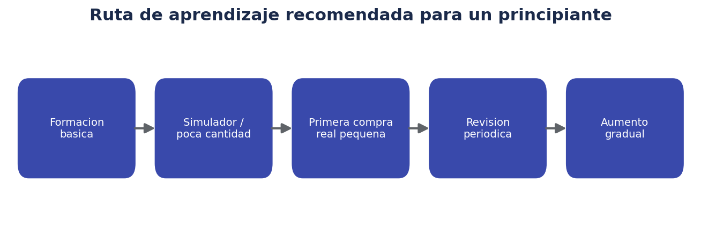
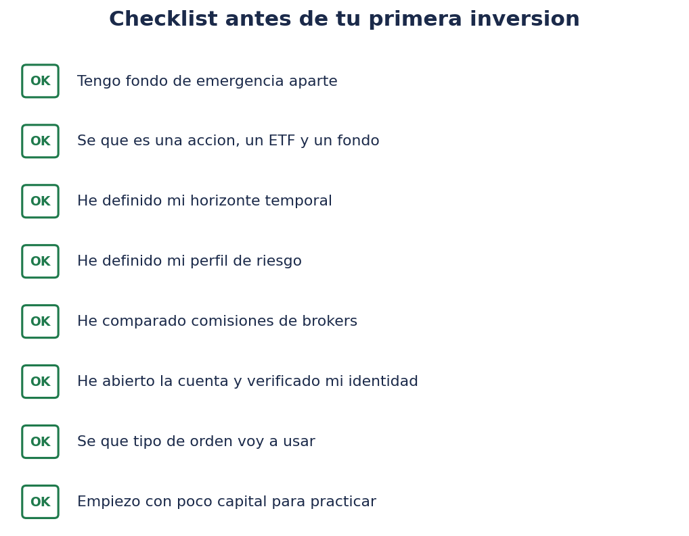
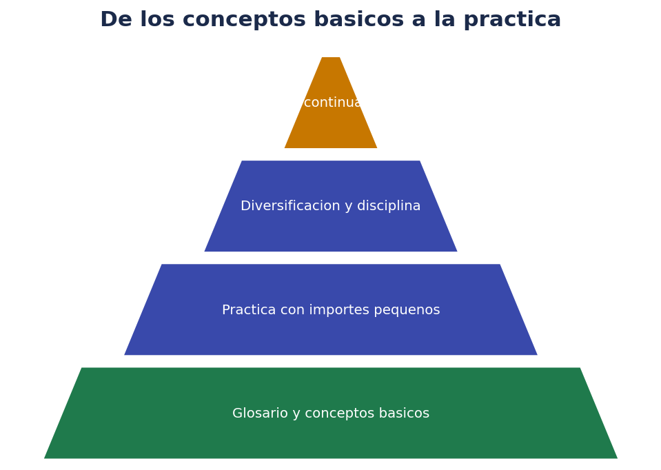

# 📘 Glosario y primeros pasos prácticos

> La chuleta de consulta rápida: términos que vas a encontrar en tu bróker, y un plan ordenado para empezar sin agobiarte.

## 🧭 Ruta de aprendizaje recomendada

1. **Formación básica**: los cuatro documentos anteriores de esta carpeta, más las fuentes oficiales (CNMV, Finanzas para Todos).
2. **Simulador o importe muy pequeño**: si tu bróker ofrece una cuenta demo, úsala; si no, empieza con una cantidad simbólica.
3. **Primera compra real pequeña**: un solo activo sencillo de entender (por ejemplo, un ETF indexado global), en una cantidad con la que te sientas cómodo.
4. **Revisión periódica**: no diaria. Trimestral o semestral es razonable para la mayoría de perfiles.
5. **Aumento gradual**: solo cuando entiendas bien lo que has hecho hasta ahora y tu situación financiera lo permita.

## ✅ Checklist antes de tu primera inversión

- [ ] Tengo un fondo de emergencia aparte, en algo líquido.
- [ ] Sé qué es una acción, un bono, un fondo y un ETF, y en qué se diferencian.
- [ ] He definido mi horizonte temporal para este dinero concreto.
- [ ] He definido (de forma realista, no aspiracional) mi perfil de riesgo.
- [ ] He comparado comisiones entre al menos dos brókers o productos similares.
- [ ] He verificado que la entidad con la que voy a operar está regulada (CNMV o equivalente en la UE).
- [ ] Sé qué tipo de orden voy a usar (mercado, limitada...) y por qué.
- [ ] Voy a empezar con una cantidad pequeña, asumible si algo sale mal.
- [ ] He leído la ficha de datos fundamentales (KID/DFI) del producto que voy a comprar.
- [ ] Tengo claro que esto no es asesoramiento financiero personalizado y que la decisión final es mía.

## 🗺️ De los conceptos básicos a la práctica

## 📖 Glosario extenso

| Término | Definición |
|---|---|
| **Acción** | Parte proporcional de la propiedad de una empresa cotizada |
| **Activo** | Cualquier bien o instrumento financiero que se puede comprar/vender |
| **Ask** | Precio mínimo al que alguien está dispuesto a vender ahora mismo |
| **Apalancamiento** | Operar con una posición mayor que el capital depositado, multiplicando ganancias y pérdidas |
| **Base imponible del ahorro** | Parte de la declaración de la Renta donde tributan ganancias, dividendos e intereses en España |
| **Bid** | Precio máximo al que alguien está dispuesto a comprar ahora mismo |
| **Bróker** | Intermediario financiero que permite comprar/vender activos en los mercados |
| **Capitalización bursátil** | Valor total de una empresa cotizada (precio de la acción × número de acciones) |
| **Cartera / portfolio** | Conjunto de activos que posee un inversor |
| **CFD** | Contrato por diferencias, derivado apalancado sobre el precio de otro activo |
| **Comisión de custodia** | Coste por mantener activos depositados en el bróker |
| **Cotización** | Precio al que se está negociando un activo en un momento dado |
| **Cupón** | Pago periódico de intereses de un bono |
| **Dividendo** | Parte del beneficio de una empresa repartido entre sus accionistas |
| **Diversificación** | Repartir la inversión entre distintos activos para reducir el riesgo específico |
| **ETF** | Fondo cotizado en bolsa que replica un índice u otra cesta de activos |
| **Fondo de emergencia** | Ahorro líquido reservado para imprevistos, antes de invertir |
| **Fondo de inversión** | Vehículo que agrupa dinero de varios inversores para invertir según una estrategia |
| **Fondo indexado** | Fondo o ETF que replica un índice bursátil de forma pasiva |
| **FOGAIN** | Fondo de Garantía de Inversiones en España, cubre insolvencia del intermediario (no pérdidas de mercado) |
| **Futuro** | Contrato para comprar/vender un activo a un precio fijado en una fecha futura |
| **Ganancia/pérdida patrimonial** | Diferencia entre precio de venta y de compra de un activo |
| **GTC (Good Till Cancelled)** | Orden que permanece activa hasta ejecutarse o ser cancelada manualmente |
| **IBEX 35** | Índice de referencia de la bolsa española |
| **Índice bursátil** | Indicador que resume la evolución conjunta de un grupo de activos |
| **Interés compuesto** | Reinversión de las ganancias generadas, que a su vez generan nuevas ganancias |
| **KID / DFI** | Documento de Datos Fundamentales, resumen obligatorio de riesgo y costes de un producto |
| **Liquidez** | Facilidad para convertir un activo en efectivo sin perder valor por ello |
| **Materia prima** | Activo físico como oro, petróleo o productos agrícolas |
| **Orden a mercado** | Orden que se ejecuta inmediatamente al mejor precio disponible |
| **Orden limitada** | Orden que solo se ejecuta al precio fijado o mejor |
| **Opción** | Derecho (no obligación) de comprar/vender un activo a un precio determinado |
| **Perfil de riesgo** | Nivel de riesgo que un inversor puede/quiere asumir, según horizonte, capacidad y tolerancia |
| **Renta fija** | Activos como bonos, con pagos de interés pactados de antemano |
| **Renta variable** | Activos como las acciones, sin rentabilidad garantizada |
| **Rentabilidad** | Ganancia o pérdida generada por una inversión, en % |
| **Slippage** | Diferencia entre el precio esperado y el precio real de ejecución de una orden |
| **Spread** | Diferencia entre el precio de compra (ask) y de venta (bid) |
| **Stop loss** | Orden que se activa al caer el precio hasta un nivel, para limitar pérdidas |
| **Traspaso (fondos)** | Cambio de un fondo a otro sin tributar en el momento del cambio (España) |
| **Volatilidad** | Medida de cuánto oscila el precio de un activo en un periodo de tiempo |

## 📖 Glosario extenso (parte II)

| Término | Definición |
|---|---|
| **Base imponible del ahorro** | Parte de la Renta donde tributan ganancias, dividendos e intereses en España |
| **Bróker regulado** | Intermediario supervisado por un organismo oficial (CNMV u homólogo en la UE) |
| **Correlación** | Medida de cómo se mueven dos activos entre sí, en la misma dirección o no |
| **Cuenta demo / simulador** | Entorno de práctica con dinero ficticio antes de operar con dinero real |
| **DCA (Dollar Cost Averaging)** | Aportaciones periódicas fijas, en lugar de invertir todo de una vez |
| **Ex-dividendo (fecha)** | Día a partir del cual comprar la acción ya no da derecho al dividendo anunciado |
| **FOGAIN** | Fondo de Garantía de Inversiones español, cubre insolvencia del intermediario |
| **Gestión activa** | Estrategia donde un gestor decide qué comprar/vender intentando batir un índice |
| **Gestión pasiva / indexada** | Estrategia que replica mecánicamente un índice de referencia |
| **Hedged (cubierto)** | Producto que neutraliza el riesgo de tipo de cambio mediante instrumentos financieros |
| **Libro de órdenes (order book)** | Lista de órdenes de compra/venta pendientes a distintos precios |
| **Market maker** | Participante que ofrece continuamente precios de compra/venta, aportando liquidez |
| **Perfil conservador / moderado / dinámico / agresivo** | Categorías orientativas de tolerancia al riesgo del inversor |
| **Política de inversión personal** | Documento propio con objetivo, horizonte, perfil de riesgo y reglas de actuación |
| **Rebalanceo** | Ajuste periódico de la cartera para volver a los porcentajes objetivo iniciales |
| **Retención a cuenta** | Adelanto de impuesto aplicado en el pago de dividendos/cupones, regularizado en la Renta |
| **Riesgo país** | Riesgo derivado de factores políticos o económicos propios de un país concreto |
| **SOCIMI / REIT** | Sociedades cotizadas que invierten en inmuebles, con régimen fiscal especial |
| **T+2** | Convención habitual de liquidación de operaciones bursátiles, dos días hábiles después |
| **TER (Total Expense Ratio)** | Porcentaje anual de costes totales de un fondo/ETF, descontado automáticamente |
| **Tracking error** | Diferencia entre la rentabilidad de un fondo/ETF y la de su índice de referencia |
| **Valor liquidativo** | Precio único diario al que se suscriben/reembolsan participaciones de un fondo tradicional |

## ❓ FAQ final de la carpeta

**¿Por dónde empiezo si solo tengo una cuenta abierta y nada más?**
Por `00-introduccion.md`, y después este glosario. Antes de comprar nada, asegúrate de poder marcar la mayoría de la checklist de arriba.

**¿Necesito saber análisis técnico (gráficos, indicadores) para invertir?**
No, especialmente si tu horizonte es largo plazo y tu estrategia es diversificar con fondos indexados o ETF. El análisis técnico es más relevante para el trading activo a corto plazo.

**¿Es mejor un fondo indexado o elegir yo mismo las acciones?**
No hay una respuesta universal. Elegir acciones individuales requiere más tiempo, conocimiento y conlleva más riesgo específico; los fondos indexados ofrecen diversificación automática y menor dedicación. Ambas son opciones legítimas según el perfil y el interés de cada persona.

**¿Qué hago si mi inversión baja justo después de comprar?**
Revisar tu plan inicial: si el horizonte y el perfil de riesgo siguen siendo los mismos, una caída puntual no debería cambiar la estrategia. Si genera mucha ansiedad, puede ser señal de que el nivel de riesgo asumido era mayor del adecuado para ti.

**¿Dónde sigo aprendiendo más allá de esta guía?**
Los portales de **CNMV**, **Banco de España** y **Finanzas para Todos** ofrecen contenido gratuito y actualizado. También conviene acostumbrarse a leer el KID/DFI de cualquier producto antes de comprarlo, y contrastar cualquier promesa de rentabilidad "demasiado buena" con fuentes independientes.

## 🔀 Términos que se confunden con frecuencia

| Se confunde... | ...con | Diferencia clave |
|---|---|---|
| Ahorrar | Invertir | Ahorrar no busca rentabilidad relevante; invertir sí, asumiendo riesgo |
| Trading | Inversión | Distinto horizonte temporal y nivel de dedicación |
| Acción | Participación de fondo | La acción cotiza en bolsa en tiempo real; la participación de fondo tiene un único valor liquidativo diario |
| ETF | Fondo indexado tradicional | El ETF cotiza en bolsa; el fondo tradicional se suscribe/reembolsa a valor liquidativo, con tratamiento fiscal distinto en España |
| Rentabilidad | Rentabilidad anualizada | La primera es el resultado total de un periodo; la segunda lo expresa "por año" para poder comparar periodos distintos |
| Riesgo | Volatilidad | La volatilidad es una forma de medir el riesgo, pero no es el único tipo de riesgo existente |
| Comisión de gestión | Comisión de custodia | La primera la cobra la gestora de un fondo/ETF; la segunda, el bróker por mantener los activos depositados |
| Rentabilidad bruta | Rentabilidad neta | La neta descuenta comisiones e impuestos; la bruta no |

## 📚 Recursos para seguir aprendiendo

- **CNMV — Guías del inversor**: documentos oficiales y gratuitos sobre productos financieros, riesgos y derechos del inversor.
- **Banco de España — Educación financiera**: contenido divulgativo sobre ahorro, crédito e inversión.
- **Finanzas para Todos**: portal conjunto CNMV/Banco de España con calculadoras, glosario y contenido práctico.
- **Documentos KID/DFI de cada producto**: la fuente más directa y obligatoria sobre riesgo, costes y escenarios de cualquier fondo o ETF concreto.
- **Informes anuales y folletos de fondos/ETF**: disponibles públicamente en la web de la gestora o del regulador correspondiente.

Como pauta general, cualquier fuente que prometa rentabilidades garantizadas altas, presione a invertir con urgencia, o no permita verificar quién está detrás, merece mucha cautela, venga de donde venga (redes sociales, mensajes privados, anuncios).

## 🎓 Cómo seguir formándote de forma estructurada

1. Termina de interiorizar el glosario de este documento hasta poder usar los términos con soltura.
2. Practica con una cuenta demo o importes simbólicos antes de operar con cantidades relevantes.
3. Lee al menos un documento oficial (KID/DFI) completo de un producto real antes de comprarlo.
4. Define tu política de inversión personal por escrito (ver plantilla en `03-riesgo-diversificacion-fiscalidad.md`).
5. Revisa tu cartera y tu plan con una periodicidad razonable (trimestral o anual), ajustando solo si cambian tus circunstancias reales, no por ruido de mercado a corto plazo.
6. Si en algún momento te planteas productos más complejos (derivados, apalancamiento, criptoactivos), busca formación específica adicional antes de operar con dinero real en ellos.

## ❓ FAQ adicional

**¿Qué diferencia hay entre "ganancia realizada" y "ganancia no realizada"?**
La ganancia no realizada (o "en papel") es la que tendrías si vendieras ahora mismo, pero no es dinero real ni tributa hasta que efectivamente vendes. La ganancia realizada es la que ya se ha materializado al vender, y es la que se declara en el IRPF de ese ejercicio.

**¿Qué es más importante para empezar: elegir bien el activo o elegir bien el momento?**
Para la mayoría de perfiles a largo plazo, suele ser más determinante el tiempo total invertido y la constancia en las aportaciones que acertar el "momento perfecto" de entrada, algo muy difícil de predecir de forma consistente incluso para profesionales.

**¿Debo preocuparme por la fiscalidad antes de empezar a invertir cantidades pequeñas?**
Conviene entender los conceptos básicos desde el principio (qué tributa, cuándo se declara), aunque con importes pequeños el impacto fiscal inicial sea limitado. La comprensión temprana evita sorpresas cuando las cantidades crezcan.

**¿Qué pasa si mi bróker cambia sus comisiones o condiciones?**
Los brókers pueden modificar sus tarifas y condiciones con el tiempo, normalmente avisando con antelación según la normativa aplicable. Conviene revisar periódicamente las condiciones vigentes y comparar con alternativas si el cambio resulta significativamente desfavorable.

## 🪙 Y después de esta carpeta, ¿qué?

Si además de renta variable, renta fija y fondos/ETF te interesa el mundo de las **criptomonedas**, este mismo repositorio incluye una carpeta dedicada (`criptomonedas/`) que parte también de cero: qué es blockchain, qué es un monedero (wallet), cómo funcionan los exchanges, la regulación europea MiCA y los primeros pasos prácticos para comprar cripto de forma más segura. Se recomienda haber asimilado bien los conceptos de esta carpeta de `trade/` (riesgo, diversificación, fiscalidad) antes de adentrarse en criptoactivos, ya que comparten muchos fundamentos pero el nivel de riesgo y las particularidades técnicas son considerablemente mayores.

## 🔤 Glosario de siglas habituales

| Sigla | Significado |
|---|---|
| **CNMV** | Comisión Nacional del Mercado de Valores |
| **ETF** | Exchange Traded Fund (fondo cotizado) |
| **CFD** | Contract for Difference (contrato por diferencias) |
| **IBEX 35** | Índice bursátil de referencia de la bolsa española |
| **IRPF** | Impuesto sobre la Renta de las Personas Físicas |
| **KID / DFI** | Key Information Document / Documento de Datos Fundamentales |
| **FOGAIN** | Fondo de Garantía de Inversiones |
| **TER** | Total Expense Ratio (ratio total de gastos) |
| **DCA** | Dollar Cost Averaging (aportaciones periódicas) |
| **REIT** | Real Estate Investment Trust |
| **SOCIMI** | Sociedad Cotizada de Inversión en el Mercado Inmobiliario |
| **GTC** | Good Till Cancelled (orden válida hasta cancelación) |
| **T+2** | Convención de liquidación a dos días hábiles |

## 🗓️ Checklist de mantenimiento periódico (una vez ya inviertes)

- [ ] Reviso mi cartera con periodicidad razonable (trimestral o anual), no a diario.
- [ ] Compruebo si el peso de cada activo se ha desviado mucho de mi objetivo (rebalanceo).
- [ ] Reviso si mis circunstancias personales han cambiado (horizonte, capacidad de ahorro, tolerancia al riesgo).
- [ ] Guardo los documentos fiscales anuales que me facilita el bróker para la próxima declaración.
- [ ] Compruebo si han cambiado las comisiones o condiciones de mi bróker.
- [ ] Sigo formándome, al menos ocasionalmente, en lugar de dar por cerrado el aprendizaje.

## 🔗 Enlaces internos de esta carpeta

- [00 · Introducción](00-introduccion.md)
- [01 · Tipos de activos](01-tipos-de-activos.md)
- [02 · Órdenes y mercados](02-ordenes-y-mercados.md)
- [03 · Riesgo, diversificación y fiscalidad](03-riesgo-diversificacion-fiscalidad.md)

## 📝 Plantilla de notas personales (para rellenar)

Espacio sugerido para anotar tus propias decisiones y aprendizajes a medida que avances:

- **Mi horizonte temporal principal**: ___________________________
- **Mi perfil de riesgo autoevaluado**: ___________________________
- **Composición objetivo de mi cartera**: ___________________________
- **Bróker(s) que uso y por qué**: ___________________________
- **Fecha de mi próxima revisión programada**: ___________________________
- **Dudas pendientes de resolver**: ___________________________

## 🔚 Antes de cerrar: revisión rápida de toda la carpeta

Repasando en una sola frase cada documento: el 00 explica qué significa invertir y qué es una cuenta de bróker; el 01 clasifica los tipos de activos según riesgo y liquidez; el 02 explica cómo funciona técnicamente una orden de compra/venta; el 03 aborda cómo gestionar el riesgo mediante diversificación y qué implicaciones fiscales tiene invertir en España; y este documento 04 recopila todo en un glosario y una checklist de acción. Guardar este resumen como referencia rápida puede ahorrarte tener que releer la carpeta entera cada vez que surja una duda puntual.

## 🏁 Cierre de la carpeta trade/

Con estos cinco documentos deberías tener una base sólida para entender qué significa invertir, qué se puede comprar, cómo funciona una orden, cómo gestionar el riesgo y qué obligaciones fiscales existen en España. El siguiente paso natural es la práctica progresiva: empezar poco a poco, revisar periódicamente y seguir formándose, en lugar de intentar dominarlo todo antes de dar el primer paso real.

## ✅ Resumen de esta carpeta completa

- Invertir requiere una base previa: fondo de emergencia, ausencia de deudas caras, objetivo y horizonte claros.
- Existen múltiples tipos de activos, cada uno con su nivel de riesgo, liquidez y fiscalidad.
- El funcionamiento de las órdenes (tipos, spread, liquidez) determina a qué precio y en qué condiciones se ejecutan tus operaciones.
- El riesgo se gestiona sobre todo con diversificación, horizonte adecuado y disciplina, no evitándolo por completo.
- La fiscalidad de la inversión en España tiene particularidades (traspasos, tramos del ahorro) que conviene conocer.
- Nada de esto sustituye el asesoramiento profesional personalizado ni garantiza resultados futuros.

---

Anterior: [03 · Riesgo, diversificación y fiscalidad](03-riesgo-diversificacion-fiscalidad.md) · Volver al [índice de la carpeta](00-introduccion.md)

*Última actualización de contenido: julio de 2026. Revisa siempre la normativa y las fuentes oficiales vigentes en el momento de la consulta, ya que la fiscalidad y la regulación financiera cambian con el tiempo.*
