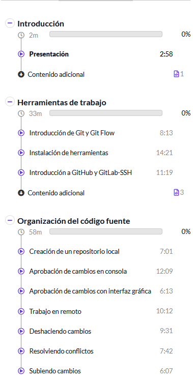

# 💠 Curso de Git

|  |  |
|---|---|
|  |   | 

## Introducción

## Herramientas de trabajo
> Git es un sistema de control de versiones distribuido.

> Git Flow es un modelo de ramificación (branching model) para Git, su objetivo es organizar el desarrollo de software con ramas específicas para cada propósito. Características principales de Git Flow:

Define ramas específicas con roles claros:

- main (o master): siempre contiene código estable listo para producción.
- develop: integración de funcionalidades antes de pasar a producción.
- feature/*: desarrollo de nuevas funcionalidades.
- release/*: preparación de versiones de producción.
- hotfix/*: corrección de errores críticos en producción.

Establece un flujo de trabajo estándar para crear, integrar y liberar código. Se puede usar con un plugin de Git (git-flow) para simplificar comandos:
```
git flow init
git flow feature start nombre
git flow feature finish nombre
```
### Herramientas
- https://git-scm.com/
- https://www.sourcetreeapp.com/
- https://desktop.github.com/
- https://kdiff3.sourceforge.net/

## Organización del código fuente

## Flujos de trabajo

## Trabajo colaborativo

## Conclusiones

