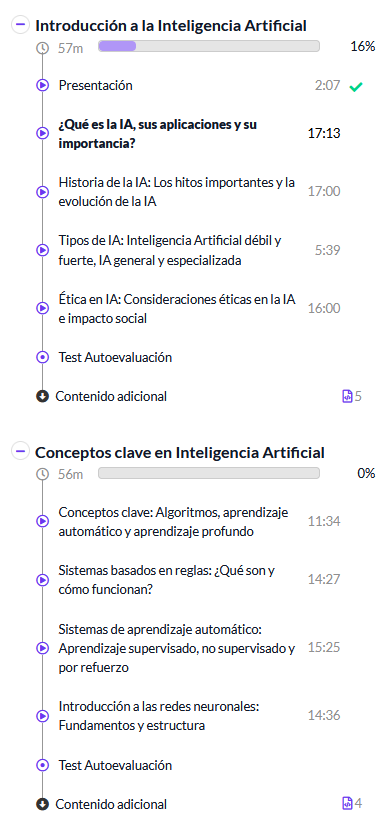
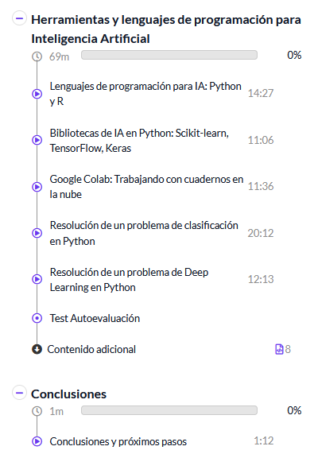
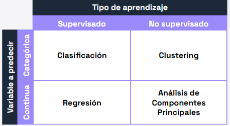

# 💠Introducción a la Inteligencia Artificial

|  |  |
|---|---|
|  |   | 

## Presentación
Se utilizará Google Colab durante el curso y algo de Python

## ¿Qué es la IA, sus aplicaciones y su importancia?

## Historia de la IA: Los hitos importantes y la evolución de la IA

## Tipos de IA: Inteligencia Artificial débil y fuerte, IA general y especializada
 
## Ética en IA: Consideraciones éticas en la IA e impacto social

# 💠Conceptos clave en Inteligencia Artificial

## Conceptos clave: Algoritmos, aprendizaje automático y aprendizaje profundo
- Sistemas de reglas
- Sistemas de aprendizaje profundo
- Redes neuronales

## Sistemas basados en reglas: ¿Qué son y cómo funcionan?

## Sistemas de aprendizaje automático: Aprendizaje supervisado, no supervisado y por refuerzo
- Machine Lerning subrama de la IA en la que intentamos que ordenadores sean capaces de aprender
  - Aprendizaje supervisado son con datos que estan etiquetados
  - Aprendizaje no supervisado son datos que no estan etiquetados.
- Sistemas de clasificación se trata de predecir unas variables cualitativas, categóricas o discretas son las que tienen un número finito de valores. 
- Regresión se trata de predecir unas variables cuantitativas, numéricas o continuas son las que puenen tomar una cantidad infinitas de valores. (Regresión)
  
 

## Introducción a las redes neuronales: Fundamentos y estructura

>Una red neuronal artificial es un modelo de aprendizaje automático (machine learning) que imita la forma en la que el cerebro procesa la información. Funciona con “neuronas” artificiales que reciben datos, los transforman mediante operaciones matemáticas y los transmiten a la siguiente capa. Ajustando los pesos de esas conexiones, la red va aprendiendo patrones y mejorando sus resultados con cada entrenamiento.

# 💠Herramientas y lenguajes de programación para Inteligencia Artificial

## Lenguajes de programación para IA: Python y R
> **Bibliotecas** es una fuente de código optimizado disponible que se comparte con otras personas y realiza tareas especificas.

## Bibliotecas de IA en Python: Scikit-learn, TensorFlow, Keras

[Python Package Index (PyPI)](https://pypi.org/): el repositorio de software oficial para paquetes de terceros del lenguaje Python. Es mantenido por la Python Software Foundation y permite a los desarrolladores buscar, instalar y publicar paquetes mediante herramientas como `pip`.

```
// Para instalar el paquete
pip install <nombre del paquete> 

//Importarlo en el entorno de ejecución
import <nombre del paquete> 
```
### NumPy y Pandas
librería de Python para trabajar con vectores, matrices y operaciones matemáticas de alto rendimiento. Pandas está construida sobre NumPy y se usa para manipular, limpiar y analizar datos mediante estructuras como *Series* y *DataFrames*.  

### Matplotlib y Seaborn
Librería de visualización que permite crear gráficos en 2D de forma flexible. Seaborn está basado en Matplotlib y facilita la creación de gráficos estadísticos más atractivos y con menos código.  

### Scikit-Learn
Librería de *machine learning* en Python que incluye algoritmos para clasificación, regresión, clustering y reducción de dimensiones, además de herramientas para preprocesar y evaluar modelos.  (Creación y entrenamientos de modelos de aprendizaje automático)

### TensorFlow y Keras
Framework de código abierto desarrollado por Google para construir y entrenar modelos de *deep learning*. Keras es una API de alto nivel que funciona sobre TensorFlow y simplifica la creación de **redes neuronales**, haciéndola más accesible y rápida.  

## Google Colab: Trabajando con cuadernos en la nube
> **Google Colab** es una herramienta publicada por Google que nos permite utilizar cuadernos de Jupyter con ejecución en entornos en la nube.

> **Cuaderno de Jupyter (Jupyter Notebook)** es una aplicación de código abierto que permite crear y compartir documentos interactivos que combinan código ejecutable, texto explicativo, fórmulas matemáticas, visualizaciones y gráficos.

> **Comandos magic** son instrucciones especiales que comienzan con **%** o **%%** y permiten realizar tareas adicionales o configurar el entorno del cuaderno de forma rápida, sin necesidad de escribir código complejo.

- Line magics (%): afectan solo a la línea donde se escriben.

- Cell magics (%%): afectan a toda la celda donde se colocan.

## Resolución de un problema de clasificación en Python

## Resolución de un problema de Deep Learning en Python
>Keras es una biblioteca de alto nivel para construir redes neuronales, que originalmente se diseñó como una interfaz para TensorFlow, pero también es compatible con Theano y CNTK. Su objetivo es hacer que la construcción, entrenamiento y evaluación de redes neuronales profundas sea más fácil y rápida. Keras permite crear redes neuronales de manera modular, flexible y concisa.
# 💠Conclusiones
